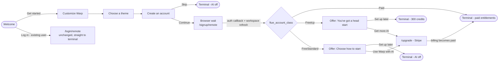

# Account-First Onboarding (FTUE) — Client Implementation Plan (N1–N4)

Status: approved for implementation. Feature flag: `AccountFirstOnboarding` (off everywhere until N4).
Scope: `warp` repo only. **No warp-server changes are in scope for N1–N4.**

This document is the implementation spec for four stacked PRs (N1 → N2 → N3 → N4) that replace the
stable multi-branch FTUE with an account-first flow. Each PR section lists its responsibility, the
files it touches, concrete tasks, tests, and acceptance criteria. Line numbers are anchors verified
near `master@a6ebba40e` — always locate by symbol name, not line number.

---

## 1. Goal and locked product decisions

Replace the stable FTUE (Welcome → intention fork → AI setup → agent/third-party → customize →
theme, with multiple branches) with a single linear flow:

**Welcome → Customize Warp → Choose a theme → Create an account → browser signup → post-auth outcome.**

Locked decisions (do not relitigate during implementation):

1. **No server billing changes.** Merged server PR #9706 already provides the `FREE_ICP` tier
   (300 credits, premium models), ICP domain checks, and the `disablePremiumModels` GraphQL field.
   An ICP user who joins a **mixed** unpaid team intentionally inherits the workspace `FREE` tier
   (0 usable credits in prod) — this is accepted product behavior, and such a user sees the
   standard-free offer screen. The client must classify from **effective billing metadata only**
   and must never run its own ICP/domain check.
2. **The old flow stays intact** as the rollback path. All new behavior is gated on
   `FeatureFlag::AccountFirstOnboarding`. Do not delete or destructively modify slides used by the
   stable flow (`intention_slide.rs`, `ai_setup_slide.rs`, `agent_slide.rs`, `third_party_slide.rs`,
   `project_slide.rs`, `ai_access_slide.rs`). Cleanup happens in a separate post-rollout PR.
3. **Existing-user login is unchanged.** "Log in" on Welcome still uses `/login/remote` and goes
   straight to the terminal after auth. No offer screens for existing users.
4. **`native_ftue=1` ships on the signup URL** (flag-gated) even though the web side (optional
   fast-follow "S1", not part of this plan) does not consume it yet. Unknown params are ignored by
   the web app, and shipping the marker now lets the web handoff fix deploy later with no client
   release.
5. **Completion is a terminal-exit concept.** Finishing the Theme slide no longer marks onboarding
   complete. Only these five exits complete onboarding: account skipped, paid-team return,
   ICP set-up-later, standard-free set-up-later, successful upgrade checkout.

## 2. Flow overview



### Post-auth classification matrix

The class mirrors the tier the server actually granted, so copy and entitlements always agree.

| Server situation | `is_user_on_paid_plan()` | `warp_ai_policy.disable_premium_models` | Class | Screen shown |
| --- | --- | --- | --- | --- |
| Paid/enterprise/legacy team (incl. team-discovery join, domain capture) | true | n/a | `Paid` | none — straight to terminal |
| Teamless ICP, or member of an all-ICP unpaid team (`FREE_ICP`, 300 credits) | false | false | `FreeIcp` | "You've got a head start" |
| Teamless non-ICP, skipped discovery, joined a mixed/non-ICP unpaid team (`FREE`, 0 usable credits in prod) | false | true | `FreeStandard` | "Choose how to start" |
| Policy missing/malformed | false | absent | `FreeStandard` (safe default) | "Choose how to start" |

Server facts backing this (for reference only, do not depend on server code):
`FREE` tier sets `disable_premium_models: "true"`, `limit: 60`; `FREE_ICP` sets
`disable_premium_models: "false"`, `limit: 300`. Prod's `remove_free_ai` gate zeroes usable credits
on standard `FREE` only. Note `CustomerType::Legacy` counts as paid in `is_user_on_paid_plan()` —
that is correct for this feature (legacy users skip the offer).

### Key existing code (read before starting)

- State machine: `crates/onboarding/src/model.rs` — `OnboardingStep` (~L118), `OnboardingStateModel`
  (~L184), `next()` (~L830), `back()` (~L800), `set_step()` (~L909), `progress()` (~L997),
  `OnboardingStateEvent` (~L173: `Completed`, `UpgradeRequested`, `AuthStateChanged`, …),
  `OnboardingAuthState` (~L60), `SelectedSettings` (~L67), `UICustomizationSettings` (~L13).
  Note the existing pattern: flow variants branch on feature flags **inside** `next()`/`back()`/
  `progress()` (see the `OpenWarpNewSettingsModes` branches). Follow the same pattern.
- Slide view host: `crates/onboarding/src/agent_onboarding_view.rs` (`start_onboarding` sends the
  initial Welcome impression, ~L326).
- Account screen: `app/src/auth/login_slide.rs` — `LoginStep` (`SelectAuthPathway`, `BrowserOpen`,
  `PrivacySettings`), `LoginPurpose` (`WarpDrive` | `WarpAgent` | `ThirdParty`, ~L515),
  `start_login()` (~L440, opens `sign_up_url()`), Skip button dispatches
  `LoginSlideAction::ShowSkipDialog` (~L674), `handle_login_later()` (~L417) emits
  `LoginSlideEvent::LoginLaterConfirmed`.
- Auth URLs and onboarded state: `app/src/auth/auth_manager.rs` — `sign_up_url()` (~L778),
  `upgrade_url()` (~L801), `link_sso_url()` (~L821), `set_user_onboarded()` (~L862).
- Billing metadata: `app/src/workspaces/workspace.rs` — native `WarpAiPolicy` (~L313), `Tier`
  (~L472, holds `warp_ai_policy: Option<WarpAiPolicy>`), `BillingMetadata` (~L499),
  `is_user_on_paid_plan()` (~L628).
- GraphQL fragment: `crates/graphql/src/api/billing.rs` — cynic `WarpAiPolicy` (~L150). The
  vendored schema already has `disablePremiumModels` (`crates/warp_graphql_schema/api/schema.graphql`
  ~L4470); **no schema sync needed**.
- Settings application: `app/src/settings/onboarding.rs` — `apply_onboarding_settings(selected,
  has_account: bool, app)` (~L21) and `apply_ui_customization_settings` (~L80).
- Orchestration: `app/src/root_view.rs` — entry routing (~L1600–1737), skip confirmation
  (~L1949–1975), post-slides routing (~L2112–2128), Welcome login flow (~L2320–2394), cloud
  preferences sync ordering (`CloudPreferencesSyncerEvent::InitialLoadCompleted`, ~L3167–3206).
- Telemetry: `crates/onboarding/src/telemetry.rs` — `OnboardingEvent` enum with names like
  `onboarding_started`, `onboarding_slide_viewed`.

## 3. Cross-PR conventions

- Branches: stack the PRs — `jaiden/afo-n1-foundation` off `master`, `jaiden/afo-n2-preauth-flow`
  off N1, `jaiden/afo-n3-offer-slide` off N2, `jaiden/afo-n4-orchestration` off N3. Rebase as
  predecessors land. Never commit to `master`.
- Every new behavior checks `FeatureFlag::AccountFirstOnboarding.is_enabled()` at runtime (prefer
  runtime checks over `#[cfg]`). When the flag is off, behavior must be byte-for-byte identical to
  today. The flag is added to `DOGFOOD_FLAGS` only in N4.
- Exhaustive matching: when adding enum variants (e.g. new `OnboardingStep` variants), update every
  `match` exhaustively — no `_` wildcards.
- Tests live in sibling files per repo convention (`${filename}_tests.rs` included via
  `#[cfg(test)] #[path = "..."] mod tests;`).
- Before opening/updating each PR: `./script/format` and the presubmit clippy command
  (`cargo clippy --workspace --all-targets --all-features --tests -- -D warnings`) must pass.
  Targeted tests: `cargo nextest run -p onboarding` plus affected `warp`-package tests.
- Use the PR template. Leave changelog lines blank for N1–N3 (flag off, no user-visible change);
  N4 may carry `CHANGELOG-NEW-FEATURE:` only when the flag later reaches stable — while dogfood-only,
  leave blank.
- Commits/PRs include `Co-Authored-By: Oz <oz-agent@warp.dev>`.

---

## 4. PR N1 — Flag and classification foundation

**Responsibility:** everything the later PRs route on, with zero UI or behavior change.

### Files and changes

1. `crates/warp_features/src/lib.rs`
   - Add `AccountFirstOnboarding` as the last variant of `FeatureFlag` (after `CloudAgentRunners`,
     ~L917) with a doc comment: gates the account-first FTUE (reordered slides, create-account
     screen, post-auth offer). Do **not** add to `DOGFOOD_FLAGS` / `PREVIEW_FLAGS` / `RELEASE_FLAGS`.
2. `app/Cargo.toml` and `app/src/features.rs`
   - Add the non-default `account_first_onboarding = []` Cargo feature and its
     `#[cfg(feature = "account_first_onboarding")] FeatureFlag::AccountFirstOnboarding` bridge.
     This makes local `--features account_first_onboarding` builds turn on the runtime flag without
     exposing the incomplete flow in default builds.
3. `crates/graphql/src/api/billing.rs`
   - Add `pub disable_premium_models: bool` to the cynic `WarpAiPolicy` fragment (~L150). Cynic
     derives the camelCase field (`disablePremiumModels`) from the snake_case name automatically —
     confirm generated query includes it (build + any query-snapshot tests).
4. `app/src/workspaces/workspace.rs`
   - Add `#[serde(default = "default_disable_premium_models")] pub disable_premium_models: bool`
     to the native `WarpAiPolicy` (~L313), where the default helper returns `true`. This struct is
     serialized/deserialized and persisted metadata written by older builds lacks the field;
     defaulting to disabled makes stale/missing policy fail closed to `FreeStandard`.
   - Update the GraphQL→native conversion so the field flows through. Find it by grepping for
     `warp_ai_policy` in `app/src/workspaces/` and `crates/graphql/src/api/queries/
     get_workspaces_metadata_for_user.rs` (~L36); also check `crates/graphql/src/api/mutations/
     create_team.rs` (~L35) if it shares the mapping.
   - Add next to `is_user_on_paid_plan()` (~L628):
     ```rust
     #[derive(Clone, Copy, Debug, PartialEq, Eq)]
     pub enum FtueAccountClass {
         Paid,
         FreeIcp,
         FreeStandard,
     }

     impl BillingMetadata {
         /// Post-auth FTUE classification. Paid always wins; otherwise
         /// `disable_premium_models` distinguishes FREE_ICP (false) from FREE (true).
         /// Missing policy falls back to FreeStandard.
         pub fn ftue_account_class(&self) -> FtueAccountClass {
             if self.is_user_on_paid_plan() {
                 return FtueAccountClass::Paid;
             }
             match &self.tier.warp_ai_policy {
                 Some(policy) if !policy.disable_premium_models => FtueAccountClass::FreeIcp,
                 Some(_) | None => FtueAccountClass::FreeStandard,
             }
         }
     }
     ```
5. `app/src/auth/auth_manager.rs`
   - In `sign_up_url()` (~L778), append `&native_ftue=1` when
     `FeatureFlag::AccountFirstOnboarding.is_enabled()`. Do not touch `sign_in_url()`,
     `upgrade_url()`, or the `state` contract.

### Tests

- Classification unit tests (workspace tests file, following the sibling-file convention): every
  row of the matrix in §2 — each paid `CustomerType` (including `Legacy` and `Enterprise`) → `Paid`
  regardless of the policy field; `Free` + `disable_premium_models=false` → `FreeIcp`; `Free` +
  `true` → `FreeStandard`; `warp_ai_policy: None` → `FreeStandard`; `Unknown` customer type →
  not paid → policy decides.
- `sign_up_url()` test: contains `native_ftue=1` iff the flag is enabled (use the existing
  feature-flag test override utilities in `warp_features`).
- Serde test: deserializing a persisted `WarpAiPolicy` JSON blob without the new field succeeds
  with `disable_premium_models == true` (safe standard-free default).

### Acceptance criteria

- No user-visible change with the flag off or on (nothing consumes the classifier yet).
- Workspace refresh round-trips `disable_premium_models` from a live/local server response.

---

## 5. PR N2 — Account-first state machine and pre-auth slides

**Responsibility:** the reordered pre-auth flow behind the flag: Welcome → Customize → Theme →
Create account → browser wait. No post-auth behavior yet (auth completion temporarily behaves like
the existing third-party path; N4 replaces that).

### Files and changes

1. `crates/onboarding/src/model.rs`
   - Add account-first branches to `next()`, `back()`, and `progress()`, keyed on
     `FeatureFlag::AccountFirstOnboarding.is_enabled()` (mirror the existing
     `OpenWarpNewSettingsModes` branching style; keep both older flows compiling and reachable).
   - Account-first step order: `Intro → Customize → ThemePicker`. `next()` from `ThemePicker`
     emits the existing completion path (root_view decides what "slides done" means). `back()` from
     `Customize` → `Intro`, from `ThemePicker` → `Customize`. Steps `Intention`, `AiSetup`,
     `Agent`, `AiAccess`, `ThirdParty`, `Project` are unreachable in this variant — match them
     explicitly (no wildcards) and route them somewhere sane (e.g. treat as `Intro`) with a comment.
   - `progress()` for account-first: 3 logical steps — `Customize` = (0, 3), `ThemePicker` = (1, 3);
     the Create-account screen is step (2, 3) but is rendered by `LoginSlideView`, which keeps its
     own bottom nav. `Intro` shows no dots (same as today).
   - Intention: account-first fixes `OnboardingIntention::AgentDrivenDevelopment` with
     `UICustomizationSettings::agent_defaults()` as the starting customization context (there is no
     intention fork). `SelectedSettings::AgentDrivenDevelopment` remains the produced settings shape.
   - Keep `SettingChanged` telemetry from the customize slide working unchanged.
2. `crates/onboarding/src/agent_onboarding_view.rs`
   - When the flag is on, construct only the intro, customize, and theme slides. Welcome impression
     continues to come from `start_onboarding`.
3. `crates/onboarding/src/slides/customize_slide.rs`
   - Should work nearly as-is under the fixed agent context; only touch progress/default wiring if
     needed. Do not change its assets, tab styling, quick-access tools, or code-review controls.
4. `crates/onboarding/src/slides/theme_picker_slide.rs`
   - Account-first: Next advances to the account screen instead of finishing onboarding; suppress
     the terminal-only disclaimer on this path (Create account owns privacy/TOS copy).
5. `app/src/auth/login_slide.rs`
   - Add `LoginPurpose::AccountFirst` (update the `login_purpose()` derivation and every match on
     `LoginPurpose` exhaustively).
   - Copy for `AccountFirst` on `LoginStep::SelectAuthPathway`:
     - Title: `Create an account`
     - Subheading 1: `Access AI, run cloud agents, collaborate with teammates, and sync settings across devices`
     - Subheading 2: `Use your work email if you have one. You may already have access to premium features through your organization`
     - Keep the existing TOS/Privacy links and the theme-matched right panel.
   - Buttons for `AccountFirst`: `Back` (returns to Theme — root_view/onboarding view wiring),
     `Skip` (label `Skip`; **bypasses** `ShowSkipDialog` and directly runs the
     `handle_login_later()` path → emits `LoginSlideEvent::LoginLaterConfirmed`), `Continue`
     (existing `start_login()`; enter-key binding stays).
   - `LoginStep::BrowserOpen` ("Sign in on your browser to continue"), manual URL copy, and pasted
     token handling are reused untouched.
6. `app/src/root_view.rs`
   - Minimal wiring only: when the flag is on and slides complete, always show the login slide with
     `LoginPurpose::AccountFirst` (today this only happens for paths that need login); route the
     login slide's Back to the Theme step. Skip completes onboarding via the existing skip handling
     (N4 replaces completion semantics).
7. `crates/onboarding/src/telemetry.rs`
   - Include `flow_version` in the `OnboardingStarted`, `SlideViewed`, and `SettingChanged`
     payloads (emit `account_first_v1` when the flag is on; leave existing payloads unchanged
     otherwise).
   - Add `OnboardingAction { slide_name: String, action: String, account_class: Option<String> }`
     → event name `onboarding_action`. Pre-auth actions emitted in this PR: `get_started`, `next`,
     `back`, `skip_account`, `continue_signup` (account_class is `None` pre-auth).
   - Account-first slide-view names: `welcome`, `customize`, `theme_picker`; login slide emits
     `create_account` on entry and `browser_auth` when entering `BrowserOpen`. Impressions fire
     once per state entry (from `set_step`/state transitions), never from render.

### Tests

- `crates/onboarding/src/model_tests.rs`: table-driven account-first tests — forward order,
  backward order, removed steps unreachable, progress values; old-flow tests still pass with the
  flag off (both `OpenWarpNewSettingsModes` on and off).
- Telemetry tests (existing mock telemetry provider): single impression per state entry; action
  events carry `flow_version`; canonical slide names.
- Login-slide behavior: `AccountFirst` Skip does not open the confirmation dialog.

### Acceptance criteria

- Flag off: stable flow unchanged (run the existing onboarding tests and eyeball the GUI).
- Flag on (dev builds only, manually enabled): Welcome → Customize → Theme → Create account →
  browser wait renders with the specified copy; Skip lands in the terminal; Continue opens the
  signup URL (with `native_ftue=1` from N1).

---

## 6. PR N3 — Post-auth offer slide

**Responsibility:** the only genuinely new screen — a two-variant offer slide. Compiled and
testable behind the flag, but not yet routed to (N4 connects it).

### Files and changes

1. `crates/onboarding/src/slides/offer_slide.rs` (new file; model it on `ai_access_slide.rs`, which
   must remain untouched for the fallback flow)
   - `pub enum OfferVariant { HeadStart, ChooseHowToStart }`.
   - `HeadStart` copy: title `You've got a head start`; subheading
     `Your account comes with some free AI`; primary button `Get more AI`; secondary `Set up later`.
   - `ChooseHowToStart` copy: title `Choose how to start`; subheading
     `Warp's agent requires a plan. Pick how you want to start`; primary `Use Warp with AI`;
     secondary `Set up later`.
   - Reuse from `ai_access_slide.rs`: layout, right-side visual, button themes, the browser
     fallback bar, and the upgrade-request wiring — primary button emits the existing
     `OnboardingStateEvent::UpgradeRequested`; secondary emits a new
     `OnboardingStateEvent`-level signal (e.g. `OfferSetUpLaterSelected`) that N4 consumes.
   - No Back button and no Skip on offer screens; progress dots hidden.
2. `crates/onboarding/src/model.rs`
   - Add `OnboardingStep::PostAuthOffer` plus stored `OfferVariant`; update every `match` on
     `OnboardingStep` exhaustively (`next()`/`back()` treat it as terminal: no next/back;
     `progress()` returns no dots). `set_step` emits `SlideViewed` with `head_start` or
     `choose_how_to_start` per variant.
3. `crates/onboarding/src/agent_onboarding_view.rs`
   - Construct/render the offer slide for `PostAuthOffer`; expose a public entry point for
     root_view (e.g. `show_post_auth_offer(variant, ctx)`).
4. `crates/onboarding/src/slides/mod.rs` (or equivalent) — export the new slide.
5. `crates/onboarding/src/telemetry.rs`
   - `onboarding_action` actions for this slide: `get_more_ai`, `use_warp_with_ai`, `set_up_later`,
     each with `account_class` (`free_icp` / `free_standard`).

### Tests

- Model tests: `PostAuthOffer` reachable only via the explicit entry point; emits the correct
  `SlideViewed` name per variant; no next/back transitions.
- Render smoke tests if slide-level tests exist for other slides; otherwise rely on model tests +
  manual dev-build inspection of both variants.

### Acceptance criteria

- Both variants render with exact copy above; primary button triggers the existing upgrade bridge;
  secondary emits the set-up-later event. Nothing routes here yet in normal operation.

---

## 7. PR N4 — Post-auth orchestration, completion semantics, rollout

**Responsibility:** the integration PR. Auth callback → classify → route; checkout detection; SSO
resume; single completion path; cloud-sync ordering; remaining telemetry; dogfood enablement.

### Files and changes

1. `app/src/root_view.rs` (primary integration point)
   - **Auth callback (account-first source):** on login success, do NOT complete onboarding. Keep
     the user on a "finishing up" presentation of the browser-wait state, trigger a
     `UserWorkspaces` refresh, and wait for fresh `BillingMetadata`. Then route on
     `ftue_account_class()`:
     - `Paid` → `complete_account_first(PaidTeam)`.
     - `FreeIcp` → `show_post_auth_offer(HeadStart)`.
     - `FreeStandard` → `show_post_auth_offer(ChooseHowToStart)`.
     Emit `onboarding_auth_completed` exactly once when classification resolves.
   - **Defensive re-classification:** until a terminal exit happens, every app-focus refresh and
     `UserWorkspacesEvent::TeamsChanged` re-evaluates the class and may upgrade the route
     (offer → terminal when billing turns paid). This covers: the web deep link firing before team
     join/survey finish (no web fix deployed), manual token paste, app restart mid-auth, browser
     closed. Never downgrade a shown offer from `FreeIcp` to `FreeStandard` mid-screen; only the
     paid upgrade transition replaces a visible offer.
   - **Metadata failure/timeout:** if the refresh errors, retry with backoff while keeping the
     finishing-up state; after a bounded wait (suggest 15–20s), classify `FreeStandard` (safe
     default — copy stays truthful) and continue re-evaluating in the background.
   - **SSO:** if the callback requires an SSO link (`link_sso_url` flow), run the existing blocking
     SSO sequence first, then resume classification (do not bypass to terminal).
   - **Upgrade/checkout:** on `OnboardingStateEvent::UpgradeRequested` from the offer slide, emit
     `onboarding_upgrade_started`, open `auth_manager.upgrade_url()`, keep the offer visible. When
     a subsequent refresh shows `is_user_on_paid_plan()`, emit `onboarding_upgrade_completed` once,
     then `complete_account_first(UpgradeCompleted)`.
   - **Set up later:** offer's secondary action → `complete_account_first(FreeIcpSetupLater)` or
     `(FreeStandardSetupLater)` per variant.
   - **Skip:** replace N2's temporary wiring so Skip → `complete_account_first(AccountSkipped)`.
   - **Single completion function** `complete_account_first(completion: AccountFirstCompletion)`:
     1. Persist `HasCompletedOnboarding`.
     2. If logged in, `AuthManager::set_user_onboarded()`.
     3. Apply settings (see item 2 below) with the typed class.
     4. Start the agent tutorial only for `PaidTeam` and `FreeIcpSetupLater` / `UpgradeCompleted`
        outcomes; never for `AccountSkipped` / `FreeStandardSetupLater`.
     5. Emit `onboarding_completed { completion_type }` with exactly one of: `account_skipped`,
        `paid_team`, `free_icp_setup_later`, `free_standard_setup_later`, `upgrade_completed`.
     6. Transition to the terminal.
   - **Cloud-sync ordering:** integrate with the existing pending-settings +
     `CloudPreferencesSyncerEvent::InitialLoadCompleted` handling (~L3167–3206) so onboarding
     choices are applied at completion time and still win if the initial cloud load lands after
     completion; they must NOT be applied while an offer is still open.
2. `app/src/settings/onboarding.rs`
   - Add `apply_account_first_onboarding_settings(selected: &SelectedSettings,
     class: Option<FtueAccountClass>, app: &mut AppContext)` (`None` = account skipped). UI
     customization always applies; `is_any_ai_enabled` = `matches!(class, Some(Paid | FreeIcp))`.
     Leave the legacy `apply_onboarding_settings(…, has_account: bool, …)` untouched for the
     fallback flow (it gets deleted in the cleanup PR).
3. `app/src/ai/onboarding.rs`
   - Map refreshed auth/billing state into the onboarding view's `OnboardingAuthState` only if the
     offer slide needs live paid/free state; extend only as needed.
4. `crates/onboarding/src/telemetry.rs`
   - Add `OnboardingAuthCompleted { account_class, has_team, is_paid, team_discovery_outcome }`
     (name `onboarding_auth_completed`). `team_discovery_outcome` ∈ `joined` | `skipped` |
     `domain_capture` | `not_offered` where derivable client-side (team present after signup vs
     not); use `unknown` if not derivable. Never include email, domain, team name, or team ID.
   - Add `OnboardingUpgradeStarted { source_slide, account_class }` and
     `OnboardingUpgradeCompleted { source_slide, account_class }`.
   - Add `OnboardingCompleted { completion_type }`.
   - Keep `OnboardingSlidesCompleted` as a narrow pre-auth milestone: emit it when Theme completes
     in the account-first flow with obsolete fields (`model`, `autonomy`, `ai_access`,
     `has_project_path`) set to `None`/`false`; do not treat it as FTUE completion.
   - Continue global `LoginButtonClicked` / Login / identify events; distinguish account-first via
     the new `onboarding_action` events (do not repurpose `LoginEventSource` values used by
     dashboards without checking; adding a new `LoginEventSource` variant is acceptable).
5. `crates/warp_features/src/lib.rs`
   - Add `FeatureFlag::AccountFirstOnboarding` to `DOGFOOD_FLAGS` — as the final commit of this PR,
     only after the E2E matrix below passes locally.

### Tests

- Root/settings tests (`app/src/root_view_tests.rs`, `app/src/settings/onboarding_tests.rs`):
  - Completion fires exactly once per route, with the right `completion_type`, only at terminal
    exits (not on Theme completion).
  - Class routing: paid bypass, both offer variants, skip path.
  - Delayed metadata → finishing-up state, then classify; timeout → `FreeStandard` fallback.
  - Re-classification upgrade path: offer visible → `TeamsChanged` paid → terminal +
    `onboarding_upgrade_completed` fired once.
  - SSO-resume path.
  - Cloud initial load before vs after completion — onboarding settings win; not applied while an
    offer is open.
  - `apply_account_first_onboarding_settings`: AI on for `Paid`/`FreeIcp`; off for `None`/
    `FreeStandard`; UI customization applied in all four.
  - Existing-user Welcome login still bypasses everything (flag on).
- Telemetry tests: every completion reason; `onboarding_auth_completed` payload shape; impressions
  not duplicated on re-render/focus.

### Acceptance criteria — end-to-end matrix (GUI against local warp-server)

Run with `WITH_LOCAL_SERVER=1 ./script/run` and a local `warp-server`; verify UI **and** telemetry
(named telemetry logging) for each:

1. Account Skip → terminal, AI off, UI/theme choices applied, `completion_type=account_skipped`.
2. Existing-user Welcome login → terminal, no offers, no account-first completion events.
3. Signup, join paid team via team discovery → no offer, terminal, `paid_team`.
4. Signup, enterprise domain capture (+SSO if configured) → SSO resume → terminal, `paid_team`.
5. Signup, teamless ICP domain → "You've got a head start"; Set up later → terminal with 300
   credits + premium models, `free_icp_setup_later`.
6. Signup, join all-ICP unpaid team → same as 5.
7. Signup as ICP, join **mixed** unpaid team → "Choose how to start" (accepted behavior; user is
   standard free), Set up later → AI off, `free_standard_setup_later`.
8. Signup non-ICP (skip discovery or join unpaid team) → "Choose how to start"; Set up later → AI
   off.
9. From each offer variant: upgrade via Stripe test checkout → offer stays until billing flips →
   terminal, `onboarding_upgrade_completed` once, `completion_type=upgrade_completed`.
10. Browser closed before completing signup; manual URL copy + token paste; app restart during
    browser auth — all recover without double events or stuck states.
11. Theme/UI choices survive cloud preference sync in all routes.

---

## 8. Explicitly out of scope for N1–N4

- **Web handoff timing ("S1")**: suppressing the web `WarpAppLauncher` on team-discovery/survey
  pages for `native_ftue=1` signups. Optional fast-follow in warp-server; N1's URL param is the
  only client prerequisite and ships regardless. Until it deploys, expect (and accept) the early
  deep-link callback; N4's defensive re-classification handles correctness.
- **Stable rollout**: later one-line promotion of the flag out of dogfood.
- **Cleanup**: deleting `intention_slide.rs`, `ai_setup_slide.rs`, `agent_slide.rs`,
  `third_party_slide.rs`, `project_slide.rs`, `ai_access_slide.rs`, the legacy
  `apply_onboarding_settings`, and obsolete telemetry fields — separate PR after rollout stabilizes.
