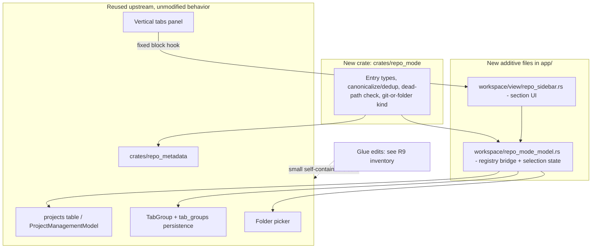
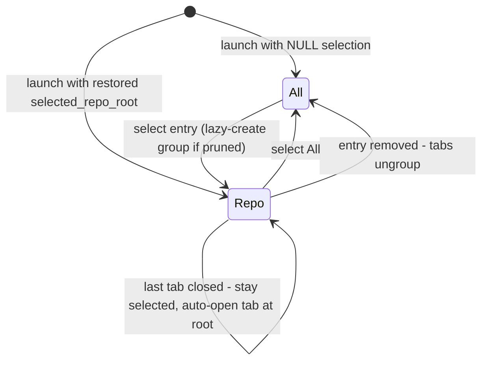
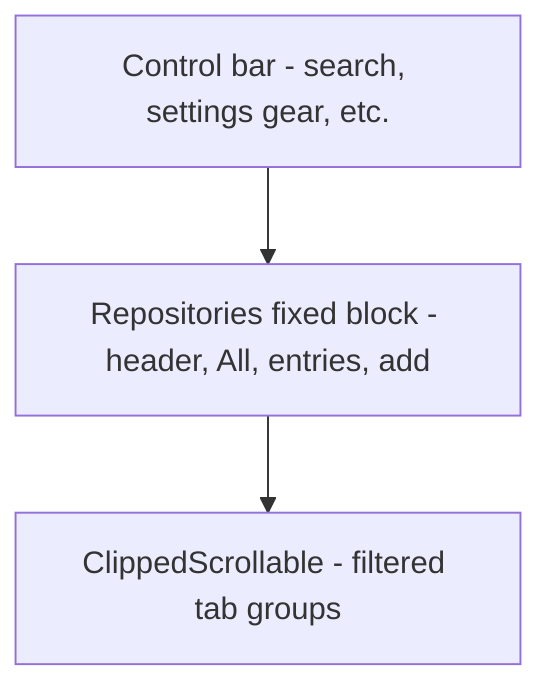

# Repo Mode Sidebar - Plan

## Goal Capsule

- **Objective:** Add a supacode-style "repo mode" to a self-built Warp GUI: a Repositories section in the vertical tabs panel lists registered repos/folders; selecting one scopes the tab strip to that repo's tab group; everything is gated behind a `repo_mode` flag and structured so rebasing onto upstream master stays routine.
- **Product authority:** This plan's Product Contract (confirmed brainstorm synthesis plus user-directed refinements during planning dialogue). Owner: Vinh Nguyen, sole user and maintainer of the patched build.
- **Execution profile:** Implement units in dependency order (U1 ∥ U2 → U3 → U4 → U5 → U6). Flag-off builds must stay visually and behaviorally identical to stock Warp at every unit boundary (per R8/AE3). Additive schema columns may land in all builds; they must be ignored when the flag is off.
- **Stop conditions:** Surface as a blocker anything that would require editing more than the declared glue inventory (it breaks R9), or any conflict with the Product Contract; do not silently widen glue. If the vertical-tabs hook exceeds one small self-contained block, stop and amend R5/KTD2 — do not fall back to a sibling panel without a Product Contract change.
- **Open blockers:** None.

---

## Product Contract

### Summary

An opt-in repo mode for the Warp GUI desktop app: an "Add Local Repository or Folder..." action registers any local directory, a Repositories section inside the existing vertical tabs panel lists registered entries, and selecting an entry filters the tab UI to that entry's tab group. New behavior lives in a dedicated domain crate plus additive view files in `app/`, with only small glue edits to upstream files, so `git pull master` + rebase remains routine.

### Problem Frame

The user works across many repos at once but stock Warp offers one flat tab set per window — no grouping by repo, no fast way to jump between repo contexts. Supacode solves this with a repo sidebar and per-repo tab sets; Cursor-style tools use a dedicated Repositories sidebar section. The user wants that flow inside Warp rather than switching apps.

The user builds Warp from this source tree and upgrades by pulling upstream master. A heavy fork would make every upgrade painful, so any change must minimize its footprint on upstream files. Upstream is itself building adjacent pieces (a Projects registry, tab groups, a repo picker — tagged `#pod-code-mode wip`), but has not shipped a repo-grouped sidebar.

### Key Decisions

- **Reuse Warp's existing tab modes; add a section, not a surface.** The Repositories section renders inside the existing vertical tabs panel as a fixed block above the tab scroller (not a Settings gear popup — that control-bar button is not a section precedent). Horizontal tab strip and vertical tab list both keep their stock rendering; repo mode only filters which tabs they show.
- **Separate crate for domain logic, additive `app/` files for view code.** A workspace crate cannot touch `Workspace` internals, so UI lives in new sibling modules under `app/src/workspace/view/` (mirroring how the vertical tabs module is structured), while entry types and path rules live in a new crate. Upstream files receive only small glue edits.
- **Build on shipped primitives.** Tab groups (`GroupedTabs`) are on by default and mature; the folder picker, `projects` table + `ProjectManagementModel`, and repo detection all exist. The one genuinely new mechanism is render-level filtering of the tab UI by group.
- **Local feature flag gates everything.** Flag off means stock Warp behavior, which makes each post-rebase build verifiable.
- **Warp skin, supacode flow.** Visuals follow Warp's theme system and shared components per the repo's GUI UI guidelines.

### Requirements

**Repo registry**

- R1. An "Add Local Repository or Folder..." action lets the user register any local directory into a persistent repo list.
- R2. Plain folders (no git metadata) are first-class registry entries; they only omit git-derived display such as branch info.
- R3. The registry persists across app restarts and records recency so the section can order by last use (order settles at launch; no live reshuffle on every selection).
- R4. A registry entry can be removed (healthy entries via row context menu; dead-path entries also expose an inline remove affordance); removal does not close the entry's open tabs (they become ordinary ungrouped tabs). Paths are canonicalized on add so the same directory cannot appear twice; entries whose path no longer exists render dimmed with removal offered.

**Repositories section and tab grouping**

- R5. With repo mode enabled, a Repositories section appears inside the vertical tabs panel as a fixed block between the control bar and the tab scroller, visually separated from the terminal tab list; the rest of Warp's core UI is unchanged, and with the flag off the section does not exist.
- R6. Selecting an entry filters the active tab UI (horizontal strip or vertical list) to that entry's tab group; new tabs opened while an entry is selected join its group and start at the entry's root directory.
- R7. Per-repo tab grouping, the registry, and the current selection survive app restart.
- R8. Repo mode is gated behind a local feature flag; with the flag off, the app is visually and behaviorally identical to stock Warp.
- R10. An "All" state heads the Repositories section and is the default when no prior selection is persisted (`selected_repo_root` is NULL), including first launch: it shows the stock tab set (grouped and ungrouped tabs alike). When a selection was saved, restore it per R7. Ungrouped tabs — plain new tabs, tabs dragged in from another window, tabs orphaned by entry removal — appear only under "All".
- R11. Closing the last tab of the selected entry keeps the entry selected and auto-opens a fresh tab at the entry's root.
- R12. Group membership is static: it is assigned when a tab opens under a selected entry and does not change when the tab's cwd drifts or the tab is dragged elsewhere.
- R13. When the vertical tabs panel is closed, repo switching remains available via command-palette "Select Repository" / "Show All Repositories" actions (hotkeys deferred).

**Upgrade compatibility**

- R9. New logic lives in a dedicated workspace crate and new additive files under `app/`; upstream files receive only small, self-contained glue edits at the declared inventory below, so rebasing the patch branch onto fresh upstream master routinely succeeds with conflicts confined to those glue points.

  **Glue inventory (authoritative):**
  | File | Touch |
  |---|---|
  | `app/src/workspace/view/vertical_tabs.rs` | One flag-gated hook: mount Repositories block above `ClippedScrollable`; switch group list to shared visible-tab accessor |
  | `app/src/workspace/view.rs` | Flag-gated calls into `repo_mode_*` helpers for: action arms, visible-tab filter + MRU fallback, new-tab routing with entry-root cwd, restore near `initial_vertical_tabs_panel_open` — prefer thin call sites, logic in additive modules |
  | `app/src/workspace/action.rs` | Add/remove/select/"All"/palette select action variants |
  | `app/src/workspace/mod.rs` | Module decls + binding registration |
  | `app/src/app_state.rs` | `TabGroupSnapshot.repo_root`, `WindowSnapshot.selected_repo_root` |
  | `app/src/persistence/sqlite.rs` (+ tests) | Read/write arms for those fields; projects remove path if missing |
  | `crates/persistence/migrations/<date>_add_repo_mode_columns/` | Nullable columns on `tab_groups` / `windows` |
  | `crates/persistence/src/schema.rs`, `model.rs` | Regen/schema fields |
  | `app/Cargo.toml`, root `Cargo.toml` | Feature + dep lines |
  | `crates/warp_features/src/lib.rs`, `app/src/features.rs` | Flag variant + cfg mapping |
  | `app/src/projects.rs` | `remove_project` (or equivalent) if absent |

### Key Flows

- F1. Add a repo
  - **Trigger:** User invokes "Add Local Repository or Folder..." from the section's add button or the command palette.
  - **Steps:** Folder picker opens; chosen path is canonicalized and saved to the registry; the entry appears in the Repositories section; selecting it activates its tab group with a first tab at the entry's root.
  - **Covers:** R1, R2, R3, R4, R6
- F2. Switch context
  - **Trigger:** User clicks an entry, or "All", in the Repositories section (or invokes the palette select actions).
  - **Steps:** The tab UI swaps to that entry's group (or the full stock set for "All"); other tabs stay alive in the background.
  - **Covers:** R5, R6, R10, R13
- F3. Restart
  - **Trigger:** Quit and relaunch Warp.
  - **Steps:** Session restoration rebuilds windows and tabs; the Repositories section shows the registry; groups reattach to their entries; the previous selection is restored (NULL → "All").
  - **Covers:** R3, R7, R10
- F4. Upgrade Warp
  - **Trigger:** Pull upstream master into the local tree.
  - **Steps:** Rebase the patch branch; resolve conflicts (expected only at glue points); rebuild; verify with the flag off (stock behavior) and on (repo mode).
  - **Covers:** R8, R9
- F5. Last tab closed under a selected entry
  - **Trigger:** User closes the last visible tab while an entry (not "All") is selected.
  - **Steps:** Entry stays selected; a fresh tab opens at the entry's root and joins its group.
  - **Covers:** R11

### Acceptance Examples

- AE1. **Covers R2.** Given a plain folder with no `.git` is registered, when it is selected, then tabs open at that folder, no branch info is shown, and nothing errors.
- AE2. **Covers R6.** Given repos A and B each have open tabs, when B is selected, then only B's tabs are visible and A's tabs keep running in the background.
- AE3. **Covers R8.** Given the feature flag is off, when Warp launches, then the UI and behavior are identical to a stock build.
- AE4. **Covers R7.** Given two repos with populated tab groups, when Warp restarts, then the section, both groups, and the prior selection are restored.
- AE5. **Covers R10.** Given the flag is on and no persisted selection (`selected_repo_root` is NULL), when Warp launches, then the tab UI shows the stock tab set and "All" is highlighted.
- AE6. **Covers R12.** Given a tab opened under repo A, when the user runs `cd` to a directory outside A, then the tab remains in A's group.

### Success Criteria

- The user reaches for the patched Warp daily instead of supacode for multi-repo terminal work.
- A routine upstream rebase of the patch branch resolves in minutes, with conflicts only at the declared glue points.

### Scope Boundaries

**Deferred for later**

- Supacode's deeper features: creating worktrees/branches from the UI, agent status indicators, CLI/deeplink control, per-repo layout snapshots.
- Cursor-style nested tab/session list under each entry inside the section (v2; the data model here already supports it).
- Hotkey switching for repos and repo tabs.
- Cross-window grouping — v1 scopes selection and groups to the current window; the same entry selected in two windows yields independent groups with shared recency.
- Upstreaming the feature as a PR.
- Reconciling with upstream's fuller code-mode UI if the pod ships its own repo mode (v1 deliberately rides the existing `projects` table).
- Full keyboard/a11y pass for the Repositories list beyond arrow+Enter+Esc basics noted in U4.

**Outside this product's identity**

- Copying supacode's or Cursor's visual styling — the feature keeps Warp's look.
- Forking away from upstream master — upgradeability is a core requirement.

### Dependencies / Assumptions

- Verified upstream primitives (all confirmed against source): tab groups on by default (`grouped_tabs` in `app/Cargo.toml` default features) with full action surface and persistence; vertical tabs panel with control bar + single `ClippedScrollable` over `render_groups`; folder picker flow (`open_folder_picker_for_worktree_submenu` in `app/src/workspace/view.rs`); `projects` table + `ProjectManagementModel` (`app/src/projects.rs`, events still `#pod-code-mode wip` but upsert/list/persist work); `workspace_metadata` for codebase index (distinct from cloud `workspaces`); repo detection (`crates/repo_metadata`); migration templates in `crates/persistence/migrations/`.
- Accepted risk: upstream's code-mode pod may expand Projects into a competing UI; a future upgrade may force choosing between this patch and the upstream version — mitigated by riding the same `projects` table rather than inventing a third registry.
- GUI UI guidelines apply: reuse shared components and theme accessors; no hard-coded colors.
- `PersistedWorkspace.workspaces()` returns all indexed roots (no user-added filter); it is not the registry backend.

---

## Planning Contract

Product Contract preservation: changed during planning dialogue and headless doc-review autofix — R5/R6/R9/R10 refined; R11–R13 added; KTD1 switched from incorrect `PersistedWorkspace`/`workspaces()` "user-added" filter to `projects` / `ProjectManagementModel` after feasibility verification; Settings-section precedent removed; launch selection reconciled with restore.

### Key Technical Decisions

- **KTD1 — Registry backend is `projects` / `ProjectManagementModel`, not `PersistedWorkspace`.** The `projects` table (`path`, `added_ts`, `last_opened_ts`) is purpose-built for explicit user adds. `ProjectManagementModel` already has `upsert_project` and `all_projects`; U3 adds `remove_project` (persist delete) if missing. `PersistedWorkspace.user_added_workspace` only bumps `navigated_ts` on `workspace_metadata` and `workspaces()` returns every indexed root — there is no user-added filter, so it cannot back R1/R4. Folder-picker UX can still mirror `open_folder_picker_for_worktree_submenu`, then call `upsert_project` after canonicalize. Accepted: Projects events are WIP-tagged; we use the store, not the unfinished UI.
- **KTD2 — Section mounts as a fixed block above the tab scroller in `vertical_tabs.rs` via one small hook.** The section body lives in a new sibling module (`app/src/workspace/view/repo_sidebar.rs`). Hook placement: between the control bar and `ClippedScrollable` in `render_vertical_tabs_panel` so the list stays visible while tabs scroll. Visual precedent: conversation-list section headers (`app/src/workspace/view/conversation_list/`), not the Settings gear button. Style divider + header typography after that pattern and theme tokens.
- **KTD3 — One tab group per (window, entry), filtering at render level via one shared visible-tab accessor.** Each selected entry maps to at most one `TabGroup` per window, created lazily on first selection. Filtering must compose with vertical-tabs search: **repo selection first, then search within the visible set**. Both horizontal strip and vertical list consume the same accessor so AE2 cannot leak via search. When the active tab falls outside the visible set, activation falls back to the group's MRU-first member.
- **KTD4 — Entry↔group binding persisted via a nullable `repo_root` column on `tab_groups`.** Upstream snapshots skip empty groups and prune groups when their last tab closes, so the binding cannot ride the snapshot alone. A nullable column (migration template: `2026-06-01-000000_add_tab_groups`) plus a `TabGroupSnapshot` field carries the binding; on restore, surviving groups re-adopt their entries, and a pruned group is lazily recreated on next selection. Selection state rides a nullable `windows.selected_repo_root` column (end-to-end precedent: `vertical_tabs_panel_open`).
- **KTD5 — Flag wiring follows the repo's compile+runtime bridge.** Cargo feature `repo_mode` in `app/Cargo.toml` (not in `default`), `FeatureFlag::RepoMode` variant in `crates/warp_features/src/lib.rs`, `#[cfg(feature = "repo_mode")]` mapping in `app/src/features.rs` (pattern at the `grouped_tabs` arm). Local enablement: build with `--features repo_mode`; tests use `override_enabled(true)` guards. Persistence migrations remain unconditional (additive nullable columns); flag-off builds ignore the columns (AE3).
- **KTD6 — Static membership; no `WorkingDirectories` integration.** Membership is assigned at open time from the selected entry. Tracking cwd drift would pull in the per-pane cwd module for marginal value; drag-in tabs from other windows arrive ungrouped and land under "All" (upstream drag never transfers `group_id`).
- **KTD7 — New crate `crates/repo_mode` holds entry identity and path rules only.** Canonicalization/dedup, dead-path check, git-or-folder kind via `repo_metadata` — pure, unit-testable, no `app/` dependency. **All/Repo selection state machine and filtering live entirely in `RepoModeModel` / additive `app/` modules** — not in the crate. The workspace member glob (`crates/*`) auto-includes it; glue is one `[workspace.dependencies]` line plus one `app/Cargo.toml` line. Size gate: if domain logic stays under ~400 LOC with a single consumer, folding into `app/src/workspace/repo_mode/` is acceptable during U1 without amending R9.
- **KTD8 — New tabs under a selected entry use `NewTerminalOptions.initial_directory`, not `new_tab_in_group` alone.** `new_tab_in_group` only creates via `add_new_session_tab_with_default_mode` (no directory parameter). Create with entry-root cwd (pattern at existing `NewTerminalOptions::default().with_initial_directory(path)` call sites), then assign/join the bound `TabGroup`.

### High-Level Technical Design

Component topology — what is new, what is reused, and where the glue is:

Selection state machine per window:

Vertical tabs panel layout (flag on):

### Assumptions

- Conversation-list section headers are a workable visual precedent for header typography and separation; if they prove mismatched, invent with theme tokens only — do not claim a Settings-section pattern.
- If the vertical-tabs hook exceeds one small self-contained block, **stop and amend R5/KTD2** (Goal Capsule stop condition). Sibling-panel mount in `render_panels` is out of scope unless Product Contract is revised.

---

## Implementation Units

### U1. Flag wiring and `crates/repo_mode` domain crate

- **Goal:** The `repo_mode` compile+runtime flag exists end-to-end, and the domain crate (or in-app module per KTD7 size gate) provides entry types and path rules.
- **Requirements:** R8, R9, R4 (canonicalization rules)
- **Dependencies:** None (parallel with U2)
- **Files:** `crates/repo_mode/Cargo.toml`, `crates/repo_mode/src/lib.rs`, `crates/repo_mode/src/entry.rs`, `crates/repo_mode/src/entry_tests.rs`, `Cargo.toml` (one `[workspace.dependencies]` line), `app/Cargo.toml` (feature `repo_mode` + dep line), `crates/warp_features/src/lib.rs` (variant), `app/src/features.rs` (cfg mapping)
- **Approach:** Follow the add-feature-flag bridge exactly (KTD5). Expose `RepoEntry` (canonical path, display name, git-or-folder kind via `repo_metadata`), canonicalization + dedup, and dead-path check. No selection state machine in the crate (KTD7). No `app/` dependency.
- **Patterns to follow:** `crates/warp_errors` and `crates/warp_channel_config` for crate shape; `grouped_tabs` arm in `app/src/features.rs` for the cfg mapping.
- **Test scenarios:**
  - Canonicalization dedups trailing-slash and symlinked variants of the same directory to one entry.
  - A directory with `.git` classifies as repo; without classifies as folder (Covers AE1 groundwork).
  - Dead-path check flags a removed directory and passes an existing one.
- **Verification:** `cargo nextest run -p repo_mode` green; stock build (no `--features repo_mode`) compiles with the flag absent from the runtime set.

### U2. Persistence: binding and selection columns

- **Goal:** The entry↔group binding and per-window selection survive restart independently of snapshot pruning.
- **Requirements:** R7
- **Dependencies:** None (parallel with U1)
- **Files:** `crates/persistence/migrations/<date>_add_repo_mode_columns/{up,down}.sql`, `crates/persistence/src/schema.rs` (regen), `crates/persistence/src/model.rs`, `app/src/app_state.rs` (`TabGroupSnapshot.repo_root`, `WindowSnapshot.selected_repo_root`), `app/src/persistence/sqlite.rs` (read/write arms), `app/src/persistence/sqlite_tests.rs`
- **Approach:** Nullable `repo_root` TEXT on `tab_groups`; nullable `selected_repo_root` TEXT on `windows` (KTD4). Mirror the `vertical_tabs_panel_open` end-to-end precedent for the window column and the `add_tab_groups` migration for the group column. Migrations are unconditional; flag-off code ignores columns (KTD5).
- **Execution note:** Start with a sqlite roundtrip test asserting both columns survive save/load before wiring snapshots.
- **Test scenarios:**
  - Roundtrip: group with `repo_root` set persists and restores it; group without stays NULL.
  - Roundtrip: window `selected_repo_root` persists; NULL restores as "All".
  - Down-migration drops both columns cleanly.
- **Verification:** `cargo nextest run -p persistence` plus the app sqlite tests green; migration auto-runs on a copy of an existing database without data loss.

### U3. Registry bridge, actions, and folder picker

- **Goal:** Registry operations work end-to-end: add via picker, list with recency, remove, dead-path detection.
- **Requirements:** R1, R2, R3, R4
- **Dependencies:** U1
- **Files:** `app/src/workspace/repo_mode_model.rs` (new), `app/src/workspace/mod.rs` (mod decl + binding registration), `app/src/workspace/action.rs` (variants: add-repo, remove-entry, select-entry, select-all, palette select), `app/src/workspace/view.rs` (thin action match arms calling helpers), `app/src/projects.rs` (`remove_project` + persist delete), `app/src/workspace/repo_mode_model_tests.rs`
- **Approach:** `RepoModeModel` bridges `ProjectManagementModel` (KTD1) and `crates/repo_mode` path rules: list = `all_projects()` ordered by `last_opened_ts` (fallback `added_ts`) captured at launch (R3); add = folder picker → canonicalize → `upsert_project`; remove = `remove_project` + ungroup tabs (does not delete `workspace_metadata` / LSP index). Palette bindings flag-gated with `.with_enabled(|| FeatureFlag::RepoMode.is_enabled())`.
- **Test scenarios:**
  - Add: picked folder lands in registry canonicalized; picking the same directory again does not duplicate (Covers R4).
  - Remove: entry disappears; its tabs lose `group_id` but stay open (Covers R4).
  - Recency order reflects last-use at launch and does not reshuffle on selection within the session.
  - Dead path: entry with missing directory is flagged for dimmed rendering.
- **Verification:** Palette shows add/select actions only with the flag on; add → entry appears; stock build unaffected; remove does not wipe codebase index for that path.

### U4. Repositories section UI

- **Goal:** The Repositories section renders inside the vertical tabs panel: fixed header with add button, "All" item, entries with selection highlight and dimmed dead paths.
- **Requirements:** R5, R10 (rendering), R2 (badge omission), R4 (remove affordances), R13 (palette path documented in empty-state/hint if panel closed)
- **Dependencies:** U3
- **Files:** `app/src/workspace/view/repo_sidebar.rs` (new), `app/src/workspace/view/repo_sidebar_tests.rs` (new), `app/src/workspace/view/vertical_tabs.rs` (one flag-gated mount above `ClippedScrollable`)
- **Approach:** Mirror conversation-list section header styling (KTD2). Row schema: primary = directory basename; secondary = optional shortened path (tooltip on overflow); icon = repo vs folder; git branch only for repos (omit for folders per R2); reuse vertical-tabs hover tokens (`fg_overlay_*`). States: default, hover, selected, selected+hover, dead-path (dimmed + inline remove). Healthy-entry remove via context menu. Keyboard v1: arrow keys among All/entries, Enter to select, Esc returns focus to tab list. Style with `appearance.theme()` accessors only.
- **Execution note:** UI unit per gui-ui-guidelines; verify visually with `cargo run --features repo_mode`.
- **Test scenarios:**
  - Flag off: panel renders with no Repositories section (Covers AE3 surface).
  - Flag on, empty registry: section shows header + "All" + add affordance (empty state).
  - Entries render in recency order; selected entry highlighted; dead path dimmed.
  - Healthy entry: context-menu remove removes the entry (Covers R4).
- **Verification:** Panel screenshots match Warp theming in light and dark; no hard-coded colors (guideline check).

### U5. Selection and tab filtering

- **Goal:** Selecting an entry scopes the tab UI to its group; "All" restores stock behavior; new tabs join the selected group at the entry root.
- **Requirements:** R6, R10, R11, R12, R13
- **Dependencies:** U2, U3, U4
- **Files:** `app/src/workspace/view.rs` (thin call sites), `app/src/workspace/view/repo_sidebar.rs`, `app/src/workspace/repo_mode_model.rs`, additive helper module if needed for visible-tab accessor, `app/src/workspace/view_tests.rs`
- **Approach:** Selection lives on `RepoModeModel` per window. One shared visible-tab accessor feeds horizontal strip and vertical list; composes with search as repo-first then query (KTD3). New tab while selected: `NewTerminalOptions` with `initial_directory` = entry root, then join bound group (KTD8); lazily create group if pruned (KTD4). Last-tab-close: keep selection, auto-open at root (R11) before empty-group prune races. Membership static (KTD6). Palette select actions work with panel closed (R13).
- **Test scenarios:**
  - Covers AE2: two groups; selecting B hides A's tabs; A's processes keep running.
  - Covers AE5: fresh launch with NULL selection shows stock set with "All" active.
  - Covers AE6: `cd` outside the repo does not change `group_id`.
  - New tab under selection joins the group at entry root; new tab under "All" is ungrouped.
  - Last tab of selected entry closed: entry stays selected, fresh tab opens at root (Covers R11 / F5).
  - Active tab outside the filtered set after switch: MRU-first member of the group activates.
  - Drag-in tab from another window appears only under "All" (Covers R10 / KTD6).
  - With repo B selected, searching for an A tab title returns no rows (search composition).
- **Verification:** All view tests green under `override_enabled` guard; manual smoke: switching entries feels instant, no tab process restarts.

### U6. Restore and integration test

- **Goal:** Section, groups, bindings, and selection restore across restart; flag-off parity proven end-to-end.
- **Requirements:** R7, R8
- **Dependencies:** U2, U3, U4, U5
- **Files:** `app/src/workspace/view.rs` (thin restore call near `initial_vertical_tabs_panel_open`), `app/src/workspace/repo_mode_model.rs`, `crates/integration/src/test/repo_mode_restoration.rs` (new), integration runner wiring per the gui-integration-test skill
- **Approach:** On restore, re-adopt groups by `repo_root`, restore `selected_repo_root` (NULL → "All"), lazily recreate pruned groups on next selection (KTD4). Integration test mirrors `session_restoration.rs`: seed a database with two bound groups + selection, assert post-restore visibility.
- **Test scenarios:**
  - Covers AE4: restart restores section, both groups, and prior selection.
  - Entry with zero open tabs at save: entry still listed after restart; selecting it recreates its group (Covers R7 with snapshot pruning).
  - Flag-off restart of a database containing repo-mode columns: stock behavior, columns ignored (Covers AE3).
- **Verification:** Integration test green in the nextest suite; manual restart smoke with the flag on and off.

---

## Verification Contract

| Gate | Command / check | Applies to |
|---|---|---|
| Unit tests | `cargo nextest run -p repo_mode -p persistence` and app workspace / repo_sidebar / view tests | U1, U2, U3, U4, U5 |
| Integration | repo-mode restoration test in `crates/integration` suite | U6 |
| Presubmit | `./script/presubmit` (fmt, clippy, tests) | all units |
| Flag-off parity | stock build (no `repo_mode` feature) compiles and behaves identically; AE3 smoke; additive columns ignored | every unit boundary |
| Manual smoke | `cargo run --features repo_mode`: add two repos, switch, restart, remove, panel-closed palette select | U4, U5, U6 |
| Glue audit | diff against master touches upstream files only at R9 inventory | before declaring done |

## Definition of Done

- All acceptance examples AE1–AE6 demonstrably pass (tests or recorded manual smoke).
- `./script/presubmit` green; integration suite green.
- Flag-off build verified behaviorally identical to stock (AE3) after the final unit.
- Glue audit passes: upstream-file edits limited to the R9 inventory; the inventory is listed in the PR/commit description for future rebases.
- No abandoned or experimental code from dead-end approaches remains in the diff.

---

## Sources / Research

- Mount seam: `app/src/workspace/view/vertical_tabs.rs` (`render_vertical_tabs_panel`, control bar + `ClippedScrollable` + `render_groups`); section-header visual precedent: `app/src/workspace/view/conversation_list/`; Settings in this panel is a control-bar gear popup (`render_settings_button`), not a list section.
- Tab group APIs: `app/src/workspace/tab_group.rs`; `create_new_tab_group` / `new_tab_in_group` / `close_tab_group` in `app/src/workspace/view.rs`; `NewTerminalOptions.with_initial_directory` for entry-root cwd (KTD8); action surface in `app/src/workspace/action.rs`.
- Flag bridge: `.agents/skills/add-feature-flag/SKILL.md` (note: enum lives in `crates/warp_features/src/lib.rs`; the skill's `warp_core` path is stale), cfg mapping pattern in `app/src/features.rs`.
- Persistence precedents: `crates/persistence/migrations/2026-06-01-000000_add_tab_groups/`, `2026-03-27-075600_add_vertical_tabs_panel_open_to_windows/`; write pipeline `app/src/persistence/sqlite.rs`; snapshot structs `app/src/app_state.rs`.
- Registry: `app/src/projects.rs` + `projects` table (`2025-07-29-122627_add_projects_table`); **not** `PersistedWorkspace.workspaces()` / `workspace_metadata` (no user-added filter). Folder picker UX: `open_folder_picker_for_worktree_submenu` in `app/src/workspace/view.rs`.
- Flow/edge analysis: ungrouped-tab reality (drag-in loses `group_id`; undo-close fallback; shared-session joins), snapshot empty-group skip and live pruning — all verified in `app/src/workspace/view.rs` and `app/src/workspace/cross_window_tab_drag.rs`.
- Test templates: `app/src/workspace/view_tests.rs` (`override_enabled` guard, `mock_workspace`), `app/src/persistence/sqlite_tests.rs`, `crates/integration/src/test/session_restoration.rs`.
- UI references: supacode (local clone; sidebar + per-repo tab strip), Cursor-style Repositories section (user-provided screenshots).
- Doc-review (2026-07-19): feasibility corrected KTD1; coherence reconciled R10/R7; design dropped Settings-section myth and specified mount/remove/palette paths.
