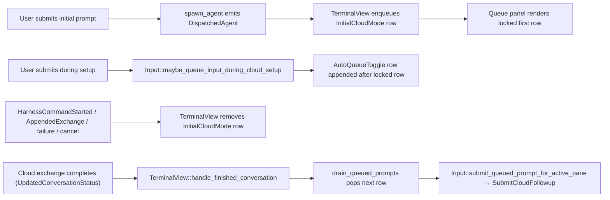

# Queued Prompts in Cloud Mode Setup — Tech Spec
See `specs/APP-4562/PRODUCT.md` for user-visible behavior. This document covers the implementation that supports that behavior, layered on top of the regular Agent Mode queued-prompts panel introduced in `specs/REMOTE-1543/`.

## Context
The regular queued-prompts panel (`specs/REMOTE-1543/`) is a terminal-owned, conversation-keyed queue that appears between the warping indicator and the input editor in `TerminalView`. Its data model lives in `app/src/ai/blocklist/queued_query.rs`, its view lives in `app/src/ai/blocklist/queued_prompts_panel.rs`, and the trigger/drain glue lives in `app/src/terminal/input.rs` and `app/src/terminal/view.rs`. Cloud Mode is currently outside that surface — see `specs/REMOTE-1543/PRODUCT.md (13, 30, 62)` and the panel's `should_render` gate at `app/src/ai/blocklist/queued_prompts_panel.rs (506-521)`.

For Cloud Mode today:
- The initial submitted cloud prompt is shown as a legacy pending-user-query block inserted by `TerminalView::insert_cloud_mode_queued_user_query_block` (`app/src/terminal/view/pending_user_query.rs:90-102`), called from `app/src/terminal/view/ambient_agent/view_impl.rs:163` (`DispatchedAgent`) and `:196` (`FollowupDispatched`).
- Pressing Enter while the cloud environment is still setting up is suppressed by `Input::should_block_cloud_mode_setup_submission` (`app/src/terminal/input.rs:6622-6634`), short-circuited at `app/src/terminal/input.rs:12651`.
- Queued prompts drain off `BlocklistAIControllerEvent::FinishedReceivingOutput` in `TerminalView::handle_ai_controller_event` (`app/src/terminal/view.rs:4980-5097`). That event does not fire for a cloud-mode pane because the response stream lives on the cloud side, so subsequent queued prompts never fire.
- `QueuedQueryOrigin::InitialCloudMode` is already defined at `app/src/ai/blocklist/queued_query.rs:22-29` but is currently unused — this spec wires it up.

## Proposed changes
### 1. Feature flag `QueuedPromptsV2`
Add a compile-time + runtime feature flag.
- `app/Cargo.toml`: add `queued_prompts_v2 = ["queue_slash_command"]` under `[features]`. The cargo dependency means enabling V2 transitively enables the existing queue feature, so every existing `FeatureFlag::QueueSlashCommand.is_enabled()` site still works without modification. Do not add to `default`.
- `crates/warp_features/src/lib.rs:876`: add `QueuedPromptsV2` to the `FeatureFlag` enum, alongside the existing `QueueSlashCommand` entry at `crates/warp_features/src/lib.rs:732`. Add the variant to `DOGFOOD_FLAGS` (`crates/warp_features/src/lib.rs:901-947`).
- `app/src/lib.rs:2957`: register the runtime flag under `#[cfg(feature = "queued_prompts_v2")]`.
All cloud-mode-aware sites described below gate on `FeatureFlag::QueuedPromptsV2.is_enabled()` directly.

### 2. `QueuedQueryOrigin::InitialCloudMode` is now load-bearing
`QueuedQueryModel` (`app/src/ai/blocklist/queued_query.rs`) gains origin-aware no-ops so the locked-row contract is enforced at the model layer, not just the panel:
- `enter_edit_mode` (`(365-396)`): no-op if the target row's origin is `InitialCloudMode`.
- `remove_by_id` (`(291-315)`): no-op if the target row's origin is `InitialCloudMode`.
- `reorder` (`(344-361)`): no-op if `source_id` is `InitialCloudMode`, or if `target_index == 0` would displace an `InitialCloudMode` row currently at index 0.
- `pop_for_autofire` (`(252-288)`): return `None` if the first row's origin is `InitialCloudMode`. The cloud-setup lifecycle removes that row via §5, not autofire.
- Add `remove_initial_cloud_mode_row(conversation_id, ctx)` that removes the first row of `conversation_id`'s queue if and only if its origin is `InitialCloudMode`. Used by §5.

This division means the panel UI in §3 only needs to *render* the lock; it does not need to gate handler dispatch, because the model rejects forbidden mutations even if a click somehow gets through.

### 3. Panel: lock the InitialCloudMode row visually
In `app/src/ai/blocklist/queued_prompts_panel.rs`:
- All locked-row hover affordances share a single tooltip constant `INITIAL_CLOUD_MODE_PROMPT_TOOLTIP = "The first cloud-mode prompt cannot be changed."` so the drag handle, edit button, and delete button all surface the same short explanation.
- In the row rendering inside `render` (`(584-606)`), when the rendered query's `origin()` is `QueuedQueryOrigin::InitialCloudMode`:
  - Render the drag handle in a visually disabled state without wrapping the row in `Draggable`, and show the shared tooltip on hover.
  - Keep the edit and delete `ActionButton`s revealed on hover and call `set_disabled(true)` on each so the click handler is gated and the disabled tooltip is surfaced. Pair that with `with_disabled_theme(NakedTheme)` so the disabled state reuses the regular naked appearance instead of picking up the default greyed-out `DisabledTheme` fill/text. Both buttons reuse the shared tooltip.
  - Static preview text renders identically to other rows.
- `should_render` (`(506-521)`) is unchanged. Because the cargo feature transitively enables `queue_slash_command`, the existing `FeatureFlag::QueueSlashCommand.is_enabled()` check passes when V2 is on.
- Wire the panel into the V2 cloud-mode composing input in `Input::render_cloud_mode_v2_composing_input` (`app/src/terminal/input/agent.rs:354-513`). Render the panel as a sibling above the input card, inside the same `ConstrainedBox` constrained to `CLOUD_MODE_V2_MAX_WIDTH` (`app/src/terminal/input/agent.rs:43`). The non-V2 placement at `app/src/terminal/input/agent.rs (332-337)` is unchanged.

### 4. Route initial + follow-up cloud-mode prompts into the queue
Branch both existing `insert_cloud_mode_queued_user_query_block` call sites on `FeatureFlag::QueuedPromptsV2.is_enabled()`:
- `app/src/terminal/view/ambient_agent/view_impl.rs (149-164)` (initial `DispatchedAgent`).
- `app/src/terminal/view/ambient_agent/view_impl.rs (180-198)` (`FollowupDispatched`).
When V2 is on, call a new `TerminalView::enqueue_initial_cloud_mode_prompt(prompt, ctx)` that resolves the active conversation id via `BlocklistAIContextModel::selected_conversation_id` and appends a row with `QueuedQueryOrigin::InitialCloudMode`. If `selected_conversation_id` returns `None`, fall back to `insert_cloud_mode_queued_user_query_block` so the visual indicator is never lost.

### 5. Mirror legacy block-removal sites onto the panel row
Introduce `TerminalView::remove_cloud_mode_queue_row(&mut self, ctx)` that resolves the active conversation id and calls `QueuedQueryModel::remove_initial_cloud_mode_row` from §2. Every existing call to `remove_pending_user_query_block` for cloud kind also calls the new helper. The helper is a no-op when V2 is off because no `InitialCloudMode` row was ever appended.

Affected sites:
- `app/src/terminal/view/ambient_agent/view_impl.rs (104-122)` — the `should_remove_pending_user_query` branch covering `HarnessCommandStarted`, `Failed`, `NeedsGithubAuth`, `Cancelled`, `HandoffSnapshotUploadFailed`.
- `app/src/terminal/view.rs (5494-5514)` — `remove_pending_cloud_mode_query_if_exchange_has_renderable_user_query`, called from `AppendedExchange` at `app/src/terminal/view.rs (5686-5689)`.
- `app/src/terminal/view.rs (5649-5658)` — oz local-to-cloud handoff first `AppendedExchange`.

### 6. Allow submission while environment is setting up (queue instead of block)
`Input::should_block_cloud_mode_setup_submission` (`app/src/terminal/input.rs:6622-6634`) currently short-circuits Enter to a no-op when the cloud pane is in `WaitingForSession` / `Failed` / `Cancelled` / `NeedsGithubAuth`. This stays untouched. The new path is purely additive and gated.

Add `Input::maybe_queue_input_during_cloud_setup(ctx)` next to `maybe_queue_input_for_in_progress_conversation` (`app/src/terminal/input.rs (13179-13263)`). It:
1. **Hard-gates** on `FeatureFlag::QueuedPromptsV2.is_enabled()` as the very first check; returns false immediately if the flag is off, without inspecting any other state.
2. Returns false unless the cloud-pane predicate `is_ambient_agent() && !is_configuring_ambient_agent() && !is_agent_running()` holds (same predicate as today's block check).
3. Resolves the active conversation id via `BlocklistAIContextModel::selected_conversation_id`. If `None`, returns false.
4. Reads and trims the editor buffer; returns false if empty.
5. Clears the editor buffer and pending attachments (mirroring `app/src/terminal/input.rs (13246-13260)`).
6. Appends a row with `QueuedQueryOrigin::AutoQueueToggle`.
7. Returns true so the submit handler short-circuits.

Call `maybe_queue_input_during_cloud_setup` in the submit handler at `app/src/terminal/input.rs (12630-12634)`, immediately alongside `maybe_queue_input_for_in_progress_conversation`, before `should_block_cloud_mode_setup_submission` is evaluated at `:12651`. When V2 is off, the new helper returns false and the existing block check still short-circuits submission to a no-op exactly as today.

### 7. Drain via conversation-status path, submit via cloud follow-up path
Two pieces change for cloud-mode draining to work end-to-end.

#### 7a. Detect finish via the conversation-status path
Add a second drain entry point inside `TerminalView::handle_ai_history_model_event` (`app/src/terminal/view.rs:5888-5963`), in the `BlocklistAIHistoryEvent::UpdatedConversationStatus` arm:
- Gate on `FeatureFlag::QueuedPromptsV2.is_enabled()` and `self.is_ambient_agent_session(ctx)`.
- Detect a transition from in-progress/blocked to a terminal status using a new `last_observed_conversation_status: HashMap<AIConversationId, ConversationStatus>` field on `TerminalView`. The map is cleared alongside the existing `queued_query_model.clear_for_conversation` cleanup at `app/src/terminal/view.rs:6031-6033`.
- Translate the terminal status into a `FinishReason`: `Complete` for clean completion, `Error` for error statuses, `Cancelled` otherwise.
- Call `self.handle_finished_conversation(conversation_id, finish_reason, ctx)` (`app/src/terminal/view.rs:4838-4857`), which already routes through `drain_queued_prompts` and any registered `queued_prompt_callback`s.

The local AI controller path continues to feed `handle_finished_conversation` for local Agent Mode at `app/src/terminal/view.rs:4998-5097`; the new history-model path feeds it for cloud-mode panes. Both converge on the same drain logic.

#### 7b. Route the popped prompt through the cloud submission path
`TerminalView::drain_queued_prompts` (`app/src/terminal/view.rs:5148-5183`) currently submits popped rows via `Input::submit_queued_prompt` (`app/src/terminal/input.rs:13096-13172`), which goes through the local `BlocklistAIController`. That path does nothing useful for a cloud pane.

Add `Input::submit_queued_prompt_for_active_pane(prompt, ctx)` next to `submit_queued_prompt`. It selects the submission path based on pane kind:
- If the pane is a shared-session viewer (`self.model.lock().shared_session_status().is_viewer()`), reuse `Self::submit_viewer_ai_query` (`app/src/terminal/input.rs:13436-13537`) so the prompt is sent to the sharer with the queued-prompt flag set.
- Else if the active pane is a cloud-mode pane and `ambient_agent_view_model.as_ref(ctx).is_ready_for_cloud_followup_prompt()` (`app/src/terminal/view/ambient_agent/model.rs:806-811`), emit `InputEvent::SubmitCloudFollowup { prompt }`. That event is already handled by `TerminalView` at `app/src/terminal/view.rs:20613-20620` and routes through `AmbientAgentViewModel::submit_cloud_followup` (`app/src/terminal/view/ambient_agent/model.rs:974-1010`), the same path used for user-initiated cloud follow-ups.
- Otherwise fall back to `submit_queued_prompt` so non-cloud queues are unaffected.

Change `drain_queued_prompts`'s `AutofireAction::Submit { text }` branch to call `submit_queued_prompt_for_active_pane(text, ctx)` instead of `submit_queued_prompt(text, ctx)`. The `PopFromEditMode` branch is unchanged.

## End-to-end flow (V2 on)

## Testing and validation
Map tests directly to the product invariants in `specs/APP-4562/PRODUCT.md`:
- **§1, §2 (feature gating)**: compile both with and without the cargo feature (`cargo check -p warp` and `cargo check -p warp --features queued_prompts_v2`); unit-test that all new helpers no-op when V2 is off.
- **§3, §4 (initial cloud-mode prompt as locked row)**: extend `app/src/terminal/view/queued_prompts_test.rs` to verify (a) `DispatchedAgent` appends an `InitialCloudMode` row when V2 is on, (b) `FollowupDispatched` does the same, (c) the legacy block is not inserted when V2 is on.
- **§4 (lock semantics at the model level)**: extend `app/src/ai/blocklist/queued_query_tests.rs` with cases proving `enter_edit_mode`, `remove_by_id`, `reorder` (both `source_id` and `target_index == 0`), `pop_for_autofire`, and `remove_initial_cloud_mode_row` behave correctly for `InitialCloudMode` rows.
- **§6, §7 (removal sites)**: terminal-view tests for `HarnessCommandStarted`, `AppendedExchange` with renderable user query, `Failed`, `Cancelled`, `NeedsGithubAuth`, `HandoffSnapshotUploadFailed`, and oz local-to-cloud handoff first exchange — each must clear the `InitialCloudMode` row.
- **§8 (during-setup queueing)**: input-level test asserting `maybe_queue_input_during_cloud_setup` appends an `AutoQueueToggle` row in cloud-setup states (WaitingForSession, Failed, Cancelled, NeedsGithubAuth) and is a no-op when V2 is off.
- **§13–§16 (drain)**: terminal-view tests asserting (a) `UpdatedConversationStatus` transitioning to a terminal status calls `handle_finished_conversation` once per transition, not per status event, and (b) the resulting submission path goes through `InputEvent::SubmitCloudFollowup` for cloud panes (mocked via `is_ready_for_cloud_followup_prompt`).
- Full presubmit: `./script/presubmit`.

Do not run the app to test.

## Parallelization
Single workstream. The queue model, panel rendering, cloud-mode dispatch sites, conversation-status drain hook, and submission routing all share types (`QueuedQueryOrigin`, `FinishReason`, `ConversationStatus`, `AmbientAgentViewModelEvent`) that must stay consistent across edits. Splitting across child agents would create merge churn on the same files without reducing wall-clock time.

## Risks and mitigations
- **`InitialCloudMode` row leaking past run start**: every existing call to `remove_pending_user_query_block` for cloud kind gets a sibling call to `TerminalView::remove_cloud_mode_queue_row`, and the model-level `pop_for_autofire` no-op prevents accidental autofire of the locked row. Tested per §5 above.
- **Double drain**: `FinishedReceivingOutput` (local) and `UpdatedConversationStatus` (history) could both call `handle_finished_conversation`. Mitigation: the new history-model entry is gated on `is_ambient_agent_session` and on a status *transition* tracked via `last_observed_conversation_status`, not on raw status updates.
- **Conversation id not yet assigned at `DispatchedAgent`**: §4 falls back to the legacy pending-user-query block so the visual indicator is never lost.
- **Cargo feature dependency mistake**: if `queued_prompts_v2 = ["queue_slash_command"]` is omitted from `app/Cargo.toml`, V2 appears to work but the regular queue surfaces are silently dark. Mitigation: presubmit + the explicit compile-check on `--features queued_prompts_v2` in isolation.
- **Panel placement inside the V2 centered input**: the panel must match `CLOUD_MODE_V2_MAX_WIDTH` so it stays visually attached to the input card. Mitigation: render it inside the same `ConstrainedBox`/`Align` wrapper that the V2 input uses (§3).
