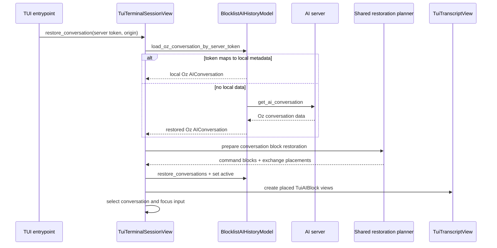

# TECH: Warp TUI Conversation Resume and Restoration (CODE-1820)

Implements the behavior in [`PRODUCT.md`](./PRODUCT.md). Code references are pinned to commit `1eb3698892bdcc9e038a9b0ea8b0eb34ffadfde0`.

## Context

The TUI already boots the main `app` crate and reuses the same agent conversation, history, action, controller, persistence, terminal model, and blocklist implementations as the GUI. The missing capability is a surface-level restoration entrypoint: no TUI argument accepts a prior conversation, no historical conversation is materialized into the transcript, and no selected token survives teardown long enough to print after the alternate screen is restored.

The relevant existing paths are:

- [`crates/warp_tui/src/session.rs (42-157)`](https://github.com/warpdotdev/warp/blob/1eb3698892bdcc9e038a9b0ea8b0eb34ffadfde0/crates/warp_tui/src/session.rs#L42-L157) — dispatches TUI worker re-execs, starts `warp::run_tui`, gates terminal-session creation on login, and exposes the `post_wire` callback after the surface is connected.
- [`app/src/ai/blocklist/history_model/conversation_loader.rs (233-366)`](https://github.com/warpdotdev/warp/blob/1eb3698892bdcc9e038a9b0ea8b0eb34ffadfde0/app/src/ai/blocklist/history_model/conversation_loader.rs#L233-L366) — loads conversations from memory, local SQLite, or the server. `load_conversation_by_server_token` first resolves a canonical local ID and reuses local data when present, then falls back to the server; this change adds a typed Oz-only wrapper over that behavior for TUI errors.
- [`app/src/ai/blocklist/history_model.rs (1058-1169)`](https://github.com/warpdotdev/warp/blob/1eb3698892bdcc9e038a9b0ea8b0eb34ffadfde0/app/src/ai/blocklist/history_model.rs#L1058-L1169) — `restore_conversations` registers a loaded conversation on a terminal surface and rebuilds the server-token and parent/child indexes; `set_active_conversation_id` establishes active-surface state.
- [`app/src/terminal/view/load_ai_conversation.rs (439-637)`](https://github.com/warpdotdev/warp/blob/1eb3698892bdcc9e038a9b0ea8b0eb34ffadfde0/app/src/terminal/view/load_ai_conversation.rs#L439-L637) — GUI historical restoration: restore action results and documents, register conversations, reconstruct command blocks, compute AI-block placement, and create GUI views.
- [`app/src/terminal/view/load_ai_conversation.rs (1196-1272)`](https://github.com/warpdotdev/warp/blob/1eb3698892bdcc9e038a9b0ea8b0eb34ffadfde0/app/src/terminal/view/load_ai_conversation.rs#L1196-L1272) — computes where restored agent exchanges belong relative to command blocks.
- [`app/src/ai/agent/conversation.rs (4003-4086)`](https://github.com/warpdotdev/warp/blob/1eb3698892bdcc9e038a9b0ea8b0eb34ffadfde0/app/src/ai/agent/conversation.rs#L4003-L4086) — reconstructs `SerializedBlockListItem::Command` values from conversation task messages.
- [`app/src/ai/blocklist/action_model.rs (606-671)`](https://github.com/warpdotdev/warp/blob/1eb3698892bdcc9e038a9b0ea8b0eb34ffadfde0/app/src/ai/blocklist/action_model.rs#L606-L671) — historical blocks read action status from `BlocklistAIActionModel`; `restore_action_results_from_exchanges` populates the past-results map they require.
- [`crates/warp_tui/src/terminal_session_view.rs (134-244)`](https://github.com/warpdotdev/warp/blob/1eb3698892bdcc9e038a9b0ea8b0eb34ffadfde0/crates/warp_tui/src/terminal_session_view.rs#L134-L244) — constructs the TUI surface's selection, context, action, controller, transcript, and input models.
- [`crates/warp_tui/src/transcript_view.rs (84-239)`](https://github.com/warpdotdev/warp/blob/1eb3698892bdcc9e038a9b0ea8b0eb34ffadfde0/crates/warp_tui/src/transcript_view.rs#L84-L239) — creates `TuiAIBlock` rich-content views for live exchanges and stores them in the shared `TerminalModel` blocklist; `RestoredConversations` is currently ignored.
- [`crates/warp_tui/src/conversation_selection.rs (99-257)`](https://github.com/warpdotdev/warp/blob/1eb3698892bdcc9e038a9b0ea8b0eb34ffadfde0/crates/warp_tui/src/conversation_selection.rs#L99-L257) — selects an existing conversation for the next prompt and resets selection when a surface is cleared.

`RestoredAgentConversations` is not the interactive loader for this feature. It supports GUI startup by handing local-ID records to recreated panes at most once. Token-based interactive restoration already has the correct local-first/server-fallback behavior in `BlocklistAIHistoryModel::load_conversation_by_server_token`.

## End-to-end flow



## Proposed changes

### 1. Parse and carry `--resume`

Add a TUI-specific argument parser in `crates/warp_tui/src/session.rs`. `run_tui_worker_if_requested` remains the first operation so terminal-server and other internal re-execs retain their current behavior. After worker detection, parse optional `--resume <token>` input and validate its UUID shape before launching the app.

Carry `Option<ServerConversationToken>` through the mount closure and login gate. Initiate restoration from the terminal manager's `post_wire` callback, where the `TuiTerminalSessionView` and all of its controller/model dependencies have been created and connected. Startup without a token follows the current path unchanged.

The startup entrypoint must not implement restoration itself. It calls the generalized TUI operation described below, which the future inline list will call directly with the selected entry's token.

### 2. Add one generalized TUI restoration operation

Add a method on `TuiTerminalSessionView` with the conceptual shape:

```rust
restore_conversation(
    server_token: ServerConversationToken,
    origin: TuiConversationRestoreOrigin,
    ctx: &mut ViewContext<Self>,
)
```

`TuiConversationRestoreOrigin` distinguishes startup resume from future list selection for telemetry and presentation only. It does not change identity, loading, block reconstruction, or continuation semantics.

The operation owns the TUI state transition:

1. Enter a loading state that suppresses the interactive zero state.
2. Call `BlocklistAIHistoryModel::load_oz_conversation_by_server_token`, which preserves the existing local-first/server-fallback semantics while returning typed Oz restoration errors.
3. Let the typed loader reject non-Oz data with a permanent unsupported-harness error.
4. Verify that the returned `AIConversation` contains the requested server token before registration.
5. Prepare the shared block restoration plan and historical action state.
6. Atomically replace the sole TUI conversation surface.
7. Register the conversation, create TUI views, mark it active and selected, clear loading state, scroll to the end, and focus the input.

The server token must be installed on the `AIConversation` before `restore_conversations`. Local conversion obtains it from persisted `AgentConversationData`; server conversion with `RestorationMode::Continue` obtains it from server metadata. If a compatibility path must repair an absent token, add the narrowest pre-registration API needed rather than inserting the conversation and patching it afterward, because registration builds the reverse token index from the conversation value it receives.

For startup, replacement operates on an empty transcript. For future inline selection, load and validate the requested conversation before clearing the current surface. If loading fails, retain the old transcript and selection. Once loading succeeds, use the history clear event plus a transcript/blocklist replacement helper to remove the old conversation's agent rich content, conversation-derived command blocks, action state, and selection before applying the new plan.

### 3. Extract shared conversation block restoration preparation

The GUI and TUI share `AIConversation`, `TerminalModel`, and `BlockList`; only their final rich-content view types differ. Extract the model/blocklist work currently embedded in `TerminalView::restore_conversation_after_view_creation` into a shared module under `app/src/ai/blocklist` or `app/src/terminal`.

Introduce a `ConversationBlockRestorationPlan` containing ordered restored exchanges and their `Option<BlockIndex>` placement relative to command blocks. Its builder:

- Uses the existing `exchanges_for_blocklist` rules from `app/src/terminal/view/blocklist_filter.rs` so hidden exchanges and internal task types remain consistently filtered.
- Calls `AIConversation::to_serialized_blocklist_items` and inserts the resulting command blocks into the supplied `TerminalModel`.
- Computes exchange placement with the existing timestamp algorithm from `command_block_indices_for_exchanges`.
- Returns frontend-neutral exchange data and placement; it does not construct views, manage focus, or apply Agent View policy.

Move or expose the filtering and placement helpers from the GUI view module at the narrowest visibility that supports both `app` and `warp_tui`. Add concise doc comments to new functions and types, and keep imports at file scope.

Refactor the GUI historical path to consume the plan without behavior changes. The GUI continues to own `AIBlockCreationParams`, document restoration, Agent View entry blocks, directory hints, pixel sizing, mouse state, and restored appearance.

### 4. Restore action state before constructing historical blocks

Before either frontend constructs historical agent views, pass the plan's visible exchanges to `BlocklistAIActionModel::restore_action_results_from_exchanges`.

This ordering is required: `TuiAIBlock` resolves tool-call status through the action model at render time. Constructing blocks first would render completed historical actions as unknown or pending. Keep the same ordering in the refactored GUI path so the extraction cannot introduce a cross-surface discrepancy.

When the sole TUI surface is replaced, clear the previous conversation's historical action-result state or replace the per-surface action model as necessary so results from the old transcript cannot satisfy action IDs in the new one.

### 5. Materialize restored TUI blocks with shared placement

Extend `TuiTranscriptView` with a restored-insertion path separate from the live `AppendedExchange` append path.

For each planned exchange:

- Construct the existing `AIBlockModelImpl<TuiAIBlock>`.
- Register the `TuiAIBlock` view and subscriptions exactly as live blocks do.
- Insert its `RichContentItem` before the planned command block with `BlockList::insert_rich_content_before_block_index`, or append it when no command placement exists.
- Preserve duplicate protection by exchange ID.

The explicit restoration operation drives this path because `RestoredConversations` carries IDs but not the block-placement plan. Other history observers continue to receive that event normally.

After all blocks are materialized, move the viewport to the end and notify the transcript so restored height and layout are recomputed.

### 6. Register, activate, and select in a fixed order

Apply restored state in this order:

1. Restore historical action results.
2. Insert conversation-derived command blocks and compute placements.
3. Call `BlocklistAIHistoryModel::restore_conversations`.
4. Create placed `TuiAIBlock` views.
5. Call `set_active_conversation_id`.
6. Call `ConversationSelection::select_existing_conversation` with a restore-specific origin.
7. Clear loading state and focus the input.

Registration must precede `TuiAIBlock` construction because `AIBlockModelImpl` resolves the exchange from `BlocklistAIHistoryModel`. Selection happens after materialization so the input never targets a conversation whose transcript failed to build.

### 7. Represent loading and errors in the sole TUI surface

Add restoration state owned by `TuiTerminalSessionView`, for example:

- `Idle`
- `Loading`
- `Failed { message }`

Startup resume renders loading instead of the zero state until completion. A startup failure renders an error with the input disabled until the user exits; it must not silently enter new-conversation mode.

Future inline selection may display loading while retaining the current transcript. On failure, show a transient or inline error and return to the prior selected conversation. Keep this distinction controlled by `TuiConversationRestoreOrigin`, while all loader and materialization behavior remains shared.

Map loader failures into user-visible categories required by PRODUCT behaviors 21-24. Preserve structured internal errors in logs/Sentry without exposing sensitive server details in the transcript.

### 8. Capture and print the selected server token

Printing must happen after `warp::run_tui` returns so raw mode and the alternate screen have been restored. At that point the `App` and its models have been dropped.

Create a small TUI-owned `TuiExitSummaryHandle`, backed by run-scoped shared storage and retained by `session::run`. Update it from the live source of truth whenever:

- `ConversationSelectionEvent::Changed` changes the selected conversation.
- `BlocklistAIHistoryEvent::ConversationServerTokenAssigned` gives the selected conversation its token.
- A restored conversation becomes selected.
- Selection is cleared.

Each update re-reads the selected `AIConversation` and stores only its optional `ServerConversationToken`; it does not duplicate conversation state. After `run_tui` returns successfully, print the resume command when the handle contains a token. Do not fall back to an active conversation or local ID.

This run-scoped bridge avoids changing the shared `TerminationResult`, which carries only `Result<()>`, and avoids printing while the alternate screen is still active. It also works with the headless signal path, which funnels termination through the same event loop before model teardown.

## Testing and validation

### Loader and identity tests

- Known token mapped to a live conversation returns that conversation without a server fetch. (PRODUCT 7-8)
- Known token mapped to local persisted metadata restores from SQLite. (PRODUCT 7-8)
- Unknown local token fetches from the server and preserves the requested token before registration. (PRODUCT 8, 16)
- Canonical local IDs remain stable for repeated loads of the same token.
- Missing, unauthorized, offline, corrupt, and non-Oz results map to distinct restoration errors. (PRODUCT 21-23)

### Shared restoration-plan tests

- The refactored GUI path produces the same visible exchange set and block ordering as before.
- Hidden exchanges and filtered internal task types are excluded. (PRODUCT 11)
- Conversation-derived command blocks are reconstructed without execution. (PRODUCT 10, 13)
- Agent exchanges are placed correctly relative to command blocks, including equal timestamps and no-command cases. (PRODUCT 10, 14)
- Action results are restored before block construction. (PRODUCT 12)

### TUI unit and view tests

Use existing `App::test` fixtures under `crates/warp_tui` to verify:

- Startup restoration transitions from loading to the restored transcript without showing an interactive zero state. (PRODUCT 5-6)
- Transcript content, command/agent ordering, hidden filtering, and duplicate prevention. (PRODUCT 9-15)
- Restored tool calls render recorded terminal states. (PRODUCT 12)
- The restored conversation becomes active and selected only after successful materialization. (PRODUCT 15-18)
- The next submitted prompt carries the restored server token. (PRODUCT 16)
- Inline-style replacement retains the old transcript on load failure and removes stale blocks/action state on success. (PRODUCT 19-20)
- Loading cancellation and error states do not start a new conversation. (PRODUCT 21-24)

### CLI and exit tests

- Internal worker arguments retain precedence over TUI arguments.
- No `--resume` preserves existing startup. (PRODUCT 1)
- A malformed or missing token value fails clearly. (PRODUCT 2-4)
- Successful exit prints the selected token after TUI teardown. (PRODUCT 25-27)
- No selection, no selected token, worker mode, and error termination print no hint. (PRODUCT 28-31)

### End-to-end verification

Run the TUI, complete a conversation, exit, and relaunch with the emitted token. Verify transcript order, command-block content, input focus, and same-lineage follow-up. Repeat once with local persisted data available offline and once with a token that requires a server fetch. Verify a failed token never enters a new conversation.

Run `cargo nextest run -p warp_tui`, the focused `warp` restoration/history tests, `./script/format`, and the presubmit clippy invocation before opening the PR.

## Risks and mitigations

- **Shared GUI refactor:** extracting restoration planning could change existing block ordering. Keep GUI behavior unchanged, preserve its tests, and add plan-level timestamp-ordering coverage before wiring the TUI.
- **Token patched too late:** inserting a conversation before its token is present can rebuild a stale reverse index. Verify or repair the token before `restore_conversations`, never after.
- **Partial surface replacement:** clearing before a cloud load succeeds can destroy a usable transcript. Load and validate first, then replace the surface as one foreground-thread operation.
- **Stale action results:** reusing an action model across conversation replacements can leak historical tool status. Clear or reinitialize per-conversation restoration state as part of replacement and test action-ID isolation.
- **Hint printed inside the alternate screen:** only persist the exit summary during the run; print after `run_tui` returns.

## Parallelization

Not proposed. The work forms one tightly coupled dependency chain: shared GUI restoration extraction, TUI materialization against that shared plan, selection/loading state, and exit lifecycle. Splitting it across agents would create contention in `load_ai_conversation.rs`, `transcript_view.rs`, and the shared blocklist APIs while forcing each worker to coordinate intermediate type changes. Implement sequentially on `harry/code-1820-conversation-persistence`.
