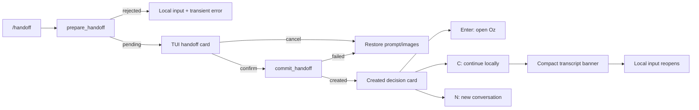

# CODE-1827 PR 3: TUI Local-to-Cloud Handoff

## Context

This top PR implements [`PRODUCT.md`](PRODUCT.md) using two reviewed downstack foundations:

1. `code-1827-blocking-interactions` centralizes TUI blocking/focus/render placement.
2. `code-1827-shared-handoff-pipeline` provides `prepare_handoff`, `PendingHandoff`, `commit_handoff`, shared startup classification, and GUI-proven behavior.

This PR contains no GUI pipeline refactor and no restructuring of existing blockers.

Relevant TUI references at warp commit `c4cc7be9477897c75c34bdc75c1a324c25b12f27`:

- [`app/src/terminal/input/slash_commands/mod.rs (103-186)`](https://github.com/warpdotdev/warp/blob/c4cc7be9477897c75c34bdc75c1a324c25b12f27/app/src/terminal/input/slash_commands/mod.rs#L103-L186) owns TUI command selection/allowlisting.
- [`crates/warp_tui/src/terminal_session_view.rs (2569-2810)`](https://github.com/warpdotdev/warp/blob/c4cc7be9477897c75c34bdc75c1a324c25b12f27/crates/warp_tui/src/terminal_session_view.rs#L2569-L2810) dispatches TUI slash commands.
- [`crates/warp_tui/src/orchestration_block/configuration.rs (47-207)`](https://github.com/warpdotdev/warp/blob/c4cc7be9477897c75c34bdc75c1a324c25b12f27/crates/warp_tui/src/orchestration_block/configuration.rs#L47-L207) shows selector integration.
- [`crates/warp_tui/src/orchestration_block/render.rs (85-267)`](https://github.com/warpdotdev/warp/blob/c4cc7be9477897c75c34bdc75c1a324c25b12f27/crates/warp_tui/src/orchestration_block/render.rs#L85-L267) is the card structure/copy reference.
- [`crates/warp_tui/src/attachment_bar/model.rs (52-443)`](https://github.com/warpdotdev/warp/blob/c4cc7be9477897c75c34bdc75c1a324c25b12f27/crates/warp_tui/src/attachment_bar/model.rs#L52-L443) projects pending images from shared input context.
- [`crates/warp_tui/src/orchestration_model.rs (316-440)`](https://github.com/warpdotdev/warp/blob/c4cc7be9477897c75c34bdc75c1a324c25b12f27/crates/warp_tui/src/orchestration_model.rs#L316-L440) demonstrates direct cloud-run creation and static URL state.

## Proposed changes

### Slash command

- Add the existing `/handoff` static command to the TUI allowlist and exhaustive execution match.
- Preserve insert-on-selection behavior and optional argument ghost text.
- Gate availability and execution through existing handoff enablement; add no new feature flag.
- On submission, gather concrete session/controller/context inputs and call downstack `prepare_handoff`.
- Show transient bottom-row errors for long-running commands, active/blocked children, empty source without prompt, and other preparation failures.

### Environment and model options

Keep handoff independent of orchestration-card state while reusing lower-level providers:

- Reuse compatible Oz model catalog filtering and validation.
- Build environment rows without “Empty environment.”
- Reuse saved/recent environment selection and persistence.
- Start current-directory repository suggestion after preparation; apply it only while selection is non-explicit.

Add a narrow shared environment projection exported through `app/src/tui_export.rs`:

- Return current environments.
- Emit on creation/deletion/initial load changes.
- Trigger existing out-of-band refresh for `R`.

Do not export unrelated cloud-object internals or add card-owned polling.

### Handoff card

Add `crates/warp_tui/src/handoff_block.rs` with `TuiHandoffBlock`.

The view owns presentation state only:

- Acceptance summary with `PendingHandoff`.
- Two-page environment/model configuration flow.
- No-environment state.
- Committed progress.
- Static created decision.
- Compact persisted result after local continuation.

It installs as the session-owned input-area interaction in downstack `TuiBlockingInteractionModel`. The transcript stays visible while the normal input, attachments, menus, footer, and response-status rows are suppressed.

Embed `TuiOptionSelector` for environment/model selection. Both pages use its existing search editor. Follow the orchestration card’s acceptance/configuration split, page header and position treatment, tinted header/body, metadata hierarchy, inline attention/error treatment, spacing, and key-hint grammar. Add one blank row above the active card. Reuse theme recipes based on `terminal_colors().normal.magenta`, matching GUI `ai_brand_color(theme)`; do not hard-code RGB values.

Register phase-scoped fixed bindings:

- Acceptance: Enter, Ctrl-E, Ctrl-C.
- Configuration pages: Enter, Left, Right, Tab, Escape, Ctrl-C.
- No environment: Enter, `R`, Ctrl-C.
- Committed progress: consume Ctrl-C without cancellation.
- Created: Enter, `C`, `N`.

### Prompt and image ownership

- On successful preparation, transfer pending images from shared input context into `PendingHandoff`.
- On pre-confirmation cancellation or fatal outcome, restore prompt/images exactly once.
- On successful creation, consume them. Local input remains blocked until the user chooses Continue locally or Start new conversation.
- Never manipulate image ownership through `TuiAttachmentModel` view state.

### Commit and outcomes

On valid Enter:

1. Consume pending card state into `commit_handoff`.
2. Pass no `materialize_local_fork` callback.
3. Keep the blocker installed in non-cancellable progress state.
4. Ignore late callbacks after the card/session is removed.

On created outcome:

- Store the run URL and whether a source conversation existed.
- Do not create `TuiCloudRunView` or task-status subscriptions.
- Keep the static created card installed as the session-owned blocking interaction.
- Enter opens the URL without dismissing the card.
- For a forked conversation, `C` transitions the same view to compact persisted presentation, removes the blocker, registers it as canonical transcript rich content, and focuses existing local input.
- `N` removes the blocker and invokes existing new-conversation behavior without registering transcript rich content.
- Omit `C` for a fresh launch with no source conversation.

On fatal outcome:

- Remove the interaction.
- Restore prompt/images.
- Focus local input.
- Show a transient error.
- Offer no in-card retry.

### No environment

- Render setup-required state with no creation form.
- Enter opens `https://docs.warp.dev/agent-platform/cloud-agents/environments`.
- `R` invokes shared refresh.
- Automatically transition when the environment projection reports an environment.

### Telemetry

- Emit the downstack initiation event with TUI surface and slash-command entry point.
- Reuse snapshot-prepared and dispatch-failure behavior.
- Add no card-action telemetry.

### End-to-end flow

## Testing and validation

Add `handoff_block_tests.rs` plus terminal-session integration-style unit tests.

Map [`PRODUCT.md`](PRODUCT.md) invariants:

- 1-7: command availability, insertion, ghost argument, parsing, fresh launch.
- 8-15: guard errors, eager cancellation, and source-state capture through the shared API.
- 16-20: input-area placement, focus, hidden-input preservation, and magenta theme.
- 21-35: metadata, Ctrl-E editing, searchable environment/model pages, page navigation, no-environment docs/refresh, automatic environment transition, incompatible model.
- 36-41: image transfer/restoration and pre-confirmation cancellation.
- 42-52: progress state, point of no return, shared commit integration, snapshot degradation, prompt semantics.
- 53-60: created decision card, URL open without dismissal, `C` persistence and local continuation, fresh-launch behavior, and `N` new-conversation behavior.
- 61-66: fatal cleanup, single-card invariant, settings changes, and stale callbacks.

Use real `App::dispatch_keystroke` paths and render-to-lines assertions.

Run:

- `./script/format`
- Focused `cargo nextest run -p warp_tui` tests.
- Focused downstack shared-pipeline regression tests if integration changes require them.
- The applicable `warp_tui` clippy command from `./script/presubmit`.

Run `./script/run-tui` in a real terminal and verify:

1. Existing and fresh conversations, with and without prompt.
2. Active-response cancellation.
3. Environment/model selection and no-environment recovery.
4. Image transfer/cancellation restoration.
5. Long-running command and active-child rejection.
6. Snapshot success and induced snapshot failure.
7. Browser open, persistent completed banner, local continuation, and new conversation.
8. Narrow terminal plus light and dark themes.

Do not use GUI integration tests for the TUI card.

## Risks and mitigations

- Keep the PR limited to TUI product behavior; do not redesign downstack APIs without approval.
- Consume pending state once and ignore stale completions to prevent duplicate runs.
- Restore images idempotently.
- Use the centralized blocking model as the sole focus/suppression source.
- Use existing cloud synchronization plus explicit refresh.
- Derive accent styles from themed normal magenta.

## Parallelization

Do not parallelize implementation. The command, card, shared-pipeline integration, focus behavior, and tests form one tightly coupled product slice.
