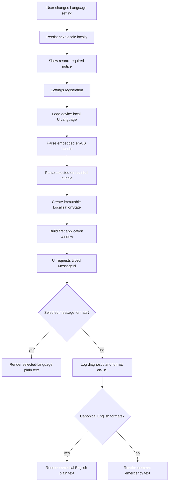

# Incremental Internationalization and Simplified Chinese — Tech Spec

GitHub issue: https://github.com/warpdotdev/warp/issues/10928

Related issue: https://github.com/warpdotdev/warp/issues/1194

Related proposal: https://github.com/warpdotdev/warp/issues/14397

Related prior spec: https://github.com/warpdotdev/warp/pull/10990

## Context

Warp does not currently have an application localization layer. User-facing
English strings are constructed directly in Rust:

- `app/src/search/command_palette/view.rs:278-295` creates the command palette
  with the English search placeholder and empty-result message.
- `app/src/workspace/view.rs:9602-9733` constructs the user menu from English
  literals and dynamic values.
- `app/src/settings_view/mod.rs:244-310` defines stable Settings section
  identifiers and their current English display strings, while line 2881
  constructs the English Settings window title.
- `app/src/settings_view/appearance_page.rs:1379-1565` assembles Appearance
  categories and widgets from English labels.

The existing settings system provides the persistence and UI patterns needed
for a language preference:

- `app/src/settings/input_mode.rs:6-20` shows an enum-backed setting declared
  with `define_settings_group!`.
- `app/src/settings/init.rs:53-115` registers every setting group before the
  application builds its views.
- `app/src/settings_view/appearance_page.rs:1205-1242` shows the existing
  dropdown construction pattern.

The workspace automatically includes crates under `crates/*`
(`Cargo.toml:1-5`), and presubmit runs formatting, Clippy, workspace tests, and
doc tests (`script/presubmit:9-68`).

The prior spec in #10990 proposes a custom YAML runtime and a whole-application
migration. Maintainer feedback in #10928 asks for established prior art,
pluralization, ongoing enforcement, low developer maintenance, safe handling of
dynamic strings, and smaller implementation increments. This spec is an
alternative architecture and rollout plan addressing those concerns.

## Decision summary

- Use [Project Fluent](https://projectfluent.org/) rather than a custom message
  format.
- Use the Rust [`fluent-bundle`](https://docs.rs/fluent-bundle/latest/fluent_bundle/)
  runtime and Fluent syntax parser. Fluent provides language-aware
  selectors/plurals, [variables](https://projectfluent.org/fluent/guide/variables.html),
  and reusable
  [terms](https://projectfluent.org/fluent/guide/terms.html).
- Embed trusted FTL resources in the binary; do not load arbitrary locale files
  from disk in production.
- Use typed message identifiers at Rust call sites and validate catalogs during
  builds and tests.
- Store an explicit, device-local language setting. Do not infer the user's
  language from environment variables or the OS in phase one.
- Apply a changed language on the next launch, avoiding partial live updates.
- Migrate only the Settings language UI, command palette, and low-risk user-menu
  entries in the first implementation.
- Add catalog checks, an incremental copy linter, developer documentation, and
  an agent skill so future UI copy follows the same path.

## Proposed changes

### 1. Add a renderer-independent `warp_i18n` crate

Create:

```text
crates/warp_i18n/
├── Cargo.toml
├── build.rs
├── locales/
│   ├── en-US/
│   │   ├── main.ftl
│   │   └── terms.ftl
│   └── zh-CN/
│       ├── main.ftl
│       └── terms.ftl
└── src/
    ├── lib.rs
    ├── catalog.rs
    ├── coverage.rs
    ├── locale.rs
    └── catalog_tests.rs
```

The crate depends on a Cargo.lock-pinned compatible release of
`fluent-bundle`, `fluent-syntax`, and `unic-langid`. The implementation uses the
concurrent Fluent bundle specialization because translated text can be
requested by UI code running on different threads.

`Locale` is a closed enum in phase one:

```rust
pub enum Locale {
    EnUs,
    ZhCn,
}
```

It provides stable BCP 47 tags (`en-US`, `zh-CN`), settings serialization, and
self-names (`English`, `简体中文`). Unsupported strings return an error rather
than being prefix-matched. In particular, Traditional Chinese locale tags are
never mapped to Simplified Chinese.

`build.rs` generates a typed `MessageId` enum from the canonical English Fluent
IDs. Kebab-case IDs are converted deterministically to Rust variants, and the
build fails if two IDs would produce the same variant. Application code cannot
request a message with an arbitrary string:

```rust
// Generated into OUT_DIR from locales/en-US/main.ftl.
pub enum MessageId {
    CommandPaletteSearch,
    CommandPaletteNoResults,
    SettingsTitle,
    SettingsAppearance,
    SettingsLanguage,
    SettingsLanguageRestartRequired,
    UserMenuWhatsNew,
    UserMenuSettings,
    UserMenuKeyboardShortcuts,
    UserMenuDocumentation,
    UserMenuFeedback,
    UserMenuViewLogs,
    UserMenuJoinSlack,
}
```

Removing an English message therefore breaks any Rust call sites that still use
its generated variant. Adding a canonical English message creates the new
variant without requiring a second hand-maintained key registry.

The public API accepts either no arguments or `FluentArgs` and returns owned
plain text:

```rust
pub struct Translator { /* selected and English bundles */ }

impl Translator {
    pub fn new(locale: Locale) -> Result<Self, CatalogError>;
    pub fn locale(&self) -> Locale;
    pub fn text(&self, id: MessageId) -> String;
    pub fn format(&self, id: MessageId, args: &FluentArgs<'_>) -> String;
}
```

Call sites pass `MessageId`, not English text and not raw FTL keys. This makes
message lookup discoverable and prevents spelling mistakes from silently
becoming runtime fallbacks.

### 2. Embed and validate Fluent resources

`main.ftl` contains messages. `terms.ftl` contains reusable product vocabulary:

```ftl
-warp = Warp
-agent = Agent
-token = Token

user-menu-settings = Settings
agent-token-count =
    { $count ->
        [one] { $count } Token
       *[other] { $count } Tokens
    }
```

The Simplified Chinese catalog references the same protected terms rather than
translating them. Catalog comments give translators context and identify
screenshots or constraints where useful.

`build.rs` parses the exact FTL bytes later embedded with `include_str!` and
fails compilation when:

- either catalog has invalid Fluent syntax;
- two canonical IDs would generate the same `MessageId` variant;
- a message registered as required for the phase-one `zh-CN` surface in
  `coverage.rs` is missing or empty;
- variables differ between an English message and its Simplified Chinese
  translation;
- a selector in either locale lacks a default variant;
- a protected term is missing or has a different value;
- duplicate message or term IDs are present.

Simplified Chinese is not required to reproduce English plural-category arms:
Fluent selects categories per locale. The validator compares referenced
variables and requires valid/default selectors, while locale-specific tests
verify the expected output.

Canonical English may contain a message that is not yet present in Simplified
Chinese; that message uses the normal English fallback and produces a coverage
warning. A message becomes a hard `zh-CN` requirement only when its complete
surface is added to `coverage.rs`. This prevents an unrelated English feature
from being blocked on translation while ensuring advertised localized surfaces
cannot silently regress.

The runtime constructs the selected-language and English bundles from embedded
resources only. There is no production environment variable or filesystem
override, which keeps the resource trust boundary inside the signed executable.

Resolution is per message:

1. Format the selected-locale message.
2. If it is missing or produces a formatting error, record a rate-limited
   diagnostic and format the canonical English message.
3. If canonical English also cannot format, return the constant built-in
   emergency text `Text unavailable`. This final fallback takes no arguments,
   never returns a raw message ID or partially formatted value, and prevents a
   caller error from producing an empty UI label.
4. English resources are build-validated and embedded. Failure to initialize
   the English bundle is treated as an application programming error during
   startup.

Formatting diagnostics contain only the message ID, selected locale, fallback
stage, and a bounded error category such as `missing-message`,
`missing-variable`, or `resolver-error`. They must not contain `FluentArgs`
names or values, partially formatted output, or error debug strings that may
include those values. Dynamic arguments can contain user input, paths,
repository data, commands, or server-provided content and therefore remain
outside logs and telemetry.

The translator returns plain strings. FTL values are never parsed as Markdown,
URLs, menu actions, or rich UI. Dynamic/user/server values enter only as
`FluentArgs`; application code continues to own rendering and interaction.
Rich text must localize trusted text spans separately while keeping link/action
targets in Rust.

### 3. Add a device-local language setting

Create `app/src/settings/language.rs` with
`define_settings_group!(LanguageSettings, ...)`, following the pattern in
`app/src/settings/input_mode.rs:6-20`.

The setting has:

- type: `warp_i18n::Locale`;
- default: `Locale::EnUs`;
- supported platforms: native GUI platforms;
- `SyncToCloud::Never`;
- storage key: `UiLanguage`;
- TOML path: `appearance.language`;
- public visibility so invalid values receive normal Settings validation.

Export the module from `app/src/settings/mod.rs` and register
`LanguageSettings` in `register_all_settings`
(`app/src/settings/init.rs:53-115`).

After settings are registered and loaded, construct a singleton
`LocalizationState` from the saved `Locale` before any window or localized view
is created. The state owns an immutable `Translator` for the lifetime of the
process. This ordering guarantees that the first rendered frame uses one
language consistently.

The first implementation intentionally does not observe preference changes.
Changing the setting writes the next locale but leaves
`LocalizationState::active_locale` unchanged until relaunch.

### 4. Add the Settings language selector

Extend `AppearanceSettingsPageView` with a language dropdown and a
`SetLanguage(Locale)` action, following the dropdown/state update pattern at
`app/src/settings_view/appearance_page.rs:1205-1242`.

Add a Language category near the top of `build_page`
(`app/src/settings_view/appearance_page.rs:1379-1393`). The widget:

- renders `English` and `简体中文` using `Locale::self_name()`;
- writes `LanguageSettings` when selected;
- compares the saved locale with `LocalizationState::active_locale`;
- renders the localized restart-required notice only when they differ.

Add localized rendering helpers for the Settings title and Appearance
navigation label. Do not change `SettingsSection`'s `Display` or `FromStr`
representations: `Display` is currently also used for telemetry and tests, so
stable English identifiers remain unchanged. Rendering calls a separate
`localized_label(&LocalizationState)` method.

The selector and localized Settings labels are hidden behind one
`FeatureFlag::Localization` gate until rollout.

### 5. Migrate a bounded set of GUI call sites

Replace only the phase-one literals:

| Surface | Current code | Phase-one messages |
|---|---|---|
| Settings shell | `app/src/settings_view/mod.rs:244-310`, header construction | Settings title and Appearance label |
| Language selector | `app/src/settings_view/appearance_page.rs` | Language label, option help, restart notice |
| Command palette | `app/src/search/command_palette/view.rs:278-295` | Search placeholder and no-results text |
| User menu | `app/src/workspace/view.rs:9657-9688` | What's new, Settings, Keyboard shortcuts, Documentation, Feedback, View Warp logs, Join Slack community |

The implementation does not migrate the update states at
`app/src/workspace/view.rs:9611-9654` or signup, billing, upgrade, referral, and
logout actions at `app/src/workspace/view.rs:9690-9731`. Those remain English
until their full surface and risk-sensitive copy can be reviewed.

Telemetry names, settings/deep-link identifiers, action enums, commands,
keyboard shortcuts, paths, usernames, versions, and server/model content do not
pass through localization.

### 6. Add incremental enforcement and contributor tooling

Add `script/check_i18n` and invoke its non-networked checks from
`script/presubmit` after formatting and before Clippy.

Hard failures:

- all catalog/build invariants in section 2;
- direct user-facing string literals reintroduced at registered phase-one
  localized call sites;
- a phase-one required key without canonical English and Simplified Chinese
  entries;
- variables or protected terms that drift between catalogs.

Advisory warnings:

- added Rust lines in a pull-request diff that pass a literal to known UI text
  constructors without using localization;
- canonical English messages not yet covered by a Simplified Chinese surface;
- changed protected terms in Simplified Chinese;
- messages lacking translator context comments.

The diff-based advisory check uses the CI base SHA when available. Locally it
checks staged and unstaged additions; if no diff base is available, it still
runs every hard catalog check. A documented, reason-bearing suppression is
allowed for non-user-facing identifiers, test fixtures, protocol values, and
other false positives.

Add `docs/i18n.md` describing:

- when text is and is not user-facing;
- message-ID naming and translator comments;
- variables, selectors, fallback, and protected terms;
- plain-text/rich-text security rules;
- the phase-by-phase migration process;
- commands for validation and pseudo-localized QA.

Add a `localize-ui-copy` skill to `warpdotdev/common-skills` in a linked PR,
then update `skills-lock.json` after that skill is merged. The skill guides
coding agents to add the typed message ID, update both FTL catalogs, preserve
protected terms, run `script/check_i18n`, and request screenshots. This avoids
adding an unpinned repo-local skill contrary to the repository's common-skills
workflow.

### 7. Pseudo-localization

Expose a development-only pseudo locale through a test/debug override, not the
end-user Language selector. Use Fluent's text transform hook (or an equivalent
test-only transform) to expand text and add visible delimiters while preserving
variables and protected terms.

Pseudo-localization is used to find hard-coded English, clipping, and layout
assumptions before another real locale is added.

## Data and control flow



## Testing and validation

### `warp_i18n` unit tests

- Every embedded FTL resource parses.
- Generated `MessageId` variants exactly match canonical English IDs and have no
  collisions.
- Phase-one English and Simplified Chinese catalogs have complete key coverage.
- Variables match where a translation exists, every selector has a default, and
  locale-specific plural arms format correctly.
- Protected terms have identical values.
- A selected-locale miss or formatting error returns canonical English.
- Missing or invalid arguments in both selected-locale and English messages
  return the constant emergency text without panicking.
- Formatting diagnostics never include argument names or values, partially
  formatted output, or unbounded error debug strings.
- No successful lookup returns an empty string or raw message ID.
- English and Simplified Chinese numeric selector examples produce the expected
  variants.
- `Locale` accepts only exact supported serialized tags.
- Pseudo-localization preserves variables and protected terms.

### Settings tests

- The default language is `en-US`.
- `UiLanguage` round-trips through public Settings storage.
- The setting uses `SyncToCloud::Never`.
- Invalid serialized values fall back through normal Settings validation.
- Selecting another locale produces a pending-restart state while leaving the
  active translator unchanged.

### UI and integration tests

- Command palette snapshots/assertions cover English and Simplified Chinese
  placeholder/empty-state text.
- Appearance Settings exposes both self-named language options.
- The restart notice appears only when saved and active locales differ.
- User-menu tests assert the exact phase-one translated items and confirm the
  excluded risk-sensitive actions remain English.
- Stable `SettingsSection::Display`, deep links, action IDs, and telemetry values
  retain their existing English values.
- Default-feature GUI builds compile on macOS, Windows, and Linux.

### Manual validation

1. Run `./script/presubmit`.
2. Start an English build and capture Settings, command palette, and user-menu
   screenshots.
3. Choose `简体中文`, verify the restart notice, relaunch, and capture the same
   surfaces.
4. Compare action behavior, keyboard focus, accessibility labels, glyphs,
   clipping, and alignment at default and enlarged UI scales.
5. Run the pseudo locale and check the same surfaces for hidden hard-coded
   English and fixed-width assumptions.
6. Build a release-style bundle and confirm localization works without external
   locale files.

## Rollout and implementation slices

1. **Spec PR:** land the approved product and technical design.
2. **Foundation slice:** add `warp_i18n`, embedded catalogs, validation,
   device-local setting, feature flag, Language selector, and phase-one call
   sites. Implementation may continue on the approved spec PR if maintainers
   prefer the repository's standard flow.
3. **Tooling slice:** land the linked common-skills change and enable the
   incremental advisory linter.
4. **Dogfood:** validate English, Simplified Chinese, fallback, and pseudo
   locale with the feature flag enabled.
5. **Release:** enable the feature flag after automated and manual validation.
6. **Follow-ups:** migrate one complete product surface per reviewable change;
   require explicit human copy review before translating security-sensitive
   surfaces.

No whole-application string replacement is part of the first implementation.

## Alternatives considered

### Custom JSON or YAML catalogs

Simple key/value formats are easy to prototype but require Warp to design and
maintain plural rules, selectors, term reuse, escaping, parser behavior, and
tooling. This repeats the central concern raised on #10928 and is not proposed.

### ICU MessageFormat

ICU MessageFormat can express complex language rules, but Fluent has a direct
Rust implementation, first-class reusable terms, selector/plural support, and a
focused plain-text resource model suitable for Warp's Rust UI. This spec does
not require Warp to design a MessageFormat subset.

### Whole-application migration

Migrating thousands of call sites would make architecture review, translation
review, visual QA, and rebasing high risk. An incremental surface registry
proves the foundation and enforcement model before broad adoption.

### Automatic system-locale selection

Environment and operating-system locale precedence differs by launch path and
platform. An explicit local setting is deterministic and matches the requested
user experience. Automatic detection can be proposed separately.

## Risks and mitigations

### New dependencies and runtime parsing

Fluent adds maintained third-party dependencies and parses resources during
startup. Versions are pinned in Cargo.lock and reviewed through the existing
dependency process. The same embedded bytes are parsed during the build, locale
files are small and trusted, and there is no production arbitrary-file loading.

### Partial localization

A mixed-language application can feel inconsistent. The selector clearly
offers a first release, the migrated surfaces are bounded, and every missing
message falls back to usable English. Follow-ups migrate complete surfaces
rather than isolated strings.

### Unlocalized copy can still be introduced

Perfect classification of Rust string literals is not feasible without false
positives. Hard checks protect migrated surfaces and catalog integrity; a
diff-based advisory linter warns elsewhere; contributor docs and the agent skill
provide a low-friction repair path. Coverage expands as each surface migrates.

### Longer Chinese labels can affect layout

Pseudo-localization, screenshot comparisons, enlarged-scale checks, and manual
testing are required before rollout. Layout fixes remain part of the same
surface migration.

### Security-sensitive copy can lose meaning

Those surfaces remain English in phase one. Later migrations require explicit
human copy review, canonical English fallback, plain-text resources, and trusted
application-owned actions/links.

## Maintainer concern mapping

| Concern raised in #10928 | Proposed answer |
|---|---|
| Prior art instead of an in-house solution | Project Fluent and its Rust runtime |
| Pluralization | Fluent language-aware selectors and numeric values |
| Maintenance as code changes | Typed IDs, build validation, contributor docs, and a common agent skill |
| Enforcement | Hard checks for migrated surfaces plus repository-wide diff warnings |
| Non-static server/variable strings | Values remain data and enter only through `FluentArgs`; they are never used as message syntax |
| Developer friction | Self-contained checks, precise diagnostics, documented suppressions, and agent-assisted edits |
| Whole-app blast radius | Foundation plus three bounded GUI surfaces; later migrations are separate |

## Open questions

None required to begin the first implementation. Dependency versions and the
exact location of the linked common-skills change are resolved during
implementation review without changing the behavior or architecture above.
