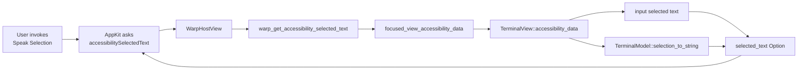

# macOS Speak Selection reads the active Warp text selection - Tech Spec
Product spec: `specs/GH10954/product.md`
GitHub issue: https://github.com/warpdotdev/warp/issues/10954
Code researched at: [`3bf0899d57087b378b99d242cecfdf16ce094097`](https://github.com/warpdotdev/warp/tree/3bf0899d57087b378b99d242cecfdf16ce094097)

## Context
The product behavior is a narrow macOS accessibility fix: when macOS asks Warp for selected text, Warp should return the same live selected plain text it already uses for copy/insert flows. It should not introduce a second terminal-selection algorithm.

Current relevant code:

- [`crates/warpui_core/src/core/view/mod.rs:152-164 @ 3bf0899`](https://github.com/warpdotdev/warp/blob/3bf0899d57087b378b99d242cecfdf16ce094097/crates/warpui_core/src/core/view/mod.rs#L152-L164) defines `View::accessibility_data` and `AccessibilityData { content }`. There is no selected-text field today.
- [`crates/warpui_core/src/core/app.rs:1437-1459 @ 3bf0899`](https://github.com/warpdotdev/warp/blob/3bf0899d57087b378b99d242cecfdf16ce094097/crates/warpui_core/src/core/app.rs#L1437-L1459) walks the focused view responder chain and returns the first `AccessibilityData` for the focused window.
- [`crates/warpui/src/platform/mac/window.rs:1327-1342 @ 3bf0899`](https://github.com/warpdotdev/warp/blob/3bf0899d57087b378b99d242cecfdf16ce094097/crates/warpui/src/platform/mac/window.rs#L1327-L1342) implements `warp_get_accessibility_contents`, which asks the app for focused-view accessibility data and returns only `data.content` as an `NSString`.
- [`crates/warpui/src/platform/mac/objc/host_view.m:384-407 @ 3bf0899`](https://github.com/warpdotdev/warp/blob/3bf0899d57087b378b99d242cecfdf16ce094097/crates/warpui/src/platform/mac/objc/host_view.m#L384-L407) exposes `WarpHostView` as an `NSAccessibilityTextAreaRole`, implements `accessibilityValue`, and reports `accessibilityNumberOfCharacters` as `0`. It does not implement `accessibilitySelectedText`, so macOS Speak Selection falls back to the text-area value.
- [`app/src/terminal/view.rs:14591-14616 @ 3bf0899`](https://github.com/warpdotdev/warp/blob/3bf0899d57087b378b99d242cecfdf16ce094097/app/src/terminal/view.rs#L14591-L14616) exposes `TerminalView::selected_text` and `TerminalView::selected_text_from_input`. The latter filters empty input-editor selections to `None`.
- [`app/src/pane_group/mod.rs:2432-2474 @ 3bf0899`](https://github.com/warpdotdev/warp/blob/3bf0899d57087b378b99d242cecfdf16ce094097/app/src/pane_group/mod.rs#L2432-L2474) documents the existing focused-pane selected-text policy: code pane first when applicable, otherwise notebook/document/terminal, and for terminal panes input-editor selection wins over terminal selection.
- [`app/src/terminal/view.rs:28323-28362 @ 3bf0899`](https://github.com/warpdotdev/warp/blob/3bf0899d57087b378b99d242cecfdf16ce094097/app/src/terminal/view.rs#L28323-L28362) builds terminal `AccessibilityData.content` from either full alt-screen output or the last visible terminal blocks plus input text.
- [`app/src/terminal/model/terminal_model.rs:1834-1853 @ 3bf0899`](https://github.com/warpdotdev/warp/blob/3bf0899d57087b378b99d242cecfdf16ce094097/app/src/terminal/model/terminal_model.rs#L1834-L1853) routes `TerminalModel::selection_to_string` to the alt-screen selection when alt-screen is active, otherwise to block-list selection.
- [`app/src/terminal/model/alt_screen.rs:251-272 @ 3bf0899`](https://github.com/warpdotdev/warp/blob/3bf0899d57087b378b99d242cecfdf16ce094097/app/src/terminal/model/alt_screen.rs#L251-L272) converts alt-screen regular and rectangular selections to strings with `RespectObfuscatedSecrets::Yes`.
- [`app/src/terminal/model/blocks/selection.rs:924-1139 @ 3bf0899`](https://github.com/warpdotdev/warp/blob/3bf0899d57087b378b99d242cecfdf16ce094097/app/src/terminal/model/blocks/selection.rs#L924-L1139) converts block-list regular, rectangular, and rich-content selections into selected plain text.
- [`app/src/terminal/model/blocks/selection_tests.rs:962-1159 @ 3bf0899`](https://github.com/warpdotdev/warp/blob/3bf0899d57087b378b99d242cecfdf16ce094097/app/src/terminal/model/blocks/selection_tests.rs#L962-L1159) already covers multi-block `selection_to_string` ordering, and [`app/src/terminal/model/blocks/selection_tests.rs:1463-1587 @ 3bf0899`](https://github.com/warpdotdev/warp/blob/3bf0899d57087b378b99d242cecfdf16ce094097/app/src/terminal/model/blocks/selection_tests.rs#L1463-L1587) covers rectangular selections.

The key gap is that the macOS accessibility bridge exposes a full-ish transcript as the text area's value but does not expose the active selected text through the native selected-text attribute Speak Selection queries.

## Proposed changes

### 1. Extend focused-view accessibility data with selected text

Update `crates/warpui_core/src/core/view/mod.rs`:

- Add `pub selected_text: Option<String>` to `AccessibilityData`.
- Keep `View::accessibility_data` defaulting to `None`, so views that do not participate in accessibility data are unchanged.
- Update the current `TerminalView` struct literal and any compile-discovered struct literals to initialize `selected_text`.

Do not put selected text into `AccessibilityContent`. `AccessibilityContent` is for announcements emitted after actions and focus changes; Speak Selection is a pull-style OS query against the focused accessibility element. Keeping selected text in `AccessibilityData` preserves that separation.

### 2. Populate terminal selected text from existing selection policy

Update `TerminalView::accessibility_data` in `app/src/terminal/view.rs`:

- Preserve the existing `content` calculation exactly, including the alt-screen transcript path and the last-five-block fallback.
- Compute:
  - `selected_text_from_input(ctx)` first.
  - Fallback to `selected_text(ctx)`, which delegates to `TerminalModel::selection_to_string`.
  - Filter empty strings to `None`.
- Return `AccessibilityData { content: terminal_session_content, selected_text }`.

This reuses:

- input-editor selected text for product Behavior 3
- `TerminalModel::selection_to_string` for product Behavior 4-11 and 15
- existing selection clearing and focus ownership for product Behavior 12-14

Do not read terminal grids directly in `TerminalView::accessibility_data`. That would duplicate selection expansion, alt-screen delegation, rectangular row handling, rich-content lookup, and obfuscated-secret policy.

### 3. Add a macOS selected-text FFI callback

Update `crates/warpui/src/platform/mac/window.rs`:

- Add `#[no_mangle] pub extern "C-unwind" fn warp_get_accessibility_selected_text(object: &mut Object) -> id`.
- Mirror the structure of `warp_get_accessibility_contents`:
  - Resolve `WindowState` and `window_id`.
  - Call `app::callback_dispatcher().with_mutable_app_context(|app| app.focused_view_accessibility_data(window_id))`.
  - Read `data.selected_text.unwrap_or_default()` and return an autoreleased `NSString`.
- Optionally factor the shared lookup into a small helper if that keeps the two FFI functions concise, but avoid adding cache state.

The callback should query live state on every invocation. A cached selected string would create stale-speech failure modes when selections clear, resize, scrollback truncates, or focus moves.

Performance tradeoff: this callback will likely rebuild `AccessibilityData.content` just to read `selected_text`, because `focused_view_accessibility_data` returns both fields together. That is acceptable for this narrow bug fix because Speak Selection is user-invoked and the existing content path is already bounded for block-list terminals. A follow-up can add a content-free selected-text query if profiling shows the transcript rebuild is expensive.

### 4. Expose `accessibilitySelectedText` from `WarpHostView`

Update `crates/warpui/src/platform/mac/objc/host_view.m`:

- Add the Rust callback declaration near `warp_get_accessibility_contents`:
  - `id warp_get_accessibility_selected_text(WarpHostView *);`
- Implement `- (NSString *)accessibilitySelectedText`.
- If `readyForWarp` is false, return `nil`.
- Query `warp_get_accessibility_selected_text(self)`.
- If the returned string is `nil` or has length `0`, return `nil` rather than an empty string. This keeps the no-selection case distinct and avoids treating a cleared selection as a real selected-text value.
- Otherwise return the selected string.

Leave `accessibilityValue` unchanged so existing VoiceOver and transcript behavior stay intact. Leave `accessibilityNumberOfCharacters` at `0` for this issue; the product requirement only needs Speak Selection to consume selected text, not full range navigation.

Do not implement `accessibilitySelectedTextRange`, `accessibilityStringForRange:`, `accessibilityAttributedStringForRange:`, or `accessibilityFrameForRange:` in this slice unless manual testing proves `accessibilitySelectedText` alone is insufficient on supported macOS versions. Those methods require a stable character-index model for the terminal transcript and are better treated as the future full-text accessibility provider.

### 5. Keep non-macOS behavior unchanged

No changes are required in:

- `crates/warpui_core/src/platform/mod.rs::Delegate`
- test/headless delegates' `set_accessibility_contents`
- Linux, Windows, or wasm platform bridges

The new selected-text query is macOS-specific FFI invoked only by `WarpHostView`. Other platforms continue to compile because `AccessibilityData` is just a shared data struct and the platform delegate trait is unchanged.

## End-to-end flow

1. User selects text in a focused Warp terminal surface.
2. Existing selection state is updated in the input editor, terminal block list, rich-content block tracking, or alt-screen model.
3. User invokes macOS Speak Selection.
4. AppKit calls `-[WarpHostView accessibilitySelectedText]`.
5. `WarpHostView` calls `warp_get_accessibility_selected_text`.
6. Rust asks `AppContext` for focused-view `AccessibilityData`.
7. `TerminalView::accessibility_data` returns the existing transcript content plus live selected text.
8. The macOS callback returns selected text to AppKit as an `NSString`, or `nil` when no non-empty selection exists.
9. macOS speaks the selected string and stops at its end.



## Testing and validation

### Automated tests

- Add a `TerminalView` unit test that constructs both an input-editor selection and a terminal-output selection, calls `accessibility_data`, and asserts `selected_text` equals the input selection. This covers product Behavior 3.
- Add a `TerminalView` unit test with only a terminal-output selection and assert `accessibility_data.selected_text` equals `TerminalView::selected_text(ctx)`. This covers product Behavior 4 and ensures the accessibility path reuses the canonical selector.
- Add a no-selection or cleared-selection test that asserts `selected_text` is `None`. This covers product Behavior 12-13.
- Keep existing `selection_to_string` tests passing for multi-line, reversed, wrapped, rich-content, alt-screen, rectangular, and obfuscated-secret semantics where they already exist. These cover product Behavior 4-11 and 15 because the new path delegates to the same source.
- Add or update a narrow mac FFI-adjacent Rust test only if the project has a test harness that can safely call exported callbacks. Otherwise, leave native AppKit behavior to manual validation because `host_view.m` is not meaningfully exercised by unit tests.

Suggested focused commands:

```sh
cargo nextest run -p warp --lib terminal::view_tests::test_accessibility_data_prefers_input_selected_text
cargo nextest run -p warp --lib terminal::model::blocks::selection_tests
cargo nextest run -p warp --lib terminal::model::selection_tests
./script/format
```

Exact test names can change during implementation, but the first command should target the new accessibility-data tests and the latter commands should preserve the reused selection semantics.

### Manual macOS validation

Manual validation is required because macOS Speak Selection and AppKit accessibility method dispatch are not covered by CI.

Run a local macOS Warp build and verify:

1. Select one word in terminal output, invoke the configured Speak Selection shortcut, and confirm speech starts at the selected word and stops at the selection end. Covers Behavior 1-2.
2. Select multiple lines across command/output blocks, including bottom-up selection, and confirm document-order speech. Covers Behavior 4-5.
3. Select text in the command input while terminal output is also selected and confirm input selection wins. Covers Behavior 3.
4. Select rectangular text and wrapped-line text and compare speech to copied plain text. Covers Behavior 7-8.
5. In alt-screen, verify Shift-drag Warp selection speaks selected text while normal mouse-reporting drag remains owned by the TUI. Covers Behavior 9.
6. Select rich-content or AI response text where selection/copy already works and confirm the same text is spoken. Covers Behavior 10.
7. Select output containing obfuscated secrets and confirm speech does not reveal hidden secret values. Covers Behavior 11.
8. Clear selection, switch focus to another pane, and invoke Speak Selection again; confirm the old selected text is not spoken. Covers Behavior 12-14.
9. Select emoji, wide characters, combining marks, and non-Latin text and confirm speech follows the selected glyphs without duplicated spacer artifacts. Covers Behavior 15.
10. With VoiceOver enabled, perform normal text selection and block navigation to confirm existing announcements are not duplicated or removed. Covers Behavior 16.

## Parallelization

Parallel implementation is not recommended. The change is small and tightly coupled across one shared API (`AccessibilityData`), one producer (`TerminalView::accessibility_data`), and one macOS consumer (`WarpHostView` / `warp_get_accessibility_selected_text`). Splitting this across agents would create merge churn and increase the risk of API drift. A single branch should implement the data-field change, macOS bridge, tests, and manual validation notes together.

## Risks and mitigations

- **macOS Speak Selection may require more than `accessibilitySelectedText` on some supported OS versions.** Start with the minimal selected-text attribute because it directly addresses the observed fallback behavior. If manual testing fails on a supported macOS version, add the smallest required AppKit method and document the version-specific reason in this spec.
- **Rebuilding transcript content for selected-text queries can be wasteful.** Accept this for the bug fix because Speak Selection is explicit and the existing block-list transcript is bounded. If profiling shows cost, add a follow-up API that asks focused views only for selected text.
- **Selection semantics could drift if the accessibility path reads grids directly.** Avoid this by delegating to `selected_text_from_input` and `TerminalModel::selection_to_string`, and add tests that compare `accessibility_data.selected_text` to the canonical selected-text helpers.
- **Empty strings can look like real selections to AppKit.** Return `nil` from `accessibilitySelectedText` when the Rust selected-text string is empty.
- **VoiceOver announcements could become noisy if selected text is emitted as an announcement.** Keep selected text out of `ActionAccessibilityContent`; expose it only through `AccessibilityData` for pull-based OS queries.

## Follow-ups

- Add a richer terminal accessibility text provider with nonzero character counts, selected ranges, string-for-range, and frame-for-range APIs if Warp wants full transcript navigation beyond Speak Selection.
- Add selected-text support for non-macOS accessibility bridges if Windows or Linux native assistive technologies expose equivalent selected-text queries.
- Factor a content-free selected-text query if the shared `focused_view_accessibility_data` path proves too expensive for repeated AppKit queries.
