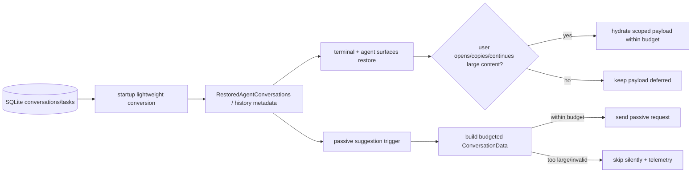

# Memory: AI conversation restoration and passive suggestions re-materialize large payloads — Tech Spec
Product spec: `specs/GH12564/product.md`
GitHub issue: https://github.com/warpdotdev/warp/issues/12564
Inspected commit: `ec27d06d7dcc08d78a1447ab0c5974e506e936ff`

## Context
This spec covers three related memory paths called out by the issue: startup restoration of persisted AI conversations, passive suggestion requests that reuse conversation task context, and long-lived AI history state that can be touched from otherwise ordinary terminal interactions. The product behavior lives in `specs/GH12564/product.md`; this document focuses on how to make those paths bounded without deleting conversation data.

Relevant code:

- [`app/src/ai/restored_conversations.rs:17 @ ec27d06`](https://github.com/warpdotdev/warp/blob/ec27d06d7dcc08d78a1447ab0c5974e506e936ff/app/src/ai/restored_conversations.rs#L17-L42) — `RestoredAgentConversations::new` eagerly converts every startup `AgentConversation` into an `AIConversation`.
- [`app/src/ai/blocklist/history_model/conversation_loader.rs:65 @ ec27d06`](https://github.com/warpdotdev/warp/blob/ec27d06d7dcc08d78a1447ab0c5974e506e936ff/app/src/ai/blocklist/history_model/conversation_loader.rs#L65-L101) — `convert_persisted_conversation_to_ai_conversation_with_metadata` calls `AIConversation::new_restored_synthesizing_on_empty` with the full persisted task list.
- [`app/src/ai/blocklist/history_model/conversation_loader.rs:562 @ ec27d06`](https://github.com/warpdotdev/warp/blob/ec27d06d7dcc08d78a1447ab0c5974e506e936ff/app/src/ai/blocklist/history_model/conversation_loader.rs#L562-L568) — orchestration children are eagerly inserted into `conversations_by_id`, which is correct for identity resolution but currently uses the same full conversion path.
- [`app/src/ai/agent/conversation.rs:393 @ ec27d06`](https://github.com/warpdotdev/warp/blob/ec27d06d7dcc08d78a1447ab0c5974e506e936ff/app/src/ai/agent/conversation.rs#L393-L505) — restored tasks are converted into `TaskStore`, exchanges, todo lists, and status.
- [`app/src/terminal/view/load_ai_conversation.rs:706 @ ec27d06`](https://github.com/warpdotdev/warp/blob/ec27d06d7dcc08d78a1447ab0c5974e506e936ff/app/src/terminal/view/load_ai_conversation.rs#L706-L760) — terminal restore collects and clones exchanges into `AIBlockCreationParams` before creating restored AI blocks.
- [`app/src/ai/blocklist/controller.rs:2114 @ ec27d06`](https://github.com/warpdotdev/warp/blob/ec27d06d7dcc08d78a1447ab0c5974e506e936ff/app/src/ai/blocklist/controller.rs#L2114-L2213) — `build_passive_suggestions_request_params` builds follow-up passive suggestion `ConversationData` with `conversation.compute_active_tasks()`.
- [`app/src/ai/agent/conversation.rs:1193 @ ec27d06`](https://github.com/warpdotdev/warp/blob/ec27d06d7dcc08d78a1447ab0c5974e506e936ff/app/src/ai/agent/conversation.rs#L1193-L1210) — `compute_active_tasks` filters active tasks and then clones each selected API task.
- [`crates/ai/src/agent/action_result/mod.rs:351 @ ec27d06`](https://github.com/warpdotdev/warp/blob/ec27d06d7dcc08d78a1447ab0c5974e506e936ff/crates/ai/src/agent/action_result/mod.rs#L351-L358) — `FileContext` stores file name, content, line range, modification time, and line count; tool results such as `ReadFilesResult`, `SearchCodebaseResult`, `RequestFileEditsResult`, and `ReadSkillResult` embed `FileContext` values.
- [`app/src/ai/agent/api/convert_conversation.rs:667 @ ec27d06`](https://github.com/warpdotdev/warp/blob/ec27d06d7dcc08d78a1447ab0c5974e506e936ff/app/src/ai/agent/api/convert_conversation.rs#L667-L684) — restore conversion rebuilds `ReadFilesResult::Success` by converting API file payloads back into `FileContext`.
- [`app/src/ai/agent/api/convert_conversation.rs:729 @ ec27d06`](https://github.com/warpdotdev/warp/blob/ec27d06d7dcc08d78a1447ab0c5974e506e936ff/app/src/ai/agent/api/convert_conversation.rs#L729-L738) — codebase search results are restored as `Vec<FileContext>`.
- [`app/src/ai/agent/api/convert_conversation.rs:758 @ ec27d06`](https://github.com/warpdotdev/warp/blob/ec27d06d7dcc08d78a1447ab0c5974e506e936ff/app/src/ai/agent/api/convert_conversation.rs#L758-L783) — apply-file-diff results restore updated files as `UpdatedFileContext { file_context }`.
- [`app/src/ai/agent/api/convert_conversation.rs:1014 @ ec27d06`](https://github.com/warpdotdev/warp/blob/ec27d06d7dcc08d78a1447ab0c5974e506e936ff/app/src/ai/agent/api/convert_conversation.rs#L1014-L1035) — read-skill results restore full skill file content into `FileContext`.
- [`app/src/ai/blocklist/passive_suggestions/maa.rs:886 @ ec27d06`](https://github.com/warpdotdev/warp/blob/ec27d06d7dcc08d78a1447ab0c5974e506e936ff/app/src/ai/blocklist/passive_suggestions/maa.rs#L886-L910) — passive code suggestions read detected files with a fixed 500,000-byte per-call limit and no explicit aggregate policy shared with conversation-history trimming.
- [`crates/ai/src/agent/action_result/convert.rs:802 @ ec27d06`](https://github.com/warpdotdev/warp/blob/ec27d06d7dcc08d78a1447ab0c5974e506e936ff/crates/ai/src/agent/action_result/convert.rs#L802-L835) — converting `FileContext` back to API file payloads copies string content into `FileContent` / `AnyFileContent`.

The existing code already has an important split between passive requests and normal requests: passive MAA suggestions use `build_passive_suggestions_request_params` without mutating conversation history, while normal requests route through `send_request_input`. The fix should preserve that split but make the passive context builder budget-aware.

## Proposed changes
### 1. Introduce shared AI payload budget and redaction primitives
Add a small shared module for estimating and trimming AI payloads, owned near the AI agent data types so both restore and request-building code can use it. Suggested location: `crates/ai/src/agent/payload_budget.rs` if it only needs core agent types, or `app/src/ai/agent/payload_budget.rs` if it must inspect app-only wrappers.

Core types:

- `AIPayloadBudget { max_total_bytes, max_file_bytes, max_tool_result_bytes, max_task_bytes, mode }`.
- `AIPayloadEstimate { total_bytes, largest_payload_bytes, file_count, trimmed_count, deferred_count }`.
- `AIPayloadTrimReason` for telemetry and tests: `StartupRestore`, `PassiveSuggestion`, `TypingMetadata`, `OnDemandHydration`.
- A trait or helpers that estimate byte size for `FileContext`, API `FileContent` / `AnyFileContent`, `api::Message`, `api::Task`, and common restored result wrappers.

Trimming should preserve identity and ordering fields but replace large raw content with a typed placeholder that keeps:

- file path/name
- line range
- line count if known
- original byte count if known or estimated
- tool-call/result id
- a short, non-sensitive reason such as `content omitted: exceeds passive suggestion budget`

Avoid lossy string-only sentinels where the UI or request path expects a typed value. If the API schema has no typed omitted-content field, use the smallest existing representation that preserves file metadata and never masquerades as complete file contents. Add explicit helper names such as `trim_tasks_for_passive_suggestions` and `trim_tasks_for_startup_restore` so call sites do not silently choose the wrong budget.

Recommended initial budgets, to be validated against Sentry/local repro data:

- Startup eager restore: at most 25 MiB of raw AI payload content across all eagerly materialized conversations during app launch.
- Single restored conversation visible hydration: at most 10 MiB before additional sections become on-demand.
- Passive suggestion request context: at most 1 MiB total, 128 KiB per file/tool-result payload.
- Shell-command passive file detection: at most 512 KiB total across files and 128 KiB per file; this replaces the current single fixed 500,000-byte read limit.

### 2. Split startup restore into metadata/structure first and content hydration second
The current startup path converts every persisted `AgentConversation` into a fully materialized `AIConversation` inside `RestoredAgentConversations::new`. Replace the all-or-nothing conversion with a two-phase restore:

1. Lightweight startup conversion builds conversation metadata, relationship indexes, task ids, status, title, timestamps, root/child linkage, server tokens, pinned state, and exchange shells without retaining large raw `FileContext` contents.
2. On-demand hydration loads or reuses the full persisted task payload for a specific conversation when a visible surface actually needs it.

Implementation options:

- Add `AIConversation::new_restored_with_materialization_policy(id, tasks, conversation_data, policy)` where `policy` can be `Full`, `StartupLightweight`, or `PassiveSuggestionBudgeted`.
- Or add a pre-conversion step in `conversation_loader.rs` that transforms `Vec<api::Task>` into a budgeted/lightweight task list before calling the existing constructor.

Prefer the first option if the constructor needs to preserve more semantics than an external task transformer can know. Prefer the second option if restore conversion can remain unchanged once tasks are budgeted.

`RestoredAgentConversations` should store only lightweight `AIConversation` values plus enough information to request full hydration later. If the raw tasks are not kept in memory, add a loader that can fetch a single conversation's full task rows from SQLite by `conversation_id`. Do not keep a second in-memory copy of the same large raw tasks just to support hydration; that would move the memory spike rather than remove it.

For `initialize_historical_conversations`, keep the eager orchestration-child identity behavior from the existing code, but use the lightweight conversion path for child conversations. The pill bar/name resolver needs child metadata and run ids, not full file contents. When a hidden child pane materializes, it can hydrate visible transcript content using the same on-demand path as a normal restored conversation.

### 3. Avoid cloning full exchanges during terminal-view restore
`TerminalView::restore_conversations_after_view_creation` currently collects `exchange.clone()` into `AIBlockCreationParams`. After large payloads are represented as deferred/trimmed values, this path must not accidentally re-expand them.

Changes:

- Make `exchanges_for_blocklist` return lightweight exchange views or references where possible, and keep cloned payloads budgeted.
- Keep `AIBlockCreationParams.exchange` lightweight for startup-created blocks. If an AI block later needs full file/tool content for copy, share, or follow-up UI, hydrate by `(conversation_id, exchange_id, message_id)` rather than by carrying full content through every block creation parameter.
- Add a regression test that restores a conversation with a large file-result payload and asserts AI block creation does not clone the original payload into every restored block.

This is also the right layer to ensure typing and prompt editing only read metadata/state needed for input behavior, not full transcript payloads.

### 4. Build passive suggestion requests from budgeted context
Change `BlocklistAIController::build_passive_suggestions_request_params` so the follow-up branch does not call `conversation.compute_active_tasks()` directly. Instead:

1. Add `conversation.compute_active_tasks_for_context(ContextUse::PassiveSuggestion, budget)` or `build_budgeted_conversation_data_for_passive_suggestion(conversation, trigger, budget)`.
2. Preserve active task ids, open subagent tool-call structure, message ids, server conversation token, and the current trigger.
3. Trim or omit large `FileContext` and tool-result payloads according to the passive budget.
4. If trimming would make the request invalid according to `validate_tool_call_results`, either include a typed summarized result that still satisfies the tool-call/result pairing or skip the passive suggestion with a structured skip reason.
5. If the resulting context is empty except for a trigger that requires prior context, skip the passive suggestion rather than sending a misleading request.

For `AgentResponseCompleted` triggers, prefer the latest exchange plus compact conversation/task metadata over full history. For shell-command triggers, use the command block and bounded detected-file snippets. For file-change triggers, use file paths and summaries rather than full file contents unless within budget.

The legacy passive code-diff path already has constants such as `PASSIVE_CODE_DIFF_TOTAL_BYTE_LIMIT`; align MAA passive file reads with the same aggregate-budget pattern rather than maintaining a separate per-call-only cap in `maa.rs`.

### 5. Keep user-initiated requests correct while making large contexts explicit
Normal user-initiated follow-ups still use `send_request_input`, which also calls `conversation.compute_active_tasks()`. Do not silently apply the passive suggestion budget to explicit user requests without product review. Instead:

- Add instrumentation first to measure request context size for explicit follow-ups.
- If explicit follow-ups exceed a high safety threshold, route through a separately named policy such as `ContextUse::UserFollowupLargeConversation`.
- Prefer server-side continuation via `server_conversation_token` and latest user input when possible, because it avoids re-sending full local history.
- If local full context is required and exceeds budget, surface a localized error/fallback in the AI conversation rather than freezing Warp.

This keeps the bug fix focused while leaving room for APP-4589 follow-up work if typing beachballs are caused partly by explicit request context assembly.

### 6. Telemetry and diagnostics
Add structured telemetry/logging without raw content:

- `ai_payload_materialization_budget_exceeded`
- `ai_payload_deferred_on_restore`
- `ai_passive_suggestion_skipped_large_context`
- `ai_payload_hydrated_on_demand`

Include conversation/task counts, estimated byte counts, payload kind, trigger kind, and reason. Do not include file contents, command output, or raw paths unless existing telemetry policy already permits those exact fields; prefer file-count and byte-count metadata.

Use these events to validate whether APP-4525, APP-4650, and APP-4589 are fixed by the same budgeted-materialization work or need separate follow-up tickets.

## End-to-end flow

Startup no longer requires the `DB → full AIConversation → cloned exchanges → UI` path for every restored conversation. Passive suggestions no longer reuse the normal full active-task serialization path.

## Testing and validation
Unit tests:

- `crates/ai` or `app/src/ai/agent` payload-budget tests:
  - estimates string and binary `FileContext` sizes
  - trims per-file and aggregate payloads
  - preserves file name, line range, line count, tool-call/result id, and ordering
  - records trim/defer counts and reasons
- `app/src/ai/agent/conversation_tests.rs`:
  - `compute_active_tasks` remains unchanged for normal callers
  - passive/context-specific active task builder preserves active task graph but trims large file results
  - budgeted tasks still satisfy tool-call/result pairing or return an explicit skip reason
- `app/src/ai/blocklist/controller_tests.rs`:
  - `build_passive_suggestions_request_params` for a large restored conversation stays under the passive budget
  - `AgentResponseCompleted` passive suggestions skip when budgeted context would be invalid
  - small conversation passive suggestions produce equivalent request params to today
- `app/src/ai/blocklist/passive_suggestions` tests:
  - MAA relevant-file reads enforce aggregate and per-file budgets
  - oversized detected files do not produce UI-visible passive suggestion failures
- `app/src/ai/blocklist/history_model_tests.rs` and restore tests:
  - startup restoration of a large persisted conversation inserts metadata without full payload materialization
  - eager orchestration-child identity resolution works with lightweight child conversations
  - on-demand hydration can load a scoped payload and reports a localized fallback when it cannot
- `app/src/terminal/view/load_ai_conversation` or integration coverage:
  - restored AI block creation does not clone full large payloads into every block param

Performance/regression fixtures:

1. Generate a SQLite fixture with a multi-agent conversation containing several large `ReadFilesResult`, `SearchCodebaseResult`, `RequestFileEditsResult`, and `ReadSkillResult` payloads totaling multiple GiB synthetically or via repeated large strings.
2. Launch Warp with session restoration enabled and record peak RSS and time-to-interactive. Acceptance: startup remains bounded by the configured eager-restore budget plus normal app baseline, not by total persisted payload size.
3. Trigger passive suggestions after the restored agent response. Acceptance: serialized request params stay under the passive budget or the request is skipped with `ai_passive_suggestion_skipped_large_context`.
4. Type in the terminal input after loading the long conversation. Acceptance: input handling does not synchronously deserialize or clone large AI payloads.
5. Open the restored large conversation and hydrate a specific file/tool result. Acceptance: only that scoped payload is loaded, the UI remains responsive, and missing/oversized payloads show localized fallback.

Manual validation:

- Reproduce the Sentry-linked scenario if a local fixture or user-safe redacted database is available.
- Verify small passive suggestions and small conversation restoration look unchanged.
- Verify multi-agent parent/child relationships, pill bar names, pinned state, and restored active conversation state after restart.

## Parallelization
This implementation should use parallel sub-agents because the restoration, passive request, and validation fixture work are separable but converge on shared payload-budget primitives.

- `payload-budget-core` — local agent in a dedicated worktree such as `/workspace/warp-worktrees/payload-budget-core` on branch `oz-agent/12564-payload-budget-core`; owns the shared budget/redaction helpers, core unit tests, and API shape.
- `restore-materialization` — local agent in `/workspace/warp-worktrees/restore-materialization` on branch `oz-agent/12564-restore-materialization`; owns `RestoredAgentConversations`, `conversation_loader`, terminal restore, and on-demand hydration seams. It depends on the core helper API but can start with a stub interface.
- `passive-suggestions-budget` — local agent in `/workspace/warp-worktrees/passive-suggestions-budget` on branch `oz-agent/12564-passive-suggestions-budget`; owns `build_passive_suggestions_request_params`, MAA/legacy passive file-read limits, and passive controller tests. It depends on the core helper API.
- `memory-fixture-validation` — local or remote agent in `/workspace/warp-worktrees/memory-fixture-validation` on branch `oz-agent/12564-memory-fixture-validation`; owns synthetic large-conversation fixtures, profiling commands, and regression documentation. Remote execution is acceptable if local memory limits make large fixtures disruptive.

Merge strategy: land one combined PR after the core helper API stabilizes. Merge `payload-budget-core` first, then rebase/merge restore and passive-suggestion branches, then add validation fixtures and final test updates. Keep production-code changes and spec updates in the same implementation PR so reviewers can verify the shipped behavior against this spec.

## Risks and mitigations
- Risk: trimming API task payloads breaks tool-call/result invariants expected by the server or `validate_tool_call_results`. Mitigation: preserve ids and typed summarized results; add unit tests around validation before sending passive requests; skip passive suggestions when a safe representation is unavailable.
- Risk: lazy hydration introduces confusing missing-content states in restored transcripts. Mitigation: keep metadata visible, make fallbacks local to a tool/file result, and hydrate automatically when the user explicitly interacts with that transcript section.
- Risk: two representations of the same conversation drift between lightweight and full hydration paths. Mitigation: centralize materialization policy in one constructor/helper and keep ids/status/relationship metadata authoritative across both paths.
- Risk: holding raw persisted tasks for hydration doubles memory. Mitigation: prefer scoped SQLite reload by conversation id over keeping raw large tasks in memory after startup conversion.
- Risk: byte budgets are too aggressive and reduce useful passive suggestions. Mitigation: start with telemetry, compare skip rates, and tune budgets without changing the product contract that passive suggestions are best-effort.
- Risk: explicit user follow-ups still serialize large contexts and can beachball. Mitigation: instrument `send_request_input` immediately and treat high-threshold explicit request bounding as the next step if APP-4589 persists after passive/startup fixes.

## Follow-ups
- Decide whether explicit user follow-ups should get a separate large-conversation continuation policy after telemetry shows how often they exceed safe context size.
- Consider server-side support for opaque persisted payload references so the client can send file/tool-result handles instead of raw content when continuing server-known conversations.
- Add a recurring memory regression fixture to CI if the generated large SQLite database can be kept small enough through compression or synthetic generation.
- Revisit retention/pruning only if bounded materialization still leaves unacceptable steady-state memory for extremely large histories.
