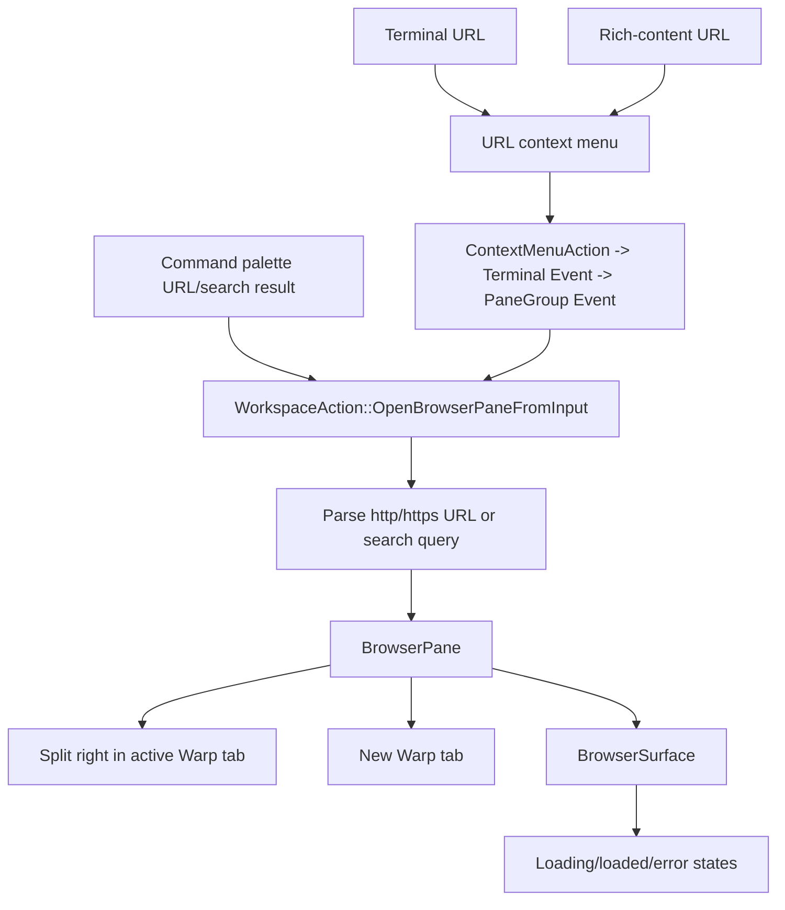

# TECH.md - Browser Pane for local previews and web lookup

Product spec: `specs/GH2164/product.md`
GitHub issue: https://github.com/warpdotdev/warp/issues/2164

## Context

Warp already has the right product surface for this feature: typed panes inside a `PaneGroup`, plus terminal/file context menus and command-palette routes that can open secondary content beside the active terminal.

- `CONTRIBUTING.md` defines spec PRs as `specs/GH<issue-number>/product.md` and `tech.md`, with the tech spec grounded in code and covering context, proposed changes, and validation.
- `WARP.md` requires new product features to be gated by a high-level `FeatureFlag` in `warp_core/src/features.rs`, with UI hidden behind the same flag until launch.
- `app/src/pane_group/pane/mod.rs:1` documents the pane contract: each pane has a `BackingView` for rendering/interactions and a `PaneContent` wrapper for pane-group lifecycle.
- `app/src/pane_group/pane/mod.rs:137` defines `IPaneType`; a Browser Pane needs its own pane type so focus, titles, drag/drop, and snapshot plumbing stay type-safe.
- `app/src/pane_group/pane/file_pane.rs:20` is the closest local example of a pane wrapper around a child view. It wraps `FileNotebookView` in `PaneView`, forwards pane events, snapshots the pane, and delegates focus.
- `app/src/app_state.rs:119` defines `LeafContents`, the pane-content snapshot enum used by app-state persistence. `LeafContents::is_persisted` already allows pane types such as `NetworkLog` and `EnvironmentManagement` to be skipped entirely during save traversal when their state should not be written to SQLite.
- `app/src/persistence/sqlite.rs:994` skips non-persisted leaf contents before inserting `pane_nodes`, avoiding orphan pane rows that would break tab restoration. Browser Pane should use this non-persisted pattern in v1 rather than adding URL persistence.
- `app/src/util/openable_file_type.rs:24` defines `EditorLayout::{SplitPane, NewTab}` and `FileTarget::{MarkdownViewer, CodeEditor, ...}`. Browser Pane should mirror the same split/new-tab concept without overloading file-target semantics.
- `app/src/workspace/view.rs:5893` routes `FileTarget::MarkdownViewer(layout)` to `open_file_notebook`.
- `app/src/workspace/view.rs:7375` implements `open_file_notebook`: `EditorLayout::NewTab` calls `add_tab_from_existing_pane`, while `EditorLayout::SplitPane` calls `pane_group.add_pane_with_direction(Direction::Right, ..., focus_new_pane = true)`.
- `app/src/code/file_tree/view.rs:2324` exposes the user-facing "Open in new pane" and "Open in new tab" labels for existing viewer-like content.
- `app/src/terminal/view/link_detection.rs:391` keeps primary-click URL handling external by calling `ctx.open_url(...)` for terminal URLs.
- `app/src/terminal/view/link_detection.rs:425` does the same for rich-content URLs.
- `app/src/terminal/view.rs:15918` builds terminal block context menus. URL context menus currently only expose "Copy URL".
- `app/src/terminal/view/context_menu.rs:42` builds AI rich-content link context menus. URL context menus currently only expose "Copy URL".
- `app/src/terminal/view.rs:1374` defines `ContextMenuAction`, `app/src/terminal/view.rs:1676` defines terminal view events, `app/src/pane_group/mod.rs:496` defines pane-group events, and `app/src/workspace/view.rs:14144` handles pane-group events at the workspace layer. Terminal URL menu actions should flow through this existing event bridge rather than dispatching workspace actions directly from terminal views.
- `app/src/search/command_palette/mixer.rs:18` defines `CommandPaletteItemAction`; URL/search opening from command palette needs either a new action variant or a binding that launches a URL/search prompt.
- `app/src/search/command_palette/mixer.rs:86` maps `CommandPaletteItemAction` values to `ItemSummary`; browser URL/search actions should map to `ItemSummary::NoOp`.
- `app/src/search/command_palette/view.rs:722` dispatches command-palette actions and is the place to route a command-palette browser result into workspace/browser-pane opening.
- Existing web search controls are scoped to Agent Mode execution profiles, not browser URL/search navigation. `app/src/ai/execution_profiles/editor/ui_helpers.rs:958` renders the Agent web search toggle and `app/src/ai/blocklist/permissions.rs:562` reads per-profile web-search permission; neither provides a browser/search-engine preference for Browser Pane.
- cmux is a useful local-dev-browser precedent for live in-app preview ergonomics, but Warp v1 intentionally does not adopt cmux-style browser URL session snapshots. Browser Pane keeps URL state while the pane is alive and omits Browser Pane URLs from durable Warp app/session restore state.

There is no general-purpose Browser Pane in the app today. The implementation should add one as a new pane type instead of trying to route web URLs through the Markdown/file viewer. Markdown viewing remains native rich-text/file viewing; Browser Pane handles `http` and `https` content plus plain search queries that are converted into search-result URLs.

## Proposed changes

### Implementation sequence

The implementation should land in small reviewable slices behind `FeatureFlag::BrowserPane`:

1. Add browser input/layout parsing types, loopback classification, URL/search conversion, and telemetry redaction helpers with unit tests.
2. Add the Browser Pane shell, pane type, non-persisted pane snapshot marker, and a test/dummy `BrowserSurface` so pane creation, split/new-tab layout, focus, and title plumbing can be reviewed without platform webview complexity.
3. Spike the native desktop webview path on macOS first because WKWebView is the most constrained system-webview baseline for Warp's current desktop app model. The spike should prove child-view embedding, URL navigation, back/forward/reload, load-state callbacks, focus handoff, nonpersistent storage, and download blocking. If the spike cannot satisfy a required v1 behavior, update this spec before widening implementation.
4. Add the terminal and rich-content URL context-menu routes through the existing terminal event -> pane-group event -> workspace bridge, keeping primary-click URL behavior unchanged.
5. Add the command-palette route, preferring an explicit URL/search prompt if inline query-dependent results would appear for ordinary command searches or pollute palette ranking.
6. Add app-state non-persistence handling so Browser Pane leaves are skipped during SQLite save/restore without dropping the surrounding tab.
7. Add Windows and Linux `BrowserSurface` implementations or hide Browser Pane on unsupported targets with a documented unavailable state and follow-up.
8. Complete accessibility, keyboard, telemetry, privacy, and manual validation before the feature is promoted beyond the initial flag.

### 1. Add a feature flag

Add `FeatureFlag::BrowserPane` in `warp_core/src/features.rs`.

All new user-visible routes should check the same flag:

- URL context-menu items.
- Command-palette result or URL/search prompt entrypoint.
- Browser Pane app-state non-persistence handling.
- Any toolbar controls specific to Browser Pane.

When the flag is disabled, primary-click URL behavior and existing context menus remain unchanged.

### 2. Add browser input and layout types

Add a small browser-pane module, for example `app/src/browser_pane/`, with shared types:

- `BrowserPaneLayout`
  - `SplitPane`
  - `NewTab`
- `BrowserPaneUrl`
  - Stores a parsed `url::Url`.
  - Accepts only `http` and `https`.
  - Normalizes display without dropping the user's entered URL.
  - Preserves path, query string, and fragment only for live navigation, display, copy URL, and reload while the pane exists. V1 does not write Browser Pane URLs into app/session restore state.
- `BrowserPaneInput`
  - Represents either a direct URL or a plain search query.
  - Converts search queries to `https://www.google.com/search?q={query}` in v1.
  - Does not add a new browser search-engine preference in v1; configurable search providers remain a follow-up.
  - Requires the user-facing search surface to disclose that search query text is sent to Google before submission.
  - Rejects or externally routes unsupported non-`http`/`https` schemes instead of loading them in Browser Pane.
- `BrowserPaneUrlKind`
  - `LoopbackPreview`
  - `Web`

`BrowserPaneUrlKind::LoopbackPreview` should be syntactic only. It returns true for:

- `localhost`
- `127.0.0.1`
- `[::1]`
- other loopback IP literals parsed by `std::net::IpAddr::is_loopback`

It should not perform DNS or network lookups.

Do not reuse `EditorLayout` or `FileTarget` for browser URLs. Those names are file-oriented and already map to Markdown/code/editor behavior. Browser Pane can still intentionally mirror their split/new-tab variants.

### 3. Add the pane and backing view

Add a new pane pair following the existing pane contract:

- `app/src/pane_group/pane/browser_pane.rs`
- `app/src/browser_pane/view.rs`
- `app/src/browser_pane/model.rs`

The wrapper should be structurally similar to `FilePane`:

- `BrowserPane::new(input, ctx)` creates `BrowserPaneView`.
- `BrowserPane::from_view(view, ctx)` wraps it in `PaneView<BrowserPaneView>`.
- `PaneId::from_browser_pane_ctx` and `PaneId::from_browser_pane_view` create typed pane IDs.
- `IPaneType::Browser` renders as "Browser".
- `PaneContent::snapshot` returns a non-persisted Browser Pane marker without URL, query, fragment, title, page content, or browser history. `LeafContents::is_persisted` must return `false` for Browser Pane in v1 so `save_app_state` skips it entirely.
- `PaneContent::focus` focuses the browser toolbar or web content according to current browser focus state.
- `PaneContent::attach` subscribes to `BrowserPaneViewEvent::Pane` and title/load-state events, then forwards `PaneEvent` and `PaneTitleUpdated` to the pane group.

`BrowserPaneView` should implement `BackingView` and expose:

- A title derived from page title when available, otherwise URL host/path.
- A minimal toolbar: address/search field, back, forward, reload/stop, copy URL, open externally.
- Loading, loaded, connection-refused, unsupported-scheme, certificate/security-warning, embedded-browsing-blocked, and generic load-failed states.
- Accessible labels for toolbar controls.
- Clear focus behavior when moving between terminal input, address/search field, browser content, and pane chrome.
- Keyboard actions or bindings for opening Browser Pane, focusing the address/search field, back, forward, reload, and returning focus to the terminal pane.

### 4. Use system webviews behind a narrow abstraction

V1 should use platform system webviews behind a narrow `BrowserSurface` abstraction rather than shipping Chromium or adopting Tauri/Electron as an app framework.

Reference points:

- Tauri's webview matrix is the model for platform choice, not a framework dependency: WebView2 on Windows, WKWebView/WebKit on macOS, and WebKitGTK on Linux. See `https://v2.tauri.app/reference/webview-versions/`.
- Wry is the closest Rust reference for mechanics: a webview attached to an existing window/event loop, child webviews where supported, and GTK container/event-loop integration for Linux X11/Wayland. See `https://docs.rs/wry/latest/wry/`.
- Electron is intentionally out of scope because it brings a Chromium/Node app process model rather than a pane-level native-webview primitive. See `https://www.electronjs.org/docs/latest/tutorial/process-model`.
- CEF/bundled Chromium is intentionally out of v1 because it brings Chromium framework binaries, helper processes, threading/message-passing complexity, packaging work, and app-owned security updates. See `https://chromiumembedded.github.io/cef/general_usage.html`.

Runtime/version policy:

- macOS: use WKWebView. Its WebKit version is supplied by macOS and updated through OS updates; Warp cannot pin a separate WKWebView engine version without abandoning the system-webview approach.
- Windows: use WebView2 Evergreen by default. Microsoft documents Fixed Version WebView2 as the pinning option, but it requires shipping a specific runtime with the app, disables automatic runtime updates for that packaged runtime, and adds more than 250 MB to the app package. Fixed Version is effectively bundling the Windows webview engine/runtime for Warp's use, even though it is not the same as adopting Electron or CEF as the app framework. V1 should not use Fixed Version unless a compatibility blocker is proven.
- Linux: use WebKitGTK only if it integrates cleanly with Warp's windowing stack. Its version comes from the target system/package set unless Warp chooses to bundle more of the GTK/WebKit stack, which is out of v1.

Decision matrix:

| Option | What Warp buys | What Warp pays | V1 decision |
| --- | --- | --- | --- |
| System webviews: WKWebView, WebView2 Evergreen, WebKitGTK | Smallest package, OS/runtime security updates, native integration, no app-owned browser-engine release train | Runtime differences across OSes, less deterministic rendering, feature detection needed for newer APIs | Default |
| WebView2 Fixed Version on Windows | Pinned Windows runtime, controlled rollout timing, reproducible Windows webview bugs, offline/locked-down install support | More than 250 MB package increase, Warp-owned runtime update cadence, Windows-only consistency, still leaves macOS/Linux unpinned | Escalation only |
| CEF/bundled Chromium | Cross-platform Chromium consistency, stronger control over engine version, better future fit for devtools/automation | Large binary/runtime footprint, helper processes, Chromium patch/update burden, packaging/signing complexity, larger security surface | Out of v1 |
| Electron | Full Chromium app platform with mature browser primitives | Replaces Warp's native Rust/custom UI model with a Chromium/Node process model | Not applicable |

Adoption criteria:

- Use system webviews for v1 if they support URL/search navigation, local HTTP previews, basic navigation controls, load/error states, focus, and bounded storage.
- Escalate to a CEF/bundled-Chromium design only if a concrete implementation spike shows a required v1 behavior cannot be met on a supported platform. Examples: no workable child-webview integration in Warp's windowing stack, no viable private/ephemeral storage mode, or a core local-preview API missing from the platform webview.
- Do not cite hypothetical future automation/devtools needs as a reason to ship Chromium in v1; those are follow-ups by product scope.

Add `BrowserSurface` rather than leaking webview-engine APIs through the pane:

- `BrowserSurface`
  - `load_url(url: &Url)`
  - `reload()`
  - `stop_loading()`
  - `go_back()`
  - `go_forward()`
  - `can_go_back()`
  - `can_go_forward()`
  - `current_url()`
  - `title()`
  - load-state callbacks
  - policy callback for external navigation or blocked embedding
  - policy callback for permission prompts and privileged web APIs

The implementation can use direct platform bindings or a small Rust webview wrapper, but that choice should stay behind `BrowserSurface`. Start with a macOS WKWebView spike because it is the clearest system-webview baseline for Warp's current native desktop app model. Before widening to Windows or Linux, the spike should prove child-view embedding, URL/search navigation, local HTTP preview loading, basic navigation controls, load/error callbacks, focus handoff, nonpersistent storage, and download blocking. If one target cannot support embedded browsing in the first pass, hide Browser Pane on that target behind the feature flag, show the unavailable state from the product spec, and document the platform gap in the PR.

Do not build developer tools, request interception, console log streaming, agent-readable screenshots, agent-controllable actions, browser recording, Playwright-compatible automation, cloud/headless browser execution, scheduled browser jobs, multi-page research canvases, or AI synthesis surfaces into this abstraction for v1.

Web content isolation is a hard v1 boundary. Browser Pane must treat page content as untrusted and must not expose page-to-Warp native bridges, JavaScript bridges, native message handlers, injected objects, custom URL scheme callbacks, IPC routes, terminal or AI context, filesystem access, credential access, or privileged Warp app actions to page content. The toolbar and pane model may consume engine-reported state such as current URL, title, load state, and navigation availability through `BrowserSurface`, but page JavaScript cannot call Warp-owned APIs. Any future page-to-Warp bridge requires a separate follow-up spec with origin scoping, explicit user gating where appropriate, security review, and tests.

Privileged browser capability policy:

| Capability | V1 policy |
| --- | --- |
| Camera | Deny inside Browser Pane and offer `Open externally` when the page needs it. |
| Microphone | Deny inside Browser Pane and offer `Open externally` when the page needs it. |
| Geolocation | Deny inside Browser Pane and offer `Open externally` when the page needs it. |
| Notifications | Deny inside Browser Pane. Browser Pane does not create Warp notifications for page notification requests in v1. |
| Clipboard API | Deny script-initiated privileged clipboard reads and writes from page content. The toolbar `Copy URL` action is Warp-owned and remains allowed. Normal text editing shortcuts in focused browser text fields may use the platform text-input path, but must not grant broad page clipboard API access. |
| File picker / file upload | Deny inside Browser Pane and offer `Open externally` when the page needs local file access. |
| Popups / new windows | Block in-pane popup creation and route the target URL to `Open externally` when the target is available. |
| Downloads | Block or route externally rather than silently writing files. |

The implementation must intercept or configure each platform webview so Browser Pane does not inherit permissive platform defaults for these prompts and APIs. If a platform cannot enforce the v1 policy for a capability, Browser Pane should hide that platform path or route the affected navigation externally until enforcement is available.

### 5. Add workspace opening APIs

Add a workspace-level entrypoint:

- `WorkspaceAction::OpenBrowserPaneFromInput { input: String, layout: BrowserPaneLayout }`
- `Workspace::open_browser_pane_from_input(input, layout, ctx) -> Result<(), BrowserPaneOpenError>`

`open_browser_pane_from_input` should:

1. Parse the input as either a supported `http`/`https` URL or a plain search query.
2. Construct `BrowserPane`.
3. Match the existing viewer layout behavior:
   - `BrowserPaneLayout::SplitPane`: add a right split to the active tab with `focus_new_pane = true`.
   - `BrowserPaneLayout::NewTab`: add a Warp tab containing the Browser Pane, using the same new-tab placement setting used by `open_file_notebook`.
4. Emit a toast or in-pane error for invalid/unsupported URL schemes.
5. Send only coarse telemetry without full URL/query/page data.

The new-tab route creates a Warp tab. It does not create an internal browser tab strip.

### 6. Extend terminal URL context menus

Keep the primary-click path unchanged in `app/src/terminal/view/link_detection.rs`: `ctx.open_url(...)` remains the default click behavior.

When `FeatureFlag::BrowserPane` is enabled, add URL context-menu items in both terminal URL surfaces:

- `app/src/terminal/view.rs:15937` for grid-highlighted terminal URLs.
- `app/src/terminal/view/context_menu.rs:42` for rich-content URLs.

The menu order should be:

1. `Open in new pane`
2. `Open in new tab`
3. `Copy URL`
4. `Open externally`

Add terminal/context-menu actions and events using the existing bridge:

1. Add context-menu action variants for opening the URL in Browser Pane split/new-tab and for opening externally.
2. Handle those `ContextMenuAction` variants in `TerminalView::context_menu_action`.
3. Emit terminal events that carry the URL string and desired `BrowserPaneLayout`.
4. Forward those terminal events from `terminal_pane.rs` into new `pane_group::Event` variants.
5. Handle those pane-group events in `Workspace` by calling `open_browser_pane_from_input`.

`Open externally` should keep using `ctx.open_url`.

Use `RespectObfuscatedSecrets::Yes` when deriving the menu URL string from terminal output, matching the current context-menu copy behavior. Do not log or send the full URL as telemetry.

### 7. Add command-palette URL/search opening

Add a command-palette route for users who want to paste/type a URL or search query even when it did not appear in terminal output.

Preferred implementation:

- Add a command-palette action titled `Open URL or Search in Browser Pane`.
- Accepting that action opens a small URL/search prompt, or an equivalent focused input, with split-pane layout as the default.
- Submitting the prompt dispatches `WorkspaceAction::OpenBrowserPaneFromInput { layout: SplitPane }`.
- Add `CommandPaletteItemAction::OpenBrowserPaneFromInput { input: String }` only if the implementation can create query-dependent results without showing the Browser Pane result for ordinary command searches.
- Map this action to `ItemSummary::NoOp` so arbitrary URLs and search queries do not pollute command-palette recents.

The command palette should not show a Browser Pane search result for every generic command query. If inline query-dependent results are used, gate them to explicit URL-looking inputs, explicit search prefixes, or another ranking rule that avoids competing with normal command results. The product invariant is the same: a user can paste/type an `http` or `https` URL or search query and open it in Browser Pane.

### 8. Do not persist pane restore state

Browser Pane is live-session only in v1. Do not add durable Browser Pane URL persistence:

- Do not add `BrowserPaneSnapshot { url }`.
- Do not add a Browser Pane SQLite table, migration, or persisted URL field.
- Do not write Browser Pane full URLs, query strings, fragments, raw search queries, page titles, page content, screenshots, scroll position, cookies, credentials, request bodies, form values, browser history stack, automation state, or per-page storage into app/session restore state.
- Do not restore Browser Pane after restart, update, crash recovery, or app/session restore.

Implementation should follow the existing non-persisted pane pattern:

1. Add a Browser Pane `LeafContents` marker only if needed by the pane snapshot contract, but keep it free of URL/title/content payloads.
2. Make `LeafContents::is_persisted` return `false` for Browser Pane in v1.
3. Rely on the existing `save_app_state` traversal skip for non-persisted leaf contents so no `pane_nodes` or `pane_leaves` rows are inserted for Browser Panes.
4. Verify restoring a tab that previously contained a Browser Pane omits that Browser Pane without dropping the surrounding tab or adjacent persisted panes.
5. If the feature flag is disabled, Browser Pane entrypoints remain hidden and no app-state restore path attempts to recreate Browser Pane.

Browser-engine storage must be bounded:

- Browser-engine storage is separate from Warp app-state restore. Prefer private/ephemeral browser-engine storage and do not use the user's default external-browser profile.
- macOS should configure WKWebView with a nonpersistent `WKWebsiteDataStore`, which Apple documents as in-memory website data that is not written to disk.
- Windows should create Browser Pane webviews with a dedicated WebView2 profile/user-data scope and private mode when available; WebView2 exposes profile metadata including `IsInPrivateModeEnabled`, profile path, and browsing-data clearing APIs.
- Linux should use an ephemeral WebKitGTK context or website data manager when available; WebKitGTK documents ephemeral contexts/managers whose webviews do not store website data in client storage.
- If any supported platform cannot provide a private/ephemeral mode, the implementation must isolate Browser Pane data in a Browser Pane-specific user-data directory under Warp app data and clear cookies/cache/storage on pane close, app shutdown, and the next Warp startup before any Browser Pane navigation. Startup cleanup is required so cookies/cache/storage do not persist after crashes, forced quits, or unclean shutdowns. The fallback should also use an explicit short TTL for Browser Pane-specific storage as a defense in depth. It must not use the user's default external-browser profile.
- Downloads are out of v1. If the engine tries to start a download, Browser Pane should block it or route externally rather than silently writing files.

### 9. Telemetry and privacy

Add coarse telemetry events only:

- Browser Pane opened.
- Browser Pane opened externally.
- Browser Pane reload clicked.
- Browser Pane search submitted.
- Browser Pane load failed.

Allowed metadata:

- Open source: terminal context menu, rich-content context menu, command palette.
- Layout: split pane or new Warp tab.
- URL kind: loopback preview or web.
- Input kind: direct URL or search query.
- Failure kind: connection refused, unsupported scheme, certificate/security warning, blocked embedding, generic failure.

Forbidden metadata:

- Full URL.
- Query string.
- Fragment.
- Raw search query.
- Page title.
- Page text.
- Screenshot.
- Cookies or credentials.
- Request or response body.

### 10. Error and external-open behavior

Browser Pane should handle these cases in-pane:

- Invalid URL typed into toolbar or command palette.
- Unsupported scheme.
- Plain search query typed into toolbar or command palette.
- Local dev server not running or connection refused.
- TLS/certificate/security warning.
- Page blocks embedded browsing or requires an external auth/permission flow.

Every failure state keeps the URL visible and offers:

- Retry, when retry makes sense.
- Open externally.
- Copy URL.

Non-`http`/`https` links clicked inside page content should not load directly in Browser Pane in v1. Page-controlled custom protocol attempts should be blocked by default and shown as unsupported with an explicit `Open externally` affordance. Browser Pane must not automatically dispatch `file:`, app-private schemes, shell-like schemes, or unknown custom protocols to the system/default handler.

Private-network policy:

- User-entered or explicitly opened loopback preview URLs remain allowed.
- A non-local page attempting to navigate to loopback, localhost, RFC1918/private IPv4 ranges, IPv6 local/private ranges, or other private-network targets must be blocked, user-gated, or opened externally.
- The platform spike must validate whether the chosen webview enforces private-network protections for page-initiated navigation and subresource requests. If a platform cannot enforce the v1 policy, the implementation must hide arbitrary remote browsing on that platform, route affected transitions externally, or update the spec before widening support.

Plain search query input should navigate to the v1 search URL rather than producing an invalid URL error.

## End-to-end flow

## Testing and validation

### Unit tests

Add focused unit tests for:

- `BrowserPaneUrl` accepts only `http` and `https`.
- `BrowserPaneInput` converts plain search text into the v1 Google Search URL.
- `BrowserPaneInput` rejects or externally routes unsupported schemes.
- Loopback classification returns true for `localhost`, `127.0.0.1`, `[::1]`, and loopback IP literals.
- Loopback classification returns false for non-loopback hosts and does not perform DNS.
- URL telemetry redaction strips query, fragment, raw search query, page title, and full URL.
- Browser Pane app-state snapshots, if a marker is needed by the pane contract, contain no URL, query, fragment, raw search query, page title, content, or browser history payload.
- `LeafContents::is_persisted` returns `false` for Browser Pane in v1, and save traversal skips Browser Pane leaves without creating orphan pane rows.
- Browser Pane storage cleanup removes Browser Pane-specific fallback storage on startup before navigation when an ephemeral/private engine mode is unavailable.
- Browser Pane webview setup does not register JavaScript bridges, native message handlers, injected objects, custom URL scheme callbacks, or other page-callable Warp APIs.
- External protocol policy blocks page-controlled `file:`, app-private, shell-like, and unknown custom schemes unless the user explicitly chooses an external route.
- Private-network policy blocks, user-gates, or externally routes non-local page transitions to loopback, localhost, RFC1918/private IPv4 ranges, IPv6 local/private ranges, and other private-network targets.
- Command-palette URL/search route opens the URL/search prompt, or creates a narrowly gated inline result only for explicit URL/search inputs.

### Pane and workspace tests

Add the smallest available pane/workspace tests covering:

- `WorkspaceAction::OpenBrowserPaneFromInput` with `SplitPane` adds a right split to the active tab and focuses it.
- `WorkspaceAction::OpenBrowserPaneFromInput` with `NewTab` creates a new Warp tab, respecting the existing new-tab placement setting.
- Saving app state skips Browser Pane leaves entirely and does not write Browser Pane `pane_nodes`, `pane_leaves`, URLs, or titles to SQLite.
- Restoring a tab that previously contained Browser Pane omits the Browser Pane without dropping the surrounding tab or adjacent persisted panes.
- Feature-flag-disabled restore paths do not attempt to recreate Browser Pane.
- Closing a Browser Pane does not affect terminal sessions or terminal processes.

### Terminal and command-palette tests

Add UI/action tests where existing harnesses make them cheap:

- Primary-click terminal URL still calls the external URL path.
- URL context menu contains `Open in new pane`, `Open in new tab`, `Copy URL`, and `Open externally` when the flag is enabled.
- URL context menu remains unchanged when the flag is disabled.
- Rich-content URL context menu gets the same Browser Pane actions.
- Submitting the command-palette URL/search route dispatches `OpenBrowserPaneFromInput` with split-pane layout.
- Browser keyboard actions focus the address/search field, navigate back/forward, reload, and return focus to the terminal.
- Browser capability policy tests or platform spike validation confirm camera, microphone, geolocation, notifications, privileged clipboard APIs, file picker/upload, popups/new windows, and downloads follow the v1 deny, block, or external-route policy.
- Browser content isolation tests or platform spike validation confirm page JavaScript cannot invoke Warp-native APIs, read terminal or AI context, access credentials or filesystem data, or trigger privileged Warp actions.

### Manual validation

Run Warp locally with `FeatureFlag::BrowserPane` enabled and validate:

1. Start a local server from Warp, for example a docs site, web app dev server, or `python3 -m http.server`.
2. Right-click the printed `localhost` URL and choose `Open in new pane`.
3. Confirm the Browser Pane opens to the right of the terminal, the terminal stays usable, and reload works.
4. Stop the server and reload the pane. Confirm the in-pane connection-failed state keeps the URL visible and offers retry/open externally.
5. Start the server again and retry. Confirm the page loads.
6. Right-click the same URL and choose `Open in new tab`. Confirm Warp creates a new Warp tab without an internal browser tab strip.
7. Primary-click the URL. Confirm it still opens externally as it does today.
8. Paste an `https` URL into the command palette route. Confirm it opens a Browser Pane.
9. Type a docs/search query into the command palette route or Browser Pane address/search field. Confirm the surface discloses that the query is sent to Google before submission, then opens a Google Search results page.
10. Use keyboard routes to focus the address/search field, navigate back/forward, reload, and return focus to the terminal.
11. Try a non-`http` URL. Confirm it does not load directly in Browser Pane.
12. Try page-controlled `file:`, custom protocol, and popup/new-window URLs. Confirm Browser Pane blocks automatic dispatch and only offers an explicit external route where appropriate.
13. From a non-local page, try navigating to `localhost`, `127.0.0.1`, `[::1]`, RFC1918/private IPv4, and IPv6 local/private targets. Confirm the transition is blocked, user-gated, or opened externally according to the platform policy.
14. Quit and restore Warp. Confirm Browser Panes are not restored, no Browser Pane URL or title is written to app/session restore state, and adjacent persisted panes/tabs restore without being dropped.

### Behavior-to-verification mapping

| Product behavior | Verification |
| --- | --- |
| #1 | Unit-test `BrowserPaneUrl`/`BrowserPaneInput` for supported `http`/`https` URLs and search queries; manually open both URL and search-query inputs. |
| #2, #3, #4, #12, #13 | Workspace tests cover `SplitPane` and `NewTab`; manual validation confirms split-right local preview, new Warp tab, and no internal browser tab strip. |
| #5 | Pane/workspace tests cover focus, resize/close lifecycle through the pane group, live in-process Browser Pane navigation state, and non-persistence across app/session restore. |
| #6 | Command-palette test accepts a typed/pasted URL or search query and dispatches `OpenBrowserPaneFromInput`. |
| #7, #8 | Terminal and rich-content context-menu tests assert `Open in new pane`, `Open in new tab`, `Copy URL`, and `Open externally`, with the split/new-tab actions carrying the expected layout. |
| #9, #11 | Terminal URL primary-click regression test still calls the existing external URL path for normal and loopback-preview URLs. |
| #10 | Unit tests cover syntactic loopback classification for `localhost`, `127.0.0.1`, `[::1]`, other loopback literals, non-loopback hosts, and no DNS lookup. |
| #14, #15, #16, #19 | Browser Pane view tests or visual/manual validation cover pane chrome, toolbar controls, URL visibility on failure, and absence of bookmarks/extensions/downloads/profiles/devtools/automation/tab strip. |
| #17, #18 | Unit tests cover address/search parsing; manual validation confirms direct URL navigation, Google Search disclosure before search submission, and search-result navigation. |
| #20, #21, #22 | Browser surface/load-state and capability-policy tests cover loading, loaded, failed load, connection refused, unsupported scheme, certificate/security warning, blocked embedding, permission/API requests, retry, copy URL, and open externally; manual validation covers stopped local server retry. |
| #23 | UI/action tests and manual keyboard validation cover reload/stop from toolbar and keyboard route. |
| #24, #25 | Pane/workspace tests and manual validation confirm closing Browser Pane or stopping the producing terminal process does not terminate the other surface. |
| #26, #33 | Browser navigation policy tests cover in-pane `http`/`https` link navigation, block-by-default handling for page-controlled non-`http`/`https` protocols, and explicit external-open affordances where allowed. |
| #27 | App-state tests verify Browser Pane leaves are non-persisted, no URL/title/query/fragment snapshot is written to SQLite, and tabs containing Browser Panes restore without dropping adjacent persisted panes; fallback-storage tests verify startup cleanup before navigation when ephemeral/private storage is unavailable. |
| #28, #29 | Telemetry unit/review tests assert coarse events only and reject full URL, query string, fragment, raw search query, page title, page text, screenshots, cookies/credentials, and request/response bodies. |
| #30, #31, #32 | Accessibility and keyboard manual validation cover toolbar accessible names, meaningful pane title, visible focus, browser-content focus boundaries, back/forward/reload shortcuts, address-field focus, and terminal focus return. |
| #34, #35 | Platform/runtime checks verify Browser Pane uses the platform webview runtime, hides or shows an unavailable state when the runtime is missing/blocked/unsupported, and leaves primary-click URL behavior unchanged. |
| #36, #37 | Release/docs review verifies enterprise runtime requirements and pinned-runtime escalation guidance; manual/platform validation confirms pinned-runtime deployments keep the same user-visible Browser Pane behavior. |
| #38 | Browser content isolation tests or platform spike validation confirm Browser Pane does not expose page-callable native bridges, message handlers, custom URL scheme callbacks, IPC routes, terminal or AI context, filesystem access, credential access, or privileged Warp app actions. |
| #39 | Browser navigation and platform-spike validation cover non-local page attempts to reach loopback, localhost, RFC1918/private IPv4 ranges, IPv6 local/private ranges, and other private-network targets. |

### Commands

For the spec-only PR, validate Markdown and repository state:

- `git add specs/GH2164/product.md specs/GH2164/tech.md`
- `git diff --cached -- specs/GH2164/product.md specs/GH2164/tech.md`
- `git -c filter.lfs.process= -c filter.lfs.required=false -c filter.lfs.clean= status --short`

For implementation PRs, run the repo-required checks before review:

- `cargo fmt`
- `cargo clippy`
- Targeted unit or pane tests added for this feature.
- Relevant manual validation from this spec.
- Update `specs/GH2164/product.md` or `specs/GH2164/tech.md` in the same PR if implementation changes user-facing behavior, architecture, module boundaries, or validation strategy.

## Risks and mitigations

### Embedded webview dependency and platform behavior

Risk: Adding a native embedded webview can introduce platform-specific dependencies, packaging constraints, and inconsistent behavior.

Mitigation: Put all engine-specific code behind `BrowserSurface`, gate the feature by `FeatureFlag::BrowserPane`, and hide the feature on unsupported targets until the platform path is reviewed.

### Browser scope creep

Risk: Browser Pane can easily become a general browser, developer-tools replacement, test runner, research canvas, or agent-automation surface.

Mitigation: Keep v1 to local preview and quick lookup ergonomics: pane lifecycle, URL/search navigation, minimal toolbar, load/error states, reload, copy URL, and open externally. Defer responsive presets, console/network summaries, devtools, screenshots, recording, cloud/headless execution, multi-page synthesis, and agent control.

### Sensitive URL or page data leakage

Risk: URLs can contain credentials, tokens, local service paths, query strings, or page content.

Mitigation: Do not persist Browser Pane URLs or titles in Warp app/session restore state in v1. Keep URL state in memory while the pane is alive, prefer ephemeral browser-engine storage, avoid full URL/search telemetry, and never emit page content, screenshots, cookies, credentials, request bodies, raw search queries, query strings, or fragments.

### Focus conflicts with terminal input

Risk: Browser content can capture keyboard shortcuts users expect to apply to terminal panes.

Mitigation: Keep pane-level navigation shortcuts owned by Warp chrome, expose clear focus state, support explicit browser keyboard routes, and apply page-level shortcuts only while browser content is focused.

### Non-persisted restore behavior causing tab loss

Risk: A non-persisted Browser Pane leaf could create orphan app-state rows or otherwise cause the surrounding tab to disappear on restore.

Mitigation: Follow the existing `LeafContents::is_persisted == false` save traversal pattern used by non-restorable panes so Browser Pane leaves are skipped before `pane_nodes` insertion. Add app-state tests that tabs containing Browser Panes restore adjacent persisted panes without trying to recreate Browser Pane.

### Remote page access to local services

Risk: A remote page loaded in Browser Pane could attempt to navigate to or interact with localhost/private-network services available to the user.

Mitigation: Allow explicitly opened loopback previews, but block, user-gate, or externally route non-local page transitions to loopback and private-network targets. Require platform-spike validation of private-network behavior before widening support.

## Follow-ups

- Agent-readable browser state for a visible Browser Pane.
- Agent-controlled browser actions.
- Responsive viewport presets.
- Console error and failed network request summaries.
- User setting for primary-click local-preview URLs to open in Browser Pane.
- Browser search-engine preference and search suggestions.
- Private-network URL classification beyond loopback literals.
- Sanitized, redacted, opt-in, or TTL-limited Browser Pane restore after separate privacy/security review.
- Workspace-level Browser Pane URL memory.
- Full developer tools.
- Browser recording, headless/cloud execution, and Playwright-compatible test generation.
- Spatial/multi-page research workspace and AI synthesis over open pages.
