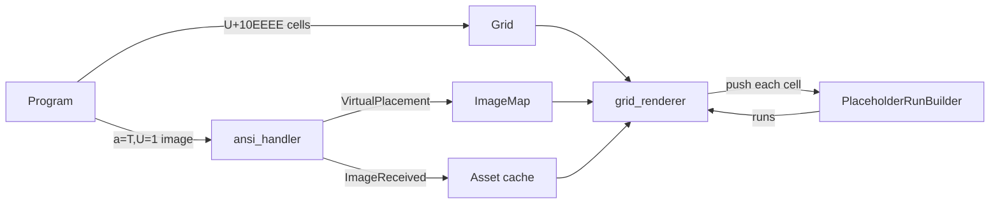

# Tech Spec: Kitty images in Unicode placeholder cells

**Product spec:** [product.md](product.md)
**Implementation:** [warpdotdev/warp#16312](https://github.com/warpdotdev/warp/pull/16312)

## Context

Warp implements the kitty graphics protocol behind the `KittyImages` feature flag ([`app/src/features.rs:129 @ 0e3101e`](https://github.com/warpdotdev/warp/blob/0e3101e1e6dfca292de9356e7b904beb7a2258c0/app/src/features.rs#L129)), which is on except on Windows. Every kitty image today is a direct placement, anchored at the cursor's cell and drawn over the grid.

- [`crates/warp_terminal/src/model/kitty.rs:715 @ 0e3101e`](https://github.com/warpdotdev/warp/blob/0e3101e1e6dfca292de9356e7b904beb7a2258c0/crates/warp_terminal/src/model/kitty.rs#L715) parses `U=1` into `KittyControlData::unicode_placeholder`. [Lines 320-325](https://github.com/warpdotdev/warp/blob/0e3101e1e6dfca292de9356e7b904beb7a2258c0/crates/warp_terminal/src/model/kitty.rs#L320-L325) and [351-356](https://github.com/warpdotdev/warp/blob/0e3101e1e6dfca292de9356e7b904beb7a2258c0/crates/warp_terminal/src/model/kitty.rs#L351-L356) then refuse it for `a=T` and `a=p` with `InvalidControlData::UnicodePlaceholderUnsupported`.
- [`KittyPlacementData` and `get_desired_dimensions` (427-470) @ 0e3101e](https://github.com/warpdotdev/warp/blob/0e3101e1e6dfca292de9356e7b904beb7a2258c0/crates/warp_terminal/src/model/kitty.rs#L427-L470) hold a placement's `c`, `r` and cursor policy, and turn them into a size in pixels.
- [`GridHandler::handle_completed_kitty_action_internal` (1796-2026) @ 0e3101e](https://github.com/warpdotdev/warp/blob/0e3101e1e6dfca292de9356e7b904beb7a2258c0/crates/warp_terminal/src/model/grid/ansi_handler.rs#L1796-L2026) handles `a=T` ([1829](https://github.com/warpdotdev/warp/blob/0e3101e1e6dfca292de9356e7b904beb7a2258c0/crates/warp_terminal/src/model/grid/ansi_handler.rs#L1829)) and `a=p` ([1931](https://github.com/warpdotdev/warp/blob/0e3101e1e6dfca292de9356e7b904beb7a2258c0/crates/warp_terminal/src/model/grid/ansi_handler.rs#L1931)). `a=T` sends the image to the app (`Event::ImageReceived`, which fills the asset cache under the image id); both then record the placement in the grid's `ImageMap` and move the cursor past it.
- [`ImageMap` (18-28) @ 0e3101e](https://github.com/warpdotdev/warp/blob/0e3101e1e6dfca292de9356e7b904beb7a2258c0/crates/warp_terminal/src/model/image_map.rs#L18-L28) stores one grid's placements. [`evict_image` (261)](https://github.com/warpdotdev/warp/blob/0e3101e1e6dfca292de9356e7b904beb7a2258c0/crates/warp_terminal/src/model/image_map.rs#L261) and [`evict_placement` (274)](https://github.com/warpdotdev/warp/blob/0e3101e1e6dfca292de9356e7b904beb7a2258c0/crates/warp_terminal/src/model/image_map.rs#L274) serve `a=d`, dispatched from [`terminal_model.rs:3579 @ 0e3101e`](https://github.com/warpdotdev/warp/blob/0e3101e1e6dfca292de9356e7b904beb7a2258c0/app/src/terminal/model/terminal_model.rs#L3579).
- A cell keeps its combining marks with its character: [`Cell::push_zerowidth` (218)](https://github.com/warpdotdev/warp/blob/0e3101e1e6dfca292de9356e7b904beb7a2258c0/crates/warp_terminal/src/model/grid/cell.rs#L218) appends them and [`Cell::raw_content` (192)](https://github.com/warpdotdev/warp/blob/0e3101e1e6dfca292de9356e7b904beb7a2258c0/crates/warp_terminal/src/model/grid/cell.rs#L192) returns them. A placeholder cell's row and column marks are therefore already in the grid. Its foreground color, which carries the image id, is in `Cell::fg`.
- [`render_grid_without_ligatures` (466)](https://github.com/warpdotdev/warp/blob/0e3101e1e6dfca292de9356e7b904beb7a2258c0/app/src/terminal/grid_renderer.rs#L466) and [`render_grid_with_ligatures` (980)](https://github.com/warpdotdev/warp/blob/0e3101e1e6dfca292de9356e7b904beb7a2258c0/app/src/terminal/grid_renderer.rs#L980) each walk the visible cells once, then draw merged backgrounds. U+10EEEE is a private-use code point that fonts don't cover, so placeholder cells draw as missing-glyph boxes. [`render_image` (1853)](https://github.com/warpdotdev/warp/blob/0e3101e1e6dfca292de9356e7b904beb7a2258c0/app/src/terminal/grid_renderer.rs#L1853) draws direct placements from the asset cache with `CacheOption::BySize`, which resizes the image on the CPU to the size it is drawn at.

## Proposed changes

Placeholder cells stay ordinary grid content. A virtual placement only records the box its cells are counted in, and the renderer decodes the visible cells each frame. No `Cell` layout changes, and scrolling, scrollback, line insertion and clearing (product 16) need no code.

1. **Accept `U=1`** (`kitty.rs`). Remove `UnicodePlaceholderUnsupported` and carry the flag into `KittyPlacementData::unicode_placeholder` for `a=T` and `a=p`.
2. **Record virtual placements** (`image_map.rs`, `grid/image.rs`, `grid/ansi_handler.rs`).
   - New `VirtualPlacement { placement_id, cols, rows }`, kept in `ImageMap::virtual_placements: HashMap<u32, VirtualPlacement>` by image id. Cells can't name a placement, since Warp cells store no underline color, so the newest placement per image wins (product 5). `evict_all_images` drops them all, `evict_image` drops the image's, and `evict_placement` drops it when the placement id matches (product 15).
   - `GridHandler::add_virtual_image_placement` sizes the box with the existing `get_desired_dimensions`, without the cursor-based limits a direct placement has, then rounds up to whole cells (product 3).
   - In both the `a=T` and `a=p` branches, after the image is validated (and, for `a=T`, sent to the app), a `U=1` placement is recorded and the handler returns before anything is placed or the cursor moves (products 1, 2). Errors and the `c=0`/`r=0` early returns stay shared with direct placements (product 4).
3. **Decode placeholder cells** (new `crates/warp_terminal/src/model/kitty_unicode_placeholder.rs`).
   - Kitty's 297 row/column diacritics, sorted by code point and looked up by binary search.
   - `decode(cell, left)` reads the id from the foreground color and up to three marks, and inherits omitted ones from the decoded cell to its left by the protocol's rules (products 6, 7). A cell whose id is 0, or whose foreground is a named color, decodes to nothing (product 11).
   - `PlaceholderRunBuilder` takes the visible cells in row-major order and groups horizontally adjacent cells that show consecutive columns of one image row into `PlaceholderRun`s (screen position, size, image id, first tile). `finish` merges a run with the one below it when that continues its tiles, so an image shown whole is one run. `PlaceholderRunBuilder::new(enabled)` takes the `KittyImages` flag: disabled, it leaves every cell alone (product 19).
   - `push` is `#[inline]` and tests the character before anything else, so a cell that isn't a placeholder costs the renderer's loop one comparison. For a placeholder it returns an empty cell with the original background, which the renderer draws instead, so neither text path draws a glyph or decoration for it (products 11, 12, 13). The path with ligatures lays out each row as one line of text; there a stretch of placeholder cells adds a single space, which keeps the text on either side from joining into a ligature.
4. **Draw the runs** (`app/src/terminal/grid_renderer.rs`). Each renderer creates the builder with `FeatureFlag::KittyImages.is_enabled()`, passes every visible cell through `push`, and calls `render_placeholder_runs` after the merged backgrounds. For each run, it:
   - looks up the virtual placement, and skips the run if there is none or the image isn't loaded (product 11);
   - takes the image from the asset cache at its own size (`CacheOption::Original`);
   - fits it into the box of `cols × rows` cells, keeping its aspect ratio, and centers it (product 8);
   - draws it in a layer clipped to the run's cells (`ClipBounds::BoundedByActiveLayerAnd`), positioned so the run's top left cell shows its own tile (products 8, 9). The cell backgrounds drawn before it show where the image doesn't cover (product 10).

### Tradeoffs

- **GPU scaling instead of `CacheOption::BySize`.** Placeholder images are often animations: the program sends each frame under the same id (product 14), and each frame is a new image to the cache. Resizing on the CPU, as `render_image` does, would resize every frame, and again on every window or font size change (product 17). Drawing at the image's own size lets the GPU scale it.
- **Decoding at render time instead of at write time.** Decoding while parsing output would mean storing a placement per cell and re-decoding on every edit, scroll and reflow. Decoding the visible rows each frame costs one comparison per cell when there are no placeholders, and needs no new state.
- **An empty replacement cell instead of special cases in the glyph code.** One hook per renderer covers both text paths and every decoration; the path with ligatures needs one more line to leave the cells out of its text.

### End-to-end flow

## Testing and validation

Automated, run with `cargo test -p warp_terminal --features local_fs`:

| Product behavior | Test |
|---|---|
| 1, 2 | `blockgrid_tests::test_virtual_kitty_placement_is_recorded_without_placing_or_moving_cursor` (`a=T,U=1`) |
| 3 | `blockgrid_tests::test_virtual_kitty_placement_box_follows_columns_and_rows`: both, either and neither of `c`/`r` |
| 5, 15 | `blockgrid_tests::test_virtual_kitty_placement_of_stored_image_is_deleted_by_its_placement_id` (`a=p,U=1`): the newest placement wins, deleting by placement id; the first test also deletes by image id |
| 6 | `kitty_unicode_placeholder_tests::test_decode_reads_id_and_tile`, `test_diacritics_are_sorted` |
| 7 | `test_decode_infers_omitted_diacritics_from_left_cell`, `test_decode_inherits_id_byte_only_from_the_previous_tile` |
| 8, 9 | `test_run_builder_merges_consecutive_tiles`, `test_run_builder_splits_runs_at_gaps_and_repeated_tiles`, `test_run_builder_merges_rows_that_continue_the_tiles_above` |
| 11 | `test_decode_rejects_cells_without_an_image` |
| 19 | `test_run_builder_ignores_placeholders_when_disabled`; the parser's existing `KittyImages` check drops the commands |

Manual, with `./script/run` on macOS, debug and `--release` builds. A demo script draws every case on one screen, in the screenshot and recording on the implementation PR:

- A 40 × 8 cell image, and some of its cells printed again beside it on the same lines (products 8, 9).
- The same picture sent as base64, a file, a temporary file and shared memory, each shown in placeholder cells.
- A 60 fps animation, a GIF and a video, each re-sent frame by frame under one id (product 14).
- Font ligatures on and off (product 13).
- Claude Code drawing `<Image>`s above its prompt, its real use.
- A benchmark in a release build on a MacBook Air (M4), sampling where the UI thread spends its time. Updating one line of text 60 times a second kept it busy 17–19% of the time: Warp's own cost of repainting. A still 64 × 18 cell image on screen added 3–5 points, and a 320 × 180 or 1280 × 720 image animating at 60 fps added 4–9. Before the changes that merge runs, keep placeholder cells out of the text line and copy received frames less, they added 10 and 13–30. Sent as fast as Warp read them, it took about 12,000 small and 990 large frames a second, the sender's own limit, with its memory flat.

Still to check by hand: scrolling and scrollback, resizing the window and changing the font size (products 16, 17), and placeholder cells in another block (product 18). Products 4, 10, 12, 20 and 21 follow from code shared with direct placements, or from leaving cells unchanged, and have no tests of their own. Linux and Windows are untested.

## Parallelization

Not proposed: the change is small, its parts depend on each other in order (accept `U=1`, record, decode, draw), and it is already implemented.

## Risks and mitigations

- **Render cost with many images.** Every run is one clipped layer and one image draw: one per image shown whole, more for an image shown in pieces. Cells that aren't placeholders cost one comparison.
- **Placeholder cells without an image now draw blank instead of a missing-glyph box** while kitty images are on. That is what the protocol intends, and the box carried no information.
- **One virtual placement per image.** A program that gives one image several virtual placements of different sizes sees all its cells use the newest. That needs underline colors in cells to fix (see Follow-ups).

## Follow-ups

- Placement ids from the underline color, if Warp cells gain one.
- Kitty's animation commands (#13737).
- The selection highlight over images (product 21's open question).
- Images sent as a file or shared memory (`t=f`, `t=t`, `t=s`) are fixed in separate commits of the implementation PR and could move to a PR of their own.
