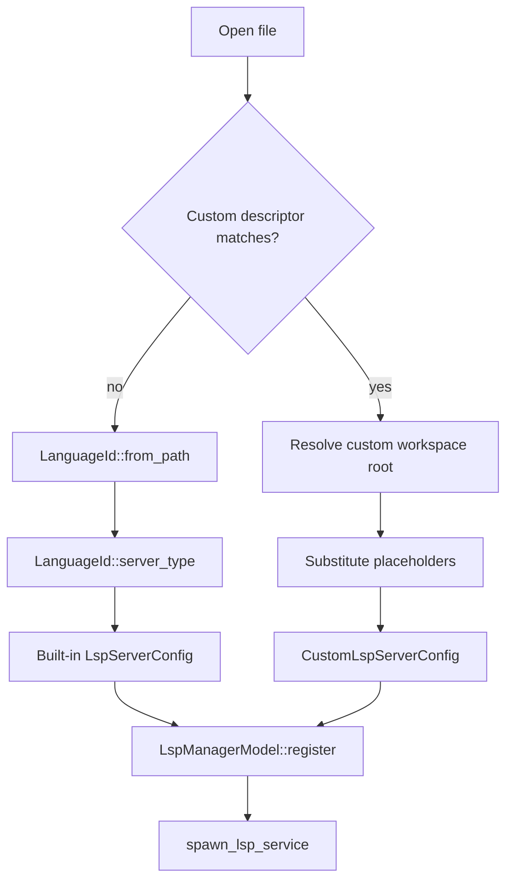

# gh-8803: Technical Spec — User-Configurable Custom Language Servers

> Companion to [product.md](./product.md). Reference the numbered invariants there for user-visible behavior; this doc covers implementation.

## Context

This feature is **purely additive**. The five built-in language servers (rust-analyzer, gopls, pyright, typescript-language-server, clangd) keep working exactly as they do today — same code paths, same persistence, same footer surfaces, same install flow. The new system lives next to the built-in pipeline and runs first when a file is opened. If a custom `[[editor.language_servers]]` entry's `filetypes` matches the file, the custom server handles it. Otherwise the existing built-in dispatch handles it unchanged.

**Design choice.** Built-in and custom runtime tracks are kept fully separate — no shared identity enum across built-in + custom status, separate in-memory caches, separate persistence rows (discriminated by `kind`). This isolation lets the built-in pipeline stay stable across releases while the custom pipeline iterates, and makes it straightforward for a reader to reason about each path independently.

### Current architecture, with line refs

The relevant existing code is left in place by this work. Citations are for grounding, not modification points:

LSP crate (`crates/lsp/`):

- `crates/lsp/src/supported_servers.rs:38-45` — `LSPServerType` enum, the central identity type for the five built-ins. Methods (`binary_name`, `args`, `languages`, `language_name`, `candidate`, `create_command`, `find_installed_binary_config`, `is_working_on_path`) stay as-is.
- `crates/lsp/src/config.rs:24-87` — `LanguageId` enum, `LanguageId::from_path` (extension → `LanguageId`), and `LanguageId::server_type` (1:1 `LanguageId` → `LSPServerType`). Stays as-is and remains the dispatch for built-ins.
- `crates/lsp/src/config.rs:93-214` — `LspServerConfig` carries `LSPServerType`. Stays as-is; the custom-server path gets a parallel config type.
- `crates/lsp/src/manager.rs:30-203` — `LspManagerModel` keys by `PathBuf` workspace root, with `Vec<ModelHandle<LspServerModel>>` per workspace. Today the vec contains only built-ins (keyed within the vec by `LSPServerType`); the change extends this to hold custom-server models too, keyed by descriptor `name`.
- `crates/lsp/src/model.rs:60-99` — `LspState` (`Stopped`/`Starting`/`Available`/`Stopping`/`Failed`). Identity-free, reusable for custom servers.
- `crates/lsp/src/language_server_candidate.rs` — install machinery for built-ins. Stays as-is; v1 does not install custom-server binaries (product.md invariant 26).

Settings + persistence:

- `[[editor.language_servers]]` is stored in the user's existing `settings.toml` — a new top-level array-of-tables in the same file all other Warp user settings live in. No new file or directory. The path is `warp_core::paths::config_local_dir().join("settings.toml")` (`crates/warp_core/src/paths.rs`), which resolves to `~/.warp/settings.toml` on macOS, `$XDG_CONFIG_HOME/dev.warp.Warp/settings.toml` on Linux, and `%LOCALAPPDATA%\dev.warp.Warp\settings.toml` on Windows. Per-workspace `.warp/settings.toml` overrides are out of scope for v1.
- `crates/settings/src/macros.rs:702-790` — the `define_settings_group!` macro hosts every existing settings group (31 invocations across `app/src/settings/`). The macro accepts arbitrary types including `Vec<T>` of complex structs — see `app/src/settings/ai.rs::agent_mode_command_execution_allowlist` which uses `type: Vec<AgentModeCommandExecutionPredicate>`. We use the same macro for our setting; no hand-rolled `SettingSchemaEntry` registration is needed.
- `crates/settings/src/manager.rs:73-95` — `SettingsManager` is the singleton that registers settings and dispatches `SettingsEvent::LocalPreferencesUpdated { storage_key, sync_to_cloud }` on changes. The macro's expansion (in particular `register_settings_events!` at `crates/settings/src/macros.rs:798-806`) emits these events automatically for every macro-registered setting.
- `app/src/settings/mod.rs:69-116` — `SettingsFileError::InvalidSettings(Vec<String>)` carries the **storage keys** (not free-text messages) of settings whose values failed to load. The UI renders one line per key. Per invariant 23, custom-server validation errors flow through this surface as a single bare key — `editor.language_servers` — when any entry is invalid; per-entry detail (which entry index, which field, why) is emitted via `log::warn!` and stays out of the banner. This matches the existing array-setting precedent at `agents.profiles.agent_mode_command_execution_allowlist`.
- `app/src/settings/init.rs:114-150` — settings load + validation entry point. Hot-reload is already wired; saving `settings.toml` re-parses and re-validates without restart.
- **Persistence shape (current).** Per-workspace LSP enablement is stored in the SQLite table `workspace_language_server`. On master the on-disk shape is `(workspace_id, language_server_name: TEXT, enabled: TEXT)`, built from two migrations: `2025-10-31-201353_add_workspace_language_server/` (initial table) and `2025-11-11-230915_change_workspace_language_server_enabled_to_text/` (typing fix). Today only built-in servers populate this table; rows use `language_server_name` set to the serialized `LSPServerType` variant name (`"RustAnalyzer"`, `"GoPls"`, etc.). The `HashMap<LSPServerType, EnablementState>` at `app/src/ai/persisted_workspace.rs:129` is an in-memory cache, not the on-disk shape. **Phase 4 of this work adds an additive `kind` column (migration `2026-05-24-180000_add_kind_to_workspace_language_server/`) to discriminate `'BuiltIn'` from `'Custom'` rows; the full description and rationale live in the Phase 4 persistence section below — implementers should treat that as the proposed change.**

JSON Schema generation:

- `app/src/bin/generate_settings_schema.rs` — build-time binary that walks the `inventory::iter::<SettingSchemaEntry>` registry and emits a single JSON Schema artifact for `settings.toml`. Schemas come from `(entry.schema_fn)(&mut SchemaGenerator)`. Each setting's schema is normally derived via `#[derive(schemars::JsonSchema)]` on the public type. Where a public type has a non-serializable field (e.g. `Regex` in `app/src/settings/privacy.rs:41-50::CustomSecretRegex`), the codebase uses `#[schemars(with = "String")]` to describe the user-typed shape. Custom LSP descriptors follow the same pattern for the private compiled `globset::GlobMatcher` field (use `#[schemars(skip)]`).

Footer:

- `app/src/code/footer.rs:1411-1856` — status rendering, Enable button dispatch, error rendering. Action enum is server-type-agnostic; the surfaces that take `&LSPServerType` for display gain a sibling branch that takes `&LspServerDescriptor` (or a unified key — see Phase 4).

Glob support is already in-tree: `globset = "0.4.18"` is in `crates/lsp/Cargo.toml:23` and used at `crates/lsp/src/service.rs:374-378`. product.md invariant 1 cites the `glob` crate's `Pattern` syntax — that's a strict subset of what `globset` accepts, so we don't add a dependency.

Path utilities live in `crates/warp_util/src/path.rs` (no `~` expansion exists today; we add it). Data/cache dirs come from `crates/warp_core/src/paths.rs:102-160` (`data_dir()`, `cache_dir()`).

### Design decision: parallel tracks, no shared identity enum

Custom servers run on a separate code path from built-ins. The two tracks share the underlying LSP runtime (`LspService`, `ProcessTransport`, `LspState`, diagnostics tracking — all verified identity-free) but diverge at every identity-bearing boundary:

- **Matcher** — checks customs first via `LanguageServersSettings::match_for_path`, falls back to the existing `LanguageId::from_path` → `LSPServerType` dispatch.
- **Status enums** — `LspRepoStatus` (built-in, 6 variants including install state) stays untouched. A new narrow `CustomLspRepoStatus` enum (3 variants: `Ready`, `Enabled`, `Disabled`) covers customs. Install-related variants intentionally don't exist for customs because there is no install flow for them. The footer dispatches "is this slot built-in or custom?" once at render time and enters one of two code paths.
- **Manager registration** — `LspManagerModel.servers: HashMap<PathBuf, Vec<ModelHandle<LspServerModel>>>` already supports multiple servers per workspace. We extend `LspServerModel` to carry either a built-in `LspServerConfig` or a `CustomLspServerConfig`. Internal duplicate-detection keys on a small `ServerKey { BuiltIn(LSPServerType), Custom(String) }` enum scoped to the manager only — not propagated to `LspRepoStatus` or the footer.
- **Persistence** — the SQLite `workspace_language_server` table gets a `kind` column (migration `2026-05-24-180000`) to discriminate `'BuiltIn'` from `'Custom'` rows. Customs are inserted with `kind = 'Custom'` and `language_server_name = descriptor.name`. The reservation of built-in names at validation time means even with the discriminator, customs cannot use the five built-in variant names.
- **Footer** — the existing built-in render path stays untouched. A new branch handles customs, reusing the same UI affordances (status indicator, Enable button, error inline) but driven by the descriptor's `name` instead of an `LSPServerType`.

Everything else (process spawning, JSON-RPC, install flow, file watching, the LSP state machine) stays untouched for built-ins. The cost of the parallel-track design is some duplication in spawn / lifecycle plumbing; the benefit is no risk to in-flight built-in work, minimal persistence change (one additive `kind` column via migration `2026-05-24-180000`), and no rename touching ~24 pattern-match sites for an enum the built-in side doesn't need to know about.

## Proposed changes

### Phase 1 — Foundation (no behavior change yet)

Goal: land data types, parsing, matching, substitution as pure modules with full unit-test coverage. Nothing in the LSP runtime path consumes them yet.

New module `crates/lsp/src/descriptor.rs`:

```rust
pub struct LspServerDescriptor {
    pub name: String,
    pub command: String,
    pub args: Vec<String>,
    pub filetypes: Vec<LspFiletypePattern>,
    pub env: BTreeMap<String, String>,
    pub initialization_options: Option<serde_json::Value>,
}

pub struct LspFiletypePattern {
    pub pattern: String,                  // raw user-typed pattern (e.g. "*.rb")
    pub language_id: Option<String>,
    matcher: globset::GlobMatcher,        // private; compile-once, dispatched via is_match()
}
```

Sibling modules:

- `crates/lsp/src/descriptor/parse.rs` — serde-driven TOML parsing. Accepts the `[[editor.language_servers]]` array. Each `filetypes` entry is an inline table `{ pattern, language_id }` (bare-string form is not accepted; see invariant 1). Classification between `Glob` and `LiteralBasename` is by metacharacter presence (`*`, `?`, `[`). **Unknown-field logging (invariant 24):** before `serde_json::from_value::<RawDescriptor>(...)`, the parser walks the entry's top-level keys and emits one `log::warn!` per ignored key — formatted as `"editor.language_servers entry '<name>': unknown field '<key>' ignored"` — for any key not in the known set `{name, command, args, filetypes, env, initialization_options}`. The known-field list is single-sourced from the field names of `RawDescriptor` (extracted at compile time via a small declarative macro or a unit test that asserts the constant set against `RawDescriptor`'s reflection) so adding a recognized field automatically extends the allowlist. Serde's default behavior is to silently drop unknown fields; the explicit walk is what makes invariant 24's "logged with a warning" promise real — `deny_unknown_fields` is intentionally NOT used because invariant 24 commits to keeping unknown fields forward-compatible.
- `crates/lsp/src/descriptor/matcher.rs` — `pub fn match_descriptor<'a>(descriptors: &'a [LspServerDescriptor], file_path: &Path) -> Option<LspMatchedDescriptor<'a>>`. Returns the first-in-source-order match per invariant 4. Computes the LSP `languageId` per invariant 1: explicit `language_id` wins, else lowercase extension, else literal basename.
- `crates/lsp/src/descriptor/placeholder.rs` — substitution engine for invariants 5, 6:
  - `pub fn expand(input: &str, ctx: &LspPlaceholderContext) -> String`
  - `LspPlaceholderContext` holds `workspace_root: &Path`, `workspace_slug: &str`, `cache_dir: &Path`, plus a logger handle for "unknown placeholder" warnings.
  - Delegates to the in-tree `crates/handlebars` engine — the same one tab configs and MCP rendering use — for `{{name}}` substitution. We use `handlebars::get_arguments` to discover referenced names, build a `HashMap<String, String>` populated with the resolved values for known names (and env vars discovered via the `env_` prefix), and call `handlebars::render_template`. Unknown names are absent from the map; the engine leaves them in place, matching product.md invariant 6.
  - The Handlebars parser only allows alphanumeric / `-` / `_` in argument names. Env-var lookups therefore use the `env_` prefix instead of a colon: `{{env_HOME}}`. The descriptor module strips the prefix and looks up the env var. Names with whitespace inside the braces are invalid per the engine; the spec adopts that constraint.
  - `~` / `~/` at position 0 expand to `home_dir()` via `warp_util::path::expand_home_prefix`. Embedded `~` is untouched.
  - `pub fn expand_json(input: &serde_json::Value, ctx: &LspPlaceholderContext) -> serde_json::Value` walks `initialization_options` and calls `expand` on string leaves only.
  - **Redaction at log boundaries (invariant 32).** `crates/lsp` cannot directly depend on `app/src/settings/privacy.rs::CustomSecretRegex` — `app/` is downstream of `lsp/` in the workspace dependency graph. So the redactor is **injected from app at the LSP boundary** rather than imported. Concretely: `crates/lsp` defines a trait `pub trait LogRedactor: Send + Sync { fn redact_for_log<'a>(&self, value: &'a str) -> Cow<'a, str>; }`, and `LspPlaceholderContext` (or equivalent app-boundary type — confirm during Phase 4 implementation) carries an `Arc<dyn LogRedactor>` populated at construction by `app/`'s wiring, where `CustomSecretRegex` lives. Callers in `crates/lsp/src/manager.rs` and `crates/lsp/src/service.rs` call the trait method before reaching `log::info!` / `log::warn!` / `log::error!`. What goes where (per invariant 32): ✅ logged verbatim, no redaction needed — descriptor `name`, `env` *keys*, `workspace_slug` (a SHA-256-derived hex string); ✅ logged verbatim but PII-bearing — resolved `workspace_root` and per-server `cache_dir` absolute paths (these can contain usernames or repo names but are not secret-redaction targets, matching how built-in LSP spawn already logs paths today); ⚠️ must pass through the injected redactor — substituted `args` strings and `env` *values*; ❌ never log verbatim — substituted `initialization_options` JSON (recursively redacting nested fields is too easy to get wrong; emit only a structural summary like `"initialization_options: 4 keys"` or run the serialized form through the redactor). Verification during Phase 4: (1) the injection point exists or is added at the natural boundary, (2) `CustomSecretRegex` is a log-time filter and not a UI-display-only filter.
- `crates/lsp/src/descriptor/validate.rs` — runs after parse and produces `Vec<LspDescriptorError>`. Per invariant 23, **any** validation failure rejects the entire `editor.language_servers` setting (all-or-nothing); `SettingsFileError::InvalidSettings` receives a single bare `editor.language_servers` entry (see the bullet on `app/src/settings/mod.rs:69-116` above), and per-entry detail (which entry index, which field, why it failed) is emitted via `log::warn!` so users can find the offending entry without that detail surfacing in the banner. Validates the `name` character set and length per invariant 1 (1–64 chars from `[A-Za-z0-9._-]`, not `.`/`..`, no leading `.` or `-`). Name **uniqueness and reserved-name checks are case-insensitive** (ASCII fold), and the reserved list covers **both** the serialized `LSPServerType` variant names (`RustAnalyzer`, `GoPls`, `Pyright`, `TypeScriptLanguageServer`, `Clangd`) and the binary display names (`rust-analyzer`, `gopls`, `pyright`, `typescript-language-server`, `clangd`); both halves are sourced from the `LSPServerType` enum at construction time, iterating via the existing `EnumIter` derive: the display set comes from `fn binary_name(&self)`, and the variant set comes from the `Serialize` derive (the same string used as the `language_server_name` persistence key for built-in rows). So adding a built-in automatically extends the reservation, and the reserved list cannot drift from the persistence layer. Validates `command`'s trust boundary per invariant 1: after `~`/`~/` home expansion via `warp_util::path::expand_home_prefix`, the value must be either absolute (starts with `/` or a Windows drive letter) or a bare name (no `/` or `\` characters); anything else (`./server`, `bin/server`, `..\\server`) is rejected with `LspDescriptorErrorKind::UnsafeCommandPath { command, reason }`. Also checks empty `filetypes`, missing `pattern` in inline tables, and uses `globset::GlobBuilder::case_insensitive(true).build()` to validate glob patterns. Rejects `**` and brace alternation explicitly to match product.md invariant 1.

Helpers in adjacent crates:

- `crates/warp_util/src/path.rs` — `pub fn workspace_hash(path: &Path) -> String` (first 8 bytes of SHA-256 over the path's `to_string_lossy` bytes, encoded as 16 lowercase hex chars). The hash powers the user-facing `{{workspace_slug}}` placeholder and, via the existing `app/src/code/lsp_logs.rs` caller, LSP log filenames. Leading `~` / `~/` expansion uses `shellexpand::tilde` (existing workspace dep), not a custom helper.
- `crates/warp_core/src/paths.rs` — `pub fn lsp_server_cache_dir(server_name: &str) -> PathBuf` returning `cache_dir().join("lsp").join(server_name)`. Validates the name is a safe directory segment (no `/`, `\`, `..`); the validator already rejects names that fail this check.

Tests: unit tests in `crates/lsp/src/descriptor/`. Covers invariants 1, 4, 5, 6, 20, 21, 22, 23, 24.

**Pause for review after Phase 1.**

### Phase 2 — Settings schema + registry + hot-reload

Goal: surface `[[editor.language_servers]]` in the settings pipeline, validate, populate the parsed descriptors in app state, react to file changes. Still no LSP runtime hookup.

Phase 2 uses `define_settings_group!` the same way every other settings group does (precedent: `app/src/settings/ai.rs::AISettings` uses the macro with `type: Vec<AgentModeCommandExecutionPredicate>` — exact same shape as our `Vec<LspServerDescriptor>`). The macro generates the settings group struct, the change-event enum, the `register_setting` call with all five callbacks, the `SettingSchemaEntry` submission, and the `LocalPreferencesUpdated` event emission — all the pieces we previously planned to hand-roll across multiple sub-phases.

Phase 2 lands as **three small, independently reviewable sub-phases**. Each compiles on its own and ends in a pause-for-review checkpoint.

#### Phase 2a — `JsonSchema` derives on descriptor types

(Shipped.) Adds `JsonSchema` derives to the Phase-1 types so the schema generator can read them. Follows the codebase convention from `privacy.rs::CustomSecretRegex` — derive on the runtime type, use `#[serde(skip)]` + `#[schemars(skip)]` for the private compiled-matcher field. See commit `2b6555ed` for the shipped form.

#### Phase 2b — `define_settings_group!` invocation + `LspServerDescriptors` newtype

New module `app/src/settings/language_servers.rs` introduces a thin newtype around `Vec<LspServerDescriptor>` and registers it through the macro. The newtype exists for one reason: the default `SettingsValue::from_file_value` uses `serde_json::from_value::<Self>`, which would deserialize each `LspFiletypePattern` with a placeholder matcher (because `matcher` is `#[serde(skip)]`). The newtype overrides `from_file_value` to route through `descriptor::parse::parse_entries`, which compiles real glob matchers from the user's pattern strings. This follows the hand-rolled-`SettingsValue` precedent at `app/src/settings/ai.rs:572-580` (`AgentModeCommandExecutionPredicate`) and `:688-709` (`ToolbarCommandMap`).

`LspServerDescriptors` is a transparent newtype over `Vec<LspServerDescriptor>` with the standard derives (`Serialize`, `Deserialize`, `JsonSchema`, `Default`). Its `SettingsValue::from_file_value` implements the all-or-nothing contract from invariant 23:

- If the underlying value is not an array → return `None` (wrong-type is a settings error per invariant 23).
- Otherwise, call `descriptor::parse::parse_entries` over the array, which yields a `{ descriptors, errors }` pair.
- If any per-entry validation errors exist → emit one `log::warn!` per entry containing the entry index and reason (per-entry detail stays out of the banner per the bullet on `app/src/settings/mod.rs:69-116` above), then return `None`.
- Otherwise return `Some(LspServerDescriptors(descriptors))`.

Returning `None` causes the macro's generated `load_fn` to surface `editor.language_servers` as a single bare key in `SettingsFileError::InvalidSettings`, which is what the banner reads.

The macro invocation registers our setting alongside the existing pattern:

```rust
define_settings_group!(LanguageServersSettings, settings: [
    language_servers: LanguageServers {
        type: LspServerDescriptors,
        default: LspServerDescriptors::default(),
        supported_platforms: SupportedPlatforms::ALL,
        sync_to_cloud: SyncToCloud::Never,
        private: false,
        toml_path: "editor.language_servers",
        description: "User-configured language servers for the editor.",
    },
]);
```

The macro generates: the `LanguageServersSettings` singleton struct holding the value, an `LanguageServersSettingsChangedEvent` enum, the `register()` method that wires up the `register_setting` callbacks, the `SettingSchemaEntry` for build-time schema generation, and the `LocalPreferencesUpdated` event emission on changes. `LanguageServersSettings::register(ctx)` gets called during app init alongside the other settings groups.

Domain methods are added to the generated group via a normal `impl` block in the same file — same pattern as `AppEditorSettings::toggle_cursor_blink` at `app/src/settings/editor.rs:238-253`:

```rust
impl LanguageServersSettings {
    /// Returns the first user-configured descriptor whose filetypes match the
    /// given path, or `None` if no custom descriptor claims the file.
    pub fn match_for_path<'a>(&'a self, path: &Path) -> Option<LspMatchedDescriptor<'a>> {
        descriptor::matcher::match_descriptor(&self.language_servers.value().0, path)
    }
}
```

Verification: `cargo run --bin generate_settings_schema` now emits an `editor.language_servers` section in the schema artifact; the settings group registers cleanly during app init; `match_for_path` returns `None` until the user writes an entry, then returns the matching descriptor.

**Pause for review after Phase 2b.**

#### Phase 2c — Validation error surfacing + integration tests

Plug parse errors into the existing settings-error banner by following the codebase's standard `Vec<T>: SettingsValue` pattern: `LspServerDescriptors::from_file_value` returns `None` if `parse_entries` produced any errors, which causes the macro's generated `load_fn` to surface `editor.language_servers` in `SettingsFileError::InvalidSettings`. Per-entry reasons (which entry, which field) go to `log::warn!` so they are findable when the banner alone isn't enough. This matches `app/src/settings/ai.rs::AgentModeCommandExecutionPredicate` (a `Vec<...>` setting whose per-element `from_file_value` returns `None` on bad regex, flowing through the blanket `impl<T: SettingsValue> SettingsValue for Vec<T>` at `crates/settings_value/src/lib.rs:138-146`).

Trade-off: per-entry detail does not appear in the in-app banner. A typo in one entry takes down the whole `[[editor.language_servers]]` array until the user fixes it. product.md invariant 23 has been revised to reflect this; partial success / per-entry banner detail can be reconsidered as a follow-up if user feedback warrants the extra infrastructure.

Integration tests in `crates/integration/src/test/` (mirror `settings_file_hot_reload.rs`'s pattern) covering parse → settings group → events:

- empty array (no descriptors, no errors, no events on save)
- one valid entry (settings group populates, `LanguageServersSettingsChangedEvent::LanguageServers` fires once on load)
- one invalid entry (whole setting fails to load; `editor.language_servers` surfaces in `SettingsFileError::InvalidSettings`; per-entry reason appears in the log)
- edit-then-save (change event fires; settings group state updates)
- remove-then-save (change event fires; settings group state shrinks)

Covers product.md invariants 2, 8, 19, 23, 24 at the settings layer.

**Pause for review after Phase 2c.**

---

After all three sub-phases land, the settings group mirrors the user's `[[editor.language_servers]]` in real time, parse errors surface in the existing settings UI, and the schema artifact for external editors is published. **No LSP runtime hookup yet** — that comes in Phase 3, which reads descriptors on demand at file-open time (no settings-group subscription; see Phase 3 "No settings-group subscription" and product.md invariant 19).

### Phase 3 — Custom-server runtime path

Goal: enable a user-configured descriptor to spawn a server, exchange JSON-RPC, and tear down. Built-in path is untouched.

**The LSP runtime below the spawn line is identity-free** (verified by exploration). `LspService` (`crates/lsp/src/service.rs`) and `transport::ProcessTransport` have zero `LSPServerType` references; `repo_watcher` only uses `config.initial_workspace()`. Customs reuse all of this directly. Identity matters only at three places: spawn-time config construction, manager-internal duplicate detection, and display.

**`CustomLspServerConfig` parallel to `LspServerConfig`** in `crates/lsp/src/config.rs`:

```rust
pub struct CustomLspServerConfig {
    pub descriptor: LspServerDescriptor,
    pub initial_workspace: PathBuf,
    pub path_env_var: Option<String>,
    pub client_name: String,
    pub client: Arc<http_client::Client>,
    pub log_relative_path: Option<PathBuf>,
}

impl CustomLspServerConfig {
    pub(crate) async fn command_and_params(self) -> Result<ResolvedLspCommand> { ... }
}
```

`command_and_params()` builds the `Command` from `descriptor.command + descriptor.args` after running both through `placeholder::expand` (and via `shellexpand::tilde` inside that, for the leading-`~` rule). Merges `descriptor.env` into the spawned environment after expanding each value. Sets `current_dir` to `initial_workspace`. Builds `InitializeParams` with `initialization_options` substituted via `placeholder::expand_json`; `default_init_params` is reused.

No PATH-fallback logic. Per product.md invariant 26 there is no install flow for custom servers; if `descriptor.command` does not resolve, the launch fails through the existing `LspState::Failed` path. The failure message must include the descriptor's `name` so the user can tell which custom server failed.

**`LspServerModel` config kind enum** at `crates/lsp/src/model.rs:101-111`. Today the model carries `config: LspServerConfig` directly; we swap that for an enum:

```rust
pub enum LspServerConfigKind {
    BuiltIn(LspServerConfig),
    Custom(CustomLspServerConfig),
}

pub struct LspServerModel {
    id: LanguageServerId,
    server_state: LspState,
    config: LspServerConfigKind,    // ← changed from LspServerConfig
    in_progress_tasks: HashMap<String, BackgroundTaskInfo>,
    diagnostics_by_path: HashMap<PathBuf, DocumentDiagnostics>,
    pub(crate) repo_watcher: LspRepoWatcher,
}
```

`LspServerModel::start()` (`model.rs:259-331`) branches on the kind at the single line that calls `spawn_lsp_service` (`lib.rs:73`):

```rust
let resolved = match config {
    LspServerConfigKind::BuiltIn(c) => c.command_and_params().await?,
    LspServerConfigKind::Custom(c) => c.command_and_params().await?,
};
// everything below: unchanged, operates on `resolved.command` / `resolved.params`
```

`spawn_lsp_service`'s signature changes from `(config: LspServerConfig, ...)` to `(config: LspServerConfigKind, ...)`. Other config accessors used by the model (`server_name`, `initial_workspace`, `log_relative_path`) become enum-dispatching helpers — call into the appropriate inner variant.

**Accessors on `LspServerModel`** for the manager and footer:

- `pub(crate) fn key(&self) -> ServerKey` — used by manager-internal duplicate detection.
- `pub fn display_name(&self) -> &str` — `binary_name()` for built-ins, `descriptor.name` for customs.
- `pub fn supports_path(&self, path: &Path) -> bool` — built-ins check `LanguageId::from_path` against `LSPServerType::languages()`; customs check the descriptor's compiled matchers.

**`ServerKey` enum, scoped to manager-internal use only.** New type in `crates/lsp/src/manager.rs`:

```rust
#[derive(Debug, Clone, Hash, PartialEq, Eq)]
pub(crate) enum ServerKey {
    BuiltIn(LSPServerType),
    Custom(String),
}
```

`pub(crate)` — does not leak to `LspRepoStatus` or the footer (see Phase 4's two-narrow-enums design). Used only by:

- `LspManagerModel::server_registered(path, key, ctx)` for duplicate detection within a workspace's server vec
- `LspManagerModelEvent::ServerRemoved { workspace_root, key, server_id }` — payload type changes from `server_type: LSPServerType` to `key: ServerKey`

External subscribers to `ServerRemoved` (in `app/`) need updates when this payload changes. The compiler will surface every site.

**`LspManagerModel::register()`** (`crates/lsp/src/manager.rs:170-203`) accepts the new kind enum:

```rust
pub fn register(
    &mut self,
    path: PathBuf,
    config: LspServerConfigKind,
    ctx: &mut ModelContext<Self>,
) -> bool
```

Built-in callers wrap their existing `LspServerConfig` in `LspServerConfigKind::BuiltIn(...)` at the call site — mechanical, compiler-guided.

**No settings-group subscription.** The manager does not subscribe to `LanguageServersSettingsChangedEvent`. Per product.md invariant 19 — and matching the existing built-in behavior where the only path to `LspServerModel::restart()` is the user-initiated footer action at `app/src/code/local_code_editor.rs:1326` — config edits do not trigger any automatic action. Descriptors live in `LanguageServersSettings::as_ref(ctx)` and are read on demand at file-open time (Phase 4's dispatch path). New entries take effect on the next matching file open; edited entries take effect on the next launch the user triggers (close-and-reopen, or an explicit restart action that already exists for built-ins).

**Tests.** Manager unit tests covering custom-server register/start/stop/remove (mirror existing built-in tests). Mock-LSP integration test: a small Rust binary in `crates/integration/test_fixtures/` that echoes JSON-RPC `initialize`/`initialized`/`shutdown` exchanges. Run it via a custom descriptor and verify the lifecycle. Covers invariants 16, 17, 18 for the custom path.

**Pause for review after Phase 3.**

### Phase 4 — File-open dispatch + footer + persistence

Goal: wire the editor's file-open path to consult the custom registry first; extend the footer and persistence layer to handle custom servers alongside built-ins. Workspace-root resolution reuses the existing chain (`PersistedWorkspace::root_for_workspace` → `DetectedRepositories::get_root_for_path` → `path.parent()` fallback) — see `app/src/code/local_code_editor.rs:1386-1397`. Custom descriptors do not declare their own root markers.

**File-open dispatch sites.** `LanguageId::from_path` is called from 11 sites in `app/src/` (the "what LSP handles this file?" decision points). Each gets a registry-first lookup added:

- `app/src/code/local_code_editor.rs:1394, 1438, 1482` — primary file-open routing (3 sites)
- `app/src/code/footer.rs:368, 414, 697` — status detection in the footer (3 sites)
- `app/src/code_review/code_review_view.rs:884, 929` — fallback server lookup in code review (2 sites)
- `app/src/ai/persisted_workspace.rs:360` — enablement check (1 site)
- Plus 4 callers of `LspManagerModel::server_for_path` (`code_review/code_review_view.rs:854`, `local_code_editor.rs:914`, `local_code_editor.rs:1496`, `global_buffer_model.rs:1317`) get the same pattern

At each site the change is "check registry first, fall back to built-in":

```rust
// NEW first lookup:
if let Some(matched) = LanguageServersSettings::handle(ctx).as_ref(ctx).match_for_path(path) {
    return /* route to custom server */;
}
// EXISTING fallback:
let language_id = LanguageId::from_path(path)?;
let server_type = language_id.server_type();
...
```

A helper in `crates/lsp/src/descriptor/registry.rs` may factor the common "check custom then built-in" pattern once it's clear the duplication isn't paying its way.

**Status — two narrow enums.** `LspRepoStatus` (`app/src/ai/persisted_workspace.rs:87-100`) **stays untouched**. The existing six variants serve built-ins only; the 24 pattern-match sites across `app/src/` don't get touched.

A new sibling enum, narrow because install variants don't apply to customs:

```rust
#[derive(Debug, Clone, PartialEq, Eq, Serialize, Deserialize)]
pub enum CustomLspRepoStatus {
    Ready,
    Enabled,
    Disabled,
}
```

A parallel function `custom_lsp_repo_status(repo_root: &Path, name: &str, ctx: &mut ModelContext<Self>) -> CustomLspRepoStatus` lives next to the existing built-in `lsp_repo_status` (around `persisted_workspace.rs:1171`).

**Footer dispatch.** `app/src/code/footer.rs` (1992 lines total) dispatches "is this slot built-in or custom?" once at render time and enters one of two code paths:

- `compute_status_message()` (lines 1536-1657) — split via the kind check at the top
- `render_lsp_icon()` (1414-1452), `render_status_text()` (1454-1477) — drive off the resolved status; no enum-specific change
- Enable button handler `CodeFooterViewAction::EnableLSP` (lines 1816-1859) — dispatches to either the existing `enable_lsp_server_for_path` (built-in) or new `enable_custom_lsp_server_for_path(path, name)` (custom). Button label: `format!("Enable {name}")` for customs vs. `format!("Enable {}", server_type.binary_name())` for built-ins
- Button-label dispatch `button_label_for_cta_statuses` (lines 659-680) — gains a custom branch that pattern-matches on `CustomLspRepoStatus`

Per product.md invariant 10, no new footer affordances or copy. Visual parity for both kinds.

**Persistence — schema discriminates on `kind`.** Three migrations shape the SQLite table `workspace_language_server`: `2025-10-31-201353_add_workspace_language_server/` (initial), `2025-11-11-230915_change_workspace_language_server_enabled_to_text/` (typing fix), and `2026-05-24-180000_add_kind_to_workspace_language_server/` (adds the kind discriminator):

```sql
CREATE TABLE workspace_language_server (
    id INTEGER PRIMARY KEY,
    workspace_id INTEGER NOT NULL REFERENCES workspace_metadata(id),
    language_server_name TEXT NOT NULL,
    enabled TEXT NOT NULL,
    kind TEXT NOT NULL DEFAULT 'BuiltIn'
);
```

Built-in rows: `kind = 'BuiltIn'`, `language_server_name` = serialized `LSPServerType` variant name (`"RustAnalyzer"`, `"GoPls"`, etc.). Custom rows: `kind = 'Custom'`, `language_server_name = descriptor.name` (e.g. `"ruby-lsp"`). The `(workspace_id, kind, language_server_name)` triple is the effective key — built-in and custom rows occupy disjoint subspaces. Per invariant 23, the validator additionally reserves both the five built-in variant names (`RustAnalyzer`, `GoPls`, `Pyright`, `TypeScriptLanguageServer`, `Clangd`) **and** the five binary display names (`rust-analyzer`, `gopls`, `pyright`, `typescript-language-server`, `clangd`) from custom `name`, case-insensitively, so a user cannot write a custom with `name = "RustAnalyzer"` or `name = "rust-analyzer"` even though the schema would now permit it. This is defense-in-depth: it eliminates any ambiguity in footer labels, log entries, and the per-server cache directory layout that share `language_server_name` (or its `binary_name()` display form) across the two kinds. The dispatch handler at `app/src/persistence/sqlite.rs:780-784` (`ModelEvent::UpsertWorkspaceLanguageServer`) routes writes by `kind`.

The in-memory cache on `Workspace` (`persisted_workspace.rs:127-130`) — currently `language_servers: HashMap<LSPServerType, EnablementState>` — gains a sibling `custom_language_servers: HashMap<String, EnablementState>`. Read-paths walk both; write-paths route to whichever map matches the request kind.

`has_enabled_lsp_server_for_file_path` (`persisted_workspace.rs:359`) extends to consult custom enablement first by routing the path through the registry's matcher, then falls back to the existing built-in check.

**Telemetry.** `app/src/code/lsp_telemetry.rs` already uses `server_type: String` as the event field type, sourced today from `LSPServerType::binary_name()`. The custom path sources from `descriptor.name`. No event-schema changes.

**Tests.** Integration tests in `crates/integration/src/test/` covering:

- Open `.rb` file with a Ruby `[[editor.language_servers]]` entry → custom server spawns at the workspace root (resolved via the existing `PersistedWorkspace`/`DetectedRepositories` chain), footer shows Enable button labeled `"Enable ruby-lsp"`, accepting persists per-workspace
- Open `.rs` file with a custom entry whose `filetypes = [{ pattern = "*.rs" }]` → custom runs, built-in rust-analyzer does not spawn (invariant 3)
- Remove the custom `.rs` entry from settings → running custom keeps running (invariant 19); next `.rs` file open in a *new* workspace routes back to built-in rust-analyzer
- Edit a running custom's `args` in settings.toml → no restart
- Open a `.zig` file with no matching custom entry and no built-in → footer shows the existing "Language support is unavailable" state (invariant 9)

Covers invariants 3, 4, 9, 10, 11, 12, 13, 14, 15, 16, 17, 18, 19.

**Pause for review after Phase 4.**

### Phase 5 — JSON schema for external editor tooling

Goal: emit a JSON Schema entry for `[[editor.language_servers]]` so external TOML editors (e.g. editing `settings.toml` via a TOML language server) can autocomplete and validate against it. The in-app TOML text view is not schema-aware in v1; this work is purely for external consumers and the docs page.

**Derive `JsonSchema` on the runtime types** following the precedent of `app/src/settings/privacy.rs:41-50::CustomSecretRegex`, which solves the same shape of problem (a public struct with a non-serializable field).

In `crates/lsp/src/descriptor.rs`:

```rust
#[derive(Debug, Clone, Serialize, Deserialize, JsonSchema)]
pub struct LspServerDescriptor {
    /// Stable unique name for this server (used in UI surfaces and logs).
    pub name: String,
    /// Path to the server binary or a bare name resolved against `PATH`.
    pub command: String,
    /// Additional arguments passed to `command` on launch.
    #[serde(default)]
    pub args: Vec<String>,
    /// Filename patterns this server claims. Non-empty.
    pub filetypes: Vec<LspFiletypePattern>,
    /// Extra environment variables merged into the server process.
    #[serde(default)]
    pub env: BTreeMap<String, String>,
    /// Verbatim `initializationOptions` payload for the LSP `initialize` request.
    pub initialization_options: Option<Value>,
}

#[derive(Debug, Clone, Serialize, Deserialize, JsonSchema)]
pub struct LspFiletypePattern {
    pub pattern: String,
    pub language_id: Option<String>,
    #[schemars(skip)]
    matcher: globset::GlobMatcher,
}
```

The `#[schemars(skip)]` attribute on `matcher` excludes the compiled artifact from the schema (it's not user-typed). The schema correctly describes what the user writes: `pattern` and `language_id`. This is the codebase convention — see `CustomSecretRegex.pattern: Regex` with `#[schemars(with = "String")]` for the same pattern applied to a regex.

`LspServerDescriptors: SettingsValue` is the hand-rolled impl from Phase 2b at `app/src/settings/language_servers.rs`. The newtype is necessary because the default `Vec<LspServerDescriptor>` blanket impl at `crates/settings_value/src/lib.rs:138` would skip `descriptor::parse::parse_entries` and leave every pattern's compiled `matcher` field at its `#[serde(skip)]` placeholder — every pattern would silently match nothing at runtime. With the newtype in place, `define_settings_group!` generates the `SettingSchemaEntry` and submits it via `inventory`, so the build-time schema generator picks it up automatically with no hand-written registration. The schema describes `LspServerDescriptor` (the inner type) since `LspServerDescriptors` is `#[serde(transparent)]`.

**Field documentation strings.** Each field gets a `///` doc comment that becomes the JSON Schema `description` (schemars derives this automatically). Per product.md invariant 25, the schema descriptions for `command`, `args`, `env`, and `initialization_options` explicitly enumerate the recognized `{{...}}` placeholders (`{{workspace_root}}`, `{{workspace_slug}}`, `{{cache_dir}}`, `{{env_VAR}}`) and the leading-`~`/`~/` home-directory expansion. These descriptions surface as hover text in external editors.

**Build-time artifact.** No changes to `app/src/bin/generate_settings_schema.rs`. It already walks the `inventory::iter::<SettingSchemaEntry>` registry and emits the JSON Schema document; the new entry from Phase 2 is picked up automatically. The schema is generated on demand (CI/build), not committed.

**In-app docs page.** Invariant 9's "Language support is unavailable" affordance points at a docs page. That page is the entry point for the plugin path: how to add a custom server, example configs for popular languages (Ruby, Bash, JDTLS, etc.), the full set of placeholders. If the docs page doesn't exist yet, this work blocks on or coordinates with the docs/marketing surface — not on engineering.

**Tests.** Schema-lint test in `crates/integration/src/test/` that validates the product.md worked-example TOMLs (JDTLS + the five built-in-as-plugin examples) parse and validate clean against the generated schema. Covers invariant 25.

### Out of scope for this implementation

Per product.md invariants 26–31: install-on-behalf, per-workspace settings overrides, multi-server-per-file, non-stdio transports, merging custom-into-built-in, and a dedicated management surface are deferred.

## End-to-end flow



Settings reload re-enters the registry build at Phase 2 so `LanguageServersSettings::as_ref(ctx)` reflects the new descriptors. The LSP manager does **not** subscribe to those changes — descriptors are read on demand at file-open time, and already-running servers keep running per invariant 19. New entries take effect on the next matching file open; edited entries take effect on the next user-initiated launch (close-and-reopen, or the existing restart action).

## Testing and validation

| PRODUCT invariant | Phase | Test home |
|---|---|---|
| 1 (field shape, filetype forms, language_id default) | 1, 2 | `descriptor/parse.rs` + `descriptor/matcher.rs` unit tests |
| 2 (unique name) | 1, 2 | `descriptor/validate.rs` unit; settings integration |
| 3 (custom overrides built-in for matched filetypes) | 4 | Integration: custom `*.rs` entry preempts rust-analyzer |
| 4 (first-in-source-order, built-in fallback) | 1, 4 | matcher unit + file-open integration |
| 5, 6 (placeholders, `~` expansion) | 1 | `descriptor/placeholder.rs` unit tests |
| 7 (substitution before spawn) | 3 | Integration: JDTLS-style entry with `{{workspace_slug}}` |
| 8, 19 (edits take effect on next launch) | 2, 4 | Hot-reload integration test asserting no restart |
| 9 (file-open routing) | 4 | Integration: `.rb` custom, `.rs` built-in, `.zig` unsupported |
| 10 (footer unchanged) | 4 | Existing footer regression tests must still pass for built-ins; new tests for custom display name parity |
| 11–15 (Enable flow) | 4 | Footer integration + persisted-workspace round-trip for custom servers |
| 16 (launch invariants) | 3, 4 | Manager test: post-substitution args, `cwd`, env merge |
| 17 (initialize, didChangeConfiguration, workspace/configuration) | 3 | LSP wire-protocol mock test |
| 18 (failure path) | 3, 4 | Manager test: nonexistent custom command → `Failed` state → footer renders error |
| 20–22 (filetype matching, no content sniff) | 1 | matcher unit tests |
| 23 (settings errors) | 2 | settings integration: each error class produces one notification line |
| 24 (unknown fields ignored) | 2 | parse unit test with extra field, asserts log + clean parse |
| 25 (JSON schema) | 5 | Schema is generated by `generate_settings_schema.rs` at build time; CI lint validates the product.md worked-example TOMLs against the generated artifact |

Manual validation gate at the end of Phase 4: load settings.toml with the JDTLS entry from product.md, open a Java file in a workspace with `pom.xml`, confirm initialize-time logs show the substituted command path and a redaction-safe summary of args (no `env` values logged verbatim; any args matching `CustomSecretRegex` patterns appear redacted per invariant 32), confirm hover/diagnostics work, confirm `{{workspace_slug}}` is stable across restarts. Separately, confirm rust-analyzer / gopls / pyright / typescript-language-server / clangd behave identically to today on a workspace without any custom entries.

## Risks and mitigations

- **Schema correctness depends on two unenforced conventions.** `define_settings_group!` generates the `SettingSchemaEntry` for `[[editor.language_servers]]`, so there's no hand-written registration to drift. The remaining risks are (1) the `#[schemars(skip)]` attribute on the private compiled `globset::GlobMatcher` field — if it's dropped, schema generation will fail to compile or emit a bogus entry for an internal field; (2) the `///` doc comments on `command`/`args`/`env`/`initialization_options` that enumerate the `{{...}}` placeholders per invariant 25 — these are the *only* place placeholder semantics are documented for external editor tooling, and they can silently rot if the placeholder set changes without the doc comments being updated. Mitigation: the schema integration test (Phase 5) validates the product.md worked-example TOMLs against the generated schema, which would catch (1); (2) requires the placeholder-substitution code and these doc comments to live next to each other or be cross-referenced.
- **`LspManagerModelEvent::ServerRemoved` payload change.** Today the event carries `server_type: LSPServerType`; the change makes it `key: ServerKey`. External subscribers in `app/` need updates. Mitigation: the rename is compiler-guided — every subscription site fails to build until updated. Land the rename as its own commit at the start of Phase 3 so the diff is purely mechanical.
- **Glob crate edge cases.** product.md cites `glob` crate syntax; implementation uses `globset` (already a dependency, a superset). The validator at `crates/lsp/src/descriptor/validate.rs` rejects `**` and `{a,b}` explicitly to keep behavior matching the documented syntax. Tests in `validate_tests.rs` cover both.
- **`workspace_hash` collision.** 64-bit prefix of SHA-256 has ~2^-32 collision probability across all workspaces a single user ever opens — well below the threshold where it matters. Documented in rustdoc on `warp_util::path::workspace_hash`.
- **No install path for custom servers.** A user who writes `command = "ruby-lsp"` without having `ruby-lsp` on `PATH` sees an `LspState::Failed` and the existing footer error. The error message must include the descriptor's `name` and the underlying OS error (e.g. `"ruby-lsp: command not found"`), not just `"command not found"`, so multiple-custom-server users can tell which entry failed.
- **Hot-reload diff cost.** Comparing descriptor sets on every settings save involves rebuilding the registry and diffing O(n) descriptors. For realistic n (single-digit to low double-digit entries), this is trivial; flagged here so reviewers can challenge.
- **PATH-based command resolution (consistency with built-in LSPs).** Per product.md invariant 16, custom-LSP `command` resolution uses the OS process loader against the user's `$PATH` — the same path Warp's five built-in LSPs (rust-analyzer, gopls, pyright, typescript-language-server, clangd) take through `crates/lsp/src/command_builder.rs::CommandBuilder::command` and `crates/lsp/src/config.rs::command_and_params`, which call `Command::new(server_type.binary_name())` followed by `current_dir(workspace_root)`. Both built-in and custom LSPs spawn with the same trust model: the user's `$PATH` is trusted, and a `$PATH` containing relative entries (`.`, `..`, `bin`, empty entries) admits workspace-controlled binaries via bare-name lookup at exec time (Unix `execvp`, Windows `cmd.exe /c`). This spec intentionally **does not** add a custom-LSP-specific sanitization layer because (1) doing so would leave the same risk on built-in LSPs while declaring it fixed for customs — false sense of security; (2) no other Warp process-spawn site (MCP servers, terminal, agent shell-outs) sanitizes `$PATH`, so a one-off here would be inconsistent. The right place for sanitization, if Warp adopts it, is `CommandBuilder` itself — tracked as a follow-up below. The validator-side rejection of `command` values that already contain separators (invariant 23) still applies and is the cheap, consistent partial mitigation.

## Follow-ups

These are product.md non-goals for v1, but the architecture supports each as additive work.

- **Custom-server install registry.** Extend the existing `LanguageServerCandidate` install machinery to accept user-descriptor-defined install sources (GitHub release URL + asset selector). Likely the next feature after v1.
- **`CommandBuilder` PATH sanitization (security hardening, all LSPs).** Today `crates/lsp/src/command_builder.rs::CommandBuilder::command` passes the user's `$PATH` through unchanged. Adding a sanitization pass that drops relative and empty `$PATH` entries before spawn would close the bare-name-via-relative-PATH attack surface for **all** LSP spawns (built-in and custom) consistently — see the Risks entry on PATH-based command resolution. This is the principled fix for the residual risk noted in product.md invariant 16 but is intentionally out of scope here: it changes built-in LSP behavior, needs its own design discussion, and should ship as a standalone change.
- **Per-workspace `.warp/settings.toml` overrides** (PRODUCT invariant 27). Add a per-workspace settings layer that merges descriptors above the user-level `LanguageServersSettings` set. The matcher accessor (`match_for_path`) on the settings group is the natural extension point.
- **Multi-server-per-file** (PRODUCT invariant 28). `match_for_path` already returns `Option<LspMatchedDescriptor>`; broaden to `Vec<LspMatchedDescriptor>` and update the file-open chain to fan out.
- **Inspection/management surface** (PRODUCT invariant 31). With users configuring more LSPs over time, a "list of configured servers, with status indicators and per-workspace enable controls" page becomes valuable. The registry's `descriptors` field is the source of truth; a new settings page consumes it directly.
- **In-app schema-aware autocomplete** (PRODUCT invariant 25 future work). Today's in-app `settings.toml` text view opens an external editor. A future version could integrate a TOML LSP into the in-app editor and consume the same JSON Schema this work generates.
- **`{{env_VAR}}` env-var capture source.** The placeholder currently resolves via `std::env::var(...)` — i.e., Warp's process environment. When Warp is launched from a GUI (Finder, Spotlight, dock, systemd user session), that env does **not** include the user's interactive shell exports from `~/.zshrc` / `~/.bashrc` / etc. So `{{env_HOME}}` works (set by launchd / systemd) but `{{env_AWS_TOKEN}}` would resolve to empty if the user only exports it in their shell rc — defeating the secret-injection use case.

  Warp already captures interactive shell env elsewhere (the terminal needs `$PATH`, `$EDITOR`, etc.; `crates/lsp/src/config.rs` already threads a `path_env_var: Option<String>` through LSP spawn). Investigation needed: identify the canonical "interactive shell env" source in this codebase and switch the placeholder resolver to read from it instead of (or in addition to) `std::env`. Worth deferring until we see whether users actually hit this — but worth documenting as a known v1 limitation in the docs page so users with secret-in-shell-rc patterns aren't surprised.

- **`descriptor.env` values are effectively hard-coded.** A direct consequence of the `{{env_VAR}}` capture limitation above: users who need dynamic env vars on the LSP process (API tokens, project-specific overrides, anything sourced from a shell rc) currently have only one reliable option — write the literal value into `settings.toml`. That's a poor fit for secrets and a fragile fit for any value that changes per environment. The fix is the same investigation as the `{{env_VAR}}` note (canonical interactive-shell env source), but worth tracking separately because the user-facing pain shows up at *every* descriptor that wants non-literal env, not just at descriptors that explicitly use the `{{env_VAR}}` placeholder. Likely candidates to investigate: a dynamic-source syntax (e.g. `env = { AWS_TOKEN = { from_shell = "AWS_TOKEN" } }`), or just fixing capture so `{{env_VAR}}` "just works".
