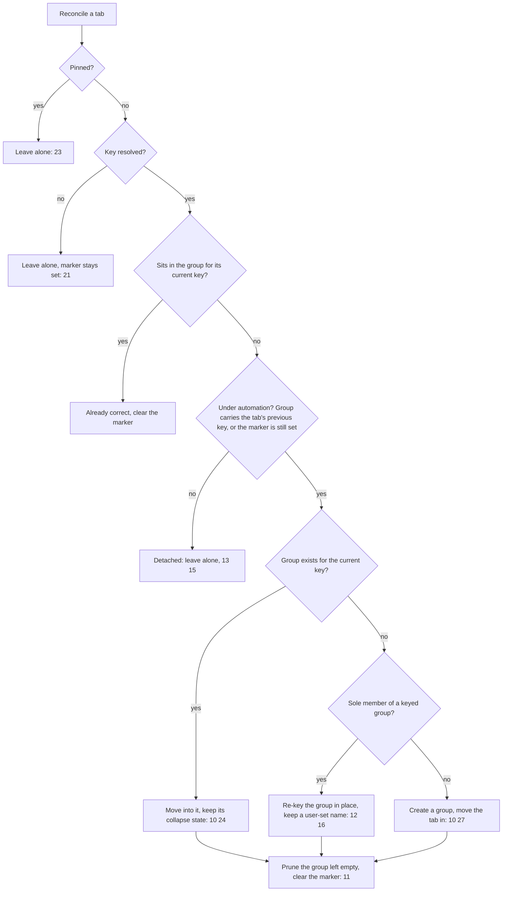

# Tech Spec: Automatic tab grouping by project

**Issue:** [warpdotdev/warp#9875](https://github.com/warpdotdev/warp/issues/9875)
**Product spec:** `specs/GH9875/product.md`

## Context

Manual tab groups already exist and carry every affordance this feature needs. The work is a
membership *resolver* plus one persisted key — no new rendering, no new drag machinery, no
new group model beyond a single column.

### Relevant code (current state)

- `app/src/workspace/tab_group.rs` — the group model: name, color, collapse, pin, drag state.
  There is no provenance or project-key field, so nothing distinguishes an automation-created
  group from a manual one.
- `app/src/tab.rs:76` — `TabData::group_id: Option<TabGroupId>` is where membership lives.
  `menu_items_with_pane_name_target` and `tab_group_menu_items` build the per-tab menu that
  **both** tab bars share.
- `app/src/workspace/view.rs` — the mutation surface:
  - `assign_tab_to_group` (`:7737`)
  - `prune_empty_tab_group` (`:7772`)
  - `move_tab_to_index` (`:7782`)
  - `sync_codebase_tab_color` (`:5668`) — the existing consumer of directory-change events
  - `insert_transferred_tab_at_index` (`:27951`) — cross-window arrivals land with no group
- `app/src/workspace/view/tab_grouping.rs:204` — `new_tab_group_from_selected_tabs` is the
  closest precedent for gathering scattered tabs into one contiguous block; it also shows
  `restore_active_tab_index`, `clamp_to_unpinned_region`, and `index_after_group`.
- `app/src/pane_group/mod.rs` — `Event::AppStateChanged` (`:504`) and `Event::RepoChanged`
  (`:730`). Tab-level directory, title and branch all resolve through the *focused* pane;
  there is no anchor-pane concept.
- `crates/repo_metadata/src/repository.rs:168` — `derive_common_git_dir` walks ancestors
  looking for a component literally named `.git`. `common_git_dir()` (`:249`) falls back to
  the per-worktree `git_dir()` when that search fails.
- `crates/persistence/src/schema.rs:359` — the `tab_groups` table.
  `crates/persistence/migrations/2026-06-12-000000_add_pinned_to_tabs_and_tab_groups/` is the
  shape to mirror for an additive column on both tables.
- `app/src/workspace/tab_settings.rs:490` — `preserve_active_tab_color` is the boolean
  tabs-setting pattern, declared at `appearance.tabs.*` (`:497`).

### The bug this feature depends on

`derive_common_git_dir` searching for a literal `.git` component means a **bare** repository's
worktrees — whose git dir looks like `/repos/api.git/worktrees/feature`, with no `.git`
component anywhere — return `None` and fall back to their per-worktree git dir. Two worktrees
of one bare repository would therefore produce two different keys and scatter into two groups,
violating invariant 5. This must be fixed before the resolver can be correct.

### Invariants that constrain the design

- Group members occupy a **contiguous run** of the tab list. This is a convention the
  workspace maintains and its helpers assume, not a runtime assertion. The resolver must
  preserve it.
- Repository detection is **asynchronous** with a synchronous cache read. A tab is ungrouped
  between creation and its key resolving; invariant 21 keeps that window from being read as a
  manual act.
- The setting lives in the global, cloud-synced tab settings, so enabling the mode acts on
  every open window at once.

## Proposed changes

### 1. `crates/repo_metadata` — correct the derivation, add a cheap lookup

Replace the ancestor search in `derive_common_git_dir` with a rule that strips a trailing
`worktrees/<name>` pair, which git guarantees for linked worktrees. One rule then covers both
layouts:

| Input git dir | Result |
|---|---|
| `/repo/.git/worktrees/feature` | `/repo/.git` |
| `/repos/api.git/worktrees/feature` | `/repos/api.git` |
| `/repo/.git` (main checkout) | itself → filtered out, stored as `None` |
| `/some/path` (no `worktrees` segment) | itself → filtered out |

The existing `.filter(|common| common != external_git_directory)` is kept, so main checkouts
still store no separate common directory.

Also add an accessor that maps an **already-canonical** path to its watched `Repository`
without re-canonicalizing. The only current public lookup canonicalizes and touches the
filesystem, which the resolver cannot afford on every directory change.

*Tradeoff:* keying on the shared git directory rather than the repository *name* means two
unrelated repositories with the same basename stay separate. Name-based grouping would merge
them, and git exposes no canonical repository name.

### 2. `app/src/workspace/project_key.rs` (new) — pure identity resolution

A pure module over three inputs: an optional directory, the shared git directory resolved for
it, and the set of existing non-git group keys.

- **Git identity** is the shared git directory (two hops: canonical pwd → repository root →
  `Repository`, neither re-canonicalizing).
- **Non-git identity** is the directory, resolved against existing keys by **longest prefix**,
  never producing a parent of an existing key, and never keying on the home directory or the
  filesystem root.
- **No key** results from no directory, an unresolvable lookup, or a directory above every
  existing key — which is what makes invariant 21 hold.
- **Display name** is the basename of the key's parent when the key's final component is
  `.git`, otherwise the key's basename with a trailing `.git` stripped. A name that would
  collide with another group in the window is qualified with its parent segment.

Deriving name *provenance* by comparing the stored name to the name its key would produce is
what lets invariant 16 work without another column: a name that differs was set by the user
and survives a re-key; a name that matches was derived and is replaced. This is why the name
rule must be **total** — a key ending in `.git` must not yield an empty string.

### 3. `crates/persistence` + app snapshots — two additive columns

One nullable text column on `tab_groups` for the project key, one boolean on `tabs` for a
placed-by-automation marker, with matching drops in `down.sql`. Both thread through the diesel
table macros, the query and insert structs, the app-side snapshots, both save hops and both
load hops, and the in-memory models. Column order in each table macro and query struct must
match the database.

The marker exists because two states are otherwise indistinguishable after a restart: a tab
the user deliberately ungrouped, and a tab automation never reached because its key had not
resolved. It is set when a tab is created, reopened, or transferred in, cleared on the first
reconcile that places it, and restored from the tab row.

### 4. `app/src/workspace/view/auto_grouping.rs` (new) — the reconcile pass

One entry point taking a **pane-group identity** (not a tab index — detection resolves an
arbitrary number of frames later, so an index captured before the await can address a
different tab). Identity resolves to an index immediately before each mutation, and the pass
no-ops when the identity is gone.

Node **E** is the whole manual-override rule. At the instant a tab's directory changes, a
tracked tab and a manually placed tab are state-identical — both sit in a group whose key no
longer matches. The resolver therefore tests against the tab's **previously resolved** key,
held as resolver state, rather than its current one; a tab that has never been placed carries
the marker instead. Any other mismatch is a placement the user made, so no state has to be
written on drop.

Moves reuse the drain-partition-splice idiom from `new_tab_group_from_selected_tabs`, which
already gathers scattered tabs into one contiguous block and clamps the insertion target out
of the pinned region, and re-seat the active tab by pane-group identity afterwards rather than
going through the activation choke point (a reorder must not activate anything).

Automation gets its **own** group-creation path that skips the inline rename dispatch — both
existing entry points end by dispatching a deferred rename action, which opens an editor and
steals focus (invariant 27).

Pinned tabs are skipped entirely rather than teaching the join path to preserve pins: the only
existing path into a group clears the pin and force-expands the target group, which would
destroy pinning irreversibly and pop open a group the user collapsed.

### 5. `app/src/workspace/view.rs` — event wiring and the enable sweep

`AppStateChanged` is the **primary** trigger and carries the cwd delta, but it also fires on
pane splits, pane closes, session changes and title updates — so the handler compares the
anchor pane's current directory against the last directory recorded for that tab and
reconciles only on a change. `RepoChanged` is a **secondary** trigger; on its own it is silent
for every non-git-to-non-git move, which is exactly invariant 6's domain.

A tab's key anchors to the first terminal pane it was created with, re-anchoring to the next
remaining terminal pane when that pane closes. This is new in-memory state, re-derived on
restore from the restored pane order.

Reconcile also runs on tab creation, on reopening a closed tab whose group is gone, on a tab
arriving from another window, and on unpinning. Enabling the setting sweeps this window's
ungrouped, unpinned tabs; disabling does nothing.

### 6. Surfaces

- **Feature flag** — its own flag layered over the existing grouped-tabs flag. Manual groups
  are already in stable; attaching new behavior to their flag would ship it unproven to
  everyone. Listed in dogfood flags, not the default set.
- **Setting** — a boolean under `appearance.tabs.*` alongside `preserve_active_tab_color`,
  with one settings widget whose `search_terms` are scoped to it, registered behind a
  **build-time** feature-flag check (the flag is fixed for the process, so `should_render` is
  the wrong mechanism).
- **Sole-member drag** — the existing suppression stops a lone tab's drag so the *group's*
  drag fires instead of orphaning the group. An automation-keyed group is derived, so nothing
  is orphaned: the emptied group prunes itself and the tab regroups at its destination. The
  suppression is therefore gated on the group carrying a project key, in **both** tab bars, so
  a manual group holding one tab keeps today's behavior.
- **Tab menu** — one entry in the group section of the shared per-tab menu, divider-separated
  and labeled so its window-wide scope reads from the text (its neighbors all act on one tab).
  Both bars use this menu, so one entry serves invariant 17.

## Testing and validation

| Invariants | How they are verified |
|---|---|
| 4, 5 | `repo_metadata` derivation tests: normal worktree, bare worktree, main checkout, no-`worktrees` path, and two worktrees of one repo yielding equal keys |
| 6, 20, 21 | `project_key` tests: subdirectory joins the existing key, longest prefix wins, a directory above every key yields no key, home and root yield no key, unresolvable lookup yields no key |
| 7 | `project_key` test: no directory yields no key |
| 8, 16 | `project_key` name tests: a key ending in `.git` derives a non-empty name, a bare key strips `.git`, two repos sharing a basename derive distinct parent-qualified names; reconcile test that a re-key preserves a user-set name and replaces a derived one |
| 2, 15, 23 | Reconcile + sweep tests: enabling groups ungrouped unpinned tabs, leaves manual groups and pinned tabs untouched; a tab still carrying the marker is placed on its first resolve |
| 10, 11, 12 | Reconcile tests: tracked tab moves and the emptied group disappears; sole member re-keys in place when no group exists, moves when one does |
| 13, 14 | Reconcile test that a tab whose group carries neither its previous nor its current key is left alone; view tests that a dragged/menu-moved tab survives a directory change and that returning it resumes automation |
| 24 | Reconcile test: joining a collapsed group leaves it collapsed |
| 27 | Reconcile test: automation's creation path dispatches no rename action |
| 9, 25, 26 | View tests: newly created / transferred-in / reopened-with-missing-group tabs are grouped; a reopened tab whose group survived keeps its placement; a directory change in a non-anchor pane does not move the tab; closing the anchor re-anchors |
| 1, 3, 19 | Settings tests: the setting defaults to off and round-trips; a unique search term isolates the new widget; with the flag off the widget is not built at all; disabling the mode changes nothing |
| 17, 22 | Tab-bar tests: the sole member of a keyed group renders its own drag affordance, a sole member of a manual group does not, and the horizontal bar computes the same suppression as the vertical panel |
| 18 | Persistence tests: a group round-trips its project key (and round-trips as absent when it has none), a tab round-trips its marker in both states, a pre-migration database restores cleanly |

**Contiguity** is asserted after every reconcile case via a test helper, because the
convention is not enforced at runtime.

**Gates.** `./script/format`, `cargo clippy --workspace --all-targets --tests -- -D warnings`,
and `cargo nextest run --no-fail-fast --workspace --exclude command-signatures-v2` must pass;
`./script/presubmit` before opening **or updating** any PR.

**Manual proof** (attached to the implementation PR), with the mode on: two worktrees of one
repository landing in one group; `cd` between projects moving a tab; a dragged tab staying put
across a later `cd`; a pinned tab staying pinned and ungrouped through the enable sweep; and a
lone tab dragged into another window.

## Risks and mitigations

- **Risk:** the resolver breaks the contiguous-run convention, which nothing asserts at
  runtime, and later group helpers misbehave in ways unit tests do not catch.
  **Mitigation:** a contiguity assertion helper runs after every reconcile test case, and
  moves reuse the existing drain-partition-splice path rather than a new one.
- **Risk:** an index captured before asynchronous detection resolves addresses a different
  tab, moving the wrong one. **Mitigation:** every mutation keys on pane-group identity and
  re-resolves to an index immediately before mutating, no-opping when the identity is gone.
- **Risk:** the enable sweep silently reorganizes windows the user is not looking at, because
  the setting is global and cloud-synced. **Mitigation:** none in this iteration — it is an
  open product question in `product.md`.
- **Risk:** joining a group clears pins or force-expands a collapsed group through the
  existing join path. **Mitigation:** automation never operates on pinned tabs and preserves
  the destination group's collapse state.
- **Risk:** the migration number collides with another PR merged first, so the runner skips
  it silently. **Mitigation:** allocate the number against `origin/master` immediately before
  merge, not at authoring time, and keep the migration idempotent.

## Follow-ups

- A right-click menu on empty horizontal tab-bar space. The vertical panel has a right-click
  handler and the per-tab menu is shared by both bars, so invariant 19 is satisfied without
  one.
- Evicting stale local repository roots in `crates/repo_metadata`, so a repository deleted and
  recreated at the same path stops resolving to the old identity before restart.
- Restricting drags to a tab's own group, and dragging a whole group to another window
  ([#14152](https://github.com/warpdotdev/warp/issues/14152)).
