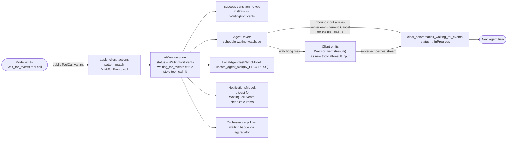

# Client Awareness of `wait_for_events` Yields — Tech Spec
## Context
See `specs/QUALITY-780/PRODUCT.md` for user-visible behavior. This spec maps the product invariants onto the existing conversation status, driver lifecycle, task sync, notifications, and orchestration pill bar code paths in the Warp client, and identifies the server-side change needed so the client can actually observe a `wait_for_events` yield. The server-side spec lives at `warp-server/specs/QUALITY-780/TECH.md`.

### Today's behavior in the bug
The end-to-end path that produces the bug is:

1. The model calls the server-handled `wait_for_events` tool. `HandleWaitForEvents` in `warp-server/logic/ai/multi_agent/runtime/ambient_agents.go` returns a `ServerToolCallResult::WaitForEventsResult` and side-effects `MarkActiveExecutionYieldedForWaitForEvents` and `ExtendTaskIdleTimeout`.
2. The current model turn ends; the agent's response stream finishes successfully.
3. `Message::ToolCallResult` messages (including the legacy server-handled `WaitForEventsResult`) are applied to the local conversation in the `response_event::Type::ClientActions(...)` arm of `BlocklistAIController::handle_response_stream_event` at `app/src/ai/blocklist/controller.rs:2614-2631`, which calls `history_model.apply_client_actions(...)`. The conversation's `ConversationStatus::Success` transition itself fires later when the `BlocklistAIActionEvent` subscriber at `app/src/ai/blocklist/controller.rs:495-518` observes that no follow-up action is queued and marks the response stream completed successfully. (The `AfterStreamFinished` arm at `controller.rs:2680+` is post-stream cleanup; it does not apply `ClientActions`.)
4. `LocalAgentTaskSyncModel.handle_history_event` (`app/src/ai/blocklist/local_agent_task_sync_model.rs:119-151`) maps `Success` → `AgentTaskState::Succeeded` and fires `update_agent_task`.
5. The server's `ApplyClientUpdates` path calls `shouldPreserveInProgressOnClientSuccess` from the `AgentTaskStateSucceeded` arm at `warp-server/logic/ai/ambient_agents/dispatcher.go:2013` (the predicate itself lives at `dispatcher.go:2110-2146`). It sees the `wait_for_events` marker and clears `in_progress_since` rather than transitioning the task to `SUCCEEDED`. The server **task state** remains preserved.
6. But on the client, `AgentDriver`'s subscription to `BlocklistAIHistoryEvent::UpdatedConversationStatus` (`app/src/ai/agent_sdk/driver.rs:2600-2683`) sees `Success` and either calls `run_exit.end_run_now(...)` (no `idle_on_complete` configured) or schedules `run_exit.end_run_after(idle_timeout, ...)` (idle timeout configured). When that future resolves, the Oz CLI driver process exits via `ctx.terminate_app(...)`.
7. `AgentNotificationsModel.handle_history_event_for_mailbox` (`app/src/ai/agent_management/agent_management_model.rs:304-389`) fires `NotificationCategory::Complete` ("Task completed.") on the same `Success` transition.
8. `aggregated_orchestrator_status` (`app/src/ai/blocklist/orchestration_topology.rs:64-106`) returns `Success` when no node is `InProgress`/`Blocked`/`Error`/`Cancelled`, so the orchestration pill bar's orchestrator badge renders the green check via `render_avatar_with_status_overlay`.

The combined effect is the bug report: an Oz cloud agent worker exits seconds after yielding for events and fires a misleading "Task completed" toast. The orchestration pill bar badge is also wrong in the narrower case where an orchestrator yields with no active descendants (today's one-level orchestration means active children already drive the aggregator to `InProgress`; the badge fix matters for the no-descendants case and is forward-compatible with any future multi-level orchestration).

### Relevant files

#### Conversation status and persistence
- `app/src/ai/agent/conversation.rs:4067-4168` — `ConversationStatus` enum, `status_icon_and_color`, `render_icon`, `is_in_progress`, `is_blocked`, `is_cancelled`, `is_done`, `is_error`.
- `app/src/ai/agent/conversation.rs:777-814` — `status()`, `update_status_with_error_message`.
- `app/src/ai/agent/conversation.rs:195-323` — `AIConversation` struct definition with all durable fields including `parent_agent_id`, `agent_name`, `last_event_sequence`, `pinned`.
- `app/src/ai/agent/conversation.rs:3038-3128` — `write_updated_conversation_state` constructs `AgentConversationData` for SQLite persistence.
- `app/src/ai/agent/conversation.rs:700-720` — `derive_status_from_root_task` reconstructs status from last-exchange output on restore. Today, a successful exchange always derives `Success`. Note: this function takes only `root_task: &Option<&Task>` — it has no access to `AgentConversationData` and is called from the restore path at `conversation.rs:542`.
- `app/src/persistence/model/...` — `AgentConversationData` struct definition (the SQLite schema for restored conversations).

#### Driver / process lifecycle
- `app/src/ai/agent_sdk/driver.rs:147-202` — `IdleTimeoutSender` (the generation-based oneshot that drives Oz CLI exit timing).
- `app/src/ai/agent_sdk/driver.rs:720-812` — `AgentDriver::run`; tx/rx oneshot that signals the CLI to terminate the process. The async block that wraps `run_internal` (defined separately at `driver.rs:1594+`) is spawned here.
- `app/src/ai/agent_sdk/driver.rs:1879-1914` — `HarnessKind::Oz` branch awaits `status_rx` from `execute_run()`; on resolution sleeps 1s then returns the conversation status.
- `app/src/ai/agent_sdk/driver.rs:2429-2709` — `execute_run`, which subscribes to `BlocklistAIHistoryEvent::UpdatedConversationStatus` and maps `Success | Blocked | Cancelled` to either immediate or idle-on-complete-delayed run exit.
- `app/src/ai/agent_sdk/driver.rs:2861-2949` — `subscribe_to_cli_agent_session_events`; the same `Success | Blocked` → exit mapping for third-party harnesses.
- `app/src/ai/agent_sdk/mod.rs:1415` — `ctx.terminate_app(TerminationMode::ForceTerminate, None)` when `driver.run` returns `Ok(())`.

#### Task sync model
- `app/src/ai/blocklist/local_agent_task_sync_model.rs:119-151` — `handle_history_event` reacts to `UpdatedConversationStatus`.
- `app/src/ai/blocklist/local_agent_task_sync_model.rs:314-355` — `map_conversation_status` maps `ConversationStatus` to `AgentTaskState`.

#### Notifications
- `app/src/ai/agent_management/agent_management_model.rs:209-302` — `handle_history_event` and `handle_history_event_for_mailbox`.
- `app/src/ai/agent_management/agent_management_model.rs:304-389` — Per-status notification branches.
- `app/src/ai/agent_management/agent_management_model.rs:471-482` — `ConversationStatus::should_trigger_notification`.

#### Orchestration pill bar and topology
- `app/src/ai/blocklist/orchestration_topology.rs:64-106` — `aggregated_orchestrator_status` with precedence `InProgress > Blocked > Error > Cancelled > Success` (precedence to be updated).
- `app/src/ai/blocklist/agent_view/orchestration_pill_bar.rs:119-151` — `pill_status_sort_key`, `pill_secondary_sort_key`, `DONE_STATUS_KEY`.
- `app/src/ai/blocklist/agent_view/orchestration_pill_bar.rs:631-705` — `pill_specs` constructs pill data; orchestrator gets aggregated status, children use their own status.
- `app/src/ai/blocklist/agent_view/orchestration_pill_bar.rs:1390-1397` — Hover card uses aggregated status for orchestrators.
- `app/src/ai/blocklist/agent_view/orchestration_pill_bar.rs:2112-2156` — `render_avatar_with_status_overlay`.

#### Server tool-call result handling
- `app/src/ai/blocklist/controller.rs:2614-2631` — the `response_event::Type::ClientActions(actions)` arm of `BlocklistAIController::handle_response_stream_event`. This is where `AddMessagesToTask` actions (which carry the tool-call-result messages, including any new `WaitForEvents` tool-call result) are dispatched into the conversation via `history_model.apply_client_actions(...)`.
- `app/src/ai/blocklist/controller.rs:495-518` — `BlocklistAIActionEvent` subscriber that drives the conversation's `Success` transition after no follow-up action is queued. Not the same code path as `AfterStreamFinished`.
- `app/src/ai/blocklist/controller.rs:2680+` — `ResponseStreamEvent::AfterStreamFinished` handler; post-stream cleanup. Does **not** apply `ClientActions`.
- `app/src/ai/blocklist/history_model.rs:1484` — `apply_client_actions` (the function that adds `AddMessagesToTask` actions to a conversation; the natural hook point for the new `WaitForEvents` tool-call detection).
- Search for `WaitForEventsResult` in the client today: no hits. The legacy server tool-call result is opaque to clients (carried in the `Message::ToolCallResult::ServerResult { serialized_result: <opaque string> }` variant per `warp-proto-apis/apis/multi_agent/v1/task.proto:939-941`).

## Design options
Three were considered. We are recommending Option B (first-class variant) because the existing exhaustive-matching conventions make it the safest change to land cleanly; the others are documented for context.

### Option A — Marker on `AIConversation`, status stays `Success`
Add a boolean `waiting_for_events: bool` on `AIConversation` (and persist it on `AgentConversationData`). Conversation status still flips to `Success` on stream finish, but every status-consuming surface that cares (`LocalAgentTaskSyncModel`, `AgentDriver`, notifications, pill bar aggregator) reads the marker alongside the status.

- Pros: smallest blast radius; no enum-variant churn; `match conversation.status()` sites that don't care about waiting keep working unchanged.
- Cons: invisible to exhaustive matching, which is how the original bug propagated in the first place. Any new consumer of `ConversationStatus::Success` will silently treat a waiting conversation as done. The "is this a real success?" check has to be repeated at every site that needs it; we cannot rely on the compiler to enumerate them.
- Verdict: rejected. The whole reason the bug exists is that `Success` is overloaded.

### Option B — First-class `ConversationStatus::WaitingForEvents` variant (recommended)
Add a new variant alongside `InProgress`, `Success`, `Blocked`, `Error`, `Cancelled`.

- Pros: exhaustive matching enumerates every site that needs to make a deliberate decision. Existing `match conversation.status()` arms (icon, color, telemetry, sort key, mailbox) fail to compile until they decide what to do, which is the exact failure mode we want the compiler to catch. Models the state accurately: quiescent but not terminal, like `Blocked`.
- Cons: touches more files (every `match conversation.status()`). Need to split `is_done()` semantically (see §"Predicate split" below) because some callers currently use it to mean "is terminal" and others to mean "is quiescent."
- Verdict: chosen. The "predicate split" is necessary work regardless of which option we pick if we want long-term correctness.

### Option C — Reuse `ConversationStatus::InProgress`
Have the conversation stay `InProgress` while yielded.

- Pros: trivially keeps the driver alive (the existing `is_in_progress()` branch already cancels idle timers) and naturally satisfies orchestration aggregation precedence.
- Cons: `InProgress` carries an implicit "actively streaming" meaning throughout the codebase — block status bar shows a spinner, the Stop button is enabled, the input is disabled in some flows, "thinking" UI animates. A yielded run is none of those things. Every UI site that keys off `InProgress` would either misfire or need a new way to ask "is the agent really doing anything?"
- Verdict: rejected. The overload is even worse than Option A.

## Proposed changes

### 1. `ConversationStatus::WaitingForEvents` variant
In `app/src/ai/agent/conversation.rs:4067-4168`:

```rust path=null start=null
pub enum ConversationStatus {
    InProgress,
    Success,
    Error,
    Cancelled,
    Blocked { blocked_action: String },
    // New:
    WaitingForEvents,
}
```

Update `Display`, `render_icon`, and `status_icon_and_color` exhaustively. The new badge needs a color and icon distinct from every existing status. Explicit collisions to avoid:
- `Success` uses `theme.ansi_fg_green()` and `Icon::Check` (`conversation.rs:4121-4127`).
- `InProgress` uses `theme.ansi_fg_magenta()` and `Icon::ClockLoader` (`conversation.rs:4114-4120`).
- `Blocked` uses `theme.ansi_fg_yellow()` and `Icon::StopFilled` (`conversation.rs:4136-4142`).

Recommended palette: `theme.ansi_fg_blue()` with a "listening" or "hourglass" icon. Final choice deferred to design with a `TODO(design)` placeholder; this spec only requires that the visual be unambiguous against the three quiescent-non-terminal-adjacent siblings above.

### 2. Predicate split on `ConversationStatus`
Replace the single `ConversationStatus::is_done()` predicate (`conversation.rs:4158-4163`) with two intent-named predicates and migrate callers:

```rust path=null start=null
impl ConversationStatus {
    /// True iff the run is finished and cannot resume on its own.
    pub fn is_terminal(&self) -> bool {
        matches!(
            self,
            ConversationStatus::Success
                | ConversationStatus::Error
                | ConversationStatus::Cancelled
        )
    }

    /// True iff the agent is not currently streaming output.
    /// Quiescent statuses include all terminal statuses plus Blocked and WaitingForEvents.
    pub fn is_quiescent(&self) -> bool {
        !matches!(self, ConversationStatus::InProgress)
    }
}
```

#### 2.1 `is_done()` migration table
`ConversationStatus::is_done()` has five call sites today. Each site picks `is_terminal()` (the run is finished) or `is_quiescent()` (the agent isn't actively streaming) based on what question the site is really asking. **Only `ConversationStatus::is_done` is affected. `AIActionStatus::is_done()` and other namesake methods (e.g. `block.rs:3282`, `block.rs:4432`) are unrelated and remain unchanged.**

| Call site | Current intent | Migration |
|---|---|---|
| `app/src/ai/agent_view/search_item.rs:210` | Decides whether to show "in-progress" decoration on the search row. | `!is_quiescent()` (i.e. `is_in_progress()`) — a yielded run should not display an active spinner in the row. |
| `app/src/ai/agent_view/conversation_list/view.rs:877` | Groups rows into the "done" list section. | `is_terminal()` — yielded runs should stay in the active section, not be sorted as done. |
| `app/src/ai/agent_view/conversation_list/view.rs:1039` | Same intent as the previous row, in a sibling render path. | `is_terminal()`. |
| `app/src/ai/agent_view/slash_commands/mod.rs:892` | `/cost` command refuses to compute cost while the conversation is still going. | `is_terminal()` — `/cost` should also refuse to compute while the run is yielded for events because the cost may not be final yet. (Alternative: `is_quiescent()` if product wants `/cost` to work mid-yield; default is the safer `is_terminal()`.) |
| `app/src/ai/agent_view/conversation_list/data_source.rs:209` | Decides whether to include the conversation in a "completed" data source. | `is_terminal()`. |

The implementer should confirm each row's intent by reading the call site before mechanically applying the migration; the table is the recommended default. After migration, **remove** `ConversationStatus::is_done` outright so the compiler rejects any future reintroduction. `should_trigger_notification` adds `WaitingForEvents => false`.

### 3. Persistence and restore
Add `WaitingForEvents` to the SQLite-persisted form via `AgentConversationData`.

Add an explicit `waiting_for_events: bool` field on `AgentConversationData` (defaulted via `serde(default)` for backward compatibility) alongside the other durable per-conversation fields like `parent_agent_id`, `pinned`, `last_event_sequence`. Populate it from `AIConversation::status == WaitingForEvents` in `write_updated_conversation_state` at `app/src/ai/agent/conversation.rs:3096-3118`.

**Restore call-site note.** `derive_status_from_root_task` (`app/src/ai/agent/conversation.rs:700-720`) takes only `root_task: &Option<&Task>` and has no access to `AgentConversationData`. The check therefore lives at the **caller**, not inside the function. In the restore path at `conversation.rs:542` (the body of `new_restored`), the call sequence becomes:

```rust path=null start=null
let status = if conversation_data
    .as_ref()
    .is_some_and(|data| data.waiting_for_events.unwrap_or(false))
{
    ConversationStatus::WaitingForEvents
} else {
    Self::derive_status_from_root_task(&root_task)
};
```

This preserves `derive_status_from_root_task`'s signature for non-yield restores and keeps the new field check explicit at the restore site.

Alternative considered: encode in the last exchange's `FinishedAIAgentOutput` via a new `WaitForEventsYielded` variant. Rejected because it touches the exchange/output shape and makes it harder to clear the waiting state independently when the run resumes.

### 4. Driver lifecycle
> **Superseded by §10 (action_model integration refactor).** The watchdog described in this section was implemented as the `WaitForEventsWatchdog` singleton (`app/src/ai/blocklist/wait_for_events_watchdog.rs`) but is being replaced by an `action_model`-owned executor; see §10 for the new ownership model, the deletion list, and the client-side safety margin. The text below is preserved as a record of the first-pass design.
Update both subscription paths to treat `WaitingForEvents` as keep-alive:

- `app/src/ai/agent_sdk/driver.rs:2600-2683` (`execute_run`'s `UpdatedConversationStatus` handler):
  - The `is_in_progress()` early-return at line 2610 cancels the idle timer. Keep this branch; `WaitingForEvents` does **not** cancel the existing idle timer (because there should be no in-flight idle timer when entering the waiting state — the previous status was `InProgress`).
  - Add an explicit `WaitingForEvents` arm: do not resolve `run_exit`; instead, schedule a `waiting_watchdog` future that fires after the server-supplied `idle_timeout_seconds` (read from the new `Message::ToolCall::WaitForEvents` call payload per server TECH §0) or a built-in `DefaultOrchestratedIdleTimeoutSeconds` fallback. On fire, emit a `Message::ToolCallResult { result: WaitForEvents(WaitForEventsResult{}) }` referencing the unresolved `WaitForEvents` tool-call id (stored when the waiting state was entered, per §8.1) as a new tool-call-result input on the active task. This closes out the unresolved tool call without cancelling the run; the agent's next turn sees the empty timeout result and decides what to do (typically `finish_task`, but the agent may also re-yield, ask the user, or take other action). The conversation leaves `WaitingForEvents` via the normal resume path (§8.3) when the server echoes the result back through `apply_client_actions`. Track the watchdog with the same generation-counter pattern used by `IdleTimeoutSender` so a resume-by-inbound-input cancels it before the timer fires.
  - The watchdog is a separate timer from the existing `idle_on_complete` completion timer: a waiting run does not enter the `Success | Blocked | Cancelled` exit path on watchdog fire.
- `app/src/ai/agent_sdk/driver.rs:2861-2949` (`subscribe_to_cli_agent_session_events`): not directly affected because third-party harnesses don't emit `wait_for_events`. Confirm by exhaustive match against the (separate) `CLIAgentSessionStatus` enum.

Sourcing the watchdog timeout from the tool-call payload keeps the client-side watchdog and the server-side `VMIdleTimeoutMinutes` synchronized; if the server caps the timeout for tenant policy, the client respects the same cap. The server-side worker idle-shutdown described in server TECH §1.1 is the defense-in-depth path for cases where the client is offline; in normal operation the client watchdog wakes the agent first.

### 5. Task sync model
Update `map_conversation_status` in `app/src/ai/blocklist/local_agent_task_sync_model.rs:314-355`:

```rust path=null start=null
ConversationStatus::WaitingForEvents => (AgentTaskState::InProgress, None),
```

This means the client actively reports `IN_PROGRESS` for yielded runs rather than relying on `shouldPreserveInProgressOnClientSuccess` server-side. The server backstop stays in place for older clients and edge cases (see server TECH §"Server-side gates remain as a backstop").

### 6. Notifications
Two changes in `app/src/ai/agent_management/agent_management_model.rs`, both targeted at the `WaitingForEvents` yield case. The orchestrator-aware suppression that an earlier draft considered (consulting `aggregated_orchestrator_status` on the orchestrator's own `Success`) is **out of scope** per PRODUCT.md (20): if the orchestrator itself reaches a terminal status, that's its own assessment and the notification fires as today. The known orchestrator notification spam is the case where the orchestrator yielded via `wait_for_events` between turns, which the `WaitingForEvents` status (and the suppression below) covers directly.

- `ConversationStatus::should_trigger_notification` (line 471): add `WaitingForEvents => false`. (Note: the function uses `matches!` today, which means a new variant returns `false` by default. Rewrite the function as an exhaustive `match` so future variants force a deliberate decision.)
- `handle_history_event_for_mailbox` (line 304): add an explicit `WaitingForEvents` arm that mirrors the `InProgress` arm at line 330 — it clears any stale notification for this origin via `remove_notification_by_source`.

### 7. Orchestration pill bar and aggregation
`app/src/ai/blocklist/orchestration_topology.rs:64-106`:
- Update `aggregated_orchestrator_status` precedence to `InProgress > Blocked > WaitingForEvents > Error > Cancelled > Success`, **with one carve-out**: when the orchestrator itself yielded into `WaitingForEvents`, its own waiting state outranks any descendant `InProgress`. This keeps the orchestrator pill honest about "THIS conversation is paused" even while child agents continue working. A descendant in `Blocked` still beats the parent's `WaitingForEvents` because Blocked needs user attention.
- Add a `any_waiting: bool` accumulator alongside the existing `any_in_progress`, `first_blocked`, `any_error`, `any_cancelled`; return `WaitingForEvents` when set and no higher-precedence status was observed.
- Update the doc-comment precedence list (lines 54-61) to match the new ordering.

`app/src/ai/blocklist/agent_view/orchestration_pill_bar.rs:119-151`:
- `pill_status_sort_key`: give `WaitingForEvents` its own slot in the "active-ish" half of the bar; do not lump it into `DONE_STATUS_KEY`. Recommended order: `Blocked = 0`, `Error = 1`, `InProgress = 2`, `WaitingForEvents = 2` (same bucket as `InProgress`, sorts left of the done section), `Cancelled | Success = DONE_STATUS_KEY (3)`.
- Update the existing comment at lines 119-124 ("Cancelled and Success share one 'done' bucket") to also mention that `WaitingForEvents` shares the `InProgress` bucket. Future readers should not have to re-derive this.
- `render_avatar_with_status_overlay` (lines 2112-2156) and the hover card (lines 1390-1397) pick up the new badge automatically because they consume `ConversationStatus::status_icon_and_color`.

### 8. Detecting `wait_for_events` from the new client tool-call variant
This section covers how the client discovers a yield. The server-side spec (`warp-server/specs/QUALITY-780/TECH.md` §0-§1) adds a first-class `WaitForEvents` variant to the public proto's `Message::ToolCall::tool` oneof and an accompanying `WaitForEventsResult` variant to `Message::ToolCallResult::result`. The client pattern-matches the public variant directly; no payload-sniffing of the opaque `Message::ToolCall::Server` is needed (and would not work, since that payload is opaque per `task.proto:405-407`).

#### 8.1 Detection point
Client-action messages flow into the conversation via `BlocklistAIHistoryModel::apply_client_actions` (`app/src/ai/blocklist/history_model.rs:1484`), invoked from the `response_event::Type::ClientActions(actions)` arm in `BlocklistAIController::handle_response_stream_event` at `app/src/ai/blocklist/controller.rs:2614-2631`. The detection hook lives inside `apply_client_actions` (or a small helper called from it) and pattern-matches on the message variant:

```rust path=null start=null
for message in &add_messages_to_task.messages {
    match message.message.as_ref() {
        Some(api::message::Message::ToolCall(tool_call)) => {
            if matches!(tool_call.tool.as_ref(), Some(api::message::tool_call::Tool::WaitForEvents(_))) {
                self.mark_conversation_waiting_for_events(conversation_id, tool_call.tool_call_id.clone(), ctx);
            }
        }
        Some(api::message::Message::ToolCallResult(result)) => {
            if matches!(result.result.as_ref(), Some(api::message::tool_call_result::Result::WaitForEvents(_))) {
                self.clear_conversation_waiting_for_events(conversation_id, ctx);
            }
        }
        _ => {}
    }
}
```

`mark_conversation_waiting_for_events` performs all four state changes atomically (under the existing model lock): sets `AIConversation::status = WaitingForEvents`, sets the durable `waiting_for_events = true` flag, stores the unresolved `tool_call_id` as in-memory state on `AIConversation`, and emits a `BlocklistAIHistoryEvent::UpdatedConversationStatus` so the driver / task sync / notifications / pill bar all re-evaluate.

**Persistence note.** The `tool_call_id` is intentionally **not** persisted on `AgentConversationData`. Only the `waiting_for_events: bool` flag is durable. The rationale matches how other unresolved tool calls are treated on restart: the wait timeout is effectively cancelled on a fresh process (the watchdog cannot re-schedule from a partial in-memory snapshot anyway). On restart, a restored conversation in `WaitingForEvents` hydrates with the `bool` set but `tool_call_id = None`:
- The driver (§4) skips scheduling a watchdog when `tool_call_id` is `None` — the wait remains open but with no client-side timeout. The conversation can still resume via user input or inbound supersede (which generates a server-emitted generic `Cancel`).
- `apply_client_actions` post-restart resume matching falls back to scanning the conversation's transcript: when a `Cancel` or `WaitForEventsResult` arrives, the conversation is `WaitingForEvents`, and `tool_call_id` is `None`, the handler walks back through messages to find the most recent `Message::ToolCall::WaitForEvents` without a matching result. If the incoming result's `tool_call_id` matches, `clear_conversation_waiting_for_events` is called.

This keeps the persistence schema minimal (one new `bool` field on `AgentConversationData`) and accepts the trade-off that a long-running wait survives a client restart but loses its watchdog.

#### 8.2 Ordering rule for the race with the `Success` transition
> **Superseded by §10 (action_model integration refactor).** The ordering rule below was implemented as guards in two places (`BlocklistAIController::new` action_model subscription, and `AIConversation::mark_request_completed`). Both are deleted by §10 in favor of running `wait_for_events` through the `action_model` lifecycle, which keeps the conversation in `WaitingForEvents` by construction (the wait action stays `running` so `Success` never gets computed). The text below is preserved as a record of the first-pass design.
Today, after the response stream finishes with no follow-up action queued, the `BlocklistAIActionEvent` subscriber at `controller.rs:495-518` marks the conversation's response stream completed successfully and transitions `ConversationStatus::Success`. If a `WaitForEvents` tool-call message arrives in the same response stream, the executor's `WaitingForEvents` transition and the subscriber's `Success` transition both fire — and without an explicit rule the `Success` transition wins because it fires last.

Pin the ordering as: **`WaitingForEvents` takes precedence over `Success` for the same conversation within a single response stream**. Implementation:

- The `WaitingForEvents` transition happens first (at `apply_client_actions` time, before the response stream's `Finished` event).
- The `Success`-transition path at `controller.rs:495-518` checks `conversation.status() == WaitingForEvents` before calling `update_status(Success)`. If true, it is a no-op: the conversation stays `WaitingForEvents` and the response stream is marked completed (the response stream's success is independent of the conversation status).
- An explicit unit test covers the ordering: a fake stream that emits a `WaitForEvents` tool call followed by a `Finished` event with no follow-up action must leave the conversation in `WaitingForEvents`, not `Success`.

This preserves "the response stream finished cleanly" semantics (the stream itself succeeded) while keeping the conversation in the correct waiting state.

#### 8.3 Clearing the waiting state on resume
Two distinct messages can close the unresolved `WaitForEvents` tool call and resume the agent. Both produce the same client-side state transition: the conversation leaves `WaitingForEvents` and re-enters `InProgress`.

1. **Generic `Cancel` tool-call result (inbound supersede).** When new user input, an inbound message, or an inbound lifecycle event arrives on the waiting task, the server's existing pending-tool-call supersede mechanism appends a generic `Cancel` tool-call-result referencing the unresolved `WaitForEvents` id (server TECH §1.1). The client's `apply_client_actions` sees the `Cancel` against the stored `tool_call_id` and treats it as the resume signal.
2. **`WaitForEventsResult` tool-call result (timeout).** The client's own watchdog has just emitted this result (§4), and the server has echoed it back through the normal stream. `apply_client_actions` pattern-matches the `WaitForEvents` result variant against the stored `tool_call_id` and treats it as the resume signal.

In both cases, `apply_client_actions` calls `clear_conversation_waiting_for_events`, which:
- Resets `AIConversation::status = InProgress` (the same status the agent run had before the yield; the resume marks the conversation as actively progressing again).
- Clears the durable `waiting_for_events = false` flag.
- Clears the stored `tool_call_id`.
- Emits `BlocklistAIHistoryEvent::UpdatedConversationStatus` so the driver cancels any pending watchdog (via the generation counter from §4), task sync reports the resumed state, and the pill bar re-renders.

The `WaitForEventsResult` is intentionally empty (server TECH §0); no payload fields drive the state transition. The variant identity is sufficient. The downstream behavioral distinction between the two cases lives in the agent's next turn, which has the full context in its message window: a generic `Cancel` is accompanied by new user/message/event inputs that the agent reacts to; a `WaitForEventsResult` arrives alone and signals "your wait timed out, decide what to do".

### 9. Coordinated rollout and backwards compatibility
No client-side feature flag is required. The signal that activates the client-side fix is the presence of the new public `Message::ToolCall::WaitForEvents` variant in a received message. Because the legacy `Message::ToolCall::Server` payload is opaque to clients (`task.proto:405-407`), there is no way for the client to detect a legacy `wait_for_events` call, and no sniff fallback exists.

Rollout sequencing (mirrors server TECH §"Backwards compatibility and coordinated rollout"):

1. **`warp-proto-apis` release.** The proto additions ship first as a no-op (no producer or consumer yet). Wire-compatible: older deserializers ignore the new variants.
2. **`warp` rev bump.** Cargo.toml in `warp` is bumped to the new release. The client adds the `WaitForEvents` detection and the `WaitingForEvents` flow. Without a server emitting the variant, the new code stays dormant.
3. **`warp-server` rev bump + flag-on rollout.** The server side ships the new emission path behind a feature flag. Flipping the flag for a tenant/workspace activates the client-side fix for that scope.
4. **Steady state.** Both repos ship the new path; the server-side flag is at 100%. The legacy server-handled `wait_for_events` path stays compiled for one release window and is then removed (server TECH §"Cleanup").

#### Behavior during the rollout window
- **Client old, server old.** Legacy bug: `Success` is reported, the CLI driver exits, the server's `shouldPreserveInProgressOnClientSuccess` keeps the task `IN_PROGRESS`. Unchanged from today.
- **Client old, server new.** Client sees the new `WaitForEvents` variant as an unknown field (proto's forward-compatibility) and ignores it. The conversation still goes to `Success` locally; same as the legacy bug. The server-side gates protect the task.
- **Client new, server old.** Server is still emitting via `Message::ToolCall::Server { payload: <opaque> }`. The client sees only the opaque variant and treats the conversation as `Success` (same as today). The server-side gates protect the task.
- **Client new, server new.** Full fix: `WaitForEvents` variant emitted by server, pattern-matched by client, conversation transitions to `WaitingForEvents`, driver stays alive, no toast, correct pill-bar badge.

#### Mixed-mode within a single conversation
The server-side feature flag is evaluated per `wait_for_events` call, so one conversation can contain both legacy and new yields. The client handles this gracefully: legacy yields produce opaque server tool-call messages that the client ignores; new yields activate the `WaitingForEvents` path. There is no client-side state that needs to track which mode a conversation is in.

## End-to-end flow
After the changes, a `wait_for_events` cycle looks like:

1. Model calls `wait_for_events`.
2. Server (per `warp-server/specs/QUALITY-780/TECH.md`) emits `Message::ToolCall { tool: WaitForEvents }` in the public proto, fires `recordWaitForEventsYield` to mark the execution and extend `VMIdleTimeoutMinutes`, and finishes the response stream **without** emitting a tool-call result.
3. Client `apply_client_actions` pattern-matches `Message_ToolCall_WaitForEvents_case` and calls `mark_conversation_waiting_for_events`: status = `WaitingForEvents`, durable `waiting_for_events = true`, stored `tool_call_id`, emit status-update event.
4. The `BlocklistAIActionEvent` subscriber at `controller.rs:495-518` checks the current status before transitioning to `Success`; sees `WaitingForEvents` and no-ops on the status transition (the response stream itself is still marked completed successfully).
5. `AgentDriver`'s `UpdatedConversationStatus` subscriber sees `WaitingForEvents`, does **not** resolve `run_exit`, and schedules the waiting watchdog with the server-supplied (or default) timeout.
6. `LocalAgentTaskSyncModel` maps `WaitingForEvents` → `AgentTaskState::InProgress` and fires `update_agent_task`.
7. `AgentNotificationsModel` does not fire a toast for the `WaitingForEvents` transition (§6). The orchestrator's own `Success`/`Cancelled`/`Error` notifications continue to fire as today.
8. The orchestration pill bar's orchestrator badge renders the new "waiting" icon/color via the updated aggregator precedence.
9. When new inbound input arrives on the waiting task (user follow-up, inbound message, or inbound lifecycle event), the server's existing supersede mechanism appends a generic `Cancel` tool-call-result for the unresolved `WaitForEvents` call (server TECH §1.1). The client's `apply_client_actions` pattern-matches the `Cancel` against the stored `tool_call_id` and calls `clear_conversation_waiting_for_events`:
   - Status transitions to `InProgress`, durable flag clears, watchdog generation bumps so the pending timer is cancelled.
   - Mailbox re-evaluates (no notification fires on `WaitingForEvents → InProgress`).
   - Pill bar re-renders.
   - The next agent turn proceeds normally (the agent sees the `Cancel` plus the new inputs in its context).
10. If no inbound input arrives before the watchdog from step 5 fires, the client emits `Message::ToolCallResult { result: WaitForEvents(WaitForEventsResult{}) }` as a new tool-call-result input on the active task, closing the unresolved `WaitForEvents` call. The server echoes the message back through the normal stream; the client's `apply_client_actions` pattern-matches the `WaitForEvents` result variant against the stored `tool_call_id` and calls `clear_conversation_waiting_for_events` (same handler as step 9). Status transitions to `InProgress` and the agent's next turn observes the empty timeout result and decides how to proceed (commonly `finish_task`, but the agent may also re-yield via another `wait_for_events`, ask the user, or take other action). The run is **not** auto-cancelled on timeout; the agent owns the decision.

## Diagram


## Testing and validation
Map each `PRODUCT.md` invariant to a concrete test or manual verification. Numbers in parentheses reference `specs/QUALITY-780/PRODUCT.md`.

### Unit tests
- `conversation_tests.rs` — `ConversationStatus::is_terminal()` returns true exactly for `Success | Error | Cancelled`; `is_quiescent()` returns true for all statuses except `InProgress`. Covers (3), (4), (28).
- `conversation_tests.rs` — `should_trigger_notification` returns `false` for `WaitingForEvents` and `InProgress`, true for `Success | Blocked | Error`. Covers (16), (19).
- `conversation_tests.rs` — Round-trip persistence: an `AIConversation` with `waiting_for_events = true` serializes and restores as `WaitingForEvents` via the explicit check at `conversation.rs:542`. Also covers the case where the persisted record is from an old build: `waiting_for_events` defaults to `false` and the status is derived normally. Covers (10).
- `conversation_tests.rs` — Transition matrix: assert the only legal transitions into `WaitingForEvents` are from `InProgress`; transitions out of `WaitingForEvents` are to `InProgress`, `Cancelled`, `Error`, or `Success`; a direct `WaitingForEvents` → `WaitingForEvents` is not reachable (must re-enter `InProgress` first). Covers PRODUCT.md (9).
- `conversation_tests.rs` — Cancellation from `WaitingForEvents`: invoking the existing cancel path on a `WaitingForEvents` conversation transitions to `Cancelled` immediately and emits a status update. Covers PRODUCT.md (14).
- `local_agent_task_sync_model_tests.rs` — `map_conversation_status(WaitingForEvents)` returns `(AgentTaskState::InProgress, None)`. Covers (15).
- `agent_management_model_tests.rs` — `handle_history_event_for_mailbox` for `WaitingForEvents` does not call `add_notification` and removes any existing notification for the origin. Covers (16), (17).
- `agent_management_model_tests.rs` — No notification fires on the `WaitingForEvents` → `InProgress` resume transition. Covers PRODUCT.md (18).
- `agent_management_model_tests.rs` — Orchestrator's own terminal status fires the existing notification: an orchestrator with non-terminal descendants reaching `Success` (or `Cancelled` / `Error`) still produces the `Complete` (or matching) toast — the mailbox does not inspect descendant state. Covers PRODUCT.md (20).
- `orchestration_topology_tests.rs` — `aggregated_orchestrator_status` precedence: orchestrator `WaitingForEvents` + all children `Success` → `WaitingForEvents`; orchestrator `WaitingForEvents` + one child `InProgress` → `InProgress`; orchestrator `WaitingForEvents` + one child `Blocked` → `Blocked`; orchestrator `WaitingForEvents` + one child `Error` → `WaitingForEvents`. Covers (22).
- `orchestration_pill_bar_tests.rs` — `pill_status_sort_key(WaitingForEvents)` returns a value strictly less than `DONE_STATUS_KEY`. Covers (24).
- `driver_tests.rs` (new or extend existing) — A status transition into `WaitingForEvents` does not resolve `run_exit` and schedules the waiting watchdog; a transition to `InProgress` after that cancels the watchdog via generation counter; a watchdog fire emits a `Message::ToolCallResult { result: WaitForEvents(WaitForEventsResult{}) }` against the stored `tool_call_id` as a new tool-call-result input on the active task and does **not** resolve `run_exit` with `Cancelled`. Covers (11), (12), (13).
- `controller_tests.rs` (new or extend existing) — Ordering rule: a `WaitForEvents` tool call followed by a `Finished` event with no follow-up action leaves the conversation in `WaitingForEvents`, not `Success`. The response stream is still marked completed successfully. Covers §8.2.
- `input_tests.rs` or `agent_message_bar_tests.rs` — With the conversation in `WaitingForEvents`, the input is enabled and submitting a follow-up clears the waiting state and transitions to `InProgress`. Covers PRODUCT.md (26).
- `history_model_tests.rs` — Starting a new conversation in a terminal view that previously held a `WaitingForEvents` conversation does not inherit `waiting_for_events = true`. Covers PRODUCT.md (31).

### Integration tests
- Add an integration test in `crates/integration/` that drives an Oz CLI agent with `--idle-on-complete=5s` against a fake server emitting the new public `WaitForEvents` variant; assert the process does not exit within 30 seconds. Covers PRODUCT.md (11).
- Timeout-path integration test: drive an Oz CLI agent against a fake server, let the client watchdog fire, assert the client emits `Message::ToolCallResult { result: WaitForEvents(WaitForEventsResult{}) }` against the unresolved `WaitForEvents` tool-call id and the run does **not** transition to `Cancelled`. The fake server echoes the result back; assert the conversation transitions to `InProgress` and the simulated agent's next turn fires. Covers PRODUCT.md (12), (29).
- Coordinated-rollout matrix: a flag-off fake server emits the legacy server tool call; the client treats the conversation as `Success` (legacy bug) and the server's `shouldPreserveInProgressOnClientSuccess` keeps the task `IN_PROGRESS`. A flag-on fake server emits the new variant; the client transitions to `WaitingForEvents`. Covers PRODUCT.md (32), (33).
- Extend `agent_conversations_model_tests.rs` to assert that a conversation entering `WaitingForEvents` does not propagate `Success` semantics to consumers that check `is_terminal()`. Covers (28).

### Manual validation
- Run a local Oz orchestrator that spawns one child agent and yields via `wait_for_events`. Verify:
  1. The orchestration pill bar's orchestrator badge shows the "waiting" icon/color (not green check). (21), (22)
  2. No "Task completed" toast appears. (16), (20)
  3. The CLI worker process stays alive until the child message arrives. (11)
  4. After the inbound message resumes the agent, the badge transitions back to active and the conversation eventually completes. (8), (30)
- Repeat with the orchestrator in the foreground and minimized to confirm notification behavior matches.
- Restart Warp while a conversation is `WaitingForEvents`. Confirm restore preserves the state and the pill bar still shows the "waiting" badge. (10)
- Submit a follow-up while in `WaitingForEvents`. Confirm the input accepts the message, the conversation transitions to `InProgress`, and no notification fires for the transition. (26), (18)

### Regression coverage
- `ConversationStatus::is_done()` is removed; CI fails on any leftover usage. `AIActionStatus::is_done()` and other namesake methods are unaffected.
- Audit every `match conversation.status()` site for an explicit `WaitingForEvents` arm. The exhaustive-matching rule from `WARP.md` should already enforce this; the test suite confirms.
- `cargo clippy --workspace --all-targets --all-features --tests -- -D warnings` and `./script/presubmit` pass.

## Orchestration
This section is the canonical cross-spec orchestration plan for QUALITY-780. The same text appears in both `warp/specs/QUALITY-780/TECH.md` and `warp-server/specs/QUALITY-780/TECH.md` so each spec is self-contained for the agent implementing it.

### Decision
Implementation is fanned out across multiple AI agents working in parallel git worktrees. The work spans three repositories (`warp-proto-apis`, `warp-server`, `warp`), and the proto change is a hard prerequisite for everything else because both the server and client implementations consume the new generated bindings. After the proto release, the server-side and client-side core work can run in parallel; once the client core lands, the remaining client work fans out further. AI agents complete each subtask in minutes, not days — the bottleneck is wave ordering, not per-agent effort.

### Worktree layout
Per the `~/src/QUALITY-780/` task-directory convention:
- `~/src/QUALITY-780/warp-proto-apis` — proto agent.
- `~/src/QUALITY-780/warp-server` — server-impl agent.
- `~/src/QUALITY-780/warp` — client-core agent and final integrator.
- `~/src/QUALITY-780/warp-driver`, `~/src/QUALITY-780/warp-sync-notif`, `~/src/QUALITY-780/warp-pill-bar`, `~/src/QUALITY-780/warp-detection` — additional `warp` worktrees for the four Wave 2 client fan-out agents.

All branches use the `matthew/` prefix.

### Dependencies and ordering (three waves)
- **Wave 0 — Proto release (single agent, sequential).** `proto` adds the new variants to `warp-proto-apis/apis/multi_agent/v1/task.proto` and publishes a release tag. All downstream waves block on this completing.
- **Wave 1 — Core scaffold + server (two agents in parallel, after Wave 0).** `server-impl` and `client-core` run concurrently because they live in different repositories and share no compilation dependency. The client core is sized to be the minimum scaffold that downstream client agents need to compile against (status variant, exhaustive match arms in shared files, predicate split, persistence, restore-site).
- **Wave 2 — Client fan-out (four agents in parallel, after Wave 1's client-core branch is pushed).** `client-driver`, `client-sync-notif`, `client-pill-bar`, `client-detection` branch from `client-core`'s branch and modify disjoint client subsystems. They do not touch the files client-core owns.
- **Wave 3 — Integration (orchestrator).** Orchestrator merges all four Wave 2 branches into the client-core branch, runs `cargo fmt` / `cargo clippy` / `./script/presubmit`, and opens a single draft PR for `warp`. `server-impl` independently opens a draft PR for `warp-server`. The proto release tag from Wave 0 is referenced from both implementation PR descriptions.

### Launch config
Run-wide settings (execution mode, model, harness) are documented in the orchestration config attached to this plan. Defaults:
- Execution mode: **local** for every agent. The agents touch code paths exercised by `./script/presubmit` and other local toolchains, and each works in a user-visible git worktree.
- Model: inherits from the orchestrator (not pinned in the config).
- Harness: default Oz.

Each wave launches as its own `run_agents` batch. Do not pre-launch downstream waves — wait for each wave's lifecycle events before fanning out the next.

### Child agents
- **proto — `warp-proto-apis` proto additions (Wave 0).**
  - Worktree: `~/src/QUALITY-780/warp-proto-apis`. Branch: `matthew/QUALITY-780-proto-additions`.
  - Owns: the proto additions in `apis/multi_agent/v1/task.proto` per server TECH §0.
  - Output: pushes branch, opens draft PR, publishes a release tag/version. Reports the released version string + git ref to the orchestrator.
- **server-impl — `warp-server` emission path + flag (Wave 1).**
  - Worktree: `~/src/QUALITY-780/warp-server`. Branch: `matthew/QUALITY-780-server`.
  - Owns: server TECH §0–§1 implementation: `WaitForEventsToolCall::ProduceActions`, `isWaitForEventsAction`, refactor of `HandleWaitForEvents` → `recordWaitForEventsYield`, finalizer hook in `RunPrimaryAgent`, gating of the `ExecuteServerHandledToolCall` arm, the new `WaitForEventsClientToolEnabled` feature flag, and the unit/integration tests in server TECH §"Testing and validation".
  - Validation: `go fmt ./...`, `go vet ./...`, `./script/presubmit` before opening the PR.
  - PR: draft, using `.github/pull_request_template.md`.
- **client-core — `warp` status variant + predicates + persistence (Wave 1).**
  - Worktree: `~/src/QUALITY-780/warp`. Branch: `matthew/QUALITY-780-client-core`.
  - Owns: §1 (`ConversationStatus::WaitingForEvents` variant + all match arms in `conversation.rs` `Display` / `render_icon` / `status_icon_and_color`); §2 (predicate split + `is_done` migration across the five call sites enumerated in §2.1); §3 (persistence field on `AgentConversationData` + restore-site check in `new_restored` at `conversation.rs:542`). For files that Wave 2 agents own (driver, sync/notif, pill bar, detection), client-core leaves their match arms with conservative `WaitingForEvents` placeholders (e.g. treat like `InProgress` for the clear-stale notification path, like `Blocked` for the "quiescent" question) so the tree compiles and existing tests pass. Wave 2 agents replace the placeholders with their final implementations.
  - Validation: `cargo fmt`, `cargo clippy --workspace --all-targets --all-features --tests -- -D warnings`, `./script/presubmit`.
  - Hand-off: pushes the branch and reports the branch name plus a one-line summary of the predicate-split shape so Wave 2 agents can rebase from a known-good commit.
- **client-driver — `warp` driver lifecycle (Wave 2).**
  - Worktree: `~/src/QUALITY-780/warp-driver`. Branch: `matthew/QUALITY-780-client-driver` (off `matthew/QUALITY-780-client-core`).
  - Owns: §4 (`app/src/ai/agent_sdk/driver.rs` — `IdleTimeoutSender` reuse pattern, `execute_run`'s `UpdatedConversationStatus` handler, `subscribe_to_cli_agent_session_events` no-op verification, watchdog emission of `WaitForEventsResult`).
- **client-sync-notif — `warp` task sync + notifications (Wave 2).**
  - Worktree: `~/src/QUALITY-780/warp-sync-notif`. Branch: `matthew/QUALITY-780-client-sync-notif` (off `matthew/QUALITY-780-client-core`).
  - Owns: §5 (`local_agent_task_sync_model.rs` — `map_conversation_status`) and §6 (`agent_management_model.rs` — `should_trigger_notification` exhaustive rewrite, `handle_history_event_for_mailbox` `WaitingForEvents` arm).
- **client-pill-bar — `warp` orchestration aggregation + pill bar (Wave 2).**
  - Worktree: `~/src/QUALITY-780/warp-pill-bar`. Branch: `matthew/QUALITY-780-client-pill-bar` (off `matthew/QUALITY-780-client-core`).
  - Owns: §7 (`orchestration_topology.rs` — `aggregated_orchestrator_status` precedence + `any_waiting` accumulator + doc-comment, `orchestration_pill_bar.rs` — `pill_status_sort_key` + sort-bucket comment).
- **client-detection — `warp` tool-call detection + ordering rule (Wave 2).**
  - Worktree: `~/src/QUALITY-780/warp-detection`. Branch: `matthew/QUALITY-780-client-detection` (off `matthew/QUALITY-780-client-core`).
  - Owns: §8 (`history_model.rs` — `apply_client_actions` pattern-matching + `mark_/clear_conversation_waiting_for_events` helpers, `controller.rs` — `Success`-transition ordering guard at `controller.rs:495-518`) and the client-side rollout notes in §9.

### Merge strategy
- Each Wave 2 client agent reports its branch name and a brief summary of changed files. Each agent runs its own `cargo fmt` / `cargo clippy` / `./script/presubmit` before reporting.
- Orchestrator integrates Wave 2 into client-core in `~/src/QUALITY-780/warp`:
  1. Check out `matthew/QUALITY-780-client-core`.
  2. Merge each Wave 2 branch in sequence (driver → sync-notif → pill-bar → detection). Conflicts should be limited to client-core's placeholder arms in fan-out-owned files; each Wave 2 agent replaces only its own placeholders, so per-file conflicts are localized.
  3. Re-run `cargo fmt`, `cargo clippy --workspace --all-targets --all-features --tests -- -D warnings`, `./script/presubmit` on the integrated branch.
  4. Push `matthew/QUALITY-780-client-core` and open a single draft PR for `warp`.
- `server-impl` opens its own draft PR for `warp-server` directly from its branch.
- Final state: three branches across three repos, three draft PRs (`warp-proto-apis`, `warp-server`, `warp`). The two implementation PRs link to the proto release.

### Diagram


## 10. Action_model integration refactor (post-Wave-3)
The first-pass implementation (§4 driver watchdog → promoted to a `WaitForEventsWatchdog` singleton, §8 detection-point with `mark_/clear_conversation_waiting_for_events` helpers, §8.2 ordering rule) shipped successfully but proved to be the wrong long-term architecture. Local-local manual validation surfaced two latent bugs in succession that share the same root cause: **`wait_for_events` is not an `action_model` action, so every code path that auto-handles "the response stream finished" or "the conversation has no pending work" forgets about it.**
### Why we are revisiting
Observed bugs:
1. **Rogue `Success` from `AIConversation::mark_request_completed`** (`app/src/ai/agent/conversation.rs:1963-2016`). When a response stream finishes with no new `action_model` actions, `mark_request_completed` unconditionally called `update_status(Success)` 150–300 ms after the detection-point's `WaitingForEvents` transition, cancelling the watchdog. Fixed by adding a second `WaitingForEvents` guard inside `mark_request_completed`, but this is the same kind of guard §8.2 already pins in `BlocklistAIController::new`, in a different code path — evidence that the guard-everywhere strategy will keep accreting.
2. **Watchdog fire only clears state; no follow-up request is sent.** After the watchdog timer fires, the controller calls `clear_conversation_waiting_for_events_if_matches`, the conversation flips back to `InProgress`, and nothing kicks off the next outbound request that should carry the synthetic `WaitForEventsResult`. The `BlocklistAIController::new` auto-follow-up subscriber keys on `BlocklistAIActionEvent::FinishedAction`, which `wait_for_events` does not produce, so the parent agent is stranded in `InProgress` indefinitely.
The same gap surfaces on the natural-resume path in local-local: when an inbound `Cancel`/`WaitForEventsResult` clears the waiting state, no follow-up is dispatched because the resume isn't an `action_model` result either. Only the driver-hosted path is unaffected, because the CLI driver's `execute_run` loop drives the next iteration itself.
### Design
Promote `wait_for_events` to a first-class `action_model` action. The conversation's `WaitingForEvents` status, the watchdog, and the follow-up request all become side effects of the action's lifecycle, owned by an executor inside `BlocklistAIActionModel`.
- **New action variant.** Add `AIAgentActionType::WaitForEvents { tool_call_id: String, idle_timeout_seconds: i32 }` alongside the existing variants. Match the `AIAgentActionResultType::WaitForEvents` variant that already shipped in Wave 2 (the result side is already wired through proto conversion).
- **Executor (`WaitForEventsExecutor`).** Lives next to the other executors under `app/src/ai/blocklist/action_model/execute/`. Responsibilities:
  - `try_to_execute_action(action, conversation_id, _, ctx)`: schedule a watchdog `Timer` for `min(watchdog_timeout_for_call(idle_timeout_seconds), MAX_WAIT)` (see "Client-side safety margin" below), record a per-conversation generation counter so a fresh `wait_for_events` supersedes any prior pending fire, transition the conversation to `WaitingForEvents` (via `BlocklistAIHistoryModel::update_conversation_status`), and return `TryExecuteResult::ExecutedAsync`. The action sits in `running_actions`.
  - `complete_wait_action(conversation_id, tool_call_id, result, ctx)`: drives the action's `handle_action_result` path with an `AIAgentActionResultType::WaitForEvents` carrying the supplied result. Both the watchdog fire and the inbound-resume detection call this entry point.
- **Watchdog fire path.** Inside the executor's spawned timer callback: re-check the per-conversation generation, and if it still matches, call `complete_wait_action(..., AIAgentActionResultType::WaitForEvents)`. The `action_model.handle_action_result` machinery then:
  1. Removes the action from `running_actions`.
  2. Emits `BlocklistAIActionEvent::FinishedAction`.
  3. Triggers `BlocklistAIController::new`'s existing auto-follow-up subscriber, which sends the next request carrying the `WaitForEventsResult` as a `Request::Input::ToolCallResult`.
  4. Transitions the conversation to `InProgress`.
  No special-case `submit_wait_for_events_timeout` shim is needed.
- **Inbound resume path.** Replace the resume half of `detect_wait_for_events_transitions` (`history_model.rs:1632-1665`) with a call to `BlocklistAIActionModel::complete_wait_for_events_action_if_running(conversation_id, tool_call_id, result, ctx)`. The executor's generation counter and bookkeeping handle the cancellation of the pending watchdog and the action's completion. If no matching action is running (e.g. message log was edited and the tool call is orphaned), the call is a no-op and the existing transcript-scan fallback for restored conversations remains.
- **Detection point.** Replace the entry half of `detect_wait_for_events_transitions` with `BlocklistAIActionModel::enqueue_wait_for_events_action(conversation_id, tool_call_id, idle_timeout_seconds, ctx)`, which appends the new action variant. The status flip to `WaitingForEvents` happens inside the executor's `try_to_execute_action`, after `start_pending_action_by_id` pops the action off `pending_actions`. The detection point loses its bespoke `mark_conversation_waiting_for_events` call.
- **Persistence and restore.** Unchanged: the durable `waiting_for_events: bool` and the `derive_status_from_root_task` restore-site check (§3) stay as-is. On restart, restored conversations in `WaitingForEvents` hydrate normally; the action_model rebuilds its `running_actions` from the transcript scan (similar to the existing fallback in `clear_conversation_waiting_for_events_if_matches`).
- **Status flip on the controller side.** The §8.2 guard in `BlocklistAIController::new` becomes redundant because `action_model.handle_action_result` already skips the `Success` transition when `running_actions` is non-empty for the conversation. The wait action stays running for the entire wait, so the natural "no pending or running actions → Success" path is not reached.
- **`mark_request_completed`.** Once `wait_for_events` is an action, `has_new_actions` becomes true on the response stream that emits it, and `mark_request_completed`'s `update_status(Success)` path is no longer taken on yield-only streams. The conversation.rs guard added during the bug fix becomes redundant and is removed.
### Client-side safety margin
The action_model's wait timeout is sourced from the server-supplied `Message::ToolCall::WaitForEvents.idle_timeout_seconds` (server TECH §0-§1). To preserve a recovery window before the worker-side idle-shutdown (server TECH §1.1) fires, apply a margin on **both** sides:
- **Server-side margin (recommended source of truth; see follow-up TODO `6240cf8f`).** `RecordWaitForEventsYield` in `logic/ai/multi_agent/runtime/ambient_agents.go` should stamp `idle_timeout_seconds = VMIdleTimeoutMinutes * 60 - watchdogSafetyMarginSeconds` so the client always observes a value below the worker's idle ceiling. Guard with `if seconds > watchdogSafetyMarginSeconds` so small test values still pass through. Suggested floor: 60 s.
- **Client-side defensive margin.** `watchdog_timeout_for_call` (or its equivalent in the new executor) further subtracts `CLIENT_WATCHDOG_SAFETY_MARGIN` from the stamped value before scheduling. The client margin defends against (a) the server-side change not being deployed yet, (b) clock skew, and (c) any latency between the client emitting `WaitForEventsResult` and the server beginning the next-turn response stream. Suggested floor: 30 s. If the stamped value is already below the margin, fall back to a hard floor (e.g. 5 s) so the watchdog still fires.
Document the margin contract: the wait timeout must allow the recovery cycle "client watchdog fires → `complete_wait_action` → `FinishedAction` → controller auto-follow-up → outbound request with `WaitForEventsResult` → server `BeginTaskProgress` → next agent turn starts producing activity that resets the worker idle counter" to complete before the worker's `VMIdleTimeoutMinutes` expires. The combined margin (server + client) is the budget for that cycle.
### Implementation plan
Fold-in is sequential because the deletions depend on the new lifecycle being live:
1. Add `AIAgentActionType::WaitForEvents { tool_call_id, idle_timeout_seconds }` to the action-type enum. Add proto conversion (the matching `AIAgentActionResultType::WaitForEvents` is already wired).
2. Implement `WaitForEventsExecutor`. Register it under the executor dispatch in `BlocklistAIActionModel`. Apply the client-side safety margin in the executor.
3. Add `BlocklistAIActionModel::enqueue_wait_for_events_action` and `complete_wait_for_events_action_if_running` entry points.
4. Switch the entry half of `detect_wait_for_events_transitions` to call `enqueue_wait_for_events_action`. Remove the direct `mark_conversation_waiting_for_events` call. The executor's `try_to_execute_action` becomes the canonical site for the status transition into `WaitingForEvents`.
5. Switch the resume half of `detect_wait_for_events_transitions` (the `WaitForEvents` result and the generic `Cancel` arms) to call `complete_wait_for_events_action_if_running`. Keep the transcript-scan fallback for restored conversations that have no running action.
6. Delete the now-obsolete plumbing in a follow-up commit:
   - `WaitForEventsWatchdog` singleton (`app/src/ai/blocklist/wait_for_events_watchdog.rs`). Either delete the file entirely or trim it to the pure helpers (`find_unresolved_wait_for_events_call`, `watchdog_timeout_for_call`, `DEFAULT_ORCHESTRATED_IDLE_TIMEOUT_SECONDS`) consumed by the executor; the singleton/`Entity`/`SingletonEntity` impls and the registration in `app/src/lib.rs` go away regardless.
   - The `§8.2` `Success`-transition guard inside `BlocklistAIController::new` (`controller.rs:495-548`).
   - The `mark_request_completed` guard in `app/src/ai/agent/conversation.rs:2010-2030` added to fix the rogue-Success bug.
   - `BlocklistAIController::submit_wait_for_events_timeout` (no remaining callers).
   - The lib.rs singleton registration for `WaitForEventsWatchdog`.
   - The obsolete test module `app/src/ai/blocklist/wait_for_events_watchdog_tests.rs` (or trim to the pure-helper tests).
7. Add executor unit tests covering: schedule on action start; watchdog fire → synthetic `WaitForEventsResult` → `FinishedAction` → follow-up request; inbound `Cancel` → action completion → follow-up request; generation supersede when a second `wait_for_events` arrives before the first watchdog fires; resume after a client restart that hydrated from persistence (no running action; result is treated as a no-op clear via the transcript-scan fallback in `clear_conversation_waiting_for_events_if_matches`).
8. Validate: `cargo fmt`, `cargo check`, `cargo clippy --workspace --all-targets --all-features --tests -- -D warnings`, `cargo nextest run -p warp` filtered to `ai::blocklist::action_model`, `ai::blocklist::controller`, `ai::agent::conversation`, `ai::blocklist::history_model`. Manual: run a local-local orchestration test, inspect logs to confirm the wait action runs, the watchdog fires with the margin applied, and the next outbound request carries the `WaitForEventsResult`.
### Rollback
If the refactor needs to be reverted, the easiest path is to revert step 4–7 in reverse order: re-enable the detection-point shortcut, re-register the `WaitForEventsWatchdog` singleton, restore both `Success` guards. The action-type and executor additions in steps 1–3 are inert without the call sites in step 4 and can stay compiled in.
### Cross-references
The deletion list in step 6 should also be reflected in the server TECH spec's "Follow-ups" section under QUALITY-780, and TODO `6240cf8f` (server-side safety margin) plus TODO `215451c6` (documenting the margin in `warp-server/specs/QUALITY-780/TECH.md`) should both be marked as prerequisites for the recovery-cycle budget to hold in production.
## Risks and mitigations
- **Risk: Predicate split regresses an `is_done()` call site.** Mitigation: remove `ConversationStatus::is_done` after migration so the compiler rejects any leftover usage; §2.1 enumerates each site with a recommended replacement and the implementer confirms intent before applying. Unit tests for both predicates assert behavior against every variant.
- **Risk: Restored conversations from before this change have no `waiting_for_events` field.** Mitigation: `#[serde(default)]` on the new field defaults to `false`. The new restore-site check (§3) does not trigger; status is derived normally. No data loss because old builds couldn't represent the state at all.
- **Risk: Restored `waiting_for_events = true` with no live driver process.** A worker can write the marker and then crash before any inbound event arrives; on the next start the conversation hydrates as `WaitingForEvents` with no driver subscribing to events for it. Mitigation: two complementary checks. (a) On restore, if the server-side task row indicates the task is terminal (`SUCCEEDED`/`FAILED`/`ERROR`/`CANCELLED`), override `waiting_for_events = false` during hydration. (b) If the conversation has no live driver/consumer registered after a short grace period, fall through to a one-shot "stale waiting" sweep that transitions the conversation to `Cancelled { reason: "Waiting state recovered without a live driver" }` and clears the flag. The server-side worker idle-shutdown path (server TECH §1.1) is the source of truth in steady state; the client cleanup is defense in depth.
- **Risk: The waiting watchdog races the resume signal.** An inbound event arrives at almost the same time as the timeout. Mitigation: use the same generation-counter pattern as `IdleTimeoutSender` so cancellation is atomic with respect to the timer fire.
- **Risk: Persisted `waiting_for_events = true` on a conversation that the server has already terminated.** Mitigation: covered by (a) above. The client trusts the server task row when reconciling on restore.
- **Risk: Orphaned `WaitForEvents` tool-call message in transcript history.** When the conversation transitions to `Cancelled` via user cancel, the unresolved tool call stays in transcript history — pending tool calls are not retroactively cancelled (per PRODUCT.md (29)). The client-side watchdog path does *not* orphan the call: the watchdog emits a `WaitForEventsResult` that closes it before the agent decides what to do next. The only remaining orphan case is the worker-side safety-net idle-shutdown (server TECH §1.1) firing because the client is offline; that path transitions the task to `CANCELLED` without a result message. Mitigation: this is intentional and harmless. Terminal conversations are read-only, so an orphan tool call is just historical metadata and does not affect any live behavior.
- **Risk: Visual badge for `WaitingForEvents` collides with `Blocked`, `InProgress`, or `Success`.** Mitigation: §1 enumerates the existing color/icon assignments and recommends `theme.ansi_fg_blue()` as a default; pick a placeholder distinct icon/color and tag it `TODO(design)`. Do not block the fix on the visual.
- **Risk: Ordering rule failure.** If §8.2's `Success`-transition guard is forgotten, a `WaitForEvents` tool call followed by a `Finished` event will get clobbered by the `Success` transition. Mitigation: dedicated controller test (see Testing §"Unit tests"). Failure is loud and reproducible.
- **Risk: Coordinated rollout regression.** A misordered release sequence (e.g. client builds without the new proto bindings) could break deserialization. Mitigation: ship `warp-proto-apis` first as a no-op; bump revs in `warp` and `warp-server` only after. Server TECH §"Coordinated rollout" tracks the sequence end-to-end.

## Follow-ups
- Once the server-side feature flag is at 100% and the legacy `ExecuteServerHandledToolCall` arm is removed (server TECH §"Cleanup"), audit the client for any remaining references to the legacy server-handled `wait_for_events` shape and drop them.
- Consider promoting `is_quiescent()` to a richer enum (`Quiescent::Streaming`, `Quiescent::Done`, `Quiescent::Waiting`, `Quiescent::Blocked`) if more callers grow ad-hoc combinations.
- Audit the block status bar for any remaining "spinner shows for `WaitingForEvents`" cases — most likely the change in §1 makes this fall out for free, but worth confirming.
- Evaluate whether the third-party harness path (`subscribe_to_cli_agent_session_events`) ever needs to model a yield analogously. Today no third-party harness emits `wait_for_events`, but if one starts to we want a clear extension point.
- Once the new client surface is stable, look at adding a richer transcript affordance ("waiting for events from agent X") that distinguishes inbound-resume (generic `Cancel` arriving with new inputs) from watchdog-timeout (`WaitForEventsResult` arriving alone) for display purposes. Out of scope for QUALITY-780 itself.
