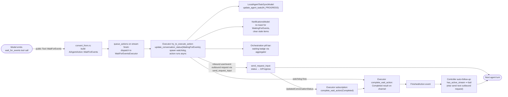
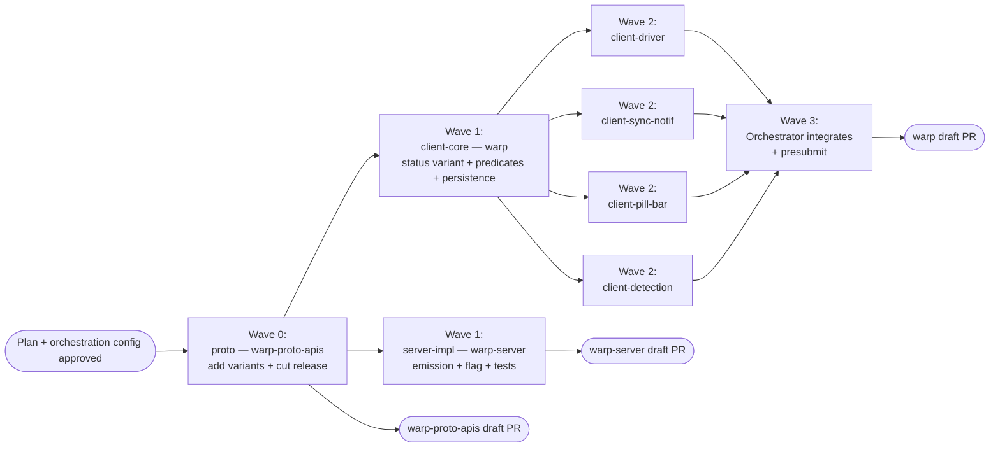

# Client Awareness of `wait_for_events` Yields — Tech Spec
## Context
See `specs/QUALITY-780/PRODUCT.md` for user-visible behavior. This spec maps the product invariants onto the existing conversation status, driver lifecycle, task sync, notifications, and orchestration pill bar code paths in the Warp client, and identifies the server-side change needed so the client can actually observe a `wait_for_events` yield. The server-side spec lives at `warp-server/specs/QUALITY-780/TECH.md`.

### Today's behavior in the bug
The end-to-end path that produces the bug is:

1. The model calls the server-handled `wait_for_events` tool. `HandleWaitForEvents` in `warp-server/logic/ai/multi_agent/runtime/ambient_agents.go` returns a `ServerToolCallResult::WaitForEventsResult` and side-effects `MarkActiveExecutionYieldedForWaitForEvents` and `ExtendTaskIdleTimeout`.
2. The current model turn ends; the agent's response stream finishes successfully.
3. `Message::ToolCallResult` messages (including the legacy server-handled `WaitForEventsResult`) are applied to the local conversation in the `response_event::Type::ClientActions(...)` arm of `BlocklistAIController::handle_response_stream_event` at `app/src/ai/blocklist/controller.rs:2614-2631`, which calls `history_model.apply_client_actions(...)`. The conversation's `ConversationStatus::Success` transition itself fires later when the `BlocklistAIActionEvent` subscriber at `app/src/ai/blocklist/controller.rs:495-518` observes that no follow-up action is queued and marks the response stream completed successfully. (The `AfterStreamFinished` arm at `controller.rs:2680+` is post-stream cleanup; it does not apply `ClientActions`.)
4. `LocalAgentTaskSyncModel.handle_history_event` (`app/src/ai/blocklist/local_agent_task_sync_model.rs:119-151`) maps `Success` → `AgentTaskState::Succeeded` and fires `update_agent_task`.
5. The server's `ApplyClientUpdates` path calls `shouldPreserveInProgressOnClientSuccess` from the `AgentTaskStateSucceeded` arm at `warp-server/logic/ai/ambient_agents/dispatcher.go:2013` (the predicate itself lives at `dispatcher.go:2110-2146`). It sees the `wait_for_events` marker and clears `in_progress_since` rather than transitioning the task to `SUCCEEDED`. The server **task state** remains preserved.
6. But on the client, `AgentDriver`'s subscription to `BlocklistAIHistoryEvent::UpdatedConversationStatus` (`app/src/ai/agent_sdk/driver.rs:2600-2683`) sees `Success` and either calls `run_exit.end_run_now(...)` (no `idle_on_complete` configured) or schedules `run_exit.end_run_after(idle_timeout, ...)` (idle timeout configured). When that future resolves, the Oz CLI driver process exits via `ctx.terminate_app(...)`.
7. `AgentNotificationsModel.handle_history_event_for_mailbox` (`app/src/ai/agent_management/agent_management_model.rs:304-389`) fires `NotificationCategory::Complete` ("Task completed.") on the same `Success` transition.
8. `aggregated_orchestrator_status` (`app/src/ai/blocklist/orchestration_topology.rs:64-106`) returns `Success` when no node is `InProgress`/`Blocked`/`Error`/`Cancelled`, so the orchestration pill bar's orchestrator badge renders the green check via `render_avatar_with_status_overlay`.

The combined effect is the bug report: an Oz cloud agent worker exits seconds after yielding for events and fires a misleading "Task completed" toast. The orchestration pill bar badge is also wrong in the narrower case where an orchestrator yields with no active descendants (today's one-level orchestration means active children already drive the aggregator to `InProgress`; the badge fix matters for the no-descendants case and is forward-compatible with any future multi-level orchestration).

### Relevant files

#### Conversation status and persistence
- `app/src/ai/agent/conversation.rs:4067-4168` — `ConversationStatus` enum, `status_icon_and_color`, `render_icon`, `is_in_progress`, `is_blocked`, `is_cancelled`, `is_done`, `is_error`.
- `app/src/ai/agent/conversation.rs:777-814` — `status()`, `update_status_with_error_message`.
- `app/src/ai/agent/conversation.rs:195-323` — `AIConversation` struct definition with all durable fields including `parent_agent_id`, `agent_name`, `last_event_sequence`, `pinned`.
- `app/src/ai/agent/conversation.rs:3038-3128` — `write_updated_conversation_state` constructs `AgentConversationData` for SQLite persistence.
- `app/src/ai/agent/conversation.rs:700-720` — `derive_status_from_root_task` reconstructs status from last-exchange output on restore. Today, a successful exchange always derives `Success`. Note: this function takes only `root_task: &Option<&Task>` — it has no access to `AgentConversationData` and is called from the restore path at `conversation.rs:542`.
- `app/src/persistence/model/...` — `AgentConversationData` struct definition (the SQLite schema for restored conversations).

#### Driver / process lifecycle
- `app/src/ai/agent_sdk/driver.rs:147-202` — `IdleTimeoutSender` (the generation-based oneshot that drives Oz CLI exit timing).
- `app/src/ai/agent_sdk/driver.rs:720-812` — `AgentDriver::run`; tx/rx oneshot that signals the CLI to terminate the process. The async block that wraps `run_internal` (defined separately at `driver.rs:1594+`) is spawned here.
- `app/src/ai/agent_sdk/driver.rs:1879-1914` — `HarnessKind::Oz` branch awaits `status_rx` from `execute_run()`; on resolution sleeps 1s then returns the conversation status.
- `app/src/ai/agent_sdk/driver.rs:2429-2709` — `execute_run`, which subscribes to `BlocklistAIHistoryEvent::UpdatedConversationStatus` and maps `Success | Blocked | Cancelled` to either immediate or idle-on-complete-delayed run exit.
- `app/src/ai/agent_sdk/driver.rs:2861-2949` — `subscribe_to_cli_agent_session_events`; the same `Success | Blocked` → exit mapping for third-party harnesses.
- `app/src/ai/agent_sdk/mod.rs:1415` — `ctx.terminate_app(TerminationMode::ForceTerminate, None)` when `driver.run` returns `Ok(())`.

#### Task sync model
- `app/src/ai/blocklist/local_agent_task_sync_model.rs:119-151` — `handle_history_event` reacts to `UpdatedConversationStatus`.
- `app/src/ai/blocklist/local_agent_task_sync_model.rs:314-355` — `map_conversation_status` maps `ConversationStatus` to `AgentTaskState`.

#### Notifications
- `app/src/ai/agent_management/agent_management_model.rs:209-302` — `handle_history_event` and `handle_history_event_for_mailbox`.
- `app/src/ai/agent_management/agent_management_model.rs:304-389` — Per-status notification branches.
- `app/src/ai/agent_management/agent_management_model.rs:471-482` — `ConversationStatus::should_trigger_notification`.

#### Orchestration pill bar and topology
- `app/src/ai/blocklist/orchestration_topology.rs:64-106` — `aggregated_orchestrator_status` with precedence `InProgress > Blocked > Error > Cancelled > Success` (precedence to be updated).
- `app/src/ai/blocklist/agent_view/orchestration_pill_bar.rs:119-151` — `pill_status_sort_key`, `pill_secondary_sort_key`, `DONE_STATUS_KEY`.
- `app/src/ai/blocklist/agent_view/orchestration_pill_bar.rs:631-705` — `pill_specs` constructs pill data; orchestrator gets aggregated status, children use their own status.
- `app/src/ai/blocklist/agent_view/orchestration_pill_bar.rs:1390-1397` — Hover card uses aggregated status for orchestrators.
- `app/src/ai/blocklist/agent_view/orchestration_pill_bar.rs:2112-2156` — `render_avatar_with_status_overlay`.

#### Server tool-call result handling
- `app/src/ai/blocklist/controller.rs:2614-2631` — the `response_event::Type::ClientActions(actions)` arm of `BlocklistAIController::handle_response_stream_event`. This is where `AddMessagesToTask` actions (which carry the tool-call-result messages, including any new `WaitForEvents` tool-call result) are dispatched into the conversation via `history_model.apply_client_actions(...)`.
- `app/src/ai/blocklist/controller.rs:495-518` — `BlocklistAIActionEvent` subscriber that drives the conversation's `Success` transition after no follow-up action is queued. Not the same code path as `AfterStreamFinished`.
- `app/src/ai/blocklist/controller.rs:2680+` — `ResponseStreamEvent::AfterStreamFinished` handler; post-stream cleanup. Does **not** apply `ClientActions`.
- `app/src/ai/blocklist/history_model.rs:1484` — `apply_client_actions` (the function that adds `AddMessagesToTask` actions to a conversation; the natural hook point for the new `WaitForEvents` tool-call detection).
- Search for `WaitForEventsResult` in the client today: no hits. The legacy server tool-call result is opaque to clients (carried in the `Message::ToolCallResult::ServerResult { serialized_result: <opaque string> }` variant per `warp-proto-apis/apis/multi_agent/v1/task.proto:939-941`).

## Design options
Three were considered. We are recommending Option B (first-class variant) because the existing exhaustive-matching conventions make it the safest change to land cleanly; the others are documented for context.

### Option A — Marker on `AIConversation`, status stays `Success`
Add a boolean `waiting_for_events: bool` on `AIConversation` (and persist it on `AgentConversationData`). Conversation status still flips to `Success` on stream finish, but every status-consuming surface that cares (`LocalAgentTaskSyncModel`, `AgentDriver`, notifications, pill bar aggregator) reads the marker alongside the status.

- Pros: smallest blast radius; no enum-variant churn; `match conversation.status()` sites that don't care about waiting keep working unchanged.
- Cons: invisible to exhaustive matching, which is how the original bug propagated in the first place. Any new consumer of `ConversationStatus::Success` will silently treat a waiting conversation as done. The "is this a real success?" check has to be repeated at every site that needs it; we cannot rely on the compiler to enumerate them.
- Verdict: rejected. The whole reason the bug exists is that `Success` is overloaded.

### Option B — First-class `ConversationStatus::WaitingForEvents` variant (recommended)
Add a new variant alongside `InProgress`, `Success`, `Blocked`, `Error`, `Cancelled`.

- Pros: exhaustive matching enumerates every site that needs to make a deliberate decision. Existing `match conversation.status()` arms (icon, color, telemetry, sort key, mailbox) fail to compile until they decide what to do, which is the exact failure mode we want the compiler to catch. Models the state accurately: quiescent but not terminal, like `Blocked`.
- Cons: touches more files (every `match conversation.status()`).
- Verdict: chosen.

### Option C — Reuse `ConversationStatus::InProgress`
Have the conversation stay `InProgress` while yielded.

- Pros: trivially keeps the driver alive (the existing `is_in_progress()` branch already cancels idle timers) and naturally satisfies orchestration aggregation precedence.
- Cons: `InProgress` carries an implicit "actively streaming" meaning throughout the codebase — block status bar shows a spinner, the Stop button is enabled, the input is disabled in some flows, "thinking" UI animates. A yielded run is none of those things. Every UI site that keys off `InProgress` would either misfire or need a new way to ask "is the agent really doing anything?"
- Verdict: rejected. The overload is even worse than Option A.

## Proposed changes

### 1. `ConversationStatus::WaitingForEvents` variant
In `app/src/ai/agent/conversation.rs:4067-4168`:

```rust path=null start=null
pub enum ConversationStatus {
    InProgress,
    Success,
    Error,
    Cancelled,
    Blocked { blocked_action: String },
    // New:
    WaitingForEvents,
}
```

Update `Display`, `render_icon`, and `status_icon_and_color` exhaustively. The new badge needs a color and icon distinct from every existing status. Explicit collisions to avoid:
- `Success` uses `theme.ansi_fg_green()` and `Icon::Check` (`conversation.rs:4121-4127`).
- `InProgress` uses `theme.ansi_fg_magenta()` and `Icon::ClockLoader` (`conversation.rs:4114-4120`).
- `Blocked` uses `theme.ansi_fg_yellow()` and `Icon::StopFilled` (`conversation.rs:4136-4142`).

Recommended palette: `theme.ansi_fg_blue()` with a "listening" or "hourglass" icon. Final choice deferred to design with a `TODO(design)` placeholder; this spec only requires that the visual be unambiguous against the three quiescent-non-terminal-adjacent siblings above.

### 2. `ConversationStatus::is_done()` is unchanged
`is_done()` keeps its existing semantics — `Success | Error | Cancelled` — so it already returns `false` for `WaitingForEvents`. No predicate split is needed; the existing five `is_done()` call sites (search row, conversation-list sections, `/cost`, fork data source) all want "the run is finished and cannot resume", which is exactly what `is_done()` already conveys. `should_trigger_notification` adds `WaitingForEvents => false`.

### 3. Persistence and restore
The `WaitingForEvents` status is **not** durable. The agent execution that the wait keeps alive is in-process state by definition; an app shutdown ends the wait the same way it ends every other running tool call.

Concretely:
- `AgentConversationData` carries no `waiting_for_events` field. There is nothing new to write in `write_updated_conversation_state`.
- `derive_status_from_root_task` is the sole authority on restore status. A conversation that was yielded at shutdown restores as `Success` because the yielding response stream finished cleanly.
- The unresolved `wait_for_events` tool-call message stays in the persisted transcript as an orphan. The next outbound request from the user re-engaging the conversation reaches the server with no result for that tool call, and the server's existing pending-tool-call supersede mechanism synthesizes the matching `Cancel`. From the agent's perspective the yield is just another inbound supersede.
- The `LocalAgentTaskSyncModel` flips back to reporting `Succeeded` on restore. The server's `shouldPreserveInProgressOnClientSuccess` gate (server TECH §1.1) handles this safely: the marker is still on the server's task row, so the dispatcher keeps the task `IN_PROGRESS` for the rollout window during which the gate exists.

Alternative considered (and rejected): persist `waiting_for_events: bool` on `AgentConversationData` and override `derive_status_from_root_task` on restore. Rejected because it added durable state for an in-process concept and introduced a stale-state risk (an offline client missing a resume signal could come back showing a multi-day "waiting" badge for a long-since-reaped server task). The honest model — "the wait ends when the app dies" — has a smaller surface area and degrades gracefully.

### 4. Wait-for-events action and executor
`wait_for_events` is modeled as a first-class `action_model` action so the watchdog, the conversation status transition, and the follow-up request all flow through the executor's lifecycle. This avoids a thicket of guards that would otherwise be needed to keep `WaitingForEvents` from being clobbered by code paths that treat "the response stream finished" as "the conversation succeeded".
#### 4.1 Action variant and result
Add `AIAgentActionType::WaitForEvents { tool_call_id: String, idle_timeout_seconds: i32 }` in the shared `ai` crate and a matching `AIAgentActionResultType::WaitForEvents(WaitForEventsResult)` result variant. `WaitForEventsResult` is an enum with two cases:
- `Completed` — watchdog timed out, or an inbound resume signal cleared the wait. Wire form is the empty proto `WaitForEventsResult{}` carried on `Request::Input::ToolCallResult.result`.
- `Cancelled` — user cancelled the wait. Wire conversion drops it (`Err(ConvertToAPITypeError::Ignore)`) so no result is sent for the unresolved tool call; the server's existing supersede mechanism synthesizes the matching `Cancel` instead, mirroring how `RunAgents::Cancelled` is handled.
`AIAgentActionResultType::WaitForEvents(Completed)` returns `true` from `is_successful()` so the controller's auto-follow-up triggers a follow-up request on completion. `Cancelled` returns `true` from `is_cancelled()` so the controller transitions the conversation to `Cancelled` per the standard cancellation path.
#### 4.2 Inbound conversion
`app/src/ai/agent/api/convert_from.rs`'s `Tool::WaitForEvents` arm produces an `AIAgentAction { action: WaitForEvents { tool_call_id, idle_timeout_seconds } }`. Because this is a real action, the exchange's `output.actions()` contains it, which means `AIConversation::mark_request_completed` sees `has_new_actions = true` and does not transition the conversation to `Success` on the yield stream. No explicit `Success`-guard is needed in `mark_request_completed`.
#### 4.3 Executor
`app/src/ai/blocklist/action_model/execute/wait_for_events.rs` implements `WaitForEventsExecutor`. Responsibilities:
- `try_to_execute_action` bumps a per-conversation generation counter, stores a `PendingWait { tool_call_id, sender, watchdog_handle }`, transitions the conversation to `ConversationStatus::WaitingForEvents` via a direct `BlocklistAIHistoryModel::update_conversation_status(WaitingForEvents)` call, spawns the watchdog future and stores its `SpawnedFutureHandle` on the pending entry, and returns `TryExecuteResult::ExecutedAsync`. The action sits in `running_actions` for the entire wait. The `tool_call_id` is held in the executor's `pending` map, not on the conversation — the only owner of the in-flight wait's identity is the executor.
- The `start_pending_action_by_id` action-model plumbing is updated to skip the default `update_conversation_in_progress_status` call for `WaitForEvents` so the executor's `WaitingForEvents` transition is not immediately clobbered with `InProgress`.
- `cancel_execution(tool_call_id)` is invoked from the executor dispatch's cancel path. It drops the pending entry, aborts the watchdog `SpawnedFutureHandle`, bumps the generation counter, and drops the channel sender. The caller (`BlocklistAIActionExecutor::cancel_running_async_action`) has already removed the action from `async_executing_actions`, so the spawn callback that wraps the channel receiver silently discards the result — no `FinishedAction` is emitted, no tool-call result reaches the wire.
- The watchdog firing path (`fire_watchdog_if_current`) is the only path that emits a `WaitForEventsResult::Completed`. It defensively re-checks that the conversation is still in `WaitingForEvents` before firing, so a watchdog that survives an out-of-band status transition does not inject a stale result.
#### 4.4 Watchdog timing and the client-side safety margin
The watchdog timeout is computed by `watchdog_timeout_for_stamped_seconds(idle_timeout_seconds)`:
- If `idle_timeout_seconds <= 0` (prost's "unset" sentinel), fall back to `DEFAULT_ORCHESTRATED_IDLE_TIMEOUT_SECONDS = 30 min`.
- Subtract `CLIENT_WATCHDOG_SAFETY_MARGIN = 30 s` to reserve a recovery window before the worker-side idle-shutdown fires (see server TECH §1.1).
- Floor the result at `HARD_FLOOR = 5 s` so small testing values still let the watchdog fire on a sane schedule.
The margin contract is the time budget for the recovery cycle: client watchdog fires → `complete_wait_action` → `FinishedAction` → controller auto-follow-up → outbound request with `WaitForEventsResult` → server `BeginTaskProgress` → next agent turn starts producing activity, which resets the worker idle counter. The corresponding server-side margin (subtract from the stamped value in `RecordWaitForEventsYield`) is tracked as a follow-up.
#### 4.5 CLI driver lifecycle
`app/src/ai/agent_sdk/driver.rs`'s `execute_run` keeps its `UpdatedConversationStatus` subscriber's two early-return arms intact: the `is_in_progress()` arm still cancels the idle timer when the run resumes, and a `WaitingForEvents` arm returns without resolving `run_exit` (the driver keeps the process alive). The driver does **not** own a separate watchdog; the executor's watchdog and follow-up flow drive recovery regardless of whether the conversation is hosted under an `AgentDriver` or in the GUI's local-local pane.
`subscribe_to_cli_agent_session_events` is unaffected because third-party harnesses don't emit `wait_for_events`; exhaustive match against `CLIAgentSessionStatus` confirms this.

### 5. Task sync model
Update `map_conversation_status` in `app/src/ai/blocklist/local_agent_task_sync_model.rs:314-355`:

```rust path=null start=null
ConversationStatus::WaitingForEvents => (AgentTaskState::InProgress, None),
```

This means the client actively reports `IN_PROGRESS` for yielded runs rather than relying on `shouldPreserveInProgressOnClientSuccess` server-side. The server backstop stays in place for older clients and edge cases (see server TECH §"Server-side gates remain as a backstop").

### 6. Notifications
Two changes in `app/src/ai/agent_management/agent_management_model.rs`, both targeted at the `WaitingForEvents` yield case. The orchestrator-aware suppression that an earlier draft considered (consulting `aggregated_orchestrator_status` on the orchestrator's own `Success`) is **out of scope** per PRODUCT.md (20): if the orchestrator itself reaches a terminal status, that's its own assessment and the notification fires as today. The known orchestrator notification spam is the case where the orchestrator yielded via `wait_for_events` between turns, which the `WaitingForEvents` status (and the suppression below) covers directly.

- `ConversationStatus::should_trigger_notification` (line 471): add `WaitingForEvents => false`. (Note: the function uses `matches!` today, which means a new variant returns `false` by default. Rewrite the function as an exhaustive `match` so future variants force a deliberate decision.)
- `handle_history_event_for_mailbox` (line 304): add an explicit `WaitingForEvents` arm that mirrors the `InProgress` arm at line 330 — it clears any stale notification for this origin via `remove_notification_by_source`.

### 7. Orchestration pill bar and aggregation
`app/src/ai/blocklist/orchestration_topology.rs`:
- `aggregated_orchestrator_status` precedence: `InProgress > Blocked > WaitingForEvents > Error > Cancelled > Success`, with one carve-out: when the orchestrator itself yielded into `WaitingForEvents`, its own waiting state outranks any descendant `InProgress`. This keeps the orchestrator pill honest about "THIS conversation is paused" even while child agents continue working. A descendant in `Blocked` still beats the parent's `WaitingForEvents` because Blocked needs user attention.
- Implementation: scan the tree for `any_in_progress`, `first_blocked`, `any_waiting`, `any_error`, `any_cancelled` as before. When `any_in_progress` is set, check whether the orchestrator's own status is `WaitingForEvents` and return `WaitingForEvents` in that case; otherwise return `InProgress`. The remaining precedence steps are unchanged.
- Update the doc-comment precedence list to match.

`app/src/ai/blocklist/agent_view/orchestration_pill_bar.rs:119-151`:
- `pill_status_sort_key`: give `WaitingForEvents` its own slot in the "active-ish" half of the bar; do not lump it into `DONE_STATUS_KEY`. Recommended order: `Blocked = 0`, `Error = 1`, `InProgress = 2`, `WaitingForEvents = 2` (same bucket as `InProgress`, sorts left of the done section), `Cancelled | Success = DONE_STATUS_KEY (3)`.
- Update the existing comment at lines 119-124 ("Cancelled and Success share one 'done' bucket") to also mention that `WaitingForEvents` shares the `InProgress` bucket. Future readers should not have to re-derive this.
- `render_avatar_with_status_overlay` (lines 2112-2156) and the hover card (lines 1390-1397) pick up the new badge automatically because they consume `ConversationStatus::status_icon_and_color`.

### 8. Wiring `wait_for_events` and resume signals through the action model
This section covers how the client discovers a yield and how a resume reaches the executor. The server-side spec adds a first-class `WaitForEvents` variant to the public proto's `Message::ToolCall::tool` oneof and an accompanying `WaitForEventsResult` variant to `Message::ToolCallResult::result`. The client pattern-matches the public variant directly; no payload-sniffing of the opaque `Message::ToolCall::Server` is needed (and would not work, since that payload is opaque per `task.proto:405-407`).
#### 8.1 Yield path: inbound `Tool::WaitForEvents` becomes an action
The yield arrives as a `Tool::WaitForEvents` tool-call message inside the response stream. `convert_from.rs` (§4.2) translates it into an `AIAgentAction::WaitForEvents` that lands in the exchange's `output.actions()`. When the response stream finishes, `BlocklistAIController::handle_response_stream_event` collects new actions from finished exchanges and forwards them to `BlocklistAIActionModel::queue_actions`, which dispatches the `WaitForEvents` action through the executor described in §4.3. The executor's `try_to_execute_action` is the single place that transitions the conversation to `WaitingForEvents` and arms the watchdog — there is no separate detection-point helper on `BlocklistAIHistoryModel`.
#### 8.2 Resume path: silent dismissal via the standard cancellation path
Two inbound signals can close the unresolved `WaitForEvents` tool call and resume the agent:
1. **Generic `Cancel` tool-call result (inbound supersede).** When new user input, an inbound message, or an inbound lifecycle event arrives on the waiting task, the server's pending-tool-call supersede mechanism appends a generic `Cancel` tool-call-result referencing the unresolved `WaitForEvents` id (server TECH §1.1).
2. **`WaitForEventsResult` tool-call result (echoed timeout).** The client's own watchdog emitted this result on a follow-up request and the server echoed it back through the next stream.
In both cases, the inbound message is just transcript data — `apply_client_actions` appends it to the conversation transcript with no special handling. The client-side teardown of the running wait is driven by the **outbound** side, before the server is asked to do anything.
For the **orchestration-event case**, `BlocklistAIController::inject_pending_events_for_request` calls `BlocklistAIActionModel::cancel_wait_for_events_for_conversation(conversation_id)` immediately before `send_request_input`. The cancel goes through the standard `cancel_running_async_action` path: the action is removed from `async_executing_actions`, `WaitForEventsExecutor::cancel_execution` aborts the watchdog handle and drops the channel sender, and the spawn callback's `async_executing_actions.remove` returns `None` so the result is silently discarded. **No `FinishedAction` is emitted and no `WaitForEventsResult` is sent.** The server's `collectCancelledResultsForIncompleteToolCalls` synthesizes the matching `Cancel` for the unresolved tool call so the message log stays consistent. Subsequent paths that cancel pending actions (e.g. `cancel_conversation_progress`, `send_query`) reuse the same machinery and behave identically.
For the **user-typed-query case** the existing `send_query` path already calls `cancel_all_pending_actions` before sending; the wait is cancelled by the same silent-dismissal path described above.
For the **watchdog-timeout case**, no outbound request precedes the firing. `fire_watchdog_if_current` produces a `Completed` result through the channel; the action_model emits `FinishedAction(Completed)`, the controller's auto-follow-up subscriber sends a follow-up request carrying the empty `WaitForEventsResult{}`, and the server's next stream echoes the result back as transcript data.
#### 8.3 Persistence and restart behavior
Nothing about the wait is persisted (§3). On restart, a previously-yielded conversation restores as `Success` per `derive_status_from_root_task`; the unresolved `Tool::WaitForEvents` tool call stays in the transcript as an orphan. When the user re-engages, the next outbound request omits a result for it and the server's existing supersede mechanism synthesizes the matching `Cancel`. There is no in-memory wait to clear and no transcript-scan fallback — the executor's `pending` map is the canonical source of truth, and after restart it is empty.
#### 8.4 Inbound orchestration events while waiting
When an orchestration event for a waiting conversation reaches `OrchestrationEventService::EventsReady`, `BlocklistAIController::handle_pending_events_ready` drains the queued events and sends them as the next outbound request via `inject_pending_events_for_request` → `send_request_input`. The readiness check `conversation_ready_for_pending_events` treats `WaitingForEvents` the same as `Success` so events can be injected while the wait is in flight. The outbound request's `send_request_input` flips status to `InProgress`, which completes the wait per §8.2; the request contains the new event inputs but no `WaitForEvents` tool-call result, so the server synthesizes a `Cancel` on the next response stream as transcript data.
#### 8.5 Why there is no `detect`/`clear` helper for the resume signal
An earlier version of this design routed the resume through `BlocklistAIHistoryModel::detect_wait_for_events_transitions` + `clear_conversation_waiting_for_events_if_matches` inside `apply_client_actions`. The detect/clear pair scanned inbound `ToolCallResult` messages for `WaitForEvents` / `Cancel` variants and flipped status to `InProgress` directly. Both helpers, the `waiting_for_events_tool_call_id` field on `AIConversation`, the `mark_conversation_waiting_for_events` setter, and the transcript-scan fallback `find_unresolved_wait_for_events_tool_call_id` have been removed: every reachable production resume path is preceded by an outbound `send_request_input` that already flips status, so the detect/clear was a no-op in every observable flow (the `if !matches!(status, WaitingForEvents) { return; }` early return at `clear_conversation_waiting_for_events_if_matches` fired before the detect/clear could do any work). Removing the machinery aligns the implementation with the natural request/response lifecycle: status transitions are driven by outbound requests and action lifecycle, not by inbound message-shape inspection.
**Known limitation, intentionally undocumented as a server contract.** If a future code path arranges for an inbound resume signal to arrive **without** any preceding outbound request that flips status (e.g. a server push synthesized without the client driving it, or a viewer flow that mirrors a sharer's status differently from how viewers currently work — see the shared-session viewer note below), the executor's `UpdatedConversationStatus` subscription would not fire and the wait would only complete via the watchdog timeout. The fix in that case would be to re-introduce a targeted detect/clear at the new entry point or to ensure the new entry point flips status explicitly. Shared-session viewers are not affected today: `try_to_execute_action` short-circuits with `NotExecuted::WaitingOnSharer` (`action_model/execute.rs:557-563`), so a viewer never has a pending wait to complete.

### 9. Coordinated rollout and backwards compatibility
No client-side feature flag is required. The signal that activates the client-side fix is the presence of the new public `Message::ToolCall::WaitForEvents` variant in a received message. Because the legacy `Message::ToolCall::Server` payload is opaque to clients (`task.proto:405-407`), there is no way for the client to detect a legacy `wait_for_events` call, and no sniff fallback exists.

Rollout sequencing (mirrors server TECH §"Backwards compatibility and coordinated rollout"):

1. **`warp-proto-apis` release.** The proto additions ship first as a no-op (no producer or consumer yet). Wire-compatible: older deserializers ignore the new variants.
2. **`warp` rev bump.** Cargo.toml in `warp` is bumped to the new release. The client adds the `WaitForEvents` detection and the `WaitingForEvents` flow. Without a server emitting the variant, the new code stays dormant.
3. **`warp-server` rev bump + flag-on rollout.** The server side ships the new emission path behind a feature flag. Flipping the flag for a tenant/workspace activates the client-side fix for that scope.
4. **Steady state.** Both repos ship the new path; the server-side flag is at 100%. The legacy server-handled `wait_for_events` path stays compiled for one release window and is then removed (server TECH §"Cleanup").

#### Behavior during the rollout window
- **Client old, server old.** Legacy bug: `Success` is reported, the CLI driver exits, the server's `shouldPreserveInProgressOnClientSuccess` keeps the task `IN_PROGRESS`. Unchanged from today.
- **Client old, server new.** Client sees the new `WaitForEvents` variant as an unknown field (proto's forward-compatibility) and ignores it. The conversation still goes to `Success` locally; same as the legacy bug. The server-side gates protect the task.
- **Client new, server old.** Server is still emitting via `Message::ToolCall::Server { payload: <opaque> }`. The client sees only the opaque variant and treats the conversation as `Success` (same as today). The server-side gates protect the task.
- **Client new, server new.** Full fix: `WaitForEvents` variant emitted by server, pattern-matched by client, conversation transitions to `WaitingForEvents`, driver stays alive, no toast, correct pill-bar badge.

#### Mixed-mode within a single conversation
The server-side feature flag is evaluated per `wait_for_events` call, so one conversation can contain both legacy and new yields. The client handles this gracefully: legacy yields produce opaque server tool-call messages that the client ignores; new yields activate the `WaitingForEvents` path. There is no client-side state that needs to track which mode a conversation is in.

## End-to-end flow
After the changes, a `wait_for_events` cycle looks like:

1. Model calls `wait_for_events`.
2. Server emits `Message::ToolCall { tool: WaitForEvents }` in the public proto, fires `recordWaitForEventsYield` to extend `VMIdleTimeoutMinutes`, and finishes the response stream without emitting a tool-call result.
3. Client receives the stream. `convert_from.rs` turns the `Tool::WaitForEvents` message into an `AIAgentAction::WaitForEvents { tool_call_id, idle_timeout_seconds }` in the exchange's `output.actions()` (§8.1). Because `has_new_actions = true`, `mark_request_completed` does not transition the conversation to `Success`.
4. When the response stream finishes, `BlocklistAIController` collects the new actions and calls `BlocklistAIActionModel::queue_actions`. The wait action is dispatched to `WaitForEventsExecutor::try_to_execute_action`.
5. The executor (§4.3) bumps its per-conversation generation counter, stores a `PendingWait { tool_call_id, sender }`, transitions the conversation to `WaitingForEvents` via `BlocklistAIHistoryModel::update_conversation_status(WaitingForEvents)`, spawns the watchdog with `watchdog_timeout_for_stamped_seconds`, and returns `ExecutedAsync`. The action sits in `running_actions`.
6. `LocalAgentTaskSyncModel` maps `WaitingForEvents` → `AgentTaskState::InProgress` and fires `update_agent_task`.
7. `AgentNotificationsModel` does not fire a toast for the `WaitingForEvents` transition (§6). The orchestrator's own `Success`/`Cancelled`/`Error` notifications continue to fire as today.
8. The orchestration pill bar's orchestrator badge renders the waiting state via the updated aggregator precedence (§7).
9. **Resume by inbound supersede.** Inbound user input, an inbound message, or an inbound lifecycle event arrives. The resume is driven by an outbound request from the client (the user's message submission, an `inject_pending_events_for_request` drain triggered by `EventsReady`, etc.). That code path calls `cancel_wait_for_events_for_conversation` before `send_request_input`; the wait is silently dismissed through the standard `cancel_running_async_action` machinery, no `FinishedAction` fires, and no tool-call result is sent on the wire. The server-synthesized `Cancel` arrives in the response stream that follows and is appended to the transcript as ordinary message data by `apply_client_action(AddMessagesToTask)`.
10. **Resume by watchdog timeout.** If no inbound input arrives before the watchdog fires, the executor's timer callback verifies the generation counter still matches and that the conversation is still in `WaitingForEvents`, then sends `Completed` on the channel. The action_model emits `FinishedAction`; the auto-follow-up subscriber sends a follow-up request whose input includes the empty `WaitForEventsResult` produced by the action's result conversion. The server echoes the result through the next stream; the agent's next turn observes the empty timeout result and decides how to proceed (commonly `finish_task`, but the agent may also re-yield, ask the user, or take other action). The run is **not** auto-cancelled on timeout; the agent owns the decision.

## Diagram


## Testing and validation
Map each `PRODUCT.md` invariant to a concrete test or manual verification. Numbers in parentheses reference `specs/QUALITY-780/PRODUCT.md`.

### Unit tests
- `conversation_tests.rs` — `ConversationStatus::is_done()` returns true exactly for `Success | Error | Cancelled` and `false` for `WaitingForEvents`. Covers (3), (4), (28).
- `conversation_tests.rs` — `should_trigger_notification` returns `false` for `WaitingForEvents` and `InProgress`, true for `Success | Blocked | Error`. Covers (16), (19).
- `conversation_tests.rs` — Restore: a conversation that was yielded via `wait_for_events` at shutdown restores as `Success` (not `WaitingForEvents`), the orphan tool call stays in the transcript, and no waiting state is rebuilt. Covers (10).
- `conversation_tests.rs` — Transition matrix: assert the only legal transitions into `WaitingForEvents` are from `InProgress`; transitions out of `WaitingForEvents` are to `InProgress`, `Cancelled`, `Error`, or `Success`; a direct `WaitingForEvents` → `WaitingForEvents` is not reachable (must re-enter `InProgress` first). Covers PRODUCT.md (9).
- `conversation_tests.rs` — Cancellation from `WaitingForEvents`: invoking the existing cancel path on a `WaitingForEvents` conversation transitions to `Cancelled` immediately and emits a status update. Covers PRODUCT.md (14).
- `local_agent_task_sync_model_tests.rs` — `map_conversation_status(WaitingForEvents)` returns `(AgentTaskState::InProgress, None)`. Covers (15).
- `agent_management_model_tests.rs` — `handle_history_event_for_mailbox` for `WaitingForEvents` does not call `add_notification` and removes any existing notification for the origin. Covers (16), (17).
- `agent_management_model_tests.rs` — No notification fires on the `WaitingForEvents` → `InProgress` resume transition. Covers PRODUCT.md (18).
- `agent_management_model_tests.rs` — Orchestrator's own terminal status fires the existing notification: an orchestrator with non-terminal descendants reaching `Success` (or `Cancelled` / `Error`) still produces the `Complete` (or matching) toast — the mailbox does not inspect descendant state. Covers PRODUCT.md (20).
- `orchestration_topology_tests.rs` — `aggregated_orchestrator_status` precedence including the parent-waits carve-out: orchestrator `WaitingForEvents` + all children `Success` → `WaitingForEvents`; orchestrator `WaitingForEvents` + one child `InProgress` → `WaitingForEvents` (carve-out); orchestrator `InProgress` + one child `InProgress` → `InProgress`; orchestrator `WaitingForEvents` + one child `Blocked` → `Blocked`; orchestrator `WaitingForEvents` + one child `Error` → `WaitingForEvents`. Covers (22).
- `orchestration_pill_bar_tests.rs` — `pill_status_sort_key(WaitingForEvents)` returns a value strictly less than `DONE_STATUS_KEY`. Covers (24).
- `wait_for_events_tests.rs` — `watchdog_timeout_for_stamped_seconds` math: stamped 0 → default minus margin; stamped 60 → 30 s; stamped 10 → `HARD_FLOOR`; stamped negative → default minus margin. Plus named-constant checks for `DEFAULT_ORCHESTRATED_IDLE_TIMEOUT_SECONDS`, `CLIENT_WATCHDOG_SAFETY_MARGIN`, and `HARD_FLOOR`. Covers (11), (12).
- `input_tests.rs` or `agent_message_bar_tests.rs` — With the conversation in `WaitingForEvents`, the input is enabled and submitting a follow-up clears the waiting state and transitions to `InProgress`. Covers PRODUCT.md (26).
- `history_model_tests.rs` — Starting a new conversation in a terminal view that previously held a `WaitingForEvents` conversation does not inherit the wait state. Covers PRODUCT.md (31).

### Integration tests
- Add an integration test in `crates/integration/` that drives an Oz CLI agent with `--idle-on-complete=5s` against a fake server emitting the new public `WaitForEvents` variant; assert the process does not exit within 30 seconds. Covers PRODUCT.md (11).
- Timeout-path integration test: drive an Oz CLI agent against a fake server, let the client watchdog fire, assert the client emits `Message::ToolCallResult { result: WaitForEvents(WaitForEventsResult{}) }` against the unresolved `WaitForEvents` tool-call id and the run does **not** transition to `Cancelled`. The fake server echoes the result back; assert the conversation transitions to `InProgress` and the simulated agent's next turn fires. Covers PRODUCT.md (12), (29).
- Coordinated-rollout matrix: a flag-off fake server emits the legacy server tool call; the client treats the conversation as `Success` (legacy bug) and the server's `shouldPreserveInProgressOnClientSuccess` keeps the task `IN_PROGRESS`. A flag-on fake server emits the new variant; the client transitions to `WaitingForEvents`. Covers PRODUCT.md (32), (33).
- Extend `agent_conversations_model_tests.rs` to assert that a conversation entering `WaitingForEvents` does not propagate `Success` semantics to consumers that check `is_done()`. Covers (28).

### Manual validation
- Run a local Oz orchestrator that spawns one child agent and yields via `wait_for_events`. Verify:
  1. The orchestration pill bar's orchestrator badge shows the "waiting" icon/color (not green check). (21), (22)
  2. No "Task completed" toast appears. (16), (20)
  3. The CLI worker process stays alive until the child message arrives. (11)
  4. After the inbound message resumes the agent, the badge transitions back to active and the conversation eventually completes. (8), (30)
- Repeat with the orchestrator in the foreground and minimized to confirm notification behavior matches.
- Restart Warp while a conversation is `WaitingForEvents`. Confirm the conversation restores as `Success` (the yield does not survive restart, per §3), the orphan `wait_for_events` tool call is visible in the transcript, and re-engaging the conversation cleanly synthesizes the supersede. (10)
- Submit a follow-up while in `WaitingForEvents`. Confirm the input accepts the message, the conversation transitions to `InProgress`, and no notification fires for the transition. (26), (18)

### Regression coverage
- Audit every `match conversation.status()` site for an explicit `WaitingForEvents` arm. The exhaustive-matching rule from `WARP.md` should already enforce this; the test suite confirms.
- `cargo clippy --workspace --all-targets --all-features --tests -- -D warnings` and `./script/presubmit` pass.

## Orchestration
This section is the canonical cross-spec orchestration plan for QUALITY-780. The same text appears in both `warp/specs/QUALITY-780/TECH.md` and `warp-server/specs/QUALITY-780/TECH.md` so each spec is self-contained for the agent implementing it.

### Decision
Implementation is fanned out across multiple AI agents working in parallel git worktrees. The work spans three repositories (`warp-proto-apis`, `warp-server`, `warp`), and the proto change is a hard prerequisite for everything else because both the server and client implementations consume the new generated bindings. After the proto release, the server-side and client-side core work can run in parallel; once the client core lands, the remaining client work fans out further. AI agents complete each subtask in minutes, not days — the bottleneck is wave ordering, not per-agent effort.

### Worktree layout
Per the `~/src/QUALITY-780/` task-directory convention:
- `~/src/QUALITY-780/warp-proto-apis` — proto agent.
- `~/src/QUALITY-780/warp-server` — server-impl agent.
- `~/src/QUALITY-780/warp` — client-core agent and final integrator.
- `~/src/QUALITY-780/warp-driver`, `~/src/QUALITY-780/warp-sync-notif`, `~/src/QUALITY-780/warp-pill-bar`, `~/src/QUALITY-780/warp-detection` — additional `warp` worktrees for the four Wave 2 client fan-out agents.

All branches use the `matthew/` prefix.

### Dependencies and ordering (three waves)
- **Wave 0 — Proto release (single agent, sequential).** `proto` adds the new variants to `warp-proto-apis/apis/multi_agent/v1/task.proto` and publishes a release tag. All downstream waves block on this completing.
- **Wave 1 — Core scaffold + server (two agents in parallel, after Wave 0).** `server-impl` and `client-core` run concurrently because they live in different repositories and share no compilation dependency. The client core is sized to be the minimum scaffold that downstream client agents need to compile against (status variant, exhaustive match arms in shared files, predicate split, persistence, restore-site).
- **Wave 2 — Client fan-out (four agents in parallel, after Wave 1's client-core branch is pushed).** `client-driver`, `client-sync-notif`, `client-pill-bar`, `client-detection` branch from `client-core`'s branch and modify disjoint client subsystems. They do not touch the files client-core owns.
- **Wave 3 — Integration (orchestrator).** Orchestrator merges all four Wave 2 branches into the client-core branch, runs `cargo fmt` / `cargo clippy` / `./script/presubmit`, and opens a single draft PR for `warp`. `server-impl` independently opens a draft PR for `warp-server`. The proto release tag from Wave 0 is referenced from both implementation PR descriptions.

### Launch config
Run-wide settings (execution mode, model, harness) are documented in the orchestration config attached to this plan. Defaults:
- Execution mode: **local** for every agent. The agents touch code paths exercised by `./script/presubmit` and other local toolchains, and each works in a user-visible git worktree.
- Model: inherits from the orchestrator (not pinned in the config).
- Harness: default Oz.

Each wave launches as its own `run_agents` batch. Do not pre-launch downstream waves — wait for each wave's lifecycle events before fanning out the next.

### Child agents
- **proto — `warp-proto-apis` proto additions (Wave 0).**
  - Worktree: `~/src/QUALITY-780/warp-proto-apis`. Branch: `matthew/QUALITY-780-proto-additions`.
  - Owns: the proto additions in `apis/multi_agent/v1/task.proto` per server TECH §0.
  - Output: pushes branch, opens draft PR, publishes a release tag/version. Reports the released version string + git ref to the orchestrator.
- **server-impl — `warp-server` emission path + flag (Wave 1).**
  - Worktree: `~/src/QUALITY-780/warp-server`. Branch: `matthew/QUALITY-780-server`.
  - Owns: server TECH §0–§1 implementation: `WaitForEventsToolCall::ProduceActions`, `isWaitForEventsAction`, refactor of `HandleWaitForEvents` → `recordWaitForEventsYield`, finalizer hook in `RunPrimaryAgent`, gating of the `ExecuteServerHandledToolCall` arm, the new `WaitForEventsClientToolEnabled` feature flag, and the unit/integration tests in server TECH §"Testing and validation".
  - Validation: `go fmt ./...`, `go vet ./...`, `./script/presubmit` before opening the PR.
  - PR: draft, using `.github/pull_request_template.md`.
- **client-core — `warp` status variant + predicates + persistence (Wave 1).**
  - Worktree: `~/src/QUALITY-780/warp`. Branch: `matthew/QUALITY-780-client-core`.
  - Owns: §1 (`ConversationStatus::WaitingForEvents` variant + all match arms in `conversation.rs` `Display` / `render_icon` / `status_icon_and_color`); §2 (`is_done` stays as-is, with the new variant correctly returning `false`); §3 (persistence field on `AgentConversationData` + restore-site check in `new_restored` at `conversation.rs:542`). For files that Wave 2 agents own (driver, sync/notif, pill bar, detection), client-core leaves their match arms with conservative `WaitingForEvents` placeholders (e.g. treat like `InProgress` for the clear-stale notification path, like `Blocked` for the not-currently-streaming question) so the tree compiles and existing tests pass. Wave 2 agents replace the placeholders with their final implementations.
  - Validation: `cargo fmt`, `cargo clippy --workspace --all-targets --all-features --tests -- -D warnings`, `./script/presubmit`.
  - Hand-off: pushes the branch and reports the branch name so Wave 2 agents can rebase from a known-good commit.
- **client-driver — `warp` driver lifecycle (Wave 2).**
  - Worktree: `~/src/QUALITY-780/warp-driver`. Branch: `matthew/QUALITY-780-client-driver` (off `matthew/QUALITY-780-client-core`).
  - Owns: §4 (`app/src/ai/agent_sdk/driver.rs` — `IdleTimeoutSender` reuse pattern, `execute_run`'s `UpdatedConversationStatus` handler, `subscribe_to_cli_agent_session_events` no-op verification, watchdog emission of `WaitForEventsResult`).
- **client-sync-notif — `warp` task sync + notifications (Wave 2).**
  - Worktree: `~/src/QUALITY-780/warp-sync-notif`. Branch: `matthew/QUALITY-780-client-sync-notif` (off `matthew/QUALITY-780-client-core`).
  - Owns: §5 (`local_agent_task_sync_model.rs` — `map_conversation_status`) and §6 (`agent_management_model.rs` — `should_trigger_notification` exhaustive rewrite, `handle_history_event_for_mailbox` `WaitingForEvents` arm).
- **client-pill-bar — `warp` orchestration aggregation + pill bar (Wave 2).**
  - Worktree: `~/src/QUALITY-780/warp-pill-bar`. Branch: `matthew/QUALITY-780-client-pill-bar` (off `matthew/QUALITY-780-client-core`).
  - Owns: §7 (`orchestration_topology.rs` — `aggregated_orchestrator_status` precedence + `any_waiting` accumulator + doc-comment, `orchestration_pill_bar.rs` — `pill_status_sort_key` + sort-bucket comment).
- **client-detection — `warp` tool-call detection + ordering rule (Wave 2).**
  - Worktree: `~/src/QUALITY-780/warp-detection`. Branch: `matthew/QUALITY-780-client-detection` (off `matthew/QUALITY-780-client-core`).
  - Originally owned the inbound-resume detect/clear path in `history_model.rs`. After the simplification in §8.5, no detect/clear helpers exist; the resume is driven entirely by the natural status flip in `send_request_input`. This agent's remaining responsibility is the client-side rollout notes in §9 and any `controller.rs` ordering guards required to keep the response-stream `Success` transition from clobbering an active wait.

### Merge strategy
- Each Wave 2 client agent reports its branch name and a brief summary of changed files. Each agent runs its own `cargo fmt` / `cargo clippy` / `./script/presubmit` before reporting.
- Orchestrator integrates Wave 2 into client-core in `~/src/QUALITY-780/warp`:
  1. Check out `matthew/QUALITY-780-client-core`.
  2. Merge each Wave 2 branch in sequence (driver → sync-notif → pill-bar → detection). Conflicts should be limited to client-core's placeholder arms in fan-out-owned files; each Wave 2 agent replaces only its own placeholders, so per-file conflicts are localized.
  3. Re-run `cargo fmt`, `cargo clippy --workspace --all-targets --all-features --tests -- -D warnings`, `./script/presubmit` on the integrated branch.
  4. Push `matthew/QUALITY-780-client-core` and open a single draft PR for `warp`.
- `server-impl` opens its own draft PR for `warp-server` directly from its branch.
- Final state: three branches across three repos, three draft PRs (`warp-proto-apis`, `warp-server`, `warp`). The two implementation PRs link to the proto release.

### Diagram


## Risks and mitigations
- **Risk: A previously-yielded conversation restores as `Success` and the user thinks it is done.** Mitigation: this is by design (§3). The orphan tool call sits in the transcript so the conversation can be re-engaged at any time, at which point the server-side supersede mechanism naturally drives the resume. Cosmetically the badge is `Success` instead of `Waiting` for the offline-and-restarted case; the user can resume manually.
- **Risk: The waiting watchdog races the resume signal.** An inbound event arrives at almost the same time as the timeout. Mitigation: the executor's per-conversation generation counter (§4.3) makes cancellation atomic with respect to the timer fire — a still-pending watchdog whose generation no longer matches no-ops.
- **Risk: Orphaned `WaitForEvents` tool-call message in transcript history.** When the conversation transitions to `Cancelled` via user cancel, the unresolved tool call stays in transcript history — pending tool calls are not retroactively cancelled (per PRODUCT.md (29)). The client-side watchdog path does *not* orphan the call: the watchdog emits a `WaitForEventsResult` that closes it before the agent decides what to do next. The only remaining orphan case is the worker-side safety-net idle-shutdown (server TECH §1.1) firing because the client is offline; that path transitions the task to `CANCELLED` without a result message. Mitigation: this is intentional and harmless. Terminal conversations are read-only, so an orphan tool call is just historical metadata and does not affect any live behavior.
- **Risk: Visual badge for `WaitingForEvents` collides with `Blocked`, `InProgress`, or `Success`.** Mitigation: §1 enumerates the existing color/icon assignments. Until design lands a dedicated visual the placeholder reuses the `InProgress` icon and color so the badge never collides with `Success` / `Blocked`.
- **Risk: Client watchdog races the worker idle-shutdown.** If the stamped `idle_timeout_seconds` matches the worker's `VMIdleTimeoutMinutes` exactly, the worker can shut down before the client watchdog has time to fire and send the follow-up. Mitigation: the client subtracts `CLIENT_WATCHDOG_SAFETY_MARGIN` (and floors at `HARD_FLOOR`) before scheduling (§4.4). A corresponding server-side margin is tracked as a follow-up so the stamped value the client observes is already below the worker ceiling.
- **Risk: Coordinated rollout regression.** A misordered release sequence (e.g. client builds without the new proto bindings) could break deserialization. Mitigation: ship `warp-proto-apis` first as a no-op; bump revs in `warp` and `warp-server` only after. Server TECH §"Coordinated rollout" tracks the sequence end-to-end.

## Follow-ups
- Once the server-side feature flag is at 100% and the legacy `ExecuteServerHandledToolCall` arm is removed (server TECH §"Cleanup"), audit the client for any remaining references to the legacy server-handled `wait_for_events` shape and drop them.
- Audit the block status bar for any remaining "spinner shows for `WaitingForEvents`" cases — most likely the change in §1 makes this fall out for free, but worth confirming.
- Evaluate whether the third-party harness path (`subscribe_to_cli_agent_session_events`) ever needs to model a yield analogously. Today no third-party harness emits `wait_for_events`, but if one starts to we want a clear extension point.
- Once the new client surface is stable, look at adding a richer transcript affordance ("waiting for events from agent X") that distinguishes inbound-resume (generic `Cancel` arriving with new inputs) from watchdog-timeout (`WaitForEventsResult` arriving alone) for display purposes. Out of scope for QUALITY-780 itself.
