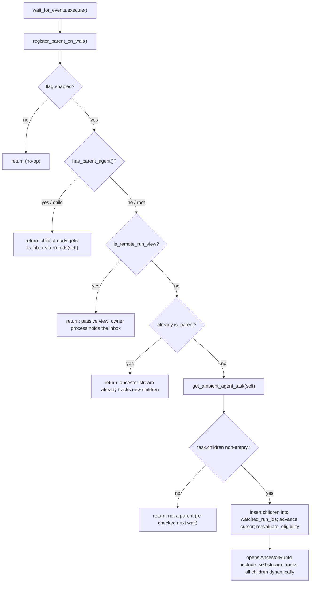

# TECH: wait_for_events parent registration for owner-side orchestration events

Linear: [QUALITY-919 — Auto-register orchestrators for child events on wait_for_events](https://linear.app/warpdotdev/issue/QUALITY-919/auto-register-orchestrators-for-child-events-on-wait-for-events)

## Context
We deliver child lifecycle and inbox-message events to an orchestrator (parent) through an owner-side SSE stream managed by `OrchestrationEventStreamer` (`app/src/ai/blocklist/orchestration_event_streamer.rs`). A conversation is treated as a parent only when its `watched_run_ids` contains a non-self run id (`is_parent_agent_conversation`, `:1463`). That set is populated when children are launched via `run_agents` (`register_watched_run_id`, `:534`) or rehydrated on restore from the server task's `children` (`:1386`). When a parent is eligible and `OwnerOrchestrationAncestorStreamer` is on (now in `default`, so enabled on all channels), `desired_sse_filter` (`:1574`) selects an `AncestorRunId { include_self: true }` stream that delivers the parent's own inbox plus all direct children's events on one ordered stream, discovering children dynamically via a server-side `parent_run_id` JOIN.

Gap: children can also be created out-of-band — via the Oz CLI or web API — by passing `parent_run_id` directly. That path never calls `register_watched_run_id`, so the parent's client never learns it is a parent, `desired_sse_filter` stays on `RunIds(self)` (or no stream), and the parent misses its children's events.

This change uses the `wait_for_events` client tool — the moment an orchestrator blocks on its descendants — as the trigger to confirm parent status against the server and register for the ancestor stream.

Scope: this is a parent-side fix only. An out-of-band child already subscribes to its own inbox in its own driver-hosted process via the existing `has_parent_agent` eligibility — the parent run id is stamped as `parent_agent_id` (`app/src/ai/agent/conversation.rs:1101`), which makes the child eligible (`is_eligible`) and opens a `RunIds(self)` stream (requires an active consumer, which a running child has). The gap is solely that the *parent* never learns it has such a child.

**Invariant (load-bearing):** orchestration trees are one level deep — a run is either a root orchestrator or a leaf child, never both. The server's ancestor query is already single-level (`parent_run_id = $1`), so this assumption is consistent end-to-end. The design relies on it in exactly one place (the child short-circuit below) and must be revisited alongside the server query if multi-level trees are introduced.

No user-visible behavior changes; this is event-delivery correctness, so no `PRODUCT.md` accompanies this spec. Behavioral contract: after an orchestrator with at least one server-recorded child calls `wait_for_events`, it receives that child's lifecycle and message events (and its own inbox) for the remainder of the conversation, regardless of how the child was created.

Relevant code:
- `app/src/ai/blocklist/action_model/execute/wait_for_events.rs` — executor; `execute()` already has `conversation_id` and currently only schedules a watchdog and flips status to `WaitingForEvents`.
- `orchestration_event_streamer.rs`: `is_parent_agent_conversation` (`:1463`), `desired_sse_filter` (`:1574`), `reevaluate_eligibility` (`:1602`), `register_watched_run_id` (`:534`), restore application of `task.children` (`:1386`), `is_eligible` + `has_parent_agent` usage (`:1541-1543`), `teardown_sse` stickiness comment (`:2032-2044`).
- `app/src/ai/ambient_agents/task.rs:180-185` — `AmbientAgentTask.children`, the server-recorded direct children (`parent_run_id`-based; includes CLI/API children).
- `start_agent.rs:182` — existing pattern for an action executor to drive `OrchestrationEventStreamer`.

## Proposed changes
1. **New dogfood-gated flag `WaitForEventsParentRegistration`** (follow the `add-feature-flag` skill: enum variant in `crates/warp_features/src/lib.rs`, `DOGFOOD_FLAGS` entry, Cargo feature + `enabled_features()` bridge in `app/Cargo.toml` and `app/src/features.rs`). It gates the entire new behavior so rollout is independent of the already-shipped `OwnerOrchestrationAncestorStreamer`.

2. **New method on `OrchestrationEventStreamer`** — `register_parent_on_wait(conversation_id, ctx)`:
   - Flag disabled → return.
   - `conversation.has_parent_agent()` is true → return. One-level-tree invariant: a child cannot be a parent, so skip the server fetch entirely. The child still receives its own inbox via the existing `is_eligible` → `RunIds(self)` stream, so there is no regression.
   - `is_remote_run_view(conversation_id)` is true → return. A shared-session viewer or remote-child placeholder is a passive view of a run executing elsewhere; that process owns the inbox. Mirrors the `is_eligible` exclusion and avoids a wasted fetch.
   - `is_parent_agent_conversation(conversation_id)` already true → return. No re-fetch is needed to discover children added later: once the parent is on the `include_self` ancestor stream, the server `parent_run_id` JOIN and `AncestorKey` fan-out already deliver events for any new child (including out-of-band ones), so new-child discovery is the stream's job, not the fetch's. The fetch exists only to make the initial not-parent → parent transition, and the role is permanent thereafter.
   - Otherwise resolve `self_run_id`; if absent, return (rare — the next wait re-checks). Spawn `ai_client.get_ambient_agent_task(self_run_id)`.
   - On result, if `task.children` is non-empty: insert the ids into `watched_run_ids`, advance `event_cursor = max(local, task.last_event_sequence)`, then call `reevaluate_eligibility`. Note `last_event_sequence` is the client's confirmed-processing **delivery** cursor for the run, not the max recorded sequence; it is `NULL` until the client acknowledges events (advanced only via the advance-only `PATCH /agent/runs/:runId/event-sequence`). So a first-time-registering root has `NULL`, the cursor stays at 0, and the ancestor stream replays from the beginning and delivers the child's already-pending events — which is also why reusing the restore path's `max(local, confirmed)` merge is correct here (it resumes past acknowledged events, not unseen ones). With `OwnerOrchestrationAncestorStreamer` on, this opens the `AncestorRunId { include_self: true }` stream, which thereafter tracks all children dynamically (the out-of-band ones and any created later). Mirror the restore path's task-application logic (`:1386`); factor a shared helper if convenient. If `children` is empty → no-op (not a parent).

3. **Invoke from `wait_for_events.rs::execute()`** via `OrchestrationEventStreamer::handle(ctx).update(ctx, |s, ctx| s.register_parent_on_wait(conversation_id, ctx))`, using the same access pattern as `start_agent.rs:182`.

### Decision flow


### Sketch (illustrative)
```rust
// orchestration_event_streamer.rs
pub fn register_parent_on_wait(
    &mut self,
    conversation_id: AIConversationId,
    ctx: &mut ModelContext<Self>,
) {
    if !FeatureFlag::WaitForEventsParentRegistration.is_enabled() {
        return;
    }
    // One-level-tree invariant: a child can never be a parent.
    let is_child = BlocklistAIHistoryModel::as_ref(ctx)
        .conversation(&conversation_id)
        .is_some_and(|c| c.has_parent_agent());
    if is_child {
        return;
    }
    // Passive view (shared-session viewer / remote child): owner process holds the inbox.
    if self.is_remote_run_view(conversation_id, ctx) {
        return;
    }
    // Already a known parent: the ancestor stream already tracks new children.
    if self.is_parent_agent_conversation(conversation_id, ctx) {
        return;
    }
    let Some(self_run_id) = self.self_run_id(conversation_id, ctx) else {
        return;
    };
    let Ok(task_id) = self_run_id.parse::<AmbientAgentTaskId>() else {
        return;
    };
    let ai_client = self.ai_client.clone();
    ctx.spawn(
        async move { ai_client.get_ambient_agent_task(&task_id).await },
        move |me, result, ctx| {
            let Ok(task) = result else { return; };
            if task.children.is_empty() {
                return; // not a parent
            }
            // Mirror the restore path (:1386): populate watched_run_ids + cursor.
            me.apply_task_children(conversation_id, &task, ctx);
            me.reevaluate_eligibility(conversation_id, ctx);
        },
    );
}
```
```rust
// wait_for_events.rs::execute(), after `conversation_id` is bound
OrchestrationEventStreamer::handle(ctx).update(ctx, |s, ctx| {
    s.register_parent_on_wait(conversation_id, ctx);
});
```

**Representation:** reuse `watched_run_ids`; no new "is parent" state is introduced. Permanence falls out for free — `watched_run_ids` is sticky and `teardown_sse` preserves it (`:2032-2044`), so the parent role persists for the conversation's life and across wait cycles; subsequent waits short-circuit on the already-parent check. After the initial transition `watched_run_ids` is intentionally **not** refreshed; it is only the boolean for `is_parent_agent_conversation` and filter selection. Children added later are delivered by the live ancestor stream, not by this set — the server fans out by `AncestorKey(parent_run_id)` and the owner drain (`handle_event_batch`, `:1954`) processes every streamed event except `killed_run_ids` tombstones, so it must never gain a `watched_run_ids` filter (see Risks).

**Flag-off / no-children behavior** is exactly today's behavior (parents discovered only via `run_agents`/restore), which keeps rollout safe.

## Testing and validation
Unit tests (`orchestration_event_streamer_tests.rs`, following the existing `*_ancestor_include_self_stream` tests):
- Root with server-recorded children → `register_parent_on_wait` opens one `AncestorRunId { include_self: true }` stream (assert the connected filter).
- Child (`has_parent_agent`) → no task fetch, no parent role, no stream change.
- Root with no children → no registration.
- Idempotent: a second call when already a parent does not re-fetch or churn the stream.
- Flag off → no-op.
- `self_run_id` absent → no fetch, no-op.
- `get_ambient_agent_task` returns an error → no registration (graceful).

Executor test (`wait_for_events_tests.rs`): `execute()` invokes the streamer method behind the flag and honors the child short-circuit.

Manual (dogfood build, flag on): a parent creates a child via the Oz CLI/web API passing `parent_run_id`, then calls `wait_for_events`; verify the parent surfaces the child's lifecycle + messages (inbox notification) and that the watchdog does not fire first.

Execution: run the affected tests via `cargo nextest run -p warp` (per AGENTS.md). The implementer must be green on these plus `./script/format` and `cargo clippy` (the `./script/presubmit` versions) before requesting review. No `crates/integration` test is added — disproportionate for this client-internal change; the manual dogfood repro covers end-to-end.

Dynamic-discovery coverage: that a child added *after* registration is delivered without a re-fetch is covered indirectly — the unit test asserts the connected filter is `AncestorRunId { include_self: true }`, and existing ancestor-stream tests already cover delivery for children resolved by that filter (server fan-out is not re-tested here).

Contract mapping: the "root with children" unit test plus the manual repro cover the behavioral contract in Context; the child, flag-off, error, and missing-run-id tests guard against over-registration and regressions.

## Parallelization
The implementation itself is a single coherent change (executor + streamer + flag plumbing, tightly coupled to its tests) and is **not** split across parallel implementation agents. Per the implementation plan it is executed by one implementation agent plus a separate code-review agent in an iterative review loop — a quality gate rather than a wall-clock speedup. See the plan's Orchestration section for worktree, branch, and coordination details.

## Environment
- Repo/worktree: `~/src/event-registrations/warp`, branch `matthew/event-registrations`. Client-only — no `warp-server` or `warp-proto-apis` changes. The server ancestor stream, `include_self`, `get_ambient_agent_task.children`, and `orchestration_viewer_streamer` already shipped and are enabled in prod.
- New flag touches `crates/warp_features/src/lib.rs`, `app/Cargo.toml`, and `app/src/features.rs`.

## Risks and mitigations
- **One-level-tree assumption:** the `has_parent_agent` short-circuit (and the single-level ancestor stream) would miss mid-tree nodes if trees become multi-level. Mitigation: invariant documented here and consistent with the server's single-level JOIN; revisit both together.
- **Timing race (accepted):** a child created during an already-blocked empty wait is not seen until the next wait. Mitigation: orchestrators create children before waiting; each subsequent wait re-checks and self-heals.
- **Extra GET per wait for childless roots:** a childless root re-fetches `get_ambient_agent_task` on every `wait_for_events` (intentional — this is the self-heal path by which a root that gains a child later discovers it). Roots that already have children skip after the first wait (they become known parents). The fetch is a single lightweight GET; add negative caching only if it proves costly (follow-up).
- **`watched_run_ids` goes stale after the transition (children added or removed out-of-band):** by design. A child added later is never inserted into the set, yet its events are still delivered because the open ancestor stream is keyed on `AncestorKey(self)` and the owner drain (`drain_sse_events`/`handle_event_batch`, `:1914`/`:1954`) does not filter by `watched_run_ids` (it drops only `killed_run_ids`). Deleted children are harmless for the same reason. **Guard:** do not add `watched_run_ids` filtering to the ancestor drain path, and do not assume the set enumerates current children — out-of-band children added after the initial transition live only on the stream. This holds only while the active filter is the ancestor stream (the feature's premise); static `RunIds` mode would not pick them up.

## Follow-ups
- **Always-on child discovery (lazy listening at first wait):** when a non-child agent first calls `wait_for_events`, open a lightweight **self** stream (`RunIds([self])`) and keep it open. That delivers the parent's own inbox and serves as the landing channel. Have the server emit a `child_agent_started` event on the parent's own run (`run_id = P`; parent resolved at creation via `resolveTaskOwnerFromParentRun`, `../warp-server/router/handlers/public_api/agent_webhooks.go:1132`) whenever a task is created with `parent_run_id = P`. The parent receives it on the self stream, registers the child / flips `is_parent`, and upgrades to `AncestorRunId { include_self: true }` (a superset of the self stream, so no coverage gap), thereafter receiving that child's events and all future children's via `AncestorKey(self)` fan-out. Children are thus discovered the instant they start (mid-wait or while actively working), the per-wait `get_ambient_agent_task` poll is removed, and childless waiters hold only the cheap self stream — the ancestor stream opens only once a child actually exists. Here `child_agent_started` is load-bearing (the upgrade trigger). New wiring: `desired_sse_filter` selects the self stream for a waiting root and the ancestor filter once a child is known. Complementary to the existing restore fetch (cold start via `task.children`); spans warp-server (emit `child_agent_started`), warp (open-on-wait + upgrade handler), and possibly warp-proto-apis (event type).
- **Alternative to the above:** open `AncestorRunId { include_self: true }` directly at first wait (no new server event — a child's first lifecycle event surfaces on it via the connect-time JOIN + `AncestorKey` fan-out), at the cost of holding the ancestor stream for every waiting root even when childless.
- Promote `WaitForEventsParentRegistration` via the `promote-feature` skill after dogfood, then remove it via `remove-feature-flag` once stable.
- Open a draft PR per the repo workflow (template at `.github/pull_request_template.md`), likely `CHANGELOG-NONE`.
