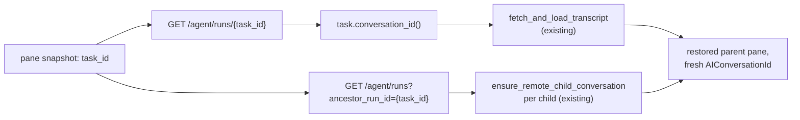

# Task-Driven Orchestration Restore

Supplemental spec for QUALITY-928. Proposes replacing the DB-persistence
approach in `TECH-parent-restore.md` (Fix 1: persist the owner's parent
conversation; Fix 2: seed children from `task.children`) with a restore path
driven entirely by server task data. Fix 1 is reverted outright. Fix 2 is kept
but re-pointed at a different server query. The M1 discovery/streaming stack
(`OrchestrationChildTracker`, `FamilyDrainMode`, `drain_family_events`) is
unaffected.

## Problem

Fix 1 makes the owner's cloud agent parent conversation survive a restart by
persisting it to SQLite despite `is_viewing_shared_session`. This trades one
bug for a new failure class:

- **BUG-2.** On a second restart, the persisted parent conversation can
  restore with zero tasks. `AIConversation::new_restored_synthesizing_on_empty`
  (`app/src/ai/agent/conversation.rs:439-457`) treats an empty `agent_tasks`
  set as "child waiting on its first server response" and silently synthesizes
  a fresh optimistic root instead of failing — that heuristic is correct for
  a child conversation created moments ago, but wrong for a parent that should
  have a full transcript. Because a local row now exists,
  `resolve_entry_open_action` (`app/src/ai/agent_conversations_model.rs:1443`)
  resolves the pane to `RestoreOrNavigateToConversation` (a local-conversation
  action) rather than `OpenConversationTranscriptViewer`, so the transcript
  fetch that would otherwise repair an empty/stale local row never runs. The
  pane renders an empty transcript instead of the real one.
- **Stable-ID plumbing became load-bearing.** Once a client conversation id is
  persisted, it must stay stable forever, or the children's persisted
  `parent_conversation_id` orphans. `ensure_remote_child_conversation`
  (`app/src/ai/blocklist/history_model.rs:577-632`) carries a stale-parent
  reconciliation branch for exactly the case where a live-session rejoin mints
  a new parent id while DB rows still point at the old one — a class of bug
  that only exists because a parent id is expected to survive across
  sessions.
- **Two independent code paths do the same job for two different reasons.**
  DB persistence (native) and `task.children` seeding (web, and any native
  restore where the local row is missing or stale) both rebuild
  `children_by_parent`. They're individually reasoned about as
  order-independent and idempotent (`TECH.md` §9.5), but that's two restore
  mechanisms to keep synchronized rather than one.
- **The web client was already proof that persistence isn't required.** Fix 2
  exists because WASM has no SQLite (`app/build.rs` gates `local_fs` /
  `local_tty` on `target_family != "wasm"`) and restores entirely from server
  data. If server data is sufficient there, it's sufficient everywhere, and
  running two mechanisms in parallel on native is the part that's optional.

## Proposed design

The pane snapshot already stores the one piece of data that's stable across
restarts and across clients: `task_id` (`AmbientAgentTaskId`, the server-side
run id). Everything else needed to rebuild a restored parent's pill bar and
transcript is available from the server through APIs that are already wired:

1. `GET /agent/runs/{task_id}` — `get_or_async_fetch_task_data` (already used
   by `ambient_pane_restoration.rs` and `child_agent/restoration.rs`) resolves
   the parent task: title, state, `conversation_id`, ownership.
2. `GET /agent/runs?ancestor_run_id={task_id}` — `TaskListFilter::ancestor_run_id`
   (`app/src/server/server_api/ai.rs:701`) + `list_ambient_agent_tasks`
   (`app/src/server/server_api/ai.rs:1248-1252`) resolves the direct children.
   This is the same query `OrchestrationChildTracker`'s Observer side already
   uses for its cold-start seed (`spawn_ancestor_seed_fetch` /
   `finish_ancestor_seed_fetch`, `app/src/ai/blocklist/orchestration_event_streamer.rs:1324-1411`).
3. `task.conversation_id()` (`app/src/ai/ambient_agents/task.rs:270-272`)
   gives the parent's server conversation token, which is what
   `restore_pane_with_transcript` / `fetch_and_load_transcript`
   (`app/src/pane_group/ambient_pane_restoration.rs:185-268`) already use to
   load a transcript.

None of the three needs a persisted local row. Restore always mints a fresh
`AIConversationId` for the parent (as it already does for every other
in-memory-only conversation) and fully repopulates it — transcript, pill bar,
child links — from these three calls. No server change is required; only the
client-side wiring of *which* data restore reads changes.

## Changes to M1

Unchanged: `OrchestrationChildTracker`, `FamilyDrainMode`,
`drain_family_events`, the family SSE stream, and everything in `TECH.md`
§4-§8. None of that discovers children via local persistence — it already
works from live server events and REST fetches — so it is orthogonal to this
change.

One M1 mechanism is reverted:

- **`ensure_remote_child_conversation`'s stale-parent reconciliation**
  (`app/src/ai/blocklist/history_model.rs:588-608`, the
  `if current_parent != Some(parent_conversation_id) { ... re-index ... }`
  branch). This branch exists solely to repair a persisted child row whose
  `parent_conversation_id` points at a parent id from a *previous* session
  that a live-session rejoin has since replaced. Once no parent id is ever
  loaded from a persisted row — every restore mints children fresh, under
  the current session's freshly-minted `parent_conversation_id` — the
  mismatch this branch handles cannot occur: `current_parent` is either
  `None` (first creation) or already equal to `parent_conversation_id`
  (idempotent re-run). Revert to the pre-fix, unconditional
  `return conversation_id` when `conversation_id_for_agent_id(run_id)`
  already resolves.

## Changes to M2

**Reverted (Fix 1):**

- `is_owned_cloud_agent_conversation` (`app/src/ai/agent/conversation.rs:3486-3506`)
  is removed. Nothing needs to know "does the current user own this run" for
  persistence purposes anymore.
- `write_updated_conversation_state`'s conditional early-return
  (`app/src/ai/agent/conversation.rs:3512-3516`) reverts to its original,
  unconditional form: any conversation with `is_viewing_shared_session` is
  never written to `agent_conversations`, full stop. A cloud agent parent
  pane is always rebuilt from `task_id` on restore, so there's nothing to
  persist and no ownership carve-out to reason about.

**Kept, modified (Fix 2):** `seed_child_conversations_from_task`
(`app/src/pane_group/child_agent/restoration.rs:79-182`) keeps its role as
the single function that rebuilds `children_by_parent` for a restored parent,
its idempotency guarantees (routes every child through
`ensure_remote_child_conversation`, which is a no-op for an already-linked
child), and its pending/retry shape. What changes is where the child list
comes from:

- Before: read `task.children` off the parent task fetched via
  `get_or_async_fetch_task_data(&parent_task_id)`. In practice this list is
  frequently empty — `GET /agent/runs/{id}` does not reliably populate
  `children` for the run's own record — which is why Fix 2 needed a fallback
  onto whatever the local index already held.
- After: issue `GET /agent/runs?ancestor_run_id={parent_task_id}` directly
  (mirroring `spawn_ancestor_seed_fetch`), and use that response's tasks as
  the child list. This is the same query path the Observer side already
  relies on for exactly this purpose, so it's a proven source rather than a
  best-effort field. The function no longer needs to fetch the parent task
  itself for this purpose (fetching `task.children` is dropped); it still
  needs `parent_conversation_id` (from its caller) to link children under and
  each child's own task data (already fetched per-child, unchanged) to name
  and place them.

**Kept, unchanged:**

- `process_pending_parent_child_seeds` / `pending_parent_child_seeds`
  (`app/src/pane_group/child_agent/restoration.rs:186-204`, field declared on
  `PaneGroup`): the ancestor-list fetch can still be in flight when restore
  first runs, so the same pending/re-drive-on-`TasksUpdated` shape is needed
  regardless of which server call populates the list.
- `load_data_into_restored_ambient_cloud_mode_view`'s `Option<AIConversationId>`
  return and both call sites that invoke the seed immediately after
  (`app/src/pane_group/mod.rs:3732-3741` and `:5377-5405`). The parent still
  needs a resolvable conversation id to seed children under, and the
  re-entrancy constraint that motivated returning it instead of reaching back
  into `PaneGroup` from an associated fn is unchanged.
- `restore_pane_with_transcript` / `fetch_and_load_transcript`
  (`app/src/pane_group/ambient_pane_restoration.rs:185-268`): this is now the
  *only* transcript-loading path for a restored completed parent (see below),
  so it stays exactly as it is.

**Removed:**

- The `RestoreOrNavigateToConversation` arm in
  `process_pending_ambient_restorations`
  (`app/src/pane_group/ambient_pane_restoration.rs:141-174`). This arm exists
  only to handle the case where `resolve_entry_open_action` sees a persisted
  local row for the parent and routes restore through a local-conversation
  navigation action instead of `OpenConversationTranscriptViewer`. With
  nothing ever persisted for the parent, `entry.identity.local_conversation_id`
  is never populated for a cross-restart pane, so
  `resolve_entry_open_action` (`app/src/ai/agent_conversations_model.rs:1443-1534`)
  always falls through to its last arm and returns
  `OpenConversationTranscriptViewer`. The arm — and the debug instrumentation
  added around it while chasing BUG-2 — is dead code once Fix 1 is reverted.

## Invariants preserved

- **Flag-OFF path.** Unaffected. All of the above is gated behind
  `FeatureFlag::OrchestrationUnifiedStack` already; flag-off restore keeps
  using the pre-M1/M2 baseline exactly as today.
- **Live session restore (case A).** Unchanged. A parent whose run is still
  `InProgress` with an attachable session resolves through
  `OpenOrAttachAmbientAgentConversation`
  (`app/src/pane_group/ambient_pane_restoration.rs:99-119`), rejoins the
  shared session, and `OrchestrationViewerModel`'s ancestor seed
  (`spawn_ancestor_seed_fetch`) rediscovers children exactly as it does today.
  This path never touched local persistence and needs no change.
- **Completed session restore (case B).** Same action
  (`OpenConversationTranscriptViewer`) and the same transcript-loading
  machinery (`restore_pane_with_transcript`,
  `load_data_into_restored_ambient_cloud_mode_view`, the seed call
  immediately after). The only thing that changes underneath is what feeds
  `seed_child_conversations_from_task`'s child list, per above.

## What's removed / simplified

- `is_owned_cloud_agent_conversation` (conversation.rs).
- The ownership carve-out in `write_updated_conversation_state`
  (conversation.rs) — reverts to a plain, unconditional early return.
- The `RestoreOrNavigateToConversation` arm and its `[ORCH-D:restore]` debug
  logging in `process_pending_ambient_restorations`
  (ambient_pane_restoration.rs).
- The `[ORCH-D:restore]` / `[ORCH-D:history]` debug logging added while
  diagnosing BUG-2 in `fetch_and_load_transcript`
  (ambient_pane_restoration.rs), `load_data_into_transcript_viewer` (mod.rs),
  and `index_child_conversation` / `ensure_remote_child_conversation`
  (history_model.rs) — once the underlying persistence path is gone, the
  conditions those log lines were added to observe no longer exist.
- The stale-parent reconciliation branch in `ensure_remote_child_conversation`
  (history_model.rs).
- `task.children`-reading in `seed_child_conversations_from_task`
  (child_agent/restoration.rs) — replaced by the ancestor-list fetch. Note
  `AmbientAgentTask.children` itself is not removed: it's still read by the
  legacy per-conversation restore-fetch path (`apply_task_children`,
  `orchestration_event_streamer.rs:2085-2099`), which is unrelated to this
  change.

Net effect: the parent conversation's identity is no longer expected to
survive a restart at all. There is exactly one restore mechanism (server task
data), not two order-independent ones, and it is the same mechanism on native
and web.

## Tradeoffs

- **Startup network dependency.** Restoring a cloud agent parent always
  requires at least the `GET /agent/runs/{task_id}` and, once there are
  children, the ancestor-list fetch. This is not new cost — both were already
  required for a correct restore under Fix 1 + Fix 2 (the parent task fetch
  to resolve `conversation_id()`, and either the DB index or `task.children`
  for the child list). What's new is that there's no persistence fallback: if
  the client is fully offline at restart, the pane cannot show a pill bar or
  transcript until connectivity returns. Given this is exclusively a
  cloud-agent (server-backed) feature, that's consistent with every other
  cloud-agent affordance already requiring connectivity.
- **No offline pill bar.** A restart with no network shows a loading state
  rather than a stale-but-present pill bar. Acceptable for the same reason:
  the underlying run only exists and only advances server-side.
- **Simpler restore surface.** No stable-conversation-id invariant to
  maintain, no DB-sync class of bug (BUG-2's failure mode cannot recur — an
  empty local row for the parent can't exist because no row is ever written),
  and no reconciliation pass. One less thing that must stay correct across
  every future change to the persistence layer.

## Pill bar notification gap on restore

Because children are never persisted, `children_by_parent` is always empty
the instant a restored parent pane is created — the only source of children
is the ancestor-list fetch kicked off by `seed_child_conversations_from_task`
(`restoration.rs:87-125`), which is async. `OrchestrationPillBar` is
constructed unconditionally in `TerminalView::new()`
(`app/src/terminal/view.rs:4211-4213`), i.e. before that fetch can possibly
resolve, and `pill_specs` (`orchestration_pill_bar.rs:600-624`) returns `None`
whenever the orchestrator has zero children. So the pill bar's first render is
always empty; whether it ever becomes non-empty depends entirely on the pill
bar receiving a re-render notification once `finish_seed_child_conversations_from_task`
(`restoration.rs:131-218`) finishes linking children.

**Traced notification chain.** `finish_seed_child_conversations_from_task`
routes every discovered child through `ensure_remote_child_conversation`
(`history_model.rs:591-639`). For a child never seen before in this session
(true for every child on a cold, unpersisted restart) this takes the `else`
branch: `start_new_child_conversation` → `start_new_conversation`, which emits
`BlocklistAIHistoryEvent::StartedNewConversation` (`history_model.rs:1345-1372`),
followed by `assign_run_id_for_conversation`, which emits
`ConversationServerTokenAssigned` (`history_model.rs:1487-1530`; per its own
doc comment this exists so `StartAgentExecutor` can resolve a pending
`start_agent` tool call, not for pill bar refresh).
`OrchestrationPillBar::new` subscribes directly to the `BlocklistAIHistoryModel`
singleton (`orchestration_pill_bar.rs:352-384`) and matches
`StartedNewConversation` (alongside `UpdatedConversationStatus`,
`AppendedExchange`, `SetActiveConversation`) to call `ctx.notify()`;
`ConversationServerTokenAssigned` falls through the wildcard `_ => {}` arm and
is dropped. Separately, `TerminalView::handle_ai_history_model_event`
(`view.rs:6044-6576`) calls `ctx.notify()` unconditionally at the end of
handling any event addressed to it, including `ConversationServerTokenAssigned`,
but that only re-renders the parent's own `TerminalView`, not `OrchestrationPillBar`
directly.

Net effect: today, `StartedNewConversation` incidentally does notify the pill
bar for the exact restore scenario (every child is genuinely new), so the pill
bar likely *does* converge once children are created. But this is fragile,
incidental coupling, not an intentional signal — nothing in
`orchestration_pill_bar.rs` documents that pill bar correctness depends on
`start_new_conversation` always being called for every newly-linked child.
Any future change that discovers/attaches a child through a path other than
`start_new_child_conversation` (e.g. a pre-created shell conversation, or a
different SSE/hydration path that calls `assign_run_id_for_conversation`
directly without minting a fresh conversation first) would silently reproduce
a permanently-empty pill bar, because the one event that's semantically
"this child now belongs under this parent" (`ConversationServerTokenAssigned`,
or the `set_parent_for_conversation` / `index_child_conversation` call inside
`ensure_remote_child_conversation`) is never observed by the pill bar.

**Recommended fix.** Make the notification explicit and independent of
incidental conversation-creation side effects, rather than relying on
alternative 4(a)'s fetch-timing change or 4(c)'s pre-population scheme:

1. Add `ConversationServerTokenAssigned` to the set of events
   `OrchestrationPillBar::new`'s subscription matches (`orchestration_pill_bar.rs:352-359`),
   calling `ensure_mouse_states` + `ctx.notify()` exactly as the existing four
   variants do. This event already fires for every remote child exactly once
   per `ensure_remote_child_conversation` call that actually links a child
   (new creation today; any future direct-attach path tomorrow), so this
   closes the gap without depending on `StartedNewConversation` continuing to
   fire incidentally.
2. Treat 4(a) (start the ancestor-list fetch in parallel with the transcript
   fetch in `process_pending_ambient_restorations`, `ambient_pane_restoration.rs:81-138`,
   caching the result for `seed_child_conversations_from_task` to consume
   synchronously) as a follow-on latency improvement, not a correctness
   requirement — it shrinks or eliminates the empty-pill-bar flash on restore,
   but (1) is what guarantees the pill bar eventually renders correctly even
   if the ancestor fetch is slow or retried.
3. Do not pursue 4(c) (pre-populating `children_by_parent` before the parent's
   `AIConversationId` exists): `children_by_parent` is keyed by the local
   parent id, which doesn't exist until the transcript loads, so this would
   need a second, task-id-keyed staging index that gets reconciled once the
   parent id is minted — reintroducing exactly the "two mechanisms to keep
   synchronized" complexity this spec sets out to remove (see Problem, bullet
   3).

**Estimated LOC.** Fix (1) is a one-arm addition to an existing match plus a
comment explaining why (~5-10 LOC) in `orchestration_pill_bar.rs`, no new
event variant or model changes required. The optional follow-on (2) is
larger: a new per-task cache field on `PaneGroup`, a fetch kicked off earlier
in `process_pending_ambient_restorations`, and a cache-check branch in
`seed_child_conversations_from_task` before falling back to today's fetch
(~60-100 LOC including the fallback path and a test covering both orderings
of transcript-fetch-first vs. ancestor-fetch-first completion).

## Validation

Manual (dogfood, flag on, server emits deployed):

1. Start a cloud agent via `/cloud-agent`, have it run 2+ remote children to
   completion, then restart the client. Verify the parent restores as a
   transcript view and the pill bar shows one pill per child with the correct
   final status badge.
2. Restart a **second** time (the BUG-2 repro) and confirm the transcript and
   pill bar are identical to the first restore — no empty transcript, no
   empty pill bar.
3. Restart a **third** time for good measure; nothing should degrade with
   repetition, since nothing is accumulating in local state.
4. Open the same completed run's Oz session link in the web client. The pill
   bar and children must appear — this exercises the ancestor-list fetch on
   the client that has no SQLite at all, so it validates the primary
   mechanism rather than a fallback.
5. Restart while a cloud agent is still running: the pane must rejoin the
   live session and show pills (case A, unaffected by this change).
6. Kill and restart the client immediately after a run completes (tight
   race with any in-flight fetch) and confirm restore still converges once
   the fetches complete, without a partial or empty pane being left behind.
7. Inspect the `agent_conversations` SQLite table after a completed
   `/cloud-agent` run and confirm no row exists for the parent conversation
   (confirming Fix 1 is fully reverted, not just inert).
8. With the flag off, repeat scenario 1 and confirm prior (pre-M1) behavior
   is unchanged.
9. Run `./script/presubmit` — must pass cleanly.
