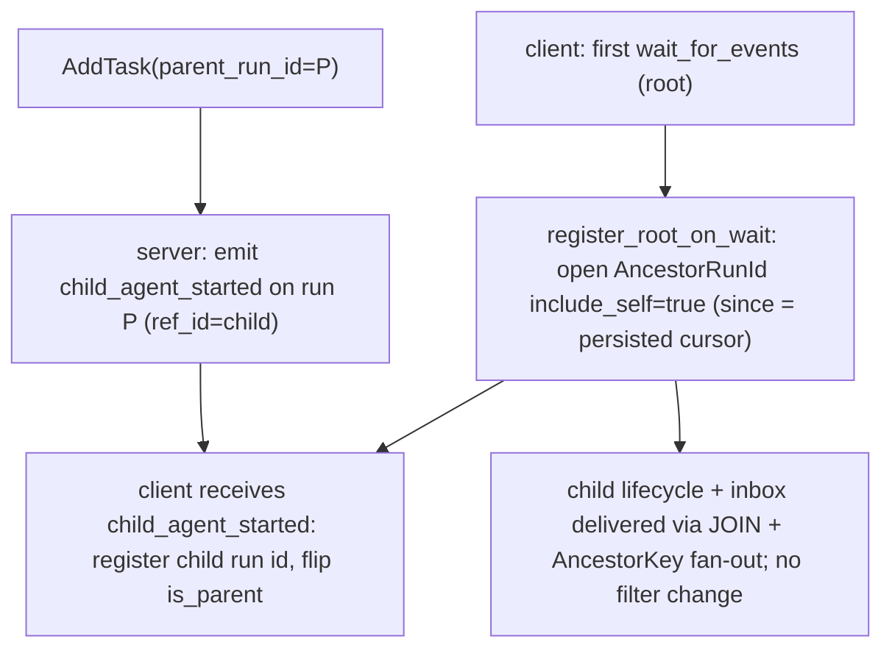
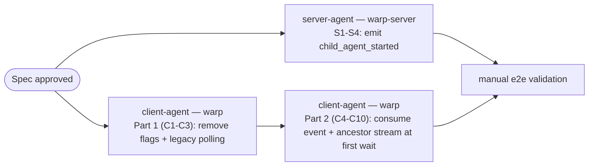

# TECH: `child_agent_started` event for push-based child discovery + orchestration polling removal

Linear: QUALITY-928 — Emit a `child_agent_started` event so parents discover children via push, and remove orchestration child-discovery polling.

Follow-up to [QUALITY-919](https://linear.app/warpdotdev/issue/QUALITY-919) (PR #13208), whose spec already sketched this work under "Always-on child discovery (lazy listening at first wait)" — see [`specs/QUALITY-919/TECH.md` (147-149) @ c0902a2](https://github.com/warpdotdev/warp/blob/c0902a246934b879390977d048f398b1a8e879d8/specs/QUALITY-919/TECH.md#L147-L149).

This spec is written to be self-contained: an implementer should be able to execute it without prior knowledge of the orchestration event system. Code blocks are the exact shape to write; line references point at the current code to change.

## Context
An orchestrator (parent) receives its children's lifecycle and inbox events through an owner-side SSE stream managed by `OrchestrationEventStreamer`. Today the parent only learns it *has* children by **fetching/polling**:
- **Legacy viewer REST poll** — `OrchestrationViewerModel` polls `GET /agent/runs?ancestor_run_id=` every 5s (30s once idle, forever) plus a separate 5s per-child `session_id` poll. [`orchestration_viewer_model.rs` (37-44, 554-586, 698-736) @ c0902a2](https://github.com/warpdotdev/warp/blob/c0902a246934b879390977d048f398b1a8e879d8/app/src/terminal/shared_session/viewer/orchestration_viewer_model.rs#L37-L44).
- **Per-`wait_for_events` fetch** — `register_parent_on_wait` does a `get_ambient_agent_task` on every wait to confirm parent status (the QUALITY-919 mechanism). [`orchestration_event_streamer.rs` (563-651) @ c0902a2](https://github.com/warpdotdev/warp/blob/c0902a246934b879390977d048f398b1a8e879d8/app/src/ai/blocklist/orchestration_event_streamer.rs#L563-L651).
- **Restore-on-startup fetch** — one-shot `get_ambient_agent_task(...).children` per restored conversation. [`orchestration_event_streamer.rs` (1370-1442) @ c0902a2](https://github.com/warpdotdev/warp/blob/c0902a246934b879390977d048f398b1a8e879d8/app/src/ai/blocklist/orchestration_event_streamer.rs#L1370-L1442).

The server already has the primitives to push instead: an append-only `ai_run_event_log` with monotonic `sequence`, a publish path (`PublishLifecycleEvent` → `publishAgentRunEvent`), and an SSE handler with `run_ids[]` and `ancestor_run_id`/`include_self` filters whose ancestor query JOINs `ai_tasks.parent_run_id`. Children are created (any path: `run_agents`, Oz CLI, web API) through one funnel, `AddTask`. Relevant server code:
- [`logic/ai/ambient_agents/add_task.go` (348-388) @ 029c643](https://github.com/warpdotdev/warp-server/blob/029c643e189a57fba62b596142d5900dd1eb4137/logic/ai/ambient_agents/add_task.go#L348-L388) — the child row insert; the natural emit point.
- [`logic/agent_lifecycle.go` (13-81) @ 029c643](https://github.com/warpdotdev/warp-server/blob/029c643e189a57fba62b596142d5900dd1eb4137/logic/agent_lifecycle.go#L13-L81) — event-type constants + `PublishLifecycleEvent(WithParent)`.
- [`logic/agent_event_publish.go` (14-79) @ 029c643](https://github.com/warpdotdev/warp-server/blob/029c643e189a57fba62b596142d5900dd1eb4137/logic/agent_event_publish.go#L14-L79) — payload (`id, run_id, event_type, ref_id, execution_id, sequence, occurred_at`) + PubSub metadata.
- [`model/ai_run_event_log.go` (35-120) @ 029c643](https://github.com/warpdotdev/warp-server/blob/029c643e189a57fba62b596142d5900dd1eb4137/model/ai_run_event_log.go#L35-L120) — `InsertEvent` and the ancestor JOIN.

This is event-delivery correctness/efficiency, so no `PRODUCT.md` accompanies this spec. Behavioral contract: whenever a child task is created with `parent_run_id = P` (by any method), a parent client watching `P` discovers that child within one SSE round-trip — no polling — and surfaces its subsequent lifecycle and inbox events.

**Invariant (carried over from QUALITY-919, load-bearing):** orchestration trees are one level deep (a run is either a root orchestrator or a leaf child). The server ancestor query is single-level (`parent_run_id = $1`), consistent end-to-end. Revisit alongside the server query if multi-level trees are introduced.

## Rollout state of existing orchestration flags
Three orchestration flags are already in the `default` Cargo feature set ([`app/Cargo.toml` (679-681) @ c0902a2](https://github.com/warpdotdev/warp/blob/c0902a246934b879390977d048f398b1a8e879d8/app/Cargo.toml#L679-L681)), i.e. enabled on all channels:
- **`OrchestrationViewerStreamer`** — fully rolled out. Its flag-OFF branch is the legacy REST poller, now dead on every channel. **Remove the flag and delete the legacy polling path** (Step C1–C2).
- **`OwnerOrchestrationAncestorStreamer`** — fully rolled out. Gates the parent's `AncestorRunId { include_self: true }` filter selection in `desired_sse_filter` ([`orchestration_event_streamer.rs` (1693-1711) @ c0902a2](https://github.com/warpdotdev/warp/blob/c0902a246934b879390977d048f398b1a8e879d8/app/src/ai/blocklist/orchestration_event_streamer.rs#L1693-L1711)). **Remove the flag; make the ancestor stream the unconditional parent path** (Step C3). This is also a precondition for opening the ancestor stream at first wait.
- **`RunAgentsTool`** — also default-on, but removing it is cross-cutting (server negotiation of `SupportsOrchestrate`, replaces `start_agent`). **Out of scope**; note only.

`WaitForEventsParentRegistration` is dogfood-only (shipped in #13208) and gates exactly the trigger this change keeps — "on `wait_for_events`, ensure the orchestrator is registered as a parent." This work swaps the *mechanism* behind that trigger (per-wait fetch → ancestor stream opened at first wait + pushed event), so we **reuse this flag** rather than adding a new one. Because it is unshipped, redefining what "on" means is safe. "Off" reverts to pre-#13208 behavior (parents discovered only via `run_agents`/restore).

## Proposed changes
### Server (warp-server) — emit the event
**S1 — add the event-type constant.** In `logic/agent_lifecycle.go`, alongside the existing `LifecycleEvent*` constants (`:13-20`):
```go
const (
	LifecycleEventRunInProgress = "run_in_progress"
	// ... existing constants unchanged ...
	LifecycleEventRunCancelled  = "run_cancelled"

	// EventChildAgentStarted is emitted on a PARENT run when a child task is
	// created with parent_run_id = <parent>. The child run id is carried in
	// ref_id. This is a discovery signal, not a run status.
	EventChildAgentStarted = "child_agent_started"
)
```
**S2 — emit after the child is committed.** In `AddTask` (`logic/ai/ambient_agents/add_task.go`) the child row is inserted inside `database.TransactionWithNoResult(...)` (`:348-368`). Add the emit *after* that block returns successfully, next to the other post-commit side effects (`:370-378`):
```go
// Notify the parent (if any) that a child was created so its client discovers
// the child via push instead of polling. Emitted on the PARENT run with the
// child run id in ref_id. Best-effort: a failure must not fail child creation.
// Placed after the commit because PublishLifecycleEvent both inserts and
// publishes and must not run inside the caller's transaction.
if params.ParentRunID != nil && *params.ParentRunID != "" {
	if _, err := logic.PublishLifecycleEvent(
		ctx,
		td.db,
		td.datastores,
		*params.ParentRunID,          // run_id the event is recorded on
		nil,                          // execution_id: the parent has none here
		logic.EventChildAgentStarted, // event_type
		&task.ID,                     // ref_id: the new child run id
	); err != nil {
		log.Warnf(ctx, "Failed to emit %s on parent %s for child %s: %v",
			logic.EventChildAgentStarted, *params.ParentRunID, task.ID, err)
	}
}
```
`PublishLifecycleEvent` (`logic/agent_lifecycle.go:47`) inserts into `ai_run_event_log` (assigning the monotonic `sequence` via `InsertEvent`) and publishes the `eventPublishPayload` (`logic/agent_event_publish.go:17-25`) to PubSub/SSE. Its `resolveParentRunIDForPublish` looks up the *parent's own* parent for routing metadata, which is `nil` under the one-level-tree invariant.

**S3 — document the type.** Add `child_agent_started` to the `event_type` enum/description for the events schemas in `public_api/openapi.yaml`.

**S4 — tests.** In the `AddTask` test suite, inject a mock via `getEventPubSubClient` (`agent_event_publish.go:28`) and assert: a task created with `ParentRunID` set produces exactly one published event with `event_type=child_agent_started`, `run_id=<parent>`, `ref_id=<child>`; a task with `ParentRunID` nil produces none.

No schema/migration changes: the event lives on the parent run in the existing `ai_run_event_log`, so it is delivered by both a `run_ids=[P]` stream and the `ancestor_run_id=P&include_self=true` stream (the parent's own events). The ancestor JOIN is keyed on the *child's* `parent_run_id`, which is why discovery must be an event on the parent run, not a JOIN artifact.

**No server feature flag.** The event is additive; existing clients ignore unknown `event_type` values (`lifecycle_event_type_from_wire` returns `None`, viewer drain `continue`s, owner-side `convert_lifecycle_events` skips). The cursor still advances harmlessly. Consumption is gated client-side.

### Client (warp) — Part 1: remove fully-rolled-out flags + legacy polling (no behavior change)
Follow the `remove-feature-flag` skill for the two flags.

**C1 — remove `OrchestrationViewerStreamer`.** Delete the enum variant (`crates/warp_features/src/lib.rs:706`), its `app/src/features.rs` arm (`:420-421`), and its `app/Cargo.toml` feature definition (`:985`) and `default`-list entry (`:680`). Collapse call sites to the enabled branch: in `orchestration_viewer_model.rs`, `new` (`:95`) branches on `FeatureFlag::OrchestrationViewerStreamer.is_enabled()` (`:101`) — keep only the streamer-driven arm (`:101-130`) and delete the legacy-polling arm (`:132-160`).

**C2 — delete the legacy poller** in `orchestration_viewer_model.rs`: methods `fetch_children` (`:698`), `apply_children_fetch` (`:744`), `schedule_next_poll` (`:554`), `maybe_kick_polling` (`:593`); consts `STATUS_POLL_INTERVAL`/`STATUS_POLL_INTERVAL_IDLE`/`CHILD_DISCOVERY_FETCH_LIMIT` (`:38-42`); and fields `polling_handle`/`fetch_generation`/`idle_due_to_no_children` (`:69-75`). The streamer-driven path (`handle_streamer_event` → `register_child`, `ChildSpawned`/`ChildStatusChanged`) becomes the only path. (`run_pending_session_id_poll` and its timer are handled in C9.)

**C3 — remove `OwnerOrchestrationAncestorStreamer` and simplify `desired_sse_filter`.** Delete the enum variant (`crates/warp_features/src/lib.rs:709`), its `app/src/features.rs` arm (`:422-423`), and its `app/Cargo.toml` feature definition (`:986`) and `default`-list entry (`:681`). Its only runtime use is the `is_enabled()` guard in `desired_sse_filter` (`orchestration_event_streamer.rs:1694`). Rewrite it so a parent — and a wait-registered root (the `ancestor_on_wait` field added in C5) — always takes the ancestor branch:
```rust
fn desired_sse_filter(
    &self,
    conversation_id: AIConversationId,
    ctx: &warpui::AppContext,
) -> DesiredSseFilter {
    let is_parent = self.is_parent_agent_conversation(conversation_id, ctx);
    let wait_root = self
        .streams
        .get(&conversation_id)
        .is_some_and(|s| s.ancestor_on_wait);
    if is_parent || wait_root {
        if let Some(self_run_id) = self.self_run_id(conversation_id, ctx) {
            return DesiredSseFilter::Filter(AgentEventFilter::AncestorRunId {
                ancestor_run_id: self_run_id,
                include_self: true,
            });
        }
    }
    let run_ids = self.run_ids_for_sse(conversation_id);
    if run_ids.is_empty() {
        return DesiredSseFilter::NoFilter;
    }
    DesiredSseFilter::Filter(AgentEventFilter::RunIds(run_ids))
}
```
A parent now always uses the ancestor stream, so the `UnsupportedRunIdCount` arm and the `MAX_RUN_ID_STREAM_FILTER` parent check are unreachable for parents. Leave the `DesiredSseFilter::UnsupportedRunIdCount` variant and its match arms (in `start_sse_connection` and `stream_filter_stale`) in place — harmless — or remove them if you prefer; non-parents still use `RunIds`.

### Client (warp) — Part 2: push-based discovery via `child_agent_started`
**C4 — event-type constant.** Near `lifecycle_event_type_from_wire` (`orchestration_event_streamer.rs:2287`):
```rust
/// Wire `event_type` emitted on a parent run when a child task is created.
/// The child run id is in `ref_id`. Not a lifecycle status, so it is handled
/// as a discovery signal and `lifecycle_event_type_from_wire` keeps returning
/// `None` for it (that function is unchanged).
const CHILD_AGENT_STARTED_EVENT: &str = "child_agent_started";
```
**C5 — per-conversation wait state.** Add a field to `ConversationStreamState` (`:198`, which is `#[derive(Default)]`):
```rust
/// True once this non-child root registered for the owner-side ancestor
/// stream from `wait_for_events` (see `register_root_on_wait`). Makes the
/// conversation eligible and selects the ancestor filter before any child is
/// known, so the stream never widens later (avoids the cursor-handoff gap in
/// Risks).
ancestor_on_wait: bool,
```
**C6 — open the ancestor stream at first wait.** Replace `register_parent_on_wait` (`:563`) and delete `finish_register_parent_on_wait` (`:619`, including its `get_ambient_agent_task` fetch). The new method does no network fetch:
```rust
/// Registers a non-child root for the owner-side ancestor stream when it
/// blocks on `wait_for_events`, so children created by any path (run_agents,
/// Oz CLI, web API) are delivered without polling. Idempotent across waits.
pub fn register_root_on_wait(
    &mut self,
    conversation_id: AIConversationId,
    ctx: &mut ModelContext<Self>,
) {
    if !FeatureFlag::WaitForEventsParentRegistration.is_enabled() {
        return;
    }
    // One-level-tree invariant: a child can never be a root parent. It already
    // receives its own inbox via the child eligibility path.
    let is_child = BlocklistAIHistoryModel::as_ref(ctx)
        .conversation(&conversation_id)
        .is_some_and(|c| c.has_parent_agent());
    if is_child {
        return;
    }
    // Passive view of a run hosted elsewhere: the owning process holds the inbox.
    if self.is_remote_run_view(conversation_id, ctx) {
        return;
    }
    // Need a run id to scope the ancestor stream; the next wait re-checks.
    let Some(self_run_id) = self.self_run_id(conversation_id, ctx) else {
        return;
    };
    let stream = self.streams.entry(conversation_id).or_default();
    if stream.ancestor_on_wait {
        return; // already registered; subsequent waits are no-ops
    }
    stream.ancestor_on_wait = true;
    // Watch self so the parent's own inbox is covered even if the filter ever
    // falls back to RunIds; redundant under the ancestor (include_self) filter.
    stream.watched_run_ids.insert(self_run_id);
    self.reevaluate_eligibility(conversation_id, ctx);
}
```
Update the call site in `wait_for_events.rs::execute` (`:110-112`) to call `register_root_on_wait` instead of `register_parent_on_wait`.

**C7 — make a wait-registered root eligible.** In `is_eligible` (`:1641`), the final predicate becomes:
```rust
let wait_root = self
    .streams
    .get(&conversation_id)
    .is_some_and(|s| s.ancestor_on_wait);
has_parent || self.is_parent_agent_conversation(conversation_id, ctx) || wait_root
```
Opening the connection seeds `since` from `stream.event_cursor` (`start_sse_connection:1905-1909`), i.e. the conversation's persisted cursor — so the ancestor stream replays from there and no later filter change occurs.

**C8 — register children from `child_agent_started` (owner path).** In `drain_sse_events` (`:2027`), after the `while let` fills `events` and before `handle_event_batch`, call a new helper:
```rust
// inside drain_sse_events, after building `events`, before computing self_run_id:
self.register_children_from_events(conversation_id, &events, ctx);
```
```rust
/// Registers children announced by `child_agent_started`. The event is on the
/// parent run; the child run id is in `ref_id`. Idempotent (`watched_run_ids`
/// is a set). Flips `is_parent_agent_conversation` to true permanently; the
/// ancestor stream is already open, so the filter shape is unchanged and no
/// reconnect happens. The event itself is not surfaced as a lifecycle/message
/// item — `convert_lifecycle_events` (`:2307`) already drops it (its `run_id`
/// equals `self_run_id`, and `lifecycle_event_type_from_wire` returns `None`),
/// so it only advances the cursor and registers the child.
fn register_children_from_events(
    &mut self,
    conversation_id: AIConversationId,
    events: &[AgentRunEvent],
    ctx: &mut ModelContext<Self>,
) {
    let mut registered_new = false;
    for event in events {
        if event.event_type != CHILD_AGENT_STARTED_EVENT {
            continue;
        }
        let Some(child_run_id) = event.ref_id.clone() else {
            continue;
        };
        if self
            .streams
            .entry(conversation_id)
            .or_default()
            .watched_run_ids
            .insert(child_run_id)
        {
            registered_new = true;
        }
    }
    if registered_new {
        self.reevaluate_eligibility(conversation_id, ctx);
    }
}
```
`AgentRunEvent` is `{ event_type, run_id, ref_id: Option<String>, execution_id, occurred_at, sequence }` (`app/src/server/server_api/ai.rs:364-372`). This helper is **not** gated: registering a child id is harmless when no stream is open, and it lets `run_agents`/restore parents pick up out-of-band siblings too.

**C9 — replace the viewer `session_id` timer (polling removal).** In `orchestration_viewer_model.rs`, delete the field `pending_session_id_poll_handle` (`:78`), methods `maybe_schedule_pending_session_id_poll` (`:502`) and `run_pending_session_id_poll` (`:527`), and the const `PENDING_SESSION_ID_POLL_INTERVAL` (`:44`). Keep `spawn_task_metadata_fetch` and drive it event-driven: it already runs on `ChildSpawned`; additionally, in `handle_child_status_changed`, re-fetch metadata when a tracked child's `session_id` is still `None` and its status advances to `InProgress` (claim time, when `session_id` first exists).

**C10 — viewer discovery scope (no change needed).** `child_agent_started` is emitted on the parent run and the viewer's ancestor stream uses `include_self: false` (`:920-923`), so it is *not* delivered to viewers; viewer child discovery stays on the child's first lifecycle event (unchanged). Earlier creation-time viewer discovery is a follow-up (would require `include_self: true` plus filtering the parent's own events in `drain_ancestor_events`).

**Gating summary.** Only `register_root_on_wait` is behind `WaitForEventsParentRegistration` (flag off ⇒ pre-#13208 behavior: roots discovered only via `run_agents`/restore; `ancestor_on_wait` is never set, so `desired_sse_filter`/`is_eligible` behave as before). `register_children_from_events` is ungated and harmless. Update the flag's doc comment (`crates/warp_features/src/lib.rs:711-714`) to describe the new mechanism.

### Decision flow


### Design tradeoff — why open the ancestor stream directly instead of upgrading from a self stream
The QUALITY-919 follow-up sketched opening a cheap `RunIds([self])` self stream and *upgrading* to the ancestor filter on the first `child_agent_started`. That introduces a cursor-handoff gap (see Risks): the per-conversation `event_cursor` is a single scalar over the *global* sequence space, but the self stream only delivers run-`P` events, so a parent-self event can advance the cursor past a lower-sequenced child event the narrow filter never delivered; the ancestor reconnect then resumes from the advanced cursor and skips it. Opening the ancestor (superset) stream from the start means the filter never widens, so the cursor always covers the full watched set and there is no gap. The cost — a childless waiting root holds an ancestor (JOIN) stream rather than a plain run-ids stream — is negligible: it is one idle SSE connection either way, differing only in server query shape. The self-stream variant would instead require resetting `event_cursor` back to the `child_agent_started` sequence on upgrade and de-duplicating the replayed parent-self events (lifecycle is idempotent, but replayed inbox messages would need message-id dedup) — strictly more complex for no real savings. Consequence: `child_agent_started` is a discovery-latency optimization (flip `is_parent` at creation instead of at the child's first lifecycle event), not a correctness-critical upgrade trigger.

## Testing and validation
Server (Go): unit-test `AddTask` per S4. Verify the event surfaces on both a `run_ids=[P]` stream and an `ancestor_run_id=P&include_self=true` stream. Run `./script/presubmit`, `go fmt ./...`, `go vet ./...`.

Client (Rust), in `orchestration_event_streamer_tests.rs` (follow the existing `*_ancestor_include_self_stream` tests):
- First `wait_for_events` on a root opens `AncestorRunId { include_self: true }` (assert the connected filter) seeded from the persisted cursor; a child created afterward is delivered without a reconnect/filter change.
- `register_children_from_events`: a `child_agent_started` event with `ref_id = C` inserts `C` into `watched_run_ids` and flips `is_parent_agent_conversation` to true; the connected ancestor filter is unchanged (no reconnect).
- Idempotency: a duplicate `child_agent_started`, or one for a child already registered via `run_agents`, does not churn the stream.
- Flag off (`WaitForEventsParentRegistration`) → `register_root_on_wait` is a no-op (no wait-time stream); child (`has_parent_agent`) and remote-view conversations never open a wait-time stream regardless of the flag.
- Unknown/forward-compat: an unrecognized `event_type` is ignored and advances the cursor.
- `orchestration_viewer_model_tests.rs`: rewrite the legacy-poller fixtures to the event-driven path (`ChildSpawned` → placeholder; `ChildStatusChanged` → status; metadata fetch on spawn and on the `InProgress` transition, no timer).
- Run via `cargo nextest run -p warp`; `./script/format` and `cargo clippy` (the `./script/presubmit` versions) must be clean.

Manual (dogfood, flag on): create a child via the Oz CLI/web API with `parent_run_id`, then have the parent `wait_for_events`; verify the child surfaces without the 5s poll cadence and the watchdog does not fire first. Cross-check that a viewer pill bar still populates with the legacy poller deleted.

## Environment
- Worktrees (already created on branch `matthew/child-agent-started-events`):
  - `~/src/child-agent-started-events/warp-server` (base `origin/develop`)
  - `~/src/child-agent-started-events/warp` (base `origin/master`)
  - `~/src/child-agent-started-events/warp-proto-apis` (base `origin/main`)
- No `warp-proto-apis` change is expected: event types are Go string constants surfaced via `openapi.yaml`, and the client deserializes generically into `AgentRunEvent` (child id rides in `ref_id`).
- Pinned research SHAs: warp `c0902a2`, warp-server `029c643`, warp-proto-apis `ac1af73`.

## Parallelization
The work splits cleanly by repo/language with one coordination point — the event-type string `child_agent_started` and `ref_id = child run id`, fixed up front in this spec.
- **server-agent** (local, warp-server worktree): S1–S4. Owns warp-server only. Lands as its own PR against `develop`. Output: the event observable on the SSE streams.
- **client-agent** (local, warp worktree): C1–C10 (Part 1 then Part 2), Part 2 behind the reused `WaitForEventsParentRegistration`. Owns warp only. Lands as its own PR against `master`. Can develop and unit-test independently of the server agent against the fixed contract; end-to-end manual validation needs the server change running locally.
- Dependency: client Part 2 manual validation depends on server-agent's emit, but neither blocks the other's implementation or unit tests. Recommend a code-review agent in an iterative loop on each PR as a quality gate (mirrors QUALITY-919).



## Risks and mitigations
- **One-level-tree assumption** — unchanged from QUALITY-919; documented and consistent with the server single-level JOIN.
- **Timing race** — a child created during an already-blocked empty wait before the ancestor stream is open is caught when the stream connects (replay from cursor) or on the next wait. Self-healing.
- **Cursor-handoff gap (avoided by design)** — a single global `event_cursor` plus a narrow→wide filter change can skip child events whose sequence is below a parent-self event already drained on the narrow filter (`drain_sse_events` dedup floor at `:2046`, `handle_event_batch` advancing to the batch max at `:2076-2083`, `start_sse_connection` seeding `since` from `event_cursor` at `:1905-1909`). Opening the ancestor stream directly (Proposed changes) avoids the filter change entirely. If a self→ancestor upgrade is ever reintroduced, seed the reconnect from the `child_agent_started` sequence (≤ all of that child's events) and dedup replayed self events.
- **Forward/backward compat** — old clients ignore `child_agent_started`; new clients with `WaitForEventsParentRegistration` off do no wait-time registration (pre-#13208 behavior). Server emit is safe to ship first.
- **Flag removal regressions** — removing `OrchestrationViewerStreamer`/`OwnerOrchestrationAncestorStreamer` deletes the only-dead-on-paper fallback paths; covered by the rewritten viewer tests and the ancestor-filter assertions.

## Follow-ups
- After `WaitForEventsParentRegistration` stabilizes in dogfood, promote it (`promote-feature`) and later remove it (`remove-feature-flag`).
- Earlier creation-time viewer discovery: flip the viewer ancestor stream to `include_self: true` and handle `child_agent_started` (`ref_id` → child) in `drain_ancestor_events`, filtering the parent's own lifecycle events.
- Consider carrying claim-time `session_id` (and title/harness) on a later child event to eliminate the on-demand metadata fetch entirely.
- Open draft PRs per repo workflow (template at `.github/pull_request_template.md`), likely `CHANGELOG-NONE`.
