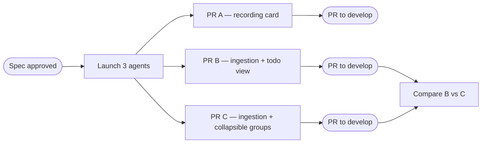

# blocklist-show-spans — Recording card + intent-span rendering (3-PR handoff spec)

## Goal

Ship three independent, separately-reviewable client PRs that improve how computer-use video recordings and intent spans appear in the AI blocklist:

- **PR A** — Improve the recording start card: render title *and* description, with real visual hierarchy/chrome.
- **PR B** — Render intent spans as a simple todo-list-like checklist.
- **PR C** — Render intent spans as collapsible, range-based span groups that wrap all in-span content.

B and C are alternative UIs over the same data and are meant to be built in isolation and compared. Each PR is developed on its own git worktree + branch so it can be handed to a separate agent and tested independently.

## Relevant Code

- `app/src/ai/blocklist/block/view_impl/output.rs` — main output render loop (`:327`) and recording-card render chain.
- `app/src/ai/blocklist/block/view_impl/output_tests.rs` — recording-card tests (near `:21`/`:90`/`:102`).
- `app/src/ai/blocklist/block/view_impl/todos.rs` — todo list components (`render_todos` `:27`, `render_todo` `:94`) reused by PR B.
- `crates/ai/src/agent/action/mod.rs` — `AIAgentActionType::StartRecording { summary, description, .. }`.
- `crates/ai/src/agent/action/convert.rs:525` (`summary`), `:526` (`description`) — proto → client action mapping.
- `app/src/ai/blocklist/action_model/recording_controller.rs:132` — `ActiveRecording.description` (stored, unused in UI).
- `app/src/ai/agent/api/convert_from.rs:794` — `Tool::Server(_) => NoClientRepresentation` (drops server tool calls).
- `app/src/ai/agent/api/convert_conversation.rs:565` — server tool-call *results* dropped (`convert_tool_call_result_to_input`).
- `app/src/ai/agent/conversation.rs:1756` — `recording_spans_by_action_id`; `RecordingSpanInfo`/`RecordingSpanStatus` at `:97`; flush-as-active at `:1872` (reference pattern for the intent-span deriver).
- warp-server (context only): `logic/ai/multi_agent/agents/computer_use/tools/report_intent.go`, `.../report_outcome.go`, `.../tools.go:86`; `logic/ai/multi_agent/runtime/report_intent.go:105` (`scanIntentSpans`).

## Current State

### Recording start card

Dispatch at `output.rs:788` matches `AIAgentActionType::StartRecording { summary, .. }` and calls `render_start_recording(props, id, summary.as_deref(), app)` — only `summary` is forwarded. Chain: `render_start_recording` (`:3111`) → `recording_summary` (`:2983`) → `start_recording_card_text` (`:3002`, returns `RecordingCardText { primary, subtext }`) → `recording_card` (`:3075`). Today the card shows `primary = "Recording started"` and `subtext = title`; it is a red dot icon + primary line + one muted subtext line, no border/background.

The action already carries both `summary: Option<String>` and `description: Option<String>` (populated at `convert.rs:525`/`:526`), and `description` is stored on `ActiveRecording.description`, but `description` is never rendered in the blocklist.

### Intent spans (server model)

Computer-use subagent tools: `report_intent { label } -> { intent_id }` and `report_outcome { intent_id, status: SUCCESS|FAILURE|INCONCLUSIVE, summary }`. The runtime enforces flat spans (exactly one open at a time) and pairs outcome → intent by `tool_call_id`. Both are **server tool calls** (nil client tool type).

### Client gap and feasibility

The client discards these today: `convert_from.rs:794` maps `Tool::Server(_) => NoClientRepresentation`, and server tool-call results return `None` in `convert_conversation.rs`. So intent spans never reach the blocklist.

Crucially, the client (`Cargo.toml:348`) and server (`warp-server/go.mod`) pin the **same** `warp-proto-apis` rev (`b0886a9`), and the server actively uses `ReportIntent`/`ReportOutcome` at that rev. The data is therefore already on the wire inside `Tool::Server(...)` and the matching `ServerToolCallResult` — **PR B and PR C are client-only** (no server or proto changes) once the client decodes and surfaces it.

### Heterogeneous span contents (drives PR C)

The computer-use subagent is a full LLM agent, so between `report_intent` and `report_outcome` the stream contains mixed rows: `Thinking` blocks (`output.rs:391`), occasional bare agent text (`:336`), `run_shell_command` rows, screenshots, and `use_computer` rows. The existing recording-span footer (`recording_spans_by_action_id`; `render_recording_footer` `:3129`) sidesteps this by only decorating `use_computer` rows. A grouping *container* must therefore be range-based (group everything between the two boundaries), not type-filtered.

## Conventions (all three PRs)

- Read the `gui-ui-guidelines` skill before writing UI; prefer existing theme tokens/elements (`recording_card`, `todos.rs`, `render_collapsible_block`).
- Minimal comments (intent only); tests only for logic worth protecting from regression (`rust-unit-tests`).
- Visually verify with `gui-integration-test`/`gui-integration-test-video` (recording capture) or `test-warp-ui`.
- Each PR: new worktree + branch off `origin/develop` (current `varoon/va-blocklist-show-spans` is at develop HEAD, so equivalent). Example: `git worktree add ../warp.blocklist-recording-card -b varoon/blocklist-recording-card origin/develop`. PRs target `develop`.

## Proposed Changes

### PR A — Recording card: title + description + chrome

Rendering only; no data/proto/server changes. Gated by the existing `FeatureFlag::VideoRecording` (these cards only render for recording actions), so no new flag.

Changes (all in `output.rs`):

- Thread `description` through: extend the dispatch arm at `:788` to also bind `description` and pass it into `render_start_recording` (widen the signature). Keep the conversation-title fallback for the title only.
- Rework `RecordingCardText`/`start_recording_card_text` (`:2996`/`:3002`) to carry three roles: a small muted status eyebrow ("Recording started" / "Starting recording" / error states), a prominent title line, and a muted description line. Preserve existing error/cancelled/None copy.
- In `recording_card` (`:3075`) render the hierarchy (eyebrow → title → description) and give the card real chrome (border + background) consistent with other cards in this file (blocked-action / `RunAgents`). Keep the red `recording_icon`.
- Optional stretch (only if low-risk): fold start+stop into one evolving card keyed by `recording_id` so it transitions `Recording…` → `Recorded • m:ss` with the existing "Open recording" button (`render_stop_recording`, `:3170`). If it grows the diff much, defer to a follow-up.

Tests: update `output_tests.rs` recording assertions for the new title+description structure; add a case proving description renders and an empty description is omitted.

Out of scope: thumbnails/poster frames; any span rendering.

### Shared intent-span ingestion (implemented independently in PR B and PR C)

Both B and C need identical plumbing. Implement it the same way in each branch (self-contained for isolated evaluation); factor into a shared module only if both ultimately merge.

1. **Verify proto variants** exist in `warp_multi_agent_api` at the pinned rev (`ServerToolCall::ReportIntent`, `::ReportOutcome`, and the `ServerToolCallResult` intent-id success). They should be present (same rev the server uses); if absent, bump the `Cargo.toml:348` rev to match `warp-server/go.mod`.
2. **Decode the tool calls:** in `convert_from.rs`, stop dropping the relevant `Tool::Server(...)` payloads — decode `ReportIntent`/`ReportOutcome` into new client output-message/action representations (add variant(s) alongside the existing `AIAgentOutputMessageType`s). Decode the `report_intent` result (carrying `intent_id`) in `convert_conversation.rs` where server tool-call results are currently dropped (`:565`).
3. **Derive spans:** add `intent_spans_by_action_id` (or an ordered `Vec<IntentSpan>`) on `conversation.rs`, mirroring `recording_spans_by_action_id` (`:1756`) and `RecordingSpanInfo`/`RecordingSpanStatus` (`:97`). Each span = `{ intent_id, label, status: Open|Success|Failure|Inconclusive, summary }` plus the ordered set of enclosed output-message ids (open → outcome by transcript order, pairing outcome → intent by `tool_call_id` exactly as the server does). Leave a never-closed span `Open` (mirror flush-as-active at `:1872`).
4. **Feature flag:** add a client `FeatureFlag` (e.g. `IntentSpansInBlocklist`) via the `add-feature-flag` skill to gate the new UI in both PRs.

### PR B — Intent spans as a todo-like checklist (simple)

Scope: shared ingestion above + a flat, todo-styled rendering. Lowest risk; reuses existing components.

- Rendering: reuse `todos.rs` patterns (`render_todos` `:27`, `render_todo` `:94`). Render the conversation's intent spans as a checklist (e.g. a collapsible "Testing" section): each span is one row, label as the item text, status → icon/color using existing icons (`in_progress_icon` while `Open`; `succeeded_icon`/`failed_icon`/`gray_stop_icon` for Success/Failure/Inconclusive). Show the outcome `summary` as muted subtext once closed. Rows render in transcript order and update in place as outcomes arrive.
- Placement: render inline at the first span's position in the output loop (`output.rs:327`), similar to how todos/web-search views are inserted. Does not need to nest the in-span rows — this view is a standalone summary list.
- Tests: unit-test the deriver (open/close pairing, never-closed = Open, status mapping) plus a render smoke test.
- Out of scope: wrapping/collapsing the actual in-span rows (that is PR C).

### PR C — Intent spans as collapsible range groups (complex)

Scope: shared ingestion above + range-based collapsible grouping of the live stream. Richer UI and the bigger structural change.

- Rendering: in the output render loop (`output.rs:327`), when a `report_intent` boundary is reached, open a collapsible container header (label + status chip; spinner while `Open`) and route every subsequently-rendered row — Thinking, text, shell, screenshots, use_computer — into that container until the matching `report_outcome`, then stamp the outcome status + summary. Model the header on the `Tasks` block / `render_collapsible_block`. This is the key change vs. today's flat push into `output_items`: rows within a span become children of a per-span sub-container.
- Required behaviors:
  - Range-based, not type-filtered — the container absorbs heterogeneous content (the headline benefit: it collapses the noisy in-span reasoning/screenshots/shell behind one labeled, outcome-tagged row).
  - Streaming: while `Open`, header shows in-progress and rows stream in live; never-closed spans stay open.
  - Content outside any span renders flat exactly as today.
  - Preserve per-row affordances inside the group (use_computer "View screenshot", the existing recording footer) — the group wraps rows, it doesn't replace them.
- Tests: deriver tests (shared with B) plus grouping tests: rows correctly bucketed into the enclosing span; heterogeneous rows (thinking + shell + use_computer) all land inside; open/closed header states; ungrouped content unaffected.
- Out of scope: changing the tool contract (e.g. a pre-declared test-plan tool) — a separate future server+proto effort, noted only as context.

## Testing and Validation (each PR)

- Build the client and run `cargo fmt` + clippy (see `fix-errors` / presubmit) on the PR's worktree.
- Run the touched unit tests (`output_tests.rs` for A; deriver/render tests for B and C).
- Visually verify: for A, a start card shows eyebrow + title + description with chrome; for B/C, drive a computer-use session that reports intents/outcomes (or a fixture) and confirm the checklist / collapsible grouping renders and updates. Use `gui-integration-test-video` or `test-warp-ui`.

## Handoff / worktrees

Three parallel PRs, one per worktree+branch off `develop`, no cross-PR ordering:

- **PR A** → worktree `../warp.blocklist-recording-card`, branch `varoon/blocklist-recording-card`. Owns recording-card render fns in `output.rs` + `output_tests.rs`; no intent-span code.
- **PR B** → worktree `../warp.blocklist-intent-spans-todo`, branch `varoon/blocklist-intent-spans-todo`. Owns shared ingestion + todo-style rendering; reuses `todos.rs`; must not restructure the render loop's nesting.
- **PR C** → worktree `../warp.blocklist-intent-spans-collapsible`, branch `varoon/blocklist-intent-spans-collapsible`. Owns shared ingestion + the render-loop nesting change; keep it flag-gated.

Merge strategy: three separate PRs to `develop`. A merges independently. B and C are evaluated against each other; the chosen one merges and the other is closed or adapted. If both merge, a follow-up factors the shared intent-span deriver into one module.

## Risks and Mitigations

- **Proto variants missing at the pinned rev.** Mitigation: step 1 of ingestion verifies presence; bump `Cargo.toml:348` to the server's rev if needed (they should already match).
- **Duplicated ingestion across B and C.** Accepted for isolated evaluation; dedupe into a shared module only if both merge.
- **Render-loop nesting regressions (PR C).** Keep the change flag-gated (`IntentSpansInBlocklist`) so ungrouped rendering is unchanged when off; cover with grouping tests.

## Follow-ups

- Video chapter markers / clickable timeline driven by intent labels + outcomes (the recorder already burns `use_computer` labels into the video via `ActionLogEntry.labels`).
- A pre-declared "test plan" tool (agent declares intended checks up front, rendered todo-style) — separate server + proto change; prototype the client rendering against fabricated data first.
- Recording-card thumbnail/poster frame once the artifact exists.
