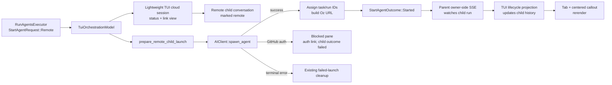

# TECH: TUI Cloud Orchestration Children
Linear: [CODE-1822 — Orchestration](https://linear.app/warpdotdev/issue/CODE-1822/orchestration)
Product: [specs/code-1822-tui-cloud-children/PRODUCT.md](./PRODUCT.md)
Baseline commit: `8f73e01bd1f0638e24ff09f4d24e76d91e2e5b76`

## Context
At the baseline commit, the downstack TUI already configured and accepted remote `run_agents` requests, retained multiple full terminal sessions, materialized native local children, rendered child messages/status identities, and navigated an orchestration tree. The remaining remote arm deliberately resolved as unsupported:
- [`crates/warp_tui/src/orchestration_model.rs (371-659) @ 8f73e01b`](https://github.com/warpdotdev/warp/blob/8f73e01bd1f0638e24ff09f4d24e76d91e2e5b76/crates/warp_tui/src/orchestration_model.rs#L371-L659) — `TuiOrchestrationModel` subscribes to each retained session's `StartAgentExecutor`, registers the parent event consumer, materializes native children, and fails Remote requests. It also owns the narrow child-conversation/session map used by failed-launch cleanup.
- [`crates/warp_tui/src/session_registry.rs (20-175) @ 8f73e01b`](https://github.com/warpdotdev/warp/blob/8f73e01bd1f0638e24ff09f4d24e76d91e2e5b76/crates/warp_tui/src/session_registry.rs#L20-L175) — every `TuiSession` retains one `TuiTerminalSessionView` and a type-erased `TerminalManagerTrait`; the view ID is also the terminal surface ID used by shared AI models.
- [`crates/warp_tui/src/session.rs (175-215) @ 8f73e01b`](https://github.com/warpdotdev/warp/blob/8f73e01bd1f0638e24ff09f4d24e76d91e2e5b76/crates/warp_tui/src/session.rs#L175-L215) — `create_local_terminal_session` is the single local PTY materializer and the pattern for registering focused/background sessions.
- [`crates/warp_tui/src/terminal_session_view.rs (220-420) @ 8f73e01b`](https://github.com/warpdotdev/warp/blob/8f73e01bd1f0638e24ff09f4d24e76d91e2e5b76/crates/warp_tui/src/terminal_session_view.rs#L220-L420) and [`terminal_session_view.rs (2450-2660) @ 8f73e01b`](https://github.com/warpdotdev/warp/blob/8f73e01bd1f0638e24ff09f4d24e76d91e2e5b76/crates/warp_tui/src/terminal_session_view.rs#L2450-L2660) — the full session view owns input, transcript, terminal routing, orchestration tabs, focus, and the normal render tree. Cloud session mode must short-circuit these responsibilities rather than thread cloud checks through each child component.

The shared executor contract already supports frontend-owned materialization:
- [`app/src/ai/blocklist/action_model/execute/run_agents.rs (211-409) @ 8f73e01b`](https://github.com/warpdotdev/warp/blob/8f73e01bd1f0638e24ff09f4d24e76d91e2e5b76/app/src/ai/blocklist/action_model/execute/run_agents.rs#L211-L409) — `RunAgentsExecutor` translates approved remote configuration into per-child `StartAgentRequest`s, fans them out, and applies the existing 30-second terminal spawn timeout.
- [`app/src/ai/blocklist/action_model/execute/start_agent.rs (108-306) @ 8f73e01b`](https://github.com/warpdotdev/warp/blob/8f73e01bd1f0638e24ff09f4d24e76d91e2e5b76/app/src/ai/blocklist/action_model/execute/start_agent.rs#L108-L306) — `StartAgentExecutor` links the frontend-created child conversation, resolves launch after run-ID assignment, and reports startup errors from conversation status.
- [`app/src/ai/blocklist/action_model/execute/start_agent.rs (496-644) @ 8f73e01b`](https://github.com/warpdotdev/warp/blob/8f73e01bd1f0638e24ff09f4d24e76d91e2e5b76/app/src/ai/blocklist/action_model/execute/start_agent.rs#L496-L644) — blocked startup is reported as a failed child outcome but retained, while terminal pre-run errors emit `CleanupFailedChildLaunch`. This behavior remains unchanged.

The GUI proves the deferred-terminal architecture but mixes reusable launch preparation with GUI-owned pane behavior:
- [`app/src/pane_group/pane/terminal_pane.rs (1910-2149) @ 8f73e01b`](https://github.com/warpdotdev/warp/blob/8f73e01bd1f0638e24ff09f4d24e76d91e2e5b76/app/src/pane_group/pane/terminal_pane.rs#L1910-L2149) — `launch_remote_child` creates a hidden PTY-less cloud pane and child conversation, normalizes remote configuration, resolves runtime skills, builds `SpawnAgentRequest`, and delegates launch to `AmbientAgentViewModel`.
- [`app/src/terminal/view/ambient_agent/model.rs (156-354) @ 8f73e01b`](https://github.com/warpdotdev/warp/blob/8f73e01bd1f0638e24ff09f4d24e76d91e2e5b76/app/src/terminal/view/ambient_agent/model.rs#L156-L354) and [`model.rs (1253-1687) @ 8f73e01b`](https://github.com/warpdotdev/warp/blob/8f73e01bd1f0638e24ff09f4d24e76d91e2e5b76/app/src/terminal/view/ambient_agent/model.rs#L1253-L1687) — GUI-only startup/session progress, error classification, GitHub-auth handling, task polling, and shared-session readiness. The TUI must not reuse this pane model or change its behavior.
- [`app/src/terminal/terminal_manager.rs (24-42) @ 8f73e01b`](https://github.com/warpdotdev/warp/blob/8f73e01bd1f0638e24ff09f4d24e76d91e2e5b76/app/src/terminal/terminal_manager.rs#L24-L42) — `TerminalManagerTrait` requires a terminal model and downcasting, not a local PTY.
- [`app/src/terminal/model/terminal_model.rs (1148-1181) @ 8f73e01b`](https://github.com/warpdotdev/warp/blob/8f73e01bd1f0638e24ff09f4d24e76d91e2e5b76/app/src/terminal/model/terminal_model.rs#L1148-L1181) — `new_for_cloud_mode_shared_session_viewer` creates the GUI's deferred PTY-less cloud terminal model. The TUI uses the same model state so a future viewer can attach without replacing the session or changing its surface ID.
- [`app/src/terminal/shared_session/viewer/terminal_manager.rs (202-405) @ 8f73e01b`](https://github.com/warpdotdev/warp/blob/8f73e01bd1f0638e24ff09f4d24e76d91e2e5b76/app/src/terminal/shared_session/viewer/terminal_manager.rs#L202-L405) — the GUI viewer manager's `new_internal` builds event channels, an inactive PTY-read receiver, the PTY-less model, `Sessions`, `ModelEventDispatcher`, and a normal `TerminalView` before a shared session exists; `new_deferred` exposes that state for cloud panes.
- [`app/src/terminal/view/ambient_agent/mod.rs (54-159) @ 8f73e01b`](https://github.com/warpdotdev/warp/blob/8f73e01bd1f0638e24ff09f4d24e76d91e2e5b76/app/src/terminal/view/ambient_agent/mod.rs#L54-L159) — `create_cloud_mode_view` retains the concrete deferred viewer behind `Box<dyn TerminalManager>`, then `wire_ambient_agent_session_events` downcasts it and connects the same manager/view in place when `SessionReady` arrives.
- [`app/src/pane_group/mod.rs (4105-4155) @ 8f73e01b`](https://github.com/warpdotdev/warp/blob/8f73e01bd1f0638e24ff09f4d24e76d91e2e5b76/app/src/pane_group/mod.rs#L4105-L4155) — remote children use this same deferred manager/view as an off-tree terminal pane, preserving pane and surface identity until the user reveals it or a shared session attaches.

The parent event stream already receives child lifecycle events, but its owner-side path queues them for the parent rather than mutating remote child history:
- [`app/src/ai/blocklist/orchestration_event_streamer.rs (196-395) @ 8f73e01b`](https://github.com/warpdotdev/warp/blob/8f73e01bd1f0638e24ff09f4d24e76d91e2e5b76/app/src/ai/blocklist/orchestration_event_streamer.rs#L196-L395) — owner-side per-conversation stream state and existing viewer-mode `ChildStatusChanged` event.
- [`app/src/ai/blocklist/orchestration_event_streamer.rs (911-1110) @ 8f73e01b`](https://github.com/warpdotdev/warp/blob/8f73e01bd1f0638e24ff09f4d24e76d91e2e5b76/app/src/ai/blocklist/orchestration_event_streamer.rs#L911-L1110) — viewer-mode ancestor events emit child status broadcasts; this path must not be registered by the TUI because it would duplicate the parent's active SSE connection.
- [`app/src/ai/blocklist/orchestration_event_streamer.rs (2141-2340) @ 8f73e01b`](https://github.com/warpdotdev/warp/blob/8f73e01bd1f0638e24ff09f4d24e76d91e2e5b76/app/src/ai/blocklist/orchestration_event_streamer.rs#L2141-L2340) — canonical lifecycle-wire mapping into `ConversationStatus`, reused by the new owner-side notification.

## Implemented design
### 1. Extract shared remote-child launch preparation, not a launch coordinator
Add a frontend-neutral module under `app/src/ai/orchestration`, re-exported through `app/src/tui_export.rs`, containing:
- `RemoteChildLaunchConfig`: the remote fields currently destructured into GUI-local `RemoteLaunchFields`.
- `PreparedRemoteChildLaunch`: normalized child/display name, parsed orchestration harness, and final `SpawnAgentRequest`.
- `PrepareRemoteChildLaunchError`: missing parent run ID and unresolved required skills.
- `prepare_remote_child_launch`: resolves runtime skills and builds the wire request with the GUI's current semantics for empty environments, unknown harness overrides, model/worker host, Oz-only computer use, Claude/Codex managed auth secrets, title, parent run ID, interactive mode, and snapshot policy.

Move the configuration mapping from `terminal_pane.rs::launch_remote_child` into this helper and make the GUI call it without changing pane creation, conversation ordering, `AmbientAgentViewModel`, spawn polling, error handling, retry, run-ID assignment, or session attachment. Keep the helper limited to launch preparation; it must not accept frontend callbacks or own mutable launch state.

Extract the launch-error interpretation needed by both frontends into shared data:
- `CloudAgentStartupBlocker::GitHubAuthRequired { message, auth_url }`.
- `CloudAgentStartupFailure::{Capacity, OutOfCredits, ServerOverloaded, Other}`.
- A classifier that preserves the GUI's existing downcasts, fallback messages, and cloud-setup auth URL construction.

The GUI maps these shared values into its existing `Status` and events without changing control flow. The TUI uses the same values in its cloud-session display state. Do not introduce a shared launch coordinator or duplicate `StartAgentExecutor` outcome state.

### 2. Retain lightweight cloud-run sessions without terminal machinery
Generalize `TuiSessions` so each retained entry contains one of:
- A `TuiTerminalSessionView` and the `TerminalManagerTrait` that keeps its PTY alive.
- A `TuiCloudRunView` with no terminal manager.

The concrete view entity ID remains the `TuiSessionId` and the history surface ID for both variants. `TuiSessionView` centralizes the small cross-variant operations required by the registry and root view: resolve the window and entity IDs, activate the focused view, refresh orchestration tabs, and preserve tab focus while switching sessions.

Add `create_cloud_run_session` beside `create_local_terminal_session` in `crates/warp_tui/src/session_registry.rs`. It creates an unfocused `TuiCloudRunView`, registers it without a manager, and returns the stable session ID used to create the remote child conversation.

Do not create a `TerminalModel`, terminal `Sessions`, `ModelEventDispatcher`, PTY-read broadcast channel, resize/wakeup streams, transcript, input model, AI controller, menus, or local/shared terminal manager for a read-only cloud-run session. Future shared-session viewing may replace this variant with a terminal-backed cloud view when that capability is implemented; v0 does not preallocate an unused transport surface.

### 3. Add cloud run state and a dedicated view
Add a per-session `TuiCloudRunState` model containing:
- Child conversation ID.
- Shared startup display state (`Dispatching`, `Blocked`, `Failed`, or `Spawned`).
- Optional task ID, run ID, and deterministic Oz run URL.

Do not duplicate ongoing `ConversationStatus`; after run-ID assignment the view reads the authoritative status from `BlocklistAIHistoryModel`.
Add `TuiCloudRunView` in `crates/warp_tui/src/cloud_run_view.rs`. It owns only `TuiCloudRunState`, the reusable link, orchestration tab bar, tab-focus state, and read-only exit confirmation. Its display-state derivation maps startup state plus history status into the centered callout and primary link.

Move shared orchestration-tab configuration and footer presentation into `crates/warp_tui/src/orchestration_tab_bar.rs` so terminal and cloud views preserve identical ordering, paging, status glyphs, identity styling, and focused-tab treatment without sharing terminal state.

Give `TuiCloudRunView` its own typed actions and keymap context. `Shift+Up` focuses its orchestration tab bar, Enter opens the current primary URL, and tab navigation switches through `TuiSessions`. The unfocused footer reuses `Shift + ↑ sub-agents`; the focused cloud-tab footer omits `Shift+Down` because the cloud body has no input target.

Keep `TuiTerminalSessionView` terminal-only. No printable input or PTY intent can originate from `TuiCloudRunView`.

### 4. Create remote sessions in `TuiSessions` and own launch lifecycle in `TuiOrchestrationModel`
Replace the Remote failure arm in `dispatch_create_agent` with a split TUI-owned launch flow:
1. Call the shared preparer. A preparation failure is surfaced through the existing failed-child contract rather than timing out.
2. Emit `CreateRemoteChildSession`; `TuiSessions` eagerly creates an unfocused lightweight cloud-run session and `TuiCloudRunState::Dispatching`, returning only the retained session ID and state model.
3. `TuiOrchestrationModel::register_remote_child_session` creates the child conversation on that session's surface, marks it remote, sets it active for the surface, and calls `record_new_conversation_request_complete` using the existing GUI ordering.
4. Record the conversation/session mapping before dispatch so `CleanupFailedChildLaunch` can remove terminal pre-run failures.
5. Call `AIClient::spawn_agent` directly. Do not use `spawn_task`: v0 needs the returned task/run IDs and deterministic Oz URL, not a joinable shared-session signal.
6. On success, update `TuiCloudRunState`, assign the task/run IDs through `BlocklistAIHistoryModel::assign_run_id_for_conversation`, and leave `StartAgentExecutor` to resolve the child and register the run under the parent.
7. On `GitHubAuthRequired`, set the shared blocked presentation and update the child conversation to `ConversationStatus::Blocked` with the shared message. Existing executor behavior reports a failed child outcome but emits no cleanup, leaving the actionable pane visible. Do not subscribe to `GitHubAuthNotifier` or automatically retry.
8. On a terminal startup failure, set the shared failure/error in history. Existing `CleanupFailedChildLaunch` removes the optimistic session and conversation.

Keep GUI launch ownership unchanged. `TuiSessions` owns retained session/view resources; `TuiOrchestrationModel` owns conversation registration, request completion, server launch, and launch outcomes. No new singleton coordinates both frontends.

### 5. Project owner-side lifecycle events into TUI child status
Extend `OrchestrationEventStreamerEvent` with an owner-side watched-run lifecycle notification carrying:
- Owner/parent conversation ID.
- Child run ID.
- Canonically mapped `ConversationStatus`.

Emit it while draining lifecycle events already received by the parent's existing owner-side SSE connection. Preserve current message hydration, event queueing, cursor advancement, eligibility, and viewer-mode behavior.

Subscribe `TuiOrchestrationModel` to this event. For each notification:
1. Resolve the run ID through `BlocklistAIHistoryModel`'s authoritative agent-ID index.
2. Require the resolved conversation to be a remote child of the indicated parent.
3. Resolve its retained TUI surface and update that conversation's status in history.
4. No-op when the run, conversation, parent relationship, or retained session no longer matches.

Only the TUI subscriber performs the history mutation. GUI code does not subscribe, so the change cannot clobber GUI-owned ambient status. Do not register a viewer-mode consumer and do not poll `get_ambient_agent_task`.

### 6. Add a reusable TUI link element
Add `crates/warp_tui/src/link.rs` with a reusable `TuiLink` presentation helper:
- Owns a persistent `MouseStateHandle` outside the render pass.
- Renders caller-provided label/URL text with semantic normal and hover styles from `TuiUiBuilder`.
- Uses `TuiHoverable` for footprint-correct click handling.
- Accepts an `on_open` callback; it contains no cloud-specific URL construction or copy.

The cloud run view uses a typed `OpenUrl(String)` action for both link clicks and Enter while the read-only cloud session is focused. The view action calls `ctx.open_url`; the element itself does not mutate application state. The same element renders the Oz run URL and GitHub authentication URL.

Keep keyboard ownership in `TuiCloudRunView`, not the element: Enter is active only for a focused cloud session with a primary link. Visible URL text remains available to the host terminal's normal selection/copy behavior.

### 7. Exports and cleanup
Re-export only the least-visible shared APIs needed by `warp_tui` through `app/src/tui_export.rs`: the prepared launch types/helper, startup blocker/failure values, spawn response/request types if not already exported, and the owner-side lifecycle event.
Use `TuiOrchestrationModel::child_session_by_conversation` only to locate retained sessions for failed-launch cleanup, and prune it whenever any retained child session is removed. Conversation lineage, navigation, run-ID lookup, and lifecycle routing remain authoritative in shared history and existing topology helpers.

Both frontends consume the remote configuration, request preparer, spawn request, startup classifier, and startup issue enums. The TUI additionally reads the prepared display name/harness, startup-value accessors, Oz run URL, and owner-side watched-run payload fields. Those definitions remain frontend-neutral, while narrowly scoped `cfg_attr(not(feature = "tui"), allow(...))` annotations cover only the TUI-only re-exports, fields, and accessors so non-TUI builds stay warning-clean. Native-only imports used by local child launch paths remain gated from WASM.

## End-to-end flow

## Testing and validation
### Shared launch preparation and error classification
- `app/src/ai/orchestration/remote_child_tests.rs` covers default-Oz and Claude harness parsing, normalized display names, the full Oz happy-path request shape, explicit environment/runner/model/worker-host/computer-use propagation, parent run ID, and agent identity.
- Error-classification tests cover GitHub-auth blockers and their callback URL, capacity failures, quota messages, and fallback failures.
- The GUI and TUI both compile against `prepare_remote_child_launch` and `classify_cloud_agent_startup_error`; GUI launch ordering and `AmbientAgentViewModel` ownership remain unchanged.

### Lightweight cloud session view
- `crates/warp_tui/src/orchestration_model_tests.rs` exercises lightweight cloud-session construction through `TuiSessions`, including the centered dispatching state, cloud footer, retained navigation, and lifecycle projection.
- `crates/warp_tui/src/cloud_run_view_tests.rs` verifies the standalone view's dispatching and GitHub-auth-blocked callouts, including the actionable authentication URL, without constructing terminal state.
- `crates/warp_tui/src/link_tests.rs:9` verifies the reusable link's default underlined rendering.
- Failed/spawned callouts, narrow-width wrapping, resize recentering, theme variants, hover/click behavior, and Enter-to-open behavior do not currently have dedicated render-to-lines or action coverage.

### Orchestration launch and lifecycle
- `crates/warp_tui/src/orchestration_model_tests.rs` covers local-harness failure, GitHub-auth blocker retention, orchestration snapshots and paging, a retained remote child moving from dispatching to a projected success status, and local failed-launch cleanup.
- The remote lifecycle fixture exercises `WatchedRunStatusChanged` through the TUI subscriber in `crates/warp_tui/src/orchestration_model.rs`. There is no dedicated streamer-level test for the event's cursor/dedup path, and no dedicated coverage for mismatched/stale events, mixed local/remote concurrency, successful spawn response assignment, or retained error/cancelled states.

### Build and lint validation
Run:
- `./script/format`
- `cargo clippy -p warp --all-targets --tests -- -D warnings`
- `cargo clippy -p warp_tui --all-targets --tests -- -D warnings`
- `cargo clippy --target wasm32-unknown-unknown --profile release-wasm-debug_assertions --no-deps`
- `git diff --check`

The WASM check remains required for the shared app changes. The TUI cloud path does not alter shared-session viewer construction or move `TerminalSurfaceInit` out of `terminal::local_tty`.

### Live verification
Use `tui-verify-change` with `./script/run-tui`:
1. Launch at least two remote children and one local child from one orchestration.
2. Verify immediate background tabs without focus theft.
3. Switch among children while remote statuses transition.
4. Open the Oz URL by mouse and Enter.
5. Exercise an authentication-required launch and verify the retained blocked pane, auth link, failed child result, and no automatic retry.
6. Resize across narrow and wide terminal widths and verify centering, wrapping, tab stability, and input suppression.

Run focused behavioral validation:
- `cargo nextest run -p warp_tui orchestration`
- `cargo nextest run -p warp_tui terminal_session`
- Focused app tests for the shared preparer, startup classifier, and event streamer.
Before submission, run `./script/presubmit` in addition to the focused and target-specific checks above.

## Parallelization
Do not split implementation across child agents. Shared launch preparation must preserve the GUI contract while TUI session creation, heterogeneous registry behavior, history linkage, lifecycle projection, and cloud-session rendering share ordering and identity invariants. The reusable link element is independent but small; integrating it sequentially avoids worktree/stack coordination overhead. Long-running focused test groups may run concurrently after implementation.

## Risks and mitigations
- **GUI behavior drift during extraction:** keep `AmbientAgentViewModel` and `launch_remote_child` ordering intact; move only normalized request construction and error interpretation, with parity tests over every mapped field and error kind.
- **Cloud session accidentally acquires terminal behavior:** keep it in the `TuiSessionView::Cloud` variant with no manager or terminal model, and scope all actions to `TuiCloudRunView`.
- **Lifecycle status clobbers GUI state:** emit an owner-side event but perform history projection only in `TuiOrchestrationModel`, after validating remote-child identity and parent linkage.
- **Duplicate status sources:** startup presentation ends at run-ID assignment; ongoing status comes only from history. Do not poll task state or store a second ongoing status in `TuiCloudRunState`.
- **Failed-launch cleanup removes a blocker:** preserve existing executor semantics—`Blocked` produces a failed outcome without cleanup; only terminal `Error`/`Cancelled` pre-run states remove the optimistic session.
- **Stale run events target a reused surface:** resolve through history's run-ID index and revalidate parent, remote-child flag, and retained surface before updating.
- **Heterogeneous session drift:** keep cross-variant focus, tab refresh, and window lookup behind `TuiSessionView`; terminal-only events remain wired only by `register_session`.
- **Future session viewing requires a terminal-backed variant:** add or replace the cloud session variant when shared viewing is implemented and transfer the conversation surface if in-place upgrade is required. Do not preallocate unused terminal infrastructure in v0.
