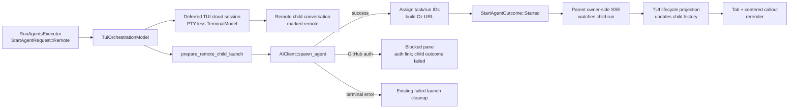

# TECH: TUI Cloud Orchestration Children
Linear: [CODE-1822 — Orchestration](https://linear.app/warpdotdev/issue/CODE-1822/orchestration)
Product: [specs/code-1822-tui-cloud-children/PRODUCT.md](./PRODUCT.md)
Inspected commit: `8f73e01bd1f0638e24ff09f4d24e76d91e2e5b76`

## Context
The downstack TUI already configures and accepts remote `run_agents` requests, retains multiple full terminal sessions, materializes native local children, renders child messages/status identities, and navigates an orchestration tree. The remaining remote arm deliberately resolves as unsupported:
- [`crates/warp_tui/src/orchestration_model.rs (371-659) @ 8f73e01b`](https://github.com/warpdotdev/warp/blob/8f73e01bd1f0638e24ff09f4d24e76d91e2e5b76/crates/warp_tui/src/orchestration_model.rs#L371-L659) — `TuiOrchestrationModel` subscribes to each retained session's `StartAgentExecutor`, registers the parent event consumer, materializes native children, and fails Remote requests. It also owns the narrow child-conversation/session map used by failed-launch cleanup.
- [`crates/warp_tui/src/session_registry.rs (20-175) @ 8f73e01b`](https://github.com/warpdotdev/warp/blob/8f73e01bd1f0638e24ff09f4d24e76d91e2e5b76/crates/warp_tui/src/session_registry.rs#L20-L175) — every `TuiSession` retains one `TuiTerminalSessionView` and a type-erased `TerminalManagerTrait`; the view ID is also the terminal surface ID used by shared AI models.
- [`crates/warp_tui/src/session.rs (175-215) @ 8f73e01b`](https://github.com/warpdotdev/warp/blob/8f73e01bd1f0638e24ff09f4d24e76d91e2e5b76/crates/warp_tui/src/session.rs#L175-L215) — `create_local_terminal_session` is the single local PTY materializer and the pattern for registering focused/background sessions.
- [`crates/warp_tui/src/terminal_session_view.rs (220-420) @ 8f73e01b`](https://github.com/warpdotdev/warp/blob/8f73e01bd1f0638e24ff09f4d24e76d91e2e5b76/crates/warp_tui/src/terminal_session_view.rs#L220-L420) and [`terminal_session_view.rs (2450-2660) @ 8f73e01b`](https://github.com/warpdotdev/warp/blob/8f73e01bd1f0638e24ff09f4d24e76d91e2e5b76/crates/warp_tui/src/terminal_session_view.rs#L2450-L2660) — the full session view owns input, transcript, terminal routing, orchestration tabs, focus, and the normal render tree. Cloud session mode must short-circuit these responsibilities rather than thread cloud checks through each child component.

The shared executor contract already supports frontend-owned materialization:
- [`app/src/ai/blocklist/action_model/execute/run_agents.rs (211-409) @ 8f73e01b`](https://github.com/warpdotdev/warp/blob/8f73e01bd1f0638e24ff09f4d24e76d91e2e5b76/app/src/ai/blocklist/action_model/execute/run_agents.rs#L211-L409) — `RunAgentsExecutor` translates approved remote configuration into per-child `StartAgentRequest`s, fans them out, and applies the existing 30-second terminal spawn timeout.
- [`app/src/ai/blocklist/action_model/execute/start_agent.rs (108-306) @ 8f73e01b`](https://github.com/warpdotdev/warp/blob/8f73e01bd1f0638e24ff09f4d24e76d91e2e5b76/app/src/ai/blocklist/action_model/execute/start_agent.rs#L108-L306) — `StartAgentExecutor` links the frontend-created child conversation, resolves launch after run-ID assignment, and reports startup errors from conversation status.
- [`app/src/ai/blocklist/action_model/execute/start_agent.rs (496-644) @ 8f73e01b`](https://github.com/warpdotdev/warp/blob/8f73e01bd1f0638e24ff09f4d24e76d91e2e5b76/app/src/ai/blocklist/action_model/execute/start_agent.rs#L496-L644) — blocked startup is reported as a failed child outcome but retained, while terminal pre-run errors emit `CleanupFailedChildLaunch`. This behavior remains unchanged.

The GUI proves the deferred-terminal architecture but mixes reusable launch preparation with GUI-owned pane behavior:
- [`app/src/pane_group/pane/terminal_pane.rs (1910-2149) @ 8f73e01b`](https://github.com/warpdotdev/warp/blob/8f73e01bd1f0638e24ff09f4d24e76d91e2e5b76/app/src/pane_group/pane/terminal_pane.rs#L1910-L2149) — `launch_remote_child` creates a hidden PTY-less cloud pane and child conversation, normalizes remote configuration, resolves runtime skills, builds `SpawnAgentRequest`, and delegates launch to `AmbientAgentViewModel`.
- [`app/src/terminal/view/ambient_agent/model.rs (156-354) @ 8f73e01b`](https://github.com/warpdotdev/warp/blob/8f73e01bd1f0638e24ff09f4d24e76d91e2e5b76/app/src/terminal/view/ambient_agent/model.rs#L156-L354) and [`model.rs (1253-1687) @ 8f73e01b`](https://github.com/warpdotdev/warp/blob/8f73e01bd1f0638e24ff09f4d24e76d91e2e5b76/app/src/terminal/view/ambient_agent/model.rs#L1253-L1687) — GUI-only startup/session progress, error classification, GitHub-auth handling, task polling, and shared-session readiness. The TUI must not reuse this pane model or change its behavior.
- [`app/src/terminal/terminal_manager.rs (24-42) @ 8f73e01b`](https://github.com/warpdotdev/warp/blob/8f73e01bd1f0638e24ff09f4d24e76d91e2e5b76/app/src/terminal/terminal_manager.rs#L24-L42) — `TerminalManagerTrait` requires a terminal model and downcasting, not a local PTY.
- [`app/src/terminal/model/terminal_model.rs (1148-1181) @ 8f73e01b`](https://github.com/warpdotdev/warp/blob/8f73e01bd1f0638e24ff09f4d24e76d91e2e5b76/app/src/terminal/model/terminal_model.rs#L1148-L1181) — `new_for_cloud_mode_shared_session_viewer` creates the GUI's deferred PTY-less cloud terminal model. The TUI uses the same model state so a future viewer can attach without replacing the session or changing its surface ID.
- [`app/src/terminal/shared_session/viewer/terminal_manager.rs (202-405) @ 8f73e01b`](https://github.com/warpdotdev/warp/blob/8f73e01bd1f0638e24ff09f4d24e76d91e2e5b76/app/src/terminal/shared_session/viewer/terminal_manager.rs#L202-L405) — the GUI viewer manager's `new_internal` builds event channels, an inactive PTY-read receiver, the PTY-less model, `Sessions`, `ModelEventDispatcher`, and a normal `TerminalView` before a shared session exists; `new_deferred` exposes that state for cloud panes.
- [`app/src/terminal/view/ambient_agent/mod.rs (54-159) @ 8f73e01b`](https://github.com/warpdotdev/warp/blob/8f73e01bd1f0638e24ff09f4d24e76d91e2e5b76/app/src/terminal/view/ambient_agent/mod.rs#L54-L159) — `create_cloud_mode_view` retains the concrete deferred viewer behind `Box<dyn TerminalManager>`, then `wire_ambient_agent_session_events` downcasts it and connects the same manager/view in place when `SessionReady` arrives.
- [`app/src/pane_group/mod.rs (4105-4155) @ 8f73e01b`](https://github.com/warpdotdev/warp/blob/8f73e01bd1f0638e24ff09f4d24e76d91e2e5b76/app/src/pane_group/mod.rs#L4105-L4155) — remote children use this same deferred manager/view as an off-tree terminal pane, preserving pane and surface identity until the user reveals it or a shared session attaches.

The parent event stream already receives child lifecycle events, but its owner-side path queues them for the parent rather than mutating remote child history:
- [`app/src/ai/blocklist/orchestration_event_streamer.rs (196-395) @ 8f73e01b`](https://github.com/warpdotdev/warp/blob/8f73e01bd1f0638e24ff09f4d24e76d91e2e5b76/app/src/ai/blocklist/orchestration_event_streamer.rs#L196-L395) — owner-side per-conversation stream state and existing viewer-mode `ChildStatusChanged` event.
- [`app/src/ai/blocklist/orchestration_event_streamer.rs (911-1110) @ 8f73e01b`](https://github.com/warpdotdev/warp/blob/8f73e01bd1f0638e24ff09f4d24e76d91e2e5b76/app/src/ai/blocklist/orchestration_event_streamer.rs#L911-L1110) — viewer-mode ancestor events emit child status broadcasts; this path must not be registered by the TUI because it would duplicate the parent's active SSE connection.
- [`app/src/ai/blocklist/orchestration_event_streamer.rs (2141-2340) @ 8f73e01b`](https://github.com/warpdotdev/warp/blob/8f73e01bd1f0638e24ff09f4d24e76d91e2e5b76/app/src/ai/blocklist/orchestration_event_streamer.rs#L2141-L2340) — canonical lifecycle-wire mapping into `ConversationStatus`, reused by the new owner-side notification.

## Proposed changes
### 1. Extract shared remote-child launch preparation, not a launch coordinator
Add a frontend-neutral module under `app/src/ai/orchestration`, re-exported through `app/src/tui_export.rs`, containing:
- `RemoteChildLaunchConfig`: the remote fields currently destructured into GUI-local `RemoteLaunchFields`.
- `PreparedRemoteChildLaunch`: normalized child/display name, parsed orchestration harness, and final `SpawnAgentRequest`.
- `PrepareRemoteChildLaunchError`: missing parent run ID and unresolved required skills.
- `prepare_remote_child_launch`: resolves runtime skills and builds the wire request with the GUI's current semantics for empty environments, unknown harness overrides, model/worker host, Oz-only computer use, Claude/Codex managed auth secrets, title, parent run ID, interactive mode, and snapshot policy.

Move the configuration mapping from `terminal_pane.rs::launch_remote_child` into this helper and make the GUI call it without changing pane creation, conversation ordering, `AmbientAgentViewModel`, spawn polling, error handling, retry, run-ID assignment, or session attachment. Keep the helper limited to launch preparation; it must not accept frontend callbacks or own mutable launch state.

Extract the launch-error interpretation needed by both frontends into shared data:
- `CloudAgentStartupBlocker::GitHubAuthRequired { message, auth_url }`.
- `CloudAgentStartupFailure::{Capacity, OutOfCredits, ServerOverloaded, Other}`.
- A classifier that preserves the GUI's existing downcasts, fallback messages, and cloud-setup auth URL construction.

The GUI maps these shared values into its existing `Status` and events without changing control flow. The TUI uses the same values in its cloud-session display state. Do not introduce a shared launch coordinator or duplicate `StartAgentExecutor` outcome state.

### 2. Add a minimal deferred TUI cloud terminal manager
Add `initialize_tui_cloud_viewer_terminal` beside the GUI shared-session viewer terminal manager and re-export it through `tui_export`; it reuses the same PTY-less `TerminalModel`, wakeup/model-event channels, `Sessions`, `ModelEventDispatcher`, terminal colors/size, and inactive PTY-read receiver. Add `crates/warp_tui/src/cloud_terminal_manager.rs` with `TuiCloudTerminalManager`, implementing `TerminalManagerTrait`; it retains the terminal model and inactive receiver while the session view retains the surface's model handles.

The TUI manager owns no local PTY, network transport, session-sharing connection API, polling loop, or speculative connected-state enum.

**GUI prior art:** This deliberately mirrors the GUI's `shared_session::viewer::TerminalManager::new_deferred` construction and lifetime model: create the real terminal model, event plumbing, view, and concrete type-erased manager before a remote session exists, then retain their identities for an eventual in-place attachment. It does not reuse the GUI manager implementation because that implementation constructs `TerminalView` and owns GUI-specific network, orchestration polling, `ActiveAgentViewsModel`, permission, and session-attachment behavior.

Add `create_cloud_terminal_session` beside `create_local_terminal_session` in `crates/warp_tui/src/session_registry.rs`. It creates `TuiCloudTerminalManager`, constructs an unfocused `TuiTerminalSessionView` from its `TerminalSurfaceInit`, and registers the view plus type-erased manager with `TuiSessions`. The resulting view ID remains the `TuiSessionId` and terminal surface ID for the session's lifetime.

The manager is intentionally the valid deferred initial state of a future cloud viewer, not a fake local terminal. Future session-sharing work may add transport to the same concrete manager without replacing the view, manager, conversation, or session identity.

### 3. Add cloud session state and centralize session-mode branching
Add a per-session `TuiCloudRunState` model containing:
- Child conversation ID.
- Shared startup display state (`Dispatching`, blocker, or terminal startup failure).
- Optional task ID, run ID, and deterministic Oz run URL.

Do not duplicate ongoing `ConversationStatus`; after run-ID assignment the view reads the authoritative status from `BlocklistAIHistoryModel`.

Add `TuiTerminalSessionMode::{Local, Cloud(ModelHandle<TuiCloudRunState>)}` to `TuiTerminalSessionView` and a `new_cloud` constructor. Keep all cloud branching behind narrow helpers:
- `cloud_session_display_state` derives the current callout from startup state plus history status.
- `render` returns the cloud session before constructing normal transcript/input/footer content.
- `child_view_ids`, activation/focus, keymap context, and PTY event routing treat an unattached cloud session as self-focused and non-interactive.
- A cloud-session keymap flag scopes `Shift+Up` directly to the existing tab-focus action because the hidden input view cannot emit `FocusAboveRequested`, and scopes Enter to opening the current primary URL regardless of whether the body or tabs own focus. The unfocused footer reuses `Shift + ↑ sub-agents`; the focused cloud-tab footer reuses the regular navigation copy but omits ineffective `Shift+Down`.

Keep cloud-session construction, display-state derivation, rendering, primary-link resolution, and read-only interrupt handling together in `crates/warp_tui/src/terminal_session_view/cloud_session.rs`; the parent session view retains shared mode selection, keybindings, and orchestration-tab coordination.

Do not add cloud checks throughout transcript, input, menus, footer, or shell-command handlers. No printable input or PTY intent is emitted from cloud session mode.

### 4. Create remote sessions in `TuiSessions` and own launch lifecycle in `TuiOrchestrationModel`
Replace the Remote failure arm in `dispatch_create_agent` with a split TUI-owned launch flow:
1. Call the shared preparer. A preparation failure is surfaced through the existing failed-child contract rather than timing out.
2. Emit `CreateRemoteChildSession`; `TuiSessions` eagerly creates an unfocused deferred cloud terminal session and `TuiCloudRunState::Dispatching`, returning only the retained `RemoteChildSession` resources.
3. `TuiOrchestrationModel::register_remote_child_session` creates the child conversation on that session's surface, marks it remote, sets it active for the surface, and calls `record_new_conversation_request_complete` using the existing GUI ordering.
4. Record the conversation/session mapping before dispatch so `CleanupFailedChildLaunch` can remove terminal pre-run failures.
5. Call `AIClient::spawn_agent` directly. Do not use `spawn_task`: v0 needs the returned task/run IDs and deterministic Oz URL, not a joinable shared-session signal.
6. On success, update `TuiCloudRunState`, assign the task/run IDs through `BlocklistAIHistoryModel::assign_run_id_for_conversation`, and leave `StartAgentExecutor` to resolve the child and register the run under the parent.
7. On `GitHubAuthRequired`, set the shared blocked presentation and update the child conversation to `ConversationStatus::Blocked` with the shared message. Existing executor behavior reports a failed child outcome but emits no cleanup, leaving the actionable pane visible. Do not subscribe to `GitHubAuthNotifier` or automatically retry.
8. On a terminal startup failure, set the shared failure/error in history. Existing `CleanupFailedChildLaunch` removes the optimistic session and conversation.

Keep GUI launch ownership unchanged. `TuiSessions` owns retained session/view resources; `TuiOrchestrationModel` owns conversation registration, request completion, server launch, and launch outcomes. No new singleton coordinates both frontends.

### 5. Project owner-side lifecycle events into TUI child status
Extend `OrchestrationEventStreamerEvent` with an owner-side watched-run lifecycle notification carrying:
- Owner/parent conversation ID.
- Child run ID.
- Canonically mapped `ConversationStatus`.

Emit it while draining lifecycle events already received by the parent's existing owner-side SSE connection. Preserve current message hydration, event queueing, cursor advancement, eligibility, and viewer-mode behavior.

Subscribe `TuiOrchestrationModel` to this event. For each notification:
1. Resolve the run ID through `BlocklistAIHistoryModel`'s authoritative agent-ID index.
2. Require the resolved conversation to be a remote child of the indicated parent.
3. Resolve its retained TUI surface and update that conversation's status in history.
4. No-op when the run, conversation, parent relationship, or retained session no longer matches.

Only the TUI subscriber performs the history mutation. GUI code does not subscribe, so the change cannot clobber GUI-owned ambient status. Do not register a viewer-mode consumer and do not poll `get_ambient_agent_task`.

### 6. Add a reusable TUI link element
Add `crates/warp_tui/src/link.rs` with a reusable `TuiLink` presentation helper:
- Owns a persistent `MouseStateHandle` outside the render pass.
- Renders caller-provided label/URL text with semantic normal and hover styles from `TuiUiBuilder`.
- Uses `TuiHoverable` for footprint-correct click handling.
- Accepts an `on_open` callback; it contains no cloud-specific URL construction or copy.

The cloud session view uses a typed `OpenCloudRunUrl(String)` action for both link clicks and Enter while the read-only cloud session is focused. The view action calls `ctx.open_url`; the element itself does not mutate application state. The same element renders the Oz run URL and GitHub authentication URL.

Keep keyboard ownership in `TuiTerminalSessionView`, not the element: Enter is active only for a focused cloud session with a primary link. Visible URL text remains available to the host terminal's normal selection/copy behavior.

### 7. Exports and cleanup
Re-export only the least-visible shared APIs needed by `warp_tui` through `app/src/tui_export.rs`: the prepared launch types/helper, startup blocker/failure values, spawn response/request types if not already exported, and the owner-side lifecycle event.

Continue using `TuiOrchestrationModel::child_session_by_conversation` only for failed-launch cleanup. Conversation lineage, navigation, run-ID lookup, and lifecycle routing remain authoritative in shared history and existing topology helpers.

## End-to-end flow

## Testing and validation
### Shared launch preparation and error classification
- Table-driven tests cover PRODUCT (1, 14, 26-35):
  - Empty and explicit environment IDs.
  - Oz/default, Claude, Codex, Gemini, OpenCode, and unknown harness input.
  - Oz-only computer-use propagation.
  - Claude/Codex auth-secret mapping and ignored unsupported secret combinations.
  - Empty and explicit model, worker host, and title.
  - Parent run-ID validation, runtime-skill resolution, and snapshot policy.
  - GitHub auth, capacity, quota, overload, and fallback error classification.
- Existing GUI tests continue passing against the extracted preparer/classifier, proving the refactor did not change GUI launch behavior.

### Deferred manager and cloud session view
- Unit tests construct `TuiCloudTerminalManager` and assert that it exposes a PTY-less cloud-viewer terminal model and a usable `TerminalSurfaceInit` without starting a local shell.
- Render-to-lines tests cover PRODUCT (7-13, 15-20, 26-28, 36-41):
  - Centered dispatching, launched, blocked-auth, failed, and terminal-status callouts.
  - Status glyph/text parity between the tab snapshot and callout.
  - URL wrapping at narrow widths and recentering after resize.
  - Dark/light theme semantic styles.
  - Click and Enter dispatch the same open-URL action.
  - No transcript, input, zero state, normal terminal metadata footer, or PTY event routing in cloud session mode; only the unfocused sub-agent hint or focused cloud-tab navigation footer renders.
- `TuiLink` tests cover persistent hover styling, footprint-correct click dispatch, label/URL preservation, and reuse with both cloud and authentication URLs.

### Orchestration launch and lifecycle
- Extend `orchestration_model_tests.rs` for PRODUCT (2-6, 14, 21-35):
  - Remote dispatch eagerly creates one unfocused retained session and child conversation.
  - Successful spawn assigns task/run IDs, resolves `run_agents` as launched, produces the channel-correct Oz URL, and leaves the session navigable.
  - GitHub auth produces a retained blocked pane and failed child result with no automatic retry.
  - Terminal pre-run errors trigger existing cleanup and do not affect siblings.
  - Mixed local/remote and concurrent remote children remain isolated.
  - Owner-side lifecycle events map to the correct remote child, update background sessions, ignore stale/mismatched events, and never mutate another tree.
  - Success/error/cancelled lifecycle states retain the pane and URL.
- Streamer tests prove the new owner-side notification reuses the existing connection/cursor path and leaves viewer-mode events and GUI subscribers unchanged.

### Live verification
Use `tui-verify-change` with `./script/run-tui`:
1. Launch at least two remote children and one local child from one orchestration.
2. Verify immediate background tabs without focus theft.
3. Switch among children while remote statuses transition.
4. Open the Oz URL by mouse and Enter.
5. Exercise an authentication-required launch and verify the retained blocked pane, auth link, failed child result, and no automatic retry.
6. Resize across narrow and wide terminal widths and verify centering, wrapping, tab stability, and input suppression.

Run focused validation:
- `cargo nextest run -p warp_tui orchestration`
- `cargo nextest run -p warp_tui terminal_session`
- Focused app tests for the shared preparer, startup classifier, and event streamer.

Before submission, run `./script/format`, the repository-prescribed Clippy command, and `./script/presubmit`.

## Parallelization
Do not split implementation across child agents. Shared launch preparation must preserve the GUI contract while TUI session creation, the deferred manager, history linkage, lifecycle projection, and cloud-session rendering share ordering and identity invariants. The reusable link element is independent but small; integrating it sequentially avoids worktree/stack coordination overhead. Long-running focused test groups may run concurrently after implementation.

## Risks and mitigations
- **GUI behavior drift during extraction:** keep `AmbientAgentViewModel` and `launch_remote_child` ordering intact; move only normalized request construction and error interpretation, with parity tests over every mapped field and error kind.
- **Cloud session behaves like a local terminal:** use a PTY-less cloud-viewer `TerminalModel`, centralize the render/focus/child-view early return, and assert no PTY intent can originate before a future viewer attaches.
- **Lifecycle status clobbers GUI state:** emit an owner-side event but perform history projection only in `TuiOrchestrationModel`, after validating remote-child identity and parent linkage.
- **Duplicate status sources:** startup presentation ends at run-ID assignment; ongoing status comes only from history. Do not poll task state or store a second ongoing status in `TuiCloudRunState`.
- **Failed-launch cleanup removes a blocker:** preserve existing executor semantics—`Blocked` produces a failed outcome without cleanup; only terminal `Error`/`Cancelled` pre-run states remove the optimistic session.
- **Stale run events target a reused surface:** resolve through history's run-ID index and revalidate parent, remote-child flag, and retained surface before updating.
- **Terminal-model deadlock:** keep lock scopes short, never acquire another terminal-model lock from within a locked call path, and use existing constructor/access patterns.
- **Future session viewing requires replacement:** retain the same cloud manager, terminal model, view, session ID, and conversation surface. Future network transport is additive to `TuiCloudTerminalManager`.
