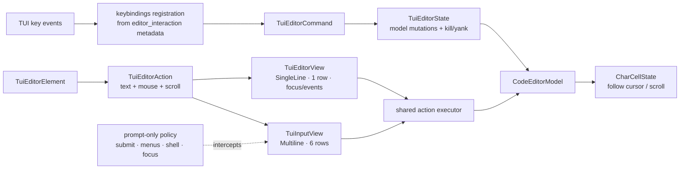

# TECH: Generic TUI editor view and shared editing behavior

## Context

The TUI already renders and hit-tests editor content through `TuiEditorElement`,
backed by `CodeEditorModel` in char-cell mode
(`crates/warp_tui/src/editor_element.rs` and
`specs/tui-editor-element/TECH.md`). Before this slice, editable behavior lived in
`TuiInputView`, which also owns prompt submission, shell mode, inline menus, and
other application-input policy. Reusing that view for selector search or custom
text would couple generic fields to prompt behavior.

This slice adds `TuiEditorView::single_line` and extracts editing behavior shared
with `TuiInputView` into `editor_interaction.rs`. The option-selector slice stacked
above uses the generic view for search and custom-text fields; see
`specs/code-1822-tui-option-selector/TECH.md`.

The ownership boundary is:

- `CodeEditorModel` and `CharCellState`: text, selection, undo/redo, wrap geometry,
  hidden lines, and retained viewport offset.
- `TuiEditorElement`: painting, cursor/selection geometry, hit-testing, printable
  input, paste, mouse selection, and wheel events
  (`crates/warp_tui/src/editor_element.rs` (44-79)).
- `editor_interaction.rs`: shared command definitions and bindings, model mutations,
  behavior configuration, kill/yank state, selection action handling, and viewport
  follow/scroll helpers (`crates/warp_tui/src/editor_interaction.rs` (15-559)).
- `TuiEditorView`: generic field focus, one-row configuration, content events,
  and programmatic text replacement
  (`crates/warp_tui/src/editor_view.rs` (37-202)).
- `TuiInputView`: prompt submission, contextual Escape,
  shell-mode interception, inline-menu routing, and prompt focus
  (`crates/warp_tui/src/input/view.rs` (66-604)).

## Proposed changes

### Shared command and binding layer

`crates/warp_tui/src/editor_interaction.rs` owns `TuiEditorCommand`, which represents
model-backed editing semantics:

- character/word deletion;
- hard-newline insertion for multiline consumers;
- horizontal, vertical, word, and visual-line navigation;
- character, vertical, word, and whole-buffer selection;
- visual-row kill-to-start/end plus yank;
- undo and redo.

The same module owns pure binding metadata for either
`TuiEditorBindingTarget::Input` or `Editor`. Each target keeps stable
user-configurable names (`tui:input:*` and `tui:editor:*`) while sharing default
keys and command semantics. `keybindings.rs` converts that metadata into
`EditableBinding`s, owns the TUI binding group, and registers both targets.

Vertical movement and selection are commands shared by both consumers, but their
bindings remain input-only. A generic single-line field is embedded in a selector
whose host owns Up/Down navigation and focus handoff, so registering
`tui:editor:move_up`, `move_down`, `select_up`, or `select_down` would consume keys
that must propagate. The metadata marks those bindings input-only while both
consumers still use the shared command variants.

`crates/warp_tui/src/keybindings.rs` remains the TUI-wide aggregation and
cross-surface validation layer. It registers both editor targets and binding
validators but does not define editor commands or key metadata
(`crates/warp_tui/src/keybindings.rs` (22-115)).

### Shared editor state and action application

Each editable view owns a `TuiEditorState`. Its single-entry kill buffer backs
Ctrl-K, Ctrl-U, and Ctrl-Y for both the prompt and generic fields. Kill range
calculation and deletion remain model semantics on `CodeEditorModel`; the shared
state only retains the deleted text for yank
(`crates/warp_tui/src/editor_interaction.rs` (322-468)).

`TuiEditorBehavior` is the single consumer configuration for line policy and
viewport height. `single_line()` rejects hard newlines and uses one visible row;
`multiline(6)` accepts full text/newline insertion and uses the prompt's six-row
viewport. The same behavior value is used for rendering, action application,
commands, programmatic replacement, scrolling, and cursor following.

`apply_editor_action` applies every `TuiEditorAction` emitted by
`TuiEditorElement`:

- printable insertion;
- paste normalized through `TuiEditorBehavior`;
- click, shift-click, word/line selection, drag updates, and drag completion;
- wheel scrolling without moving the cursor.

Single-line behavior inserts only the first pasted or programmatically supplied
line and ignores `InsertNewline`. Multiline behavior inserts the complete payload
and accepts `InsertNewline`. The mutation path is shared even though consumer
configuration differs.

The action helper returns `TuiEditorInteractionOutcome::FollowCursor` for
insertions/selection changes and `PreserveViewport` for wheel scrolling, so callers
cannot confuse an opaque boolean result. Shared mutation helpers take
`&mut AppContext`; they do not depend on a concrete view type.

### Generic editor view

`TuiEditorView::single_line` creates a char-cell `CodeEditorModel`, owns a
`TuiEditorState` and persistent `MouseStateHandle`, and renders
`TuiEditorElement` with a one-row viewport. It tracks focus through
`TuiView::on_focus`/`on_blur`, and mouse-originated selection focuses the field
before applying the shared action.

The view exposes:

- `text`;
- `set_text`, which suppresses the resulting `Changed` event;
- `is_focused`;
- `TuiEditorViewEvent::Changed` for user edits.

Dispatched editor actions and commands call `follow_editor_cursor` after mutation.
Programmatic `set_text` does not follow immediately: it can run before layout has
pushed the real terminal width into `CharCellState`. `TuiEditorElement::build`
clamps retained scroll state after applying the real width, so replacement or
resize cannot leave a windowed editor scrolled past its content. User actions and
commands then follow the cursor unless the interaction explicitly preserves the
viewport.

### Prompt input integration

`TuiInputView` embeds the same `TuiEditorElement`, `TuiEditorState`, command
executor, action executor, and viewport helpers. It adds only prompt policy:

- `!` at the buffer start enters shell mode before generic character insertion;
- Backspace at the empty shell-mode boundary exits shell mode before delegation;
- Enter submits; the shared input-only newline command handles
  Shift-Enter/Ctrl-J/Alt-Enter;
- Up/Down route to an open inline menu before editor navigation;
- contextual Escape dismisses the nearest prompt-owned mode;
- the prompt chooses multiline paste and a six-row viewport.

## Data flow

## Testing and validation

`crates/warp_tui/src/editor_view_tests.rs` covers:

- single-line paste truncation;
- single-line programmatic replacement and newline rejection;
- shared Ctrl-K registration and kill/yank behavior;
- cursor following plus stale-offset clamping after resize/replacement;
- shared command editing;
- focus and mouse-selection behavior;
- programmatic text replacement.

Existing `crates/warp_tui/src/input/view_tests.rs` continues to cover multiline
paste, command navigation/selection, kill/yank, shell-mode overrides, inline-menu
routing, mouse selection, and six-row viewport behavior through the shared layer.

Validation commands:

- `./script/format`
- `cargo nextest run --no-fail-fast -p warp_tui -E 'test(editor_view) or test(input::view::tests)'`
- `cargo nextest run --no-fail-fast -p warp_tui`
- `cargo clippy -p warp_tui --tests -- -D warnings`
