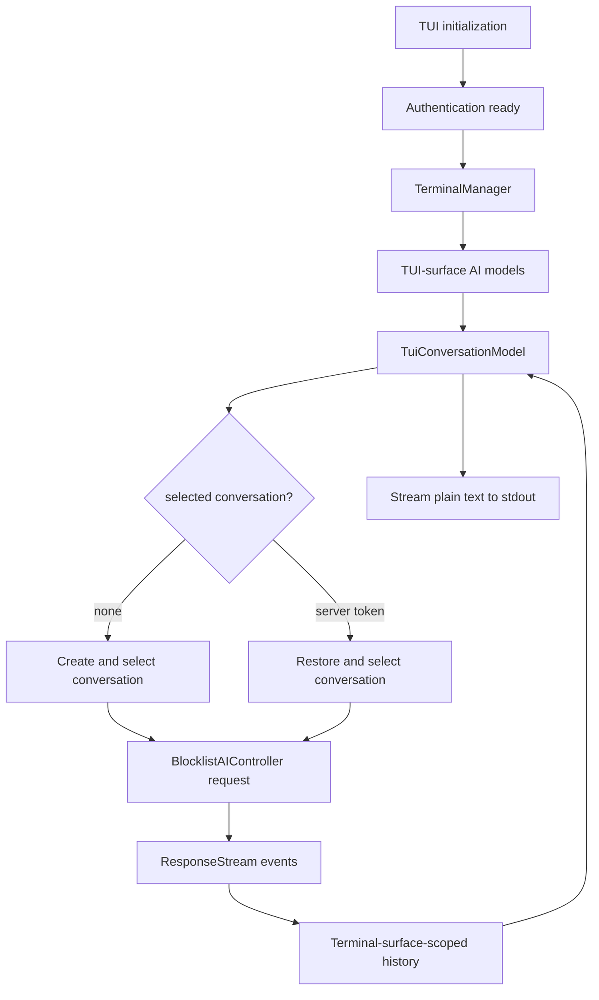

# TUI conversation streaming — TECH
## Context
This change adds a one-shot TUI path that sends a prompt through Warp's production AI controller and streams plain-text output to stdout. The reusable coordination model is designed to support a future interactive TUI without introducing an alternate request or response-stream implementation.
`BlocklistAIHistoryModel` stores conversations and active/progress state per terminal surface. Active conversation means the current or most recent stream/progress target; it remains distinct from the conversation selected for the next prompt (`app/src/ai/blocklist/history_model.rs:206`, `app/src/ai/blocklist/conversation_selection.rs`).
Every terminal surface constructs its own implementation of the object-safe `ConversationSelection` contract and passes a type-erased `ConversationSelectionHandle` into shared AI models. The GUI implementation delegates selected-conversation behavior to `AgentViewController`; the TUI implementation owns selection without constructing Agent View UI state.
## Design
### Conversation selection boundary
GUI and TUI composition roots explicitly construct their own `ConversationSelection` implementations and erase them behind `ConversationSelectionHandle = ModelHandle<Box<dyn ConversationSelection>>` (`app/src/terminal/view.rs`, `crates/warp_tui/src/prompt_stream.rs`). The contract centralizes:
- selected/next-prompt conversation lookup
- new and existing conversation targeting
- surface-owned pending-query behavior and effective autoexecute behavior
- selection reconciliation for clear, split, remove, delete, and transfer history events

The generic blocklist module defines only the trait, fixed selection/presentation event contract, type-erased handle, and shared value types; it does not contain either surface implementation, selection state, or GUI/TUI branching. `AgentViewConversationSelection` lives beside Agent View code and is an unconditional thin adapter over the GUI's `AgentViewController`. `TuiConversationSelection` lives in the TUI frontend and owns its pending selection directly.

`BlocklistAIContextModel`, `BlocklistAIInputModel`, and `BlocklistAIController` require a `ConversationSelectionHandle`; none accepts an optional `AgentViewController` or knows which surface implementation is inside the handle. Context owns pending attachments and request context, input owns input-mode behavior, and the controller owns request/action/stream behavior.

The contract intentionally includes selected-conversation behavior together with conversation-presentation state and lifecycle events. It exposes active/fullscreen queries and entry/exit events because shared input/context/controller behavior must derive that information from the surface rather than duplicate it. Selection-mutating methods continue carrying `AgentViewEntryOrigin` and `EnterAgentViewError`; the GUI implementation forwards those values unchanged to `AgentViewController`, while the TUI implementation forwards origins through the shared lifecycle event contract without interpreting GUI-only origin behavior and never returns GUI-only entry failures.

### Conversation presentation lifecycle
The GUI selection implementation assumes Agent View is enabled, derives selected/active/fullscreen state directly from `AgentViewController`, and translates `AgentViewControllerEvent` into `ConversationSelectionEvent` for shared models. It does not preserve a second pending-selection state machine for the legacy AgentView-disabled path. The TUI implementation treats any selected conversation as active and fullscreen; it has no separate terminal-versus-Agent-View presentation state.

`BlocklistAIInputModel` and `BlocklistAIContextModel` derive active/fullscreen state synchronously from `ConversationSelectionHandle` and subscribe to its lifecycle events for transition side effects. `BlocklistAIController` subscribes to exit events for cancellation behavior. Shared models never store presentation state and never hold `AgentViewController`.
### Terminal-surface-scoped history
WarpUI `EntityId` is the routing key for a terminal surface. History fields, methods, and events use `terminal_surface_id` terminology consistently:
- live, cleared, and active conversation IDs are keyed by terminal surface
- clear, restore, selection-transfer, and streaming events carry terminal surface IDs
- GUI-local APIs retain terminal-view terminology when they specifically address `TerminalView`
Moving a conversation between surfaces emits `ConversationTransferredBetweenTerminalSurfaces`, allowing the previous surface to discard rendered blocks while the destination becomes canonical (`app/src/ai/blocklist/history_model.rs:1047`, `app/src/ai/blocklist/history_model.rs:2855`).
### TUI conversation coordination
`TuiConversationModel` is the reusable TUI presentation coordinator (`crates/warp_tui/src/conversation_model.rs`). It contains no transcript widgets and coordinates:
- the TUI-owned `ConversationSelection` implementation
- creation and selection of a new conversation
- restore and selection of an existing conversation
- prompt submission through `BlocklistAIController`
- terminal-surface-filtered history events for conversation start, stream updates, status changes, selection changes, and errors
`send_prompt(...)` targets the current selection or creates a conversation when none is selected. `restore_conversation_by_server_token_and_send_prompt(...)` resolves a supplied server conversation token to the canonical local conversation ID, restores and selects that conversation, then delegates to `send_prompt(...)` (`crates/warp_tui/src/conversation_model.rs`).
### One-shot prompt streaming
`PromptStreamSurface` adapts `TuiConversationModel` events to stdout and application termination (`crates/warp_tui/src/prompt_stream.rs`). It is named for its actual behavior rather than as a test fixture.
TUI initialization always completes authentication before dispatching either prompt streaming or the default user-ID command (`app/src/tui.rs:23`). Prompt streaming uses the normal local terminal-manager and PTY lifecycle; there is no surface-specific PTY startup switch.
`PtySpawner` can safely use the standard terminal-server subprocess from a `warp-tui` executable. `warp_tui::run()` asks `warp::run_tui_worker_if_requested()` to dispatch Warp worker invocations before parsing frontend arguments, then passes the TUI initializer into `warp::run_tui(...)` for app bootstrap and authentication (`crates/warp_tui/src/lib.rs`, `app/src/lib.rs`, `app/src/tui.rs`). This lets TUI launches register the same early `PtySpawner` singleton as other Warp launches without recursively starting more TUI frontends, and preserves dispatch for other current-executable workers.
The adapter prints changed plain-text snapshots, then the server conversation token and final status when the stream completes. Tool actions fail clearly because this phase does not provide approval or action UI.
### Channel-specific binaries
The `warp_tui` package mirrors GUI channel binaries. Each channel-specific binary only configures `ChannelState` and calls `warp_tui::run()`. The `warp_tui` library owns frontend argument parsing, TUI conversation coordination, selection, and prompt-stream presentation; the `warp` app crate owns worker dispatch, shared app bootstrap, authentication, AI models, and terminal-manager internals. The TUI frontend accepts:
- `--prompt <text>`
- `--conversation-id <server-conversation-token>`
Bare `cargo run -p warp_tui` uses the OSS/production channel; `./script/run-tui -- --prompt ...` selects the internal local channel when its channel config is available.
## End-to-end flow

## Testing and validation
Automated coverage verifies:
- terminal-surface-scoped history maps and active/progress state
- the generic conversation-selection contract and TUI-owned pending-selection state
- GUI implementation delegation to Agent View and TUI-owned selection behavior
- GUI Agent View lifecycle effects remain behaviorally equivalent through the trait adapter
- creating a TUI conversation selects it for the correct terminal surface
- split and removal events reconcile TUI selection
- selecting a new conversation, restoring an existing conversation by server token, and sending a follow-up retain the same canonical local conversation ID
- mock response-stream events flow through `BlocklistAIController` into filtered history/model events
- TUI-owned frontend parsing accepts prompt-streaming CLI arguments
- Warp worker invocations dispatch before TUI frontend argument parsing
Manual validation:
- `cargo run -p warp_tui -- --prompt "Reply with exactly: hello from tui"` emits streamed text, the server conversation token as `conversation_id=...`, and `status=Success`
- a separate process using that server token with `--conversation-id` restores the conversation and recalls the previous response
- prompts requiring tools terminate with an unsupported-action error rather than hanging
Run:
- `./script/format`
- `cargo check -p warp -p warp_tui`
- `cargo check -p warp --tests`
- `cargo check -p warp --features integration_tests --tests`
- `cargo clippy -p warp -p warp_tui --all-targets -- -D warnings`
- focused nextest filters for history, context selection, TUI model, and controller response-stream tests
## Out of scope
- Transcript/rich-content TUI widgets
- TUI workspace/root orchestration UI
- TUI tool/action execution, approval UI, shell execution, or autoexecute policy
- A shared cross-surface `AgentConversationSession`
- A raw server-stream client that bypasses `BlocklistAIController`
- A stable external stdout protocol
## Risks and mitigations
- **GUI behavior regresses.** `AgentViewConversationSelection` delegates selection to the existing `AgentViewController` and translates its lifecycle events without duplicating state. Pin entry/exit ordering and side effects with focused GUI tests.
- **The contract accumulates GUI vocabulary.** Keep the surface implementations responsible for interpreting presentation state and `AgentViewEntryOrigin`; shared models consume the common contract without branching on GUI versus TUI.
- **Active/progress and selected/next-prompt semantics blur.** Keep active state in history and selected/next-prompt behavior behind `ConversationSelection`.
- **A TUI selection becomes invalid.** Reconcile selection from removal, deletion, transfer, clear, and split events.
- **One-shot presentation policy leaks into reusable models.** Keep stdout, termination, and unsupported-action behavior in `crates/warp_tui/src/prompt_stream.rs`.
