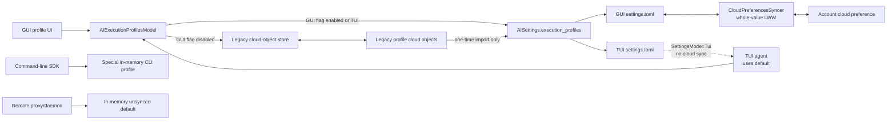

# File-backed Execution Profile Collection — Tech Spec

## Context

Warp execution profiles currently use GUI cloud objects, while TUI configuration is derived from local scalar settings. The target architecture stores the complete profile collection as one public setting on both GUI and TUI, with the existing settings system providing local TOML persistence, file watching, GUI cloud synchronization, and TUI-local isolation.

There is no sibling `PRODUCT.md`; this migration preserves the existing GUI profile-management flow, CLI behavior, runtime permission semantics, and workspace overrides. The intentional behavior changes are that GUI profile synchronization follows the user's settings-sync toggle, the profile collection becomes directly editable in `settings.toml`, and concurrent cross-device edits resolve through whole-collection last-write-wins instead of per-profile revision enforcement.

Relevant client code at `d4f5ee61b3ec0e01a95b360f033a9990ea8a3e78`:

- [`app/src/ai/execution_profiles/profiles.rs:33`](https://github.com/warpdotdev/warp/blob/d4f5ee61b3ec0e01a95b360f033a9990ea8a3e78/app/src/ai/execution_profiles/profiles.rs#L33) defines process-local `ClientProfileId`; [`AIExecutionProfilesModel`](https://github.com/warpdotdev/warp/blob/d4f5ee61b3ec0e01a95b360f033a9990ea8a3e78/app/src/ai/execution_profiles/profiles.rs#L182-L415) owns profile construction, active-profile selection, and persistence dispatch; [`edit_profile_internal`](https://github.com/warpdotdev/warp/blob/d4f5ee61b3ec0e01a95b360f033a9990ea8a3e78/app/src/ai/execution_profiles/profiles.rs#L1191-L1202) routes profile mutations.
- [`app/src/ai/execution_profiles/mod.rs (93-115)`](https://github.com/warpdotdev/warp/blob/d4f5ee61b3ec0e01a95b360f033a9990ea8a3e78/app/src/ai/execution_profiles/mod.rs#L93-L115) builds a default profile from legacy command and directory settings. The same file makes profile cloud objects revision-enforced and gives the default profile a per-user uniqueness key at [`mod.rs (204-255)`](https://github.com/warpdotdev/warp/blob/d4f5ee61b3ec0e01a95b360f033a9990ea8a3e78/app/src/ai/execution_profiles/mod.rs#L204-L255).
- [`app/src/settings/cloud_preferences.rs:33`](https://github.com/warpdotdev/warp/blob/d4f5ee61b3ec0e01a95b360f033a9990ea8a3e78/app/src/settings/cloud_preferences.rs#L33) documents cloud preferences as last-write-wins. [`CloudPreferencesSyncer::handle_initial_load`](https://github.com/warpdotdev/warp/blob/d4f5ee61b3ec0e01a95b360f033a9990ea8a3e78/app/src/settings/cloud_preferences_syncer.rs#L575-L668) reconciles settings by storage key; local-to-cloud and cloud-to-local updates replace the complete serialized value at [`cloud_preferences_syncer.rs (673-991)`](https://github.com/warpdotdev/warp/blob/d4f5ee61b3ec0e01a95b360f033a9990ea8a3e78/app/src/settings/cloud_preferences_syncer.rs#L673-L991).
- [`SettingsMode`](https://github.com/warpdotdev/warp/blob/d4f5ee61b3ec0e01a95b360f033a9990ea8a3e78/crates/settings/src/lib.rs#L184-L235) disables cloud synchronization for TUI launches. [`user_preferences_toml_file_path`](https://github.com/warpdotdev/warp/blob/d4f5ee61b3ec0e01a95b360f033a9990ea8a3e78/app/src/settings/mod.rs#L597-L609) selects separate GUI and TUI configuration directories.
- [`app/src/settings/privacy.rs (700-833)`](https://github.com/warpdotdev/warp/blob/d4f5ee61b3ec0e01a95b360f033a9990ea8a3e78/app/src/settings/privacy.rs#L700-L833) and [`LEGACY_CLOUD_SETTINGS_STORAGE_KEYS`](https://github.com/warpdotdev/warp/blob/d4f5ee61b3ec0e01a95b360f033a9990ea8a3e78/app/src/settings/cloud_preferences_syncer.rs#L174-L181) are prior art for deferring generic settings sync until legacy account data has seeded the new preference.
- Runtime allowlist and denylist enforcement reads the active execution profile, not the older scalar settings, in [`app/src/ai/blocklist/permissions.rs (301-421)`](https://github.com/warpdotdev/warp/blob/d4f5ee61b3ec0e01a95b360f033a9990ea8a3e78/app/src/ai/blocklist/permissions.rs#L301-L421).
- Generic structured settings are all-or-nothing during deserialization; invalid startup values use the setting default, while failed hot reloads retain the last-known-good in-memory value and inhibit writes to the invalid key. The relevant paths are [`crates/settings/src/manager.rs (315-406)`](https://github.com/warpdotdev/warp/blob/d4f5ee61b3ec0e01a95b360f033a9990ea8a3e78/crates/settings/src/manager.rs#L315-L406) and [`crates/warpui_extras/src/user_preferences/toml_backed.rs (58-207)`](https://github.com/warpdotdev/warp/blob/d4f5ee61b3ec0e01a95b360f033a9990ea8a3e78/crates/warpui_extras/src/user_preferences/toml_backed.rs#L58-L207).

Relevant server code at `d8c39c0ecd919471d9b9f22afcfead964a589206`:

- [`db/migrations/20231020113508_create_generic_string_object_table.sql:13`](https://github.com/warpdotdev/warp-server/blob/d8c39c0ecd919471d9b9f22afcfead964a589206/db/migrations/20231020113508_create_generic_string_object_table.sql#L13) stores serialized models in an unbounded PostgreSQL `TEXT` column.
- [`graphql/v2/mutations/update_generic_string_object.graphqls:3`](https://github.com/warpdotdev/warp-server/blob/d8c39c0ecd919471d9b9f22afcfead964a589206/graphql/v2/mutations/update_generic_string_object.graphqls#L3) accepts an unconstrained GraphQL `String`; no application-layer payload limit is imposed on generic string object creation or update.

The design accepts whole-collection last-write-wins synchronization. Concurrent edits from different GUI devices may overwrite one another at collection granularity, matching other structured cloud-preference settings. No profile-count, list-length, or total serialized-size limit is added.

## Proposed changes

### Collection setting and file schema

Introduce one `ExecutionProfilesConfig` setting shared by GUI and TUI:

```rust
#[derive(Clone, Debug, Deserialize, PartialEq, Serialize)]
#[serde(transparent)]
pub struct ExecutionProfilesConfig(
    IndexMap<ExecutionProfileId, ExecutionProfileFile>,
);

#[derive(Clone, Debug, Deserialize, Eq, Hash, PartialEq, Serialize)]
pub struct ExecutionProfileId(String);
```

`ExecutionProfilesConfig` is serialized transparently as the profile map; no wrapper metadata or `default_profile_id` field is written. The reserved key `default` identifies the default profile. Profile keys must match `[A-Za-z0-9_-]+`; missing `default`, duplicate TOML keys/tables, invalid keys, or any malformed profile invalidate the complete setting. `AIExecutionProfile::is_default_profile` is derived from the map key at runtime rather than serialized per profile.

The default file shape is:

```toml
[agents.execution_profiles.default]
name = "Default"
read_files = "agent_decides"
execute_commands = "always_ask"

[agents.execution_profiles.profile-550e8400-e29b-41d4-a716-446655440000]
name = "Code Review"
read_files = "always_allow"
execute_commands = "always_ask"
```

Manually authored profiles may use readable keys such as `code-review`. GUI-created profiles preserve the current create-then-edit flow and receive opaque `profile-<uuid>` keys. Renaming changes only the display name. Migrated non-default profiles use deterministic keys derived from their legacy server `SyncId`, so two devices independently importing the same account converge on identical keys; the migrated default always uses `default`.

`ExecutionProfilesConfig` implements `SettingsValue` and `JsonSchema`. Its custom `SettingsValue::to_file_value` converts every domain profile into `ExecutionProfileFile`; `from_file_value` validates every map key, converts every entry through the existing file-safe permission/regex/UUID pipeline, requires `default`, and returns `None` on any failure. Do not rely on blanket map deserialization for file validation. Set `max_table_depth: 2` so the map and each profile render as section tables while nested values remain inline where necessary.

Declare the setting under `AISettings`:

```rust
execution_profiles: ExecutionProfiles {
    type: ExecutionProfilesConfig,
    default: ExecutionProfilesConfig::default(),
    supported_platforms: SupportedPlatforms::ALL,
    sync_to_cloud: SyncToCloud::Globally(RespectUserSyncSetting::Yes),
    surface: settings::SettingSurfaces::ALL,
    private: false,
    toml_path: "agents.execution_profiles",
    max_table_depth: 2,
    description: "AI execution profiles and their permissions.",
}
```

GUI settings sync follows the user's “Sync settings across devices” preference. TUI launches use the same schema in a separate `settings.toml`; `SettingsMode::Tui` keeps the syncer inert, so TUI profiles remain local.

### Model ownership and mutations

`AIExecutionProfilesModel` remains the concrete singleton and application-facing API. During the GUI feature-flagged compatibility window, retain a narrow persistence-source abstraction with two implementations:

- The existing legacy cloud-object store, used when the flag is disabled.
- A settings-backed store that reads and writes `AISettings::execution_profiles`, used when the flag is enabled.

The model owns all behavior common to both paths; stores expose only profile lookup and persistence primitives. After rollback support and old-client compatibility are retired, remove the legacy store and source dispatch, then inline the settings-backed path if the abstraction no longer adds value.

The model owns:

- Profile lookup, default and active-profile resolution, and per-session active profile keys.
- Create, edit, delete, and profile-name operations.
- Construction of new profiles by cloning `default`, clearing the display name, assigning a `profile-<uuid>` key, and preserving the current GUI editor flow.
- Telemetry and `AIExecutionProfilesModelEvent` emission.
- Fallback from an active key removed by file/cloud reload to `default`.
- Translation between `ExecutionProfilesConfig` and `AIExecutionProfile` snapshots, including the derived `is_default_profile` field.

Mutations clone the collection, apply one logical change, and persist it through `AISettings::execution_profiles.set_value`. The in-memory model must not maintain a second authoritative profile copy. A failed settings write leaves `AISettings` and the effective collection unchanged through the existing settings write-error behavior.

Subscribe to `AISettingsChangedEvent::ExecutionProfiles`. Maintain a non-authoritative last-observed collection snapshot solely for change classification. On local file or GUI cloud reload, diff that snapshot against the new valid setting to emit `ProfileCreated`, `ProfileUpdated`, and `ProfileDeleted`, prune stale per-session active keys, notify selectors, and replace the snapshot. In settings mode, the store resolves every read from `AISettings`; neither the model nor the store maintains a second authoritative collection. Do not add GUI/TUI-specific edit methods.

`LaunchMode::CommandLine` remains an explicit exception: it continues using `AIExecutionProfile::create_default_cli_profile`, remains non-persisted and read-only, and preserves sandbox/computer-use overrides. `LaunchMode::RemoteServerProxy` and `RemoteServerDaemon` preserve their current inert, unsynced in-memory default and do not read, migrate, or persist the collection. TUI uses only the reserved `default` profile in this change; the shared collection schema permits future TUI profile selection without adding it here.

### Legacy scalar writers

The new collection becomes the only runtime source for command allowlists, command denylists, directory allowlists, models, and permissions. When no legacy cloud profile collection exists, migration constructs `default` from:

- `agent_mode_command_execution_allowlist`, excluding built-in defaults as today.
- `agent_mode_command_execution_denylist`.
- `agent_mode_coding_file_read_allowlist`.
- The one-time `PreferredAgentModeLLMId` private preference.
- Current `AIExecutionProfile::default()` values for remaining fields.

After migration, new clients stop consulting those scalar settings for execution-profile behavior. Rewire the remaining Settings-page allowlist/denylist/directory editors and the codebase-search permission speedbump to mutate the appropriate execution profile directly. Keep legacy keys intact for old clients during the rollout window; remove them only in a later cleanup after legacy-client support ends.

The TUI has no separate global model setting. Its inline model picker mutates
the active execution profile's `base_model`, and ordinary TUI requests resolve
their model from that profile. Explicit per-surface child-agent overrides retain
precedence over the profile default.


### Presence-based one-time migration

Migration is client-side, one-directional, and never creates, updates, or deletes legacy `AIExecutionProfile` cloud objects. Old clients continue operating on their own legacy profile objects. Old and new clients may diverge; no bidirectional compatibility bridge is introduced.

Defer generic initial synchronization of the execution-profile collection key using the same mechanism as privacy-setting migration. GUI migration runs after generic cloud objects and cloud preferences complete initial load, with this precedence:

1. If the collection is explicitly present in the settings file, retain it. This includes a cloud collection applied locally before migration and any locally authored collection.
2. Otherwise, if the current account has owned legacy profile objects, import the complete legacy collection without overlaying scalar settings.
3. Otherwise, synthesize `default` from legacy scalar settings and domain defaults.

Writing an imported or synthesized collection makes the setting explicit, so migration does not run again unless the user removes the setting. Because the key is withheld from generic initial upload, an already-explicit local collection is handed directly to `CloudPreferencesSyncer` after migration inspection; ordinary sync preference gating still applies.

Legacy custom profile keys use `legacy-<hex(server-id-bytes)>`, where the lowercase hex encoding is collision-free for the canonical 22-character `ServerId` and satisfies the profile-key grammar. Do not generate fresh random keys during import. Delay migration until pending legacy profile creations have canonical server IDs, or exclude unsynced client-ID objects and retry after `ObjectSynced`.

GUI migration imports existing legacy profile objects once even when the user has disabled settings sync so upgrading does not discard existing profile data. It does not read an existing new cloud preference or upload the resulting collection while sync is disabled; subsequent collection synchronization obeys `RespectUserSyncSetting::Yes`. TUI launches never import GUI legacy cloud objects and never participate in GUI migration.

The GUI rollout feature flag supports ordinary rollback:

- Flag enabled: use or migrate the collection setting.
- Flag disabled: use legacy cloud profile objects.
- Re-enabling the flag returns to the preserved collection.

Register and validate the collection setting regardless of the GUI rollout flag; the flag gates GUI model selection and migration, not preservation of the new value. This lets a flag-off GUI build retain file/cloud collection updates for a later re-enable. TUI always uses its local collection path and does not select the legacy GUI cloud-object store.

Profiles created or edited on the two paths during rollback may diverge; this is accepted. Retain legacy cloud objects for the entire compatibility window and do not schedule server cleanup in this change.

### Validation and failure behavior

Use the existing all-or-nothing `SettingsValue` behavior:

- The complete setting is invalid if any profile fails to deserialize or validate.
- `default` must exist and parse successfully.
- Profile keys must match `[A-Za-z0-9_-]+`.
- Duplicate keys/tables fail at TOML parsing.
- Invalid regexes, UUIDs, permission values, or field types invalidate the collection.

At cold startup, an invalid collection uses `ExecutionProfilesConfig::default()`—one valid `default` profile—while the existing settings error banner identifies the invalid key and write inhibition preserves the raw file. On hot reload, failed deserialization retains the last-known-good collection and inhibits writes until the file is fixed. Do not add partial profile recovery.

No collection-size guard is introduced. Existing profile count and list lengths are unbounded, server storage uses `TEXT`, and realistic collection payloads are far below transport limits.

### End-to-end flow



## Testing and validation

Automated coverage should focus on behavior specific to this migration rather than retesting generic settings infrastructure:

- Round-trip and reject the collection as a unit, including missing `default`, invalid keys, and a malformed nested profile.
- Exercise migration precedence for an explicit collection, legacy objects, and synthesized defaults.
- Verify deterministic legacy keys, pending client-ID retry, and that legacy objects remain untouched.
- Verify feature-flag rollback preserves both persistence representations.

Generic `SettingsManager` and `CloudPreferencesSyncer` tests remain responsible for setting defaults, malformed hot-reload retention, sync-toggle gating, whole-value last-write-wins replacement, debouncing, and TUI sync isolation.

### Manual validation

- Edit `default` and add a readable custom profile directly in GUI `settings.toml`; verify hot reload updates the GUI.
- Introduce a malformed custom profile; verify the standard settings error appears and the last-known-good collection remains active.
- Create, rename, and delete a profile through the GUI; verify opaque key stability and file updates.
- Run two GUI clients against one account and confirm last-write-wins behavior.
- Run the TUI with a separate file and confirm only its local `default` applies.
- Exercise feature-flag rollback and re-enable without deleting either storage representation.


## Risks and mitigations

### Whole-collection last-write-wins can lose concurrent edits

Two GUI devices editing different profiles concurrently can overwrite the complete collection. This matches cloud-preference semantics and is accepted. Tests must make the behavior explicit; do not add custom merge logic.

### Generic settings sync can race migration

If local state uploads before legacy account profiles are inspected, a generated default collection can overwrite the migration source. Defer this storage key from generic initial upload and resolve it through the dedicated migration path, following privacy-setting prior art.

### Multiple devices can migrate simultaneously

Fresh random migration keys would make devices produce distinct identities for the same profiles. Derive keys deterministically from legacy server IDs and wait for canonical IDs before import.

### Rollback produces divergent catalogs

Flag-off clients use legacy objects while the collection remains unchanged. New-only profiles are temporarily unavailable and edits on either path do not cross over. Preserve both representations and restore the collection on re-enable; do not attempt a temporary bidirectional bridge.

### Invalid collections affect every profile

One malformed custom profile invalidates the setting. Existing startup-default and hot-reload-last-known-good behavior prevents crashes and preserves the raw file. Permission-bearing data is never partially recovered or silently defaulted per profile.

### Local settings are device-scoped, not account-scoped

The same GUI file survives account changes, matching ordinary settings behavior. Once an execution-profile collection is explicit, it remains the device's authoritative local value until cloud sync replaces it or the user removes it.

### Legacy UI writers currently target stale scalar settings

Command and directory list controls, including the codebase-search speedbump, can write values that runtime permission checks no longer read. Rewire every writer to the execution-profile collection and cover the speedbump path with regression tests.

### Collection payload growth is unbounded

The client and server impose no relevant cap. Do not introduce an arbitrary product limit; rely on deterministic migration/idempotency tests to prevent runaway duplication and revisit a generic payload guard only if infrastructure constraints emerge.

## Follow-ups

- Add TUI profile selection using the shared collection; this change intentionally uses only `default`.
- Remove legacy cloud profile objects and their update paths after rollback support and old-client compatibility are no longer required.
- Remove legacy scalar profile settings after old clients no longer depend on them.
- Remove the rollout feature flag after migration is complete.
