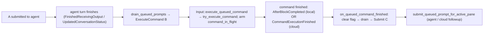

# Queue terminal commands alongside prompts — Tech Spec

See `specs/gh-11912/PRODUCT.md` for user-visible behavior. This layers command support onto the v2 queued-prompts machinery from `specs/REMOTE-1543/` and `specs/APP-4562/`.

## Context
The queued-prompts queue is an app-wide singleton, `QueuedQueryModel` (`app/src/ai/blocklist/queued_query.rs`), keyed by `AIConversationId`. Each conversation has a `ConversationQueueState { queue: Vec<QueuedQuery>, editing, queue_next_prompt_override }`. A `QueuedQuery` today carries `id`, `text`, `origin: QueuedQueryOrigin`, and a flat `attachments: Vec<PendingAttachment>` (every row can hold attachments, even though only prompts ever use them). Draining is mediated by `peek_autofire` → `AutofireAction` → `remove_fired_row` so the send path can read a row's attachments before the row is removed (`queued_query.rs:361,384`).

Submit/queue flow today:
- The enter handler tries queue gates before executing: `maybe_queue_input_for_in_progress_conversation` then `maybe_queue_input_during_cloud_setup`, then the shell-execution branch (`app/src/terminal/input.rs:12720-12722`, shell branch at `:12882`).
- `maybe_queue_input_for_in_progress_conversation` (`input.rs:13381`) **returns false in shell mode** (`!is_ai_input_enabled()` at `:13389`), so a shell command falls through and `try_execute_command` runs it, cancelling any in-progress conversation (`input.rs:12959-12973`). This is the bug in #11912.
- `try_execute_command` (`input.rs:6763`) already routes correctly per pane: for a shared-session viewer/executor (cloud-mode pane) it sends the command to the sharer via `try_execute_command_on_behalf_of_shared_session_participant`; otherwise it runs locally via `try_execute_command_from_source`.

Drain + submit:
- `TerminalView::handle_finished_conversation` (`app/src/terminal/view.rs:4804`) → `drain_queued_prompts` (`view.rs:5260`). The clean path peeks the head and, for `AutofireAction::Submit`, calls `Input::submit_queued_prompt_for_active_pane` (`input.rs:13293`, routes cloud-followup / shared-session-viewer / local). The non-clean path (`Error|Cancelled`) restores the head into the editor via `pop_front`.
- Local finish detection: `handle_ai_controller_event`, `FinishedReceivingOutput` arm (`view.rs:5098`). It already defers finishing while `has_active_subagent()` is true (`view.rs:5108`, `conversation.rs:3078`) — this is the LRC guard.
- Cloud finish detection: `handle_ai_history_model_event`, `UpdatedConversationStatus` arm (`view.rs:6048-6088`), gated on `QueuedPromptsV2` + `is_ambient_agent_session`, draining only on a transition to a terminal status.

Command completion signals (the new draining inputs) — local and shared-session are distinct and must both be handled:
- **Local**: `ModelEvent::AfterBlockCompleted` is handled in `TerminalView` (`view.rs:11886`); the completed block is `block_type`, and `BlockType::User(UserBlockCompleted { serialized_block, was_part_of_agent_interaction, .. })` exposes success via `serialized_block.exit_code.was_successful()` (`view.rs:11986`). Agent-executed commands are `BlockType::User` with `was_part_of_agent_interaction == true`.
- **Shared session / cloud**: the sharer emits `OrderedTerminalEventType::CommandExecutionFinished { next_block_id }` from `command_finished` (`app/src/terminal/model/terminal_model.rs:2812`) on every command completion. The viewer event loop receives it but currently **no-ops** it (`app/src/terminal/shared_session/viewer/event_loop.rs:274`). This is the authoritative remote-command-finished signal for a cloud/viewer pane — it does not depend on the indirect, byte-parse-driven block completion on the viewer. (The viewer already keys its own per-command cleanup of `pending_command_execution_request` off the synced block completion in `Input::handle_block_completed_event`, `input.rs:14349-14364`.)

Panel: `app/src/terminal/view/queued_prompts_panel.rs` renders each row; the row render is where the `!` prefix is added.

Feature flag: `FeatureFlag::QueuedPromptsV2` (already wired).

## Proposed changes

### 1. Model: a queued item is a prompt or a command (`queued_query.rs`)
Replace the flat `attachments` field with a `kind` enum so attachments are *structurally* impossible on a command:
```rust
pub enum QueuedQueryKind {
    /// An agent prompt; may carry image/file attachments captured from the input.
    Prompt { attachments: Vec<PendingAttachment> },
    /// A shell command run in the terminal / via the shared session. Cannot hold attachments.
    Command,
}
```
- `QueuedQuery` keeps the shared `id`, `text`, `origin` and gains `kind: QueuedQueryKind`. `text` stays shared (both kinds have a string); only `attachments` move into the `Prompt` variant, so a `Command` has nowhere to put them. Use `Vec` (not `Option<Vec>`): an empty vec already means "no attachments", so `Option` would add a redundant `None`-vs-empty state.
- Accessors: `is_command()` = `matches!(self.kind, QueuedQueryKind::Command)`; `attachments()` returns the `Prompt` variant's slice or `&[]` for a `Command`. Constructors: keep `new` / `new_with_attachments` (build `Prompt`), add `new_command(text)` (builds `Command`). `origin` stays telemetry-only; firing branches on `kind`, not `origin`.
- Commands are normal mutable rows: `is_locked()` stays false for them, so reorder/edit/delete/`pop_front` behave exactly as for prompts.
- Extend the drain action: add `AutofireAction::ExecuteCommand { query_id, command }`. `peek_autofire` (`queued_query.rs:361`) returns `ExecuteCommand` for a `Command` head, and `Submit` / `PopFromEditMode` otherwise.
- Track the in-flight command on `ConversationQueueState`: add `command_in_flight: bool` with `arm_command_in_flight`, `clear_command_in_flight`, and `has_command_in_flight(conversation_id) -> bool`. Storing this on the singleton lets the `Input` gate read it and both `TerminalView` and the viewer event loop set/clear it. Clear it in `drop_conversation` so lifecycle cleanup (`queued_query.rs:247`) resets it.

### 2. Queue gate: allow shell submissions to queue (`input.rs`)
In `maybe_queue_input_for_in_progress_conversation` (`input.rs:13381`):
- Remove the `!is_ai_input_enabled()` early return. Compute `let is_command = !self.ai_input_model.as_ref(ctx).is_ai_input_enabled();` up front.
- Extend the in-progress predicate so the queue stays active while a command runs (PRODUCT §14): queue when the conversation is in-progress/blocked **or** `QueuedQueryModel::as_ref(ctx).has_command_in_flight(conversation_id)`.
- The `is_queue_next_prompt_enabled` / summarizing gate is unchanged, so queuing still requires auto-queue to be on (PRODUCT §2, §7).
- The `/queue`-argument unwrap only applies in AI mode (a shell command won't match `commands::QUEUE`); skip it for `is_command`.
- Append `QueuedQuery::new_command(prompt)` when `is_command`, else the existing prompt row. Do not take pending attachments for commands.

Because the enter handler already calls this gate before the shell-execution branch (`input.rs:12720`), a queued command never reaches `try_execute_command`, so the interrupt-the-agent path (`input.rs:12959`) is bypassed. No change to `maybe_queue_input_during_cloud_setup` (queuing-while-running is the in-progress gate, not the setup gate).

### 3. Drain dispatch: execute commands (`view.rs`, `input.rs`)
In `drain_queued_prompts` (`view.rs:5260`), `FinishReason::Complete` arm, handle the new action:
- `AutofireAction::ExecuteCommand { query_id, command }`: call `remove_fired_row` (row disappears immediately, PRODUCT §10), `arm_command_in_flight(conversation_id)`, then dispatch via a new `Input::execute_queued_command(command, ctx)` that calls `try_execute_command` (reusing local vs shared-session routing, PRODUCT §9). Do **not** peek/drain the next item here — the next item fires on block completion (§4). If `try_execute_command` returns false (cannot execute, e.g. precmd not yet received), `clear_command_in_flight` and restore `command` into the editor if empty, matching the non-clean restore, so the queue never wedges.
- `Submit` arm unchanged. `PopFromEditMode` now carries `is_command` (set from `first.is_command()` in `peek_autofire`): when restoring a command's text into an empty input, force shell mode via `Input::set_input_mode_terminal(true, ctx)` and skip the attachment restore (commands have none), so an edited command that the clean drain pops into the input stays a command instead of being submitted as an agent prompt (PRODUCT §5).

The non-clean arm (`Error|Cancelled`) restores the head via `pop_front` + `replace_buffer_content(query.text())`; when `query.is_command()`, it also forces shell mode via `set_input_mode_terminal(false, ctx)` and skips the attachment restore, so a restored command stays a command (PRODUCT §17).

### 4. Command-finished trigger advances the queue (`view.rs`, `viewer/event_loop.rs`)
Add one shared entry point on `TerminalView`, `on_queued_command_finished(&mut self, ctx)`: resolve the active conversation (`BlocklistAIHistoryModel::as_ref(ctx).active_conversation(self.terminal_view_id).map(|c| c.id())`); if `QueuedQueryModel::as_ref(ctx).has_command_in_flight(conv)`, call `clear_command_in_flight(conv)` then `self.drain_queued_prompts(conv, FinishReason::Complete, ctx)`. Passing `Complete` regardless of exit status implements PRODUCT §12; going through `drain_queued_prompts` (not `handle_finished_conversation`) avoids re-running conversation-finished callbacks.
Fire it from **both** command-finished sources so local and cloud panes are each covered by their authoritative signal:
- **Local** — in the `ModelEvent::AfterBlockCompleted` handler (`view.rs:11886`), after the existing `pending_command_queue` handling, when `block_type` is `BlockType::User(b)` with `!b.was_part_of_agent_interaction`, call `self.on_queued_command_finished(ctx)`.
- **Shared session / cloud** — handle the previously-no-op `OrderedTerminalEventType::CommandExecutionFinished` arm in the viewer event loop (`app/src/terminal/shared_session/viewer/event_loop.rs:274`): `self.terminal_view.upgrade(ctx)` then `view.update(.., |view, ctx| view.on_queued_command_finished(ctx))`.
- Both are gated on the armed `command_in_flight` flag, and `on_queued_command_finished` clears it *before* draining, so it is naturally idempotent: if a viewer happens to observe both a synced `AfterBlockCompleted` and a `CommandExecutionFinished`, only the first advances the queue (the second sees no armed flag and no-ops). The armed-only gate also keeps agent-executed command blocks / LRC snapshots from advancing the queue — they complete while the flag is unarmed, since the agent is idle whenever a queued command is in flight (PRODUCT §16). When the next item is a prompt, `submit_queued_prompt_for_active_pane` routes it to the cloud-followup / local path as today.

### 5. LRC handling (no code change, documented)
For queued prompts that trigger an agent LRC, the existing `has_active_subagent()` guard in the `FinishedReceivingOutput` arm (`view.rs:5108`) already defers `handle_finished_conversation` until the subagent/LRC turn truly ends (PRODUCT §15); the cloud `UpdatedConversationStatus` path only drains on a terminal status, which the agent won't report mid-LRC. The new command-finished trigger (§4) cannot fire during an LRC because it is armed only while a queued *command* is in flight, i.e. when the agent is idle. No new code is required, but this reasoning is the reason the trigger is gated on the armed flag rather than on every `User` block completion.

### 6. Panel: blue `!` prefix on command rows (`queued_prompts_panel.rs`)
In the row render, when `query.is_command()`, render a leading `!` glyph before the preview text using the same blue color token the input uses for the shell-mode `!` prefix (locate the shell-prefix color in the input/editor styling and reuse the token rather than hard-coding a color). All other affordances (drag handle, edit/delete buttons, collapse) are unchanged (PRODUCT §4, §5).

## End-to-end flow (queue = [prompt A, command B, prompt C])


## Testing and validation
Map tests to `PRODUCT.md` invariants; follow repo test conventions (`*_tests.rs` included via `#[path]`).
- **§2, §7, §14 (gating)** — `app/src/terminal/input_tests.rs`: shell submission queues a `Command` row when auto-queue is on and a conversation is in progress; runs immediately when auto-queue is off / no in-progress run; queues while `has_command_in_flight` is true even though the conversation is idle.
- **§1 (flag)** — `cargo check -p warp` and `cargo check -p warp --features queued_prompts_v2`; assert the gate no-ops with the flag off.
- **§3–§5 (model)** — `app/src/ai/blocklist/queued_query_tests.rs`: `kind` round-trips; `peek_autofire` yields `ExecuteCommand` for a command head and `Submit` for a prompt head; command rows are reorderable/editable/deletable (not locked); `arm/clear/has_command_in_flight`; `drop_conversation` clears in-flight.
- **§8–§13 (drain + FIFO + exit code)** — `app/src/terminal/view/queued_prompts_tests.rs`: a clean finish with a command head calls `execute_queued_command` and arms in-flight without draining the next item; an `AfterBlockCompleted` `User` block with the flag armed drains the next item; a non-zero exit still advances; the [A, B, C] sequence fires A→B→C in order, B only after A finishes and C only after B's block completes.
- **§15, §16 (LRC)** — assert an `AfterBlockCompleted` for an agent-executed (`was_part_of_agent_interaction == true`) block does not drain; assert the `has_active_subagent()` defer still holds for a queued prompt that starts an LRC (extend existing subagent-defer coverage).
- **§5, §17 (restore keeps command kind)** — a clean finish while a command row is being edited restores its text into the empty input *and forces shell mode*; error/cancel with a command head restores its text into the empty editor *in shell mode* and leaves the rest intact.
- **§19 (cloud)** — viewer/cloud pane: a drained command routes through the shared-session branch of `try_execute_command`, and an `OrderedTerminalEventType::CommandExecutionFinished` event advances the queue (extend `app/src/terminal/shared_session/viewer/event_loop_tests.rs`, which already exercises this event). Assert idempotency: a duplicate command-finished signal while the flag is unarmed does not double-drain.
- Full `./script/format` and `cargo clippy` (per WARP.md) before PR; run the queue test suites (`queued_query`, `queued_prompts`, input/view tests). Do not run the app to test.

## Parallelization
Single workstream. The change threads one set of shared types (`QueuedQueryKind`, `AutofireAction`, `command_in_flight`) through the model, the input gate, the view drain, both command-finished triggers, and the panel render; every edit depends on the model change landing first, and the files (`queued_query.rs`, `input.rs`, `view.rs`, `shared_session/viewer/event_loop.rs`, `queued_prompts_panel.rs`) overlap heavily with the in-flight changes. Splitting across child agents would create merge churn on the same files without reducing wall-clock time, so it is implemented directly.

## Risks and mitigations
- **Queue wedges if a command never starts**: only arm `command_in_flight` when `try_execute_command` returns true; on false, clear and restore text (§3).
- **Double-drain**: the command-finished trigger is armed only during command-in-flight (agent idle), and the conversation-finish paths won't re-fire (the conversation already reached a terminal status before the command ran).
- **Spurious advance from agent command blocks**: filtered by `!was_part_of_agent_interaction` (local) plus the armed flag, which is only set while the agent is idle (§4, §16).
- **Viewer completion reliability**: cloud panes advance on the explicit `OrderedTerminalEventType::CommandExecutionFinished` event rather than the indirect, byte-parse-driven block completion on the viewer. If both a synced `AfterBlockCompleted` and a `CommandExecutionFinished` reach a viewer, the armed-flag clear in `on_queued_command_finished` dedupes them; validated by the §19 cloud test.
- **`origin` vs `kind` confusion**: `origin` stays telemetry-only; all firing decisions branch on `kind` to avoid conflating source with type.
