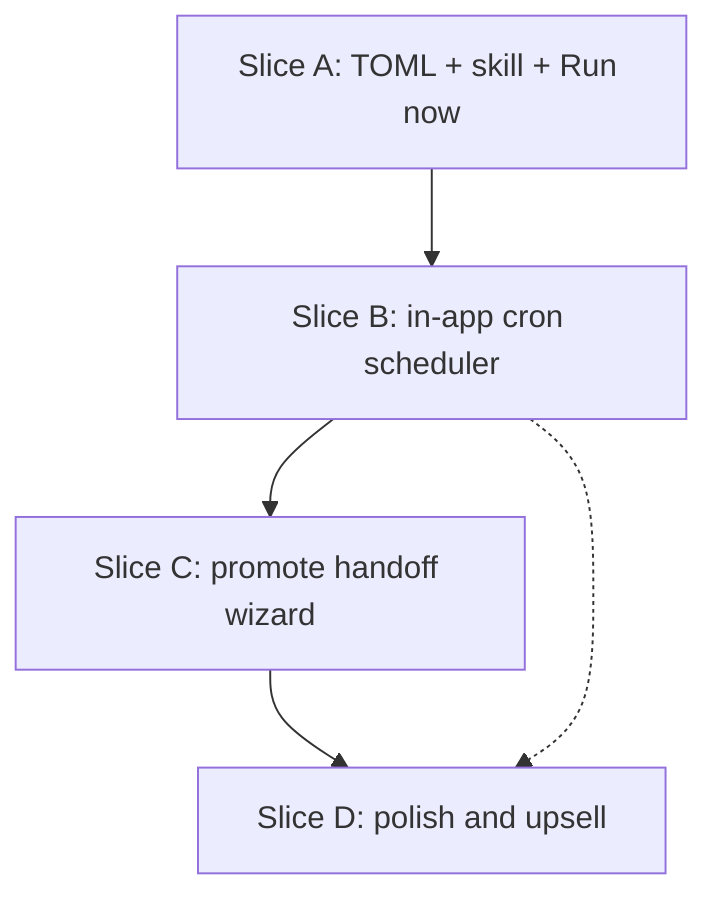

# Local Automations — Multi-slice plan

Planning doc for the full local→cloud on-ramp. Slice A has full product/tech specs; later slices are scoped here until they get their own PRODUCT/TECH.

## Product thesis
Local automations are an **on-ramp wedge**: cheap personal crons on the user’s machine that build the habit of unattended agents, then **promote** into Warp cloud scheduled agents when reliability, team share, or device-off matters. Local is intentionally thin (cron + runners), not a full local trigger platform.

## Competitive context (research snapshot)
- **Cursor Automations**: cloud-first event/cron agents; strong enterprise adoption stories; local `/loop` is separate and dies with the laptop.
- **Codex**: local-first schedules + triage inbox; machine must stay awake; cloud event triggers weaker/roadmap.
- **Warp today**: interactive local agents + Oz cloud schedules (`ScheduledAmbientAgent`); **missing local automation bridge**.

Wedge: simple local create → feel the value → hit reliability limits → promote (wizard), including explaining billing for non–Warp-agent jobs.

## Locked decisions (grill session)
| Decision | Choice |
|----------|--------|
| Primary job | On-ramp wedge to cloud |
| Local trigger surface (v1) | Cron only |
| Missed runs | Catch-up on Warp wake + visible missed; v2 suggest cloud / optional auto-handoff |
| Object model (intent) | One conceptual automation; promote is plane change later |
| Promote (near term) | **Handoff wizard** (not hard-linked object); works for all runners; agent explains billing |
| Runners | `warp_agent` + `shell` (third-party CLIs via shell) |
| Config | User-scoped `~/.warp/automations/*.toml` (channel-aware `data_dir`) |
| Isolation | Optional worktree under existing `~/.warp/worktrees/...` |
| Unattended perms | Always CLI-like unattended profile for Warp agent runs |
| Results | Local tab per run; list page for configs; no dedicated history route in early slices |
| Create path | NL → skill writes TOML |
| Scheduler host | Warp app must be running (no daemon v1) |
| Prototype cut | **Slice A = convention + skill + Run now** |

## Slice map

### Slice A — Convention, skill, Run now (NOW)
**Specs:** [`PRODUCT.md`](./PRODUCT.md), [`TECH.md`](./TECH.md)

**Delivers**
- `~/.warp/automations/*.toml` schema + loader/watcher
- Skills: schema + create/edit from NL
- Minimal list + open config + **Run now** (agent tab or shell tab)
- CLI-like unattended profile for agent runs
- Feature-flagged

**Does not deliver**
- Cron firing, catch-up, promote, history route, daemon, repo-local paths

**Exit criteria**
- Dogfood: create via skill, list appears, Run now completes a useful personal job twice without hangs
- Invalid TOML never crashes the app

---

### Slice B — Client scheduler MVP
**Depends on:** A stable schema + Run now path

**Delivers**
- In-process cron evaluator while Warp is running
- Catch-up on launch (coalesce/stale rules TBD in B PRODUCT)
- Missed/skipped visibility on the list (not a full history product)
- `enabled` respected for schedule (Run now still available)
- Clear copy: requires Warp running / machine awake
- Timeout enforcement using `timeout_seconds` if present

**Does not deliver**
- Background daemon / launchd
- Event triggers (GitHub, Slack, …)
- Auto cloud fallback

**Exit criteria**
- Schedule fires while app open; after sleep/quit, catch-up or missed is honest and visible
- No double-fire storms on wake

**Spec debt to resolve in B PRODUCT**
- Catch-up window (e.g. run if due < N hours else mark missed)
- Overlap policy if previous run still open
- Notification policy (optional OS notify on fail)

---

### Slice C — Promote handoff wizard
**Depends on:** A (files exist); better after B so users feel miss pain

**Delivers**
- “Promote to cloud” / “Make this reliable” from list or agent
- Agent- or UI-assisted mapping into existing **cloud scheduled ambient agent** create flow
- Works for **any** local automation:
  - Warp agent: map prompt, cron, model/env hints when present
  - Shell / third-party: wizard explains what cannot lift 1:1; offers rewrite to Warp agent or cloud-equivalent; **billing / subscription** explanation
- Does **not** require bidirectional object sync; local and cloud may diverge after handoff
- Optional: leave local `enabled = false` after successful promote (prompt user)

**Does not deliver**
- True single-object multi-plane control plane
- One-click lossless promote for arbitrary shell

**Exit criteria**
- User can go from local TOML to a running cloud schedule without retyping the whole prompt by hand
- Shell automation promote path never silently claims 1:1 parity

**Implementation notes**
- Reuse `ScheduledAgentManager::create_schedule` / CLI schedule create patterns
- `profile_id` is local-only on cloud objects today — do not pretend local unattended profile ships to cloud

---

### Slice D — Polish and upsell
**Depends on:** B and/or C

**Candidates (prioritize after dogfood)**
- Missed-run upsell UI (“3 misses → try cloud”)
- Respect existing auto-handoff-to-cloud settings + credits when applicable
- Repo-local `.warp/automations/` discovery (team share via git)
- Richer list filters; optional light run log without a dedicated history IA
- First-class runner presets (Claude Code / Codex) as sugar over shell
- Agent-assisted “adapt this shell automation for cloud”
- Templates gallery (morning brief, bug hunt, dependency audit)
- Telemetry: create, run now, schedule fire, miss, promote start/complete

**Out of scope unless strategy changes**
- Full local event bus (Slack/GitHub triggers on laptop)
- Separate always-on daemon competing with cloud
- Replacing cloud scheduled agents with local-only team product

## Suggested sequencing and staffing
1. **A** — 1 eng; spike unattended GUI profile day 1
2. **B** — 1 eng after A schema freeze
3. **C** — can overlap late B if schedule create APIs are stable
4. **D** — opportunistic / dogfood-driven

## Success metrics (product)
- **Activation:** % of AI users who create ≥1 local automation (skill or file)
- **Habit:** runs per week (Run now + scheduled once B lands)
- **Wedge:** promote wizard starts / completes per local automation creator
- **Quality:** agent run hang rate (permission prompts) ≈ 0 for automation sessions
- **Trust:** crash rate on bad TOML ≈ 0; support tickets about “silent cron” while A-only should be low (copy must say schedules don’t fire yet)

## Open strategy risks
- Shipping A without B too long trains users that “automations don’t schedule.” Mitigate with skill/UI copy and fast B follow.
- Promote-as-wizard is weaker than one-object plane flip; acceptable near term, revisit if promote conversion is high and divergence hurts.
- Shell-first power users may never need Warp agent; still valuable if promote teaches cloud value or shell stays local-only happily.

## Document index
- Slice A product: [`PRODUCT.md`](./PRODUCT.md)
- Slice A tech: [`TECH.md`](./TECH.md)
- This plan: [`PLAN.md`](./PLAN.md)
