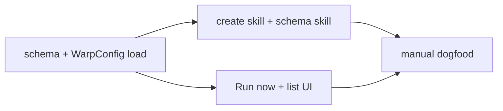

# Local Automations — Slice A TECH

## Context
Slice A implements the product behavior in [`PRODUCT.md`](./PRODUCT.md): TOML-on-disk local automations, a create/edit skill, minimal list + open config, and **Run now** into a local tab. No cron scheduler.

**Current system (relevant patterns)**
- User file configs load from `data_dir()` via `WarpConfig` + filesystem watchers: tab configs, custom model routers, launch configs.
  - [`app/src/user_config/mod.rs` (192-224) @ fa727a46ef732fcc1f6b9dc64c31b658fa1e0a58](https://github.com/warpdotdev/warp/blob/fa727a46ef732fcc1f6b9dc64c31b658fa1e0a58/app/src/user_config/mod.rs#L192-L224) — `tab_configs_dir()`, `custom_model_routers_dir()`
  - [`app/src/user_config/native.rs` (30-160) @ fa727a46ef732fcc1f6b9dc64c31b658fa1e0a58](https://github.com/warpdotdev/warp/blob/fa727a46ef732fcc1f6b9dc64c31b658fa1e0a58/app/src/user_config/native.rs#L30-L160) — async load + watcher reload
- Tab configs: TOML, one file per entity, `source_path`, deny_unknown_fields pattern.
  - [`app/src/tab_configs/tab_config.rs` (138-164) @ fa727a46ef732fcc1f6b9dc64c31b658fa1e0a58](https://github.com/warpdotdev/warp/blob/fa727a46ef732fcc1f6b9dc64c31b658fa1e0a58/app/src/tab_configs/tab_config.rs#L138-L164)
- Worktree path helpers already exist for tab configs.
  - [`app/src/tab_configs/tab_config.rs` (42-58) @ fa727a46ef732fcc1f6b9dc64c31b658fa1e0a58](https://github.com/warpdotdev/warp/blob/fa727a46ef732fcc1f6b9dc64c31b658fa1e0a58/app/src/tab_configs/tab_config.rs#L42-L58)
- Unattended permissions: `AIExecutionProfile::create_default_cli_profile`.
  - [`crates/cloud_object_models/src/ai_execution_profile.rs` (452-506) @ fa727a46ef732fcc1f6b9dc64c31b658fa1e0a58](https://github.com/warpdotdev/warp/blob/fa727a46ef732fcc1f6b9dc64c31b658fa1e0a58/crates/cloud_object_models/src/ai_execution_profile.rs#L452-L506)
- Cloud scheduled agents already exist (`ScheduledAmbientAgent`) but are **out of scope** for Slice A execution; promote is Slice C.
  - [`crates/cloud_object_models/src/scheduled_ambient_agent.rs` (164-198) @ fa727a46ef732fcc1f6b9dc64c31b658fa1e0a58](https://github.com/warpdotdev/warp/blob/fa727a46ef732fcc1f6b9dc64c31b658fa1e0a58/crates/cloud_object_models/src/scheduled_ambient_agent.rs#L164-L198)
  - CLI create path: [`app/src/ai/agent_sdk/schedule.rs` (43-169) @ fa727a46ef732fcc1f6b9dc64c31b658fa1e0a58](https://github.com/warpdotdev/warp/blob/fa727a46ef732fcc1f6b9dc64c31b658fa1e0a58/app/src/ai/agent_sdk/schedule.rs#L43-L169)
- Skill authoring pattern: bundled skill + schema companion (see `create-tab-config` + `tab-configs`).
  - [`resources/bundled/skills/create-tab-config/SKILL.md` @ fa727a46ef732fcc1f6b9dc64c31b658fa1e0a58](https://github.com/warpdotdev/warp/blob/fa727a46ef732fcc1f6b9dc64c31b658fa1e0a58/resources/bundled/skills/create-tab-config/SKILL.md)

## Proposed changes

### 1. Schema + load path
Add `automations_dir() -> data_dir().join("automations")` next to `tab_configs_dir()`.

Introduce a small module (suggested: `app/src/local_automations/`):
- `LocalAutomation` serde TOML struct with `deny_unknown_fields` **or** explicit `#[serde(deny_unknown_fields)]` on v1 fields and a documented extension policy. Prefer deny_unknown_fields for Slice A to keep the skill honest; unknown-field warnings can come later if dogfood needs softer evolution.
- Fields (concrete draft):

```toml
name = "Morning repo brief"
enabled = true
schedule = "0 9 * * 1-5"  # stored only; not fired in Slice A

# Exactly one of cwd / worktree
cwd = "~/code/warp"

# OR:
# [worktree]
# repo = "~/code/warp"
# name = "automation-morning-brief"   # under ~/.warp/worktrees/<repo>/<name>
# base_branch = "main"               # optional

[runner]
type = "warp_agent"   # or "shell"
prompt = "Summarize commits on main from the last 24h."
# command = "gh ..."  # when type = shell

# optional
timeout_seconds = 1800
# [env]
# FOO = "bar"
```

- `LocalAutomationError { file_name, file_path, error_message }` mirror `TabConfigError`.
- Load all `*.toml` from `automations_dir()`; attach `source_path`.
- Wire into `WarpConfig` (or a dedicated singleton if cleaner) with the same watch/reload pattern as tab configs. Feature-flag the whole surface (`FeatureFlag::LocalAutomations` or similar).

### 2. Worktree / cwd resolution
- Reuse `generated_worktree_path` / git worktree add patterns from tab configs where possible; do not fork a second worktree root.
- Resolution API: `fn resolve_working_directory(automation) -> Result<PathBuf, ResolveError>` used by Run now.
- Worktree: create if missing; reuse if exists and clean enough for Slice A (document: dirty worktree still runs — user owns risk; optional later “require clean”).

### 3. Run now execution
**Warp agent**
- Open a new local agent tab (existing workspace APIs for new agent pane/tab with directory).
- Apply CLI-like unattended profile for that session only:
  - Prefer constructing permissions via `AIExecutionProfile::create_default_cli_profile(is_sandboxed=false, computer_use_override=Some(false))` (or the project’s supported equivalent for GUI sessions).
  - Do **not** switch the user’s global default interactive profile.
- Seed the conversation with `prompt` and start the agent (same path as “open agent and submit”).
- If the platform cannot attach a one-off profile without larger refactors, fallback options ranked:
  1. Session-scoped profile override (best).
  2. `autoexecute_any_action` / run-to-completion style flags if already used for similar unattended GUI flows (verify carefully).
  3. Document temporary limitation only if blocked — do not ship AlwaysAsk hangs.

**Shell**
- Open terminal tab at resolved cwd; run `command` (or sequential commands).
- No agent profile involved.

**UI entry points**
- Minimal list view: name, runner, schedule, enabled, path; actions Open + Run now.
- Placement: Settings → Automations; keep UI thin (table/list, no history).
- Command palette: “Open Settings: Automations”.

### 4. Skills
Add bundled skills (mirror tab-config split):
- `local-automations` — schema, paths, examples, validation rules, Slice A limitations (no cron fire).
- `create-local-automation` — NL → write TOML workflow; optional “run now” instructions for the agent (invoke palette / tell user to click Run now if agent cannot trigger UI yet).

Until client Run now exists, the create skill can still write files for dogfood; ship skill in the same PR as loader if possible so list populates immediately.

### 5. Open config
- Reuse existing “open path in editor” used by tab config / model router error toasts.

### 6. Explicitly not in this PR / slice
- Cron ticker, catch-up, missed states.
- Promote wizard / `ScheduledAmbientAgent` write path.
- Repo-local `.warp/automations/`.
- Daemon / launchd.

## Implementation notes (as landed)
- Feature flag: `FeatureFlag::LocalAutomations` (cargo feature `local_automations`), enabled for dogfood via `DOGFOOD_FLAGS`.
- Module: `app/src/local_automations/` (`local_automation.rs` schema/resolution + `list_view.rs` list body). Settings host: `app/src/settings_view/local_automations_page.rs`. Loader/watcher wired into `WarpConfig` (`automations_dir()`, `WarpConfigUpdateEvent::LocalAutomations`).
- Schema uses `deny_unknown_fields` (fail-closed) plus cross-field validation: exactly one of `cwd` / `[worktree]`, non-empty `name`/`schedule`/`prompt`/`command`. `timeout_seconds` and `env` parse and are stored but are not applied at run time in Slice A.
- Unattended profile: `AIExecutionProfilesModel` gained ephemeral client-only profiles (`register_ephemeral_profile`); Run now registers a renamed `AIExecutionProfile::create_default_cli_profile(false, Some(false))` and sets it as the active profile for the new session only. Permission checks flow through `get_profile_by_id`, so no AlwaysAsk hangs and the user's default profile is untouched.
- Run now: `WorkspaceAction::RunLocalAutomation` resolves cwd/worktree on a background task (`git worktree add` when needed, with fallback to checking out an existing branch of the same name), then opens a tab via `add_tab_with_pane_layout`. Shell runner uses a terminal pane template with the command; agent runner opens a terminal pane and enters the agent view with the prompt auto-submitted (`AgentViewEntryOrigin::LocalAutomation`, `AutoTriggerBehavior::Always`).
- List surface: Settings → Automations (`SettingsSection::LocalAutomations`), opened via Command Palette "Open Settings: Automations" (`workspace:open_local_automations_list` / `ShowSettingsPage(LocalAutomations)`), the header toolbar Automations button, or the new-session menu. Rows show name, runner, schedule, home-relative path, and a disabled tag, with Run now / Open config actions; parse failures render as error rows; empty state explains how to create one. Run / Open config keep Settings open.
- Skills: bundled `local-automations` (schema reference) + `create-local-automation` (NL → TOML workflow), activation-gated on the feature flag.
## Testing and validation
Map to PRODUCT.md Behavior numbers:

| Behavior | Verification |
|----------|----------------|
| 1–4 paths / one-file | Unit: `automations_dir()` under fake data_dir; load fixtures |
| 5–8 schema | Unit parse valid/invalid TOML; missing runner/prompt/command; bad schedule still loads |
| 9–12 runners | Integration or manual: Run now agent vs shell |
| 13–17 skill | Manual: NL create writes file; conflict asks; skill text mentions no cron |
| 18–21 list | Manual/UI: empty state, error row, open config |
| 22–28 Run now | Manual: disabled warn; missing cwd error; worktree create; two concurrent tabs |
| 29–31 billing/trust | Manual: usage appears as normal agent; no cloud schedule created |
| 32–35 must-not | Manual: no background cron; invalid file doesn’t crash |

Automated:
- Parse/load unit tests (`local_automation_tests.rs`) with temp dirs.
- Worktree resolution unit tests with git temp repo where feasible.
- Optional integration test later; not required to land schema+skill.

## Parallelization
Useful split once schema is fixed:



- **schema-loader** (local): `app/src/local_automations/*`, `user_config` wiring, unit tests. Branch `local-automations/slice-a-schema`.
- **run-now-ui** (local): list + Run now + profile attach. Branch `local-automations/slice-a-run-now`. Depends on schema types landing first (stack or merge schema first).
- **skills** (local): `resources/bundled/skills/...`. Can parallelize after schema draft is in PRODUCT/TECH.

If one engineer: schema → skill → Run now → thin list.

## Risks and mitigations
- **Unattended profile in GUI agent tabs** may not be a one-liner. Spike early; block ship of agent runner until no AlwaysAsk hang.
- **Worktree side effects** on user’s disk. Mitigate with clear names under `~/.warp/worktrees` and skill defaults.
- **Schema churn** before Slice B. Keep schedule as opaque string; avoid over-modeling cron presets in code until B.
- **Feature flag** required so dogfood can land dark.

## Follow-ups
See [`PLAN.md`](./PLAN.md) slices B–D (scheduler, promote wizard, polish).
