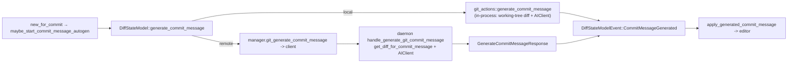
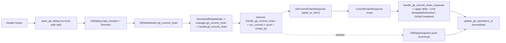

# TECH: Remote git operations in code review

Support the code review git-operations dialog (commit / push / create-PR) and View-PR over a remote SSH session, routed through `DiffStateModel`. Also remove the redundant post-operation metadata recompute and capture per-commit file lists up front to cut the git subprocess work behind the push dialog. (Broader git-call caching is scoped out of this task — see Follow-ups.)

References are pinned to commit `4ca690bee7655421f82280ae166f05e3a91a47f5`.

## Context

Git ops today are local-only. The flow is: header buttons → `CodeReviewAction` → [`open_git_dialog`](https://github.com/warpdotdev/warp/blob/4ca690bee7655421f82280ae166f05e3a91a47f5/app/src/code_review/code_review_view.rs#L6397), which builds a [`GitDialog`](https://github.com/warpdotdev/warp/blob/4ca690bee7655421f82280ae166f05e3a91a47f5/app/src/code_review/git_dialog/mod.rs#L479) holding a `repo_path: PathBuf`. Each mode's `start_confirm` shells out via `app/src/util/git.rs` (`run_commit` / `run_push` / `create_pr` / `get_*`).

What feeds the dialog, and from where:
- `DiffStateModel` (per-pane Local/Remote, [enum](https://github.com/warpdotdev/warp/blob/4ca690bee7655421f82280ae166f05e3a91a47f5/app/src/code_review/diff_state/mod.rs#L336)): branch name, [`unpushed_commits`](https://github.com/warpdotdev/warp/blob/4ca690bee7655421f82280ae166f05e3a91a47f5/app/src/code_review/diff_state/mod.rs#L270) (on `DiffMetadata`), `upstream_ref`, base branch, stats. Only exists while the panel is open.
- `GitRepoStatusModel` (per-repo, always-on, `local_fs`-only): PR info via [`CodeReviewView::pr_info`](https://github.com/warpdotdev/warp/blob/4ca690bee7655421f82280ae166f05e3a91a47f5/app/src/code_review/code_review_view.rs#L6293). `DiffMetadata.pr_info` is hardcoded `None` locally.
- `app/src/util/git.rs`: the dialog's own change/diff fetches plus the actual mutations.

The remote transport is proven: [`DiscardFilesRequest`](https://github.com/warpdotdev/warp/blob/4ca690bee7655421f82280ae166f05e3a91a47f5/crates/remote_server/proto/diff_state.proto#L197) is already a remote git mutation. The path is proto → [client](https://github.com/warpdotdev/warp/blob/4ca690bee7655421f82280ae166f05e3a91a47f5/crates/remote_server/src/client/mod.rs#L1060) → [`RemoteServerManager`](https://github.com/warpdotdev/warp/blob/4ca690bee7655421f82280ae166f05e3a91a47f5/crates/remote_server/src/manager.rs#L1985) → daemon [`handle_discard_files`](https://github.com/warpdotdev/warp/blob/4ca690bee7655421f82280ae166f05e3a91a47f5/app/src/remote_server/server_model.rs#L2587). The daemon is the Warp binary in daemon mode with `local_fs`, so its handlers call the same `crate::util::git::*` functions ([`handle_get_branches`](https://github.com/warpdotdev/warp/blob/4ca690bee7655421f82280ae166f05e3a91a47f5/app/src/remote_server/server_model.rs#L2506) → `get_all_branches`). Server diff state is keyed per-`(repo, mode)` by [`DiffModelKey`](https://github.com/warpdotdev/warp/blob/4ca690bee7655421f82280ae166f05e3a91a47f5/app/src/remote_server/diff_state_tracker.rs#L28).

Two blockers and two inefficiencies:
- `open_git_dialog` early-returns for remote because it resolves `repo_path` via `LocalOrRemotePath::to_local_path()` (→ `None` for remote).
- Remote PR info has no source: `pr_info()` reads only `GitRepoStatusModel` (local).
- [`refresh_after_git_operation`](https://github.com/warpdotdev/warp/blob/4ca690bee7655421f82280ae166f05e3a91a47f5/app/src/code_review/code_review_view.rs#L6266) does a full metadata recompute + a separate `gh pr view`, duplicating the repo watcher, which already refreshes on `commit_updated`/`remote_ref_updated` ([`handle_file_update`](https://github.com/warpdotdev/warp/blob/4ca690bee7655421f82280ae166f05e3a91a47f5/app/src/code_review/diff_state/local.rs#L999), [`should_refresh_metadata`](https://github.com/warpdotdev/warp/blob/4ca690bee7655421f82280ae166f05e3a91a47f5/app/src/code_review/git_status_update.rs#L587)).
- [`load_metadata_for_repo`](https://github.com/warpdotdev/warp/blob/4ca690bee7655421f82280ae166f05e3a91a47f5/app/src/code_review/diff_state/local.rs#L1281) recomputes everything (incl. [`get_unpushed_commits`](https://github.com/warpdotdev/warp/blob/4ca690bee7655421f82280ae166f05e3a91a47f5/app/src/util/git.rs#L327)) on every refresh, and the push dialog fetches per-commit files one round trip at a time.

Scope note: remote PR get/view uses its **own** RPC running `gh pr view` on the daemon and lands in `DiffStateModel`. We are **not** building a remote `GitRepoStatusModel` in this task; local PR info keeps using `GitRepoStatusModel`.

## Proposed changes

### 1. New RPCs + protos
Add to `crates/remote_server/proto/diff_state.proto`, mirroring the `DiscardFilesRequest`/`DiscardFilesResponse` success/error shape and reusing existing `Commit` / `PrInfo`. Shared payloads: `GitOpError { message }` and `GitOpDelta { repeated Commit unpushed_commits, optional string upstream_ref }`.
- `GitCommitChainRequest { repo_path, message, include_unstaged, branch, mode: GitCommitChainMode, autogenerate_pr_content }` → `GitCommitChainResponse { GitCommitChainSuccess { delta: GitOpDelta, pr_info? } | GitOpError }`. **One** RPC runs the whole commit (+ optional push + optional create-PR) chain on the daemon (§2). `mode` is `COMMIT_ONLY | COMMIT_AND_PUSH | COMMIT_AND_CREATE_PR`; a plain commit is `COMMIT_ONLY`, so there is no standalone commit RPC.
- `GitPushRequest { repo_path, branch }` → `GitPushResponse { GitOpDelta | GitOpError }` (always pushes with `--set-upstream`, so there is no separate `set_upstream` field).
- `GitCreatePrRequest { repo_path, branch, autogenerate_content }` → `GitCreatePrResponse { PrInfo | GitOpError }`. `branch` + `autogenerate_content` support daemon-side AI generation (§8); the title/body are always either AI-generated or filled by `gh` (no `title`/`body` fields), and base is left to `gh` (no `base` field).
- `GitGetPrInfoRequest { repo_path }` → `GitGetPrInfoResponse { GitGetPrInfoSuccess { pr_info? } | GitOpError }` — the "own command" for remote PR get/view; daemon runs `get_pr_for_branch`.
- `GitGetCommittedBranchFilesRequest { repo_path }` → `GitGetCommittedBranchFilesResponse { GitGetCommittedBranchFilesSuccess { repeated FileChangeEntry files } | GitOpError }` — the committed branch diff (`merge_base(HEAD, main)..HEAD`) backing the create-PR dialog's Changes box (§4). Committed-only by design (no working-tree edits, no untracked files) so it matches what `gh pr create` includes; the daemon runs `get_committed_branch_file_entries`.

Also extend `Commit` with `repeated FileChangeEntry files` and add `FileChangeEntry { path, additions, deletions }` so per-commit file lists ride along (§5). Add `repeated FileChangeEntry files` to `DiffMetadataAgainstBase` too, so the dialog's "Changes" box renders for remote repos from synced metadata (§4). (An earlier `DiffMetadata.has_staged_changes` bit was dropped in favor of the authoritative empty-commit guard in `run_commit` (§2), which rejects an empty staged set rather than pre-gating Confirm on a synced bit. It never shipped, so no proto field is reserved for it.)

Wire each into the envelopes in `crates/remote_server/proto/remote_server.proto`: the requests go into the `HostScopedRequest` oneof (field numbers 15–18) and the responses into the `ServerMessage` oneof (27–30). §8 adds the 5th request/response pair (19 / 31), and §4's committed-branch-files pair adds the 6th (20 / 32). `build.rs` already compiles both protos, so no codegen wiring changes.

Returning the post-op delta in the response is deliberate: it powers the immediate UI update (§6) without a follow-up recompute.

### 2. Daemon handlers + server-side reuse
Add `handle_git_commit_chain` / `handle_git_push` / `handle_create_pr` / `handle_get_pr_info` (and `handle_generate_git_commit_message`, §8) arms to the `host_scoped_request::Message` match in `ServerModel::handle_message` (exhaustive, so the compiler enforces this; `host_response_tests::every_host_scoped_request_has_a_response_disposition` also guards a per-variant disposition). Each validates `repo_path` via `requested_repo_path`, then uses `spawn_request_handler` to call the shared `git_actions::{run_commit_chain, run_push, create_pr, get_pr}` orchestration layer (which composes the `crate::util::git::*` primitives), so local and remote share identical action logic. `git_actions::run_commit_chain` runs the **entire** chain in one spawned future — `run_commit`, then `run_push` (for `COMMIT_AND_PUSH` / `COMMIT_AND_CREATE_PR`), then `create_pr` / `create_pr_with_ai_content` (for `COMMIT_AND_CREATE_PR`), and finally `compute_unpushed_state` **exactly once** — so one logical chain = one network round trip regardless of subprocess fan-out, and the delta is not recomputed per stage. Host-scoped requests execute at most once (the manager's only retry re-dispatches a request that never reached the daemon; timeouts fail rather than re-send), so the chain needs no per-stage idempotency guards. Mutating handlers first bail if `git_operation_in_progress` (a `.git` sentinel probe for an in-progress merge/rebase/cherry-pick/revert or a held `index.lock`).

PATH/`gh` correctness: the daemon captures the interactive login-shell PATH once (via `capture_interactive_path`, which runs `echo "$PATH"` through a bootstrapped session's login shell) into `ServerModel.interactive_path`, and threads it as `path_env` so commit hooks, `git-lfs`, and `gh` resolve. Until that capture completes, handlers fall back to the daemon process PATH. `gh` must be installed + authenticated on the remote host; the existing `user_facing_git_error` mapping already covers "gh not installed/authenticated".

The post-op delta computation (unpushed commits + upstream ref) lives in the `compute_unpushed_state` helper the handlers call, rather than inlined per op, so a future remote chip/tab-details model can reuse it.

### 3. Client + manager + model dispatch
- `crates/remote_server/src/manager.rs`: add typed RPC methods (`git_commit_chain` / `git_push` / `git_create_pr` / `git_get_pr_info` / `git_generate_commit_message`) on `HostRequestHandle`, mirroring `discard_files` (`send` + typed decode). `git_commit_chain` maps the domain `CommitChainMode` to the proto `GitCommitChainMode` and decodes `GitCommitChainResponse` to `(GitOpDelta, Option<PrInfo>)`. A nested `GitOpError` is surfaced as `HostRequestError::OperationFailed(message)` so the raw git/gh string reaches the client's `user_facing_git_error` — no change to the exhaustive `from_client_error` match. (No edits to `client/mod.rs`; the typed decode lives on the handle.)
- `RemoteServerManager` exposes `git_commit_chain` / `git_push_branch` / `git_create_pr` / `git_get_pr_info` / `git_generate_commit_message`, each spawning the RPC and emitting a new `RemoteServerManagerEvent` variant (`CommitChainResponse`, `GitPushResponse`, `CreatePrResponse`, `GetPrInfoResponse`, `GenerateCommitMessageResponse`) on completion. (The original "awaitable futures" plan was dropped in favor of events, for symmetry with the rest of the manager; the new variants return `None` from the exhaustive `session_id()` match.) Add `RemoteServerOperation::{CommitChain, Push, CreatePr, GetPrInfo, GenerateCommitMessage}`.
- `app/src/code_review/diff_state/remote.rs`: the manager-event handlers (`handle_git_commit_chain_response` etc.) apply the returned delta to `self.metadata` (incl. `metadata.pr_info` for create-PR / get-PR), emit `MetadataRefreshed`, then emit `GitOpCompleted`. The remote `is_git_operation_blocked` returns `false` — there is no client-side in-flight guard; the daemon's `.git` sentinel (§2) is the authoritative backstop (a client-side double-submit guard is a potential follow-up).
- `app/src/code_review/diff_state/mod.rs`: the op dispatchers (`git_commit_chain` / `git_push` / `create_pr` / `generate_commit_message`) are implemented for **both** backends — each `match`es the enum and forwards to `LocalDiffStateModel` or `RemoteDiffStateModel`, exactly like the existing `discard_files` / `fetch_branches` dispatchers, so the dialog never has to know which backend is active. The local backend runs the shared `git_actions::*` orchestration on the working tree (off-thread) and emits the same `DiffStateModelEvent`s the remote backend does; `apply_git_op_delta` is the shared metadata seam on both. Only `fetch_pr_info` / `pr_info` stay remote-only (local PR info still comes from `GitRepoStatusModel`).

### 4. GitDialog + CodeReviewView wiring
- `GitDialog` drops `repo_path: PathBuf` and instead holds `repo_location: LocalOrRemotePath` + a `diff_state_model: ModelHandle<DiffStateModel>` (two fields, not a wrapper type). Each mode's `start_confirm` is backend-agnostic: it dispatches the op through the `DiffStateModel` methods (`git_commit_chain` / `git_push` / `create_pr`) for both local and remote, and completion arrives the same way for both (see below). The model backend owns the local-vs-remote split, so the dialog no longer branches on `repo_location` for the op itself.
- Reads come from already-synced state where possible: branch/base/`unpushed_commits` come from `DiffMetadata`, and per-commit file lists now ride on `Commit`, so the push dialog renders them for both local and remote without a fetch. The commit dialog's "Changes" file list rides along in synced metadata: `against_head`'s `DiffMetadataAgainstBase.files` (per-file path + adds/dels) is captured from the same numstat that builds the aggregate stats, so `commit::refresh_remote_file_changes` populates the box for remote repos without a working-tree read (local repos still read it directly). The create-PR dialog is different: it fetches a **committed-only** `merge_base(HEAD, main)..HEAD` diff on open via `DiffStateModel::fetch_committed_branch_files` (local computes it off-thread; remote uses the `GitGetCommittedBranchFiles` RPC, §1), delivered as `DiffStateModelEvent::BranchCommittedFilesReceived` and applied by `pr::apply_committed_file_changes`. This deliberately does *not* reuse the working-tree-inclusive `against_base_branch` metadata (which also feeds the review viewer's MainBranch header and must stay WIP-inclusive): `gh pr create` builds the PR from committed history, so the box must exclude uncommitted edits and untracked files to match what the PR will contain. AI commit-message / PR-title/body generation for remote repos runs on the daemon (see §8), so the client never reconstructs the diff or calls AI itself.
- `open_git_dialog`: drop the `to_local_path()` bail; pass `repo_path()` (a `LocalOrRemotePath`) + the `diff_state_model` handle to the dialog constructors regardless of local/remote.
- Completion: `GitDialog` subscribes to `DiffStateModel` and handles `GitOpCompleted` / `CommitMessageGenerated` in `handle_diff_state_event` for **both** backends — the local backend emits the same events from its own spawn callback, so there is no separate dialog-side local completion path. Each variant routes to one completion helper per mode: `commit::finish_commit_chain` / `push::finish_push` / `pr::finish_create_pr` (toast + telemetry + close), so local and remote produce identical UX. `GitOpResult` carries the per-mode result shape (commit-chain / push / create-PR) each helper consumes.
- Remote PR get/view: route `CodeReviewView::pr_info` to read `DiffStateModel` metadata when the repo is remote (populated by `GetPrInfo` / create-PR responses), and keep `GitRepoStatusModel` for local. Make this one accessor so the later remote-chip work can repoint it without touching call sites.

### 5. Capture per-commit file lists up front
Extend `Commit` with `files: Vec<FileChangeEntry>` and populate it from the same `git log --numstat <upstream>..HEAD` that builds the unpushed-commit vec (in `parse_commit_log`). The push dialog then renders a commit's file list on expansion as a pure toggle — removing the old per-commit `get_commit_files` round trip (and its "Loading…" state) entirely. Remote rows get this for free since `Commit` rides in `DiffMetadata` / the proto.

Broader git-call caching (the unpushed-commit cache, the `git status --porcelain=2` collapse, and the `detect_main_branch` cache) is deferred — see Follow-ups.

### 6. Remove redundant refresh, keep immediate UI update
Today `refresh_after_git_operation` does a full metadata recompute + a separate `gh pr view`, which duplicates the watcher (local) and is a no-op (remote, where the UI only updates on the next server push).

New model: each op produces its post-op delta (§1), and the active backend applies it via `apply_git_op_delta`, which updates `metadata` and emits `MetadataRefreshed`. That emission drives `CodeReviewView`'s existing subscriptions → `update_git_operations_ui` → buttons/menu re-render. The local backend applies the delta in its spawn callback (after computing `compute_unpushed_state` in-process); the remote backend applies it in the manager-event handler. Both then emit `GitOpCompleted`. So:
- Drop the blanket `refresh_metadata_after_git_operation` full-chain recompute from the completion path. `refresh_after_git_operation` still calls `refresh_pr_info`: local PR info comes from `GitRepoStatusModel`, which neither the delta path nor the watcher updates. For remote, create-PR / `GetPrInfo` responses populate `metadata.pr_info` directly.
- Keep the repo watcher (local) and the server diff-state push (remote) as the eventual-consistency backstop only.
- **Immediate-refresh guarantee:** the applied delta emits a model event synchronously on op completion, so the header updates without waiting for the throttled watcher (local) or a server round trip (remote). On a partial chain failure (e.g. commit succeeds but push fails) no delta is applied, and the backstop reconciles.

### 7. Telemetry + gating
Replace the hardcoded `is_local: Some(true)` in `commit.rs`/`push.rs`/`pr.rs` and the dialog Cancel path with the real value derived from `repo_location().is_remote()` (the dialog holds `repo_location` rather than a bare path). Gate the remote path behind the existing `GitOperationsInCodeReview` flag (no new flag needed for an internal-first rollout).
### 8. AI commit message + PR title/body on the daemon
Local repos generate the open-time commit message and the PR title/body on the **client** (routed through the local `DiffStateModel` backend → `git_actions`): they read the working tree via `get_diff_for_commit_message` / `get_diff_for_pr` and call `AIClient::generate_code_review_content`. Remote repos have no local working tree, so this work moves to the daemon, which already holds an authenticated `ServerApiProvider` / `AIClient` — the user's bearer token is forwarded at `Initialize` / `Authenticate` (`apply_initialize_auth`), and the existing `UploadHandoffSnapshot` handler already calls warp-server from the daemon. Running AI there also keeps the (potentially large) diff on the remote host: only the resulting strings cross the SSH link, so this is one round trip with a small payload rather than shipping the raw diff to the client.
Two mechanisms:
- **Commit message** — new `GitGenerateCommitMessageRequest { repo_path, include_unstaged, branch_name }` → `GitGenerateCommitMessageResponse { message | error }` (host-scoped; request field 19, response field 31). At commit-dialog open, `GitDialog::new_for_commit` calls `commit::maybe_start_commit_message_autogen` for both backends, which dispatches through `DiffStateModel::generate_commit_message`. The local backend runs `git_actions::generate_commit_message` in-process (working-tree diff + `AIClient`); the remote backend routes `RemoteServerManager::git_generate_commit_message` → `HostRequestHandle::git_generate_commit_message` → the daemon's `handle_generate_git_commit_message`, which runs `get_diff_for_commit_message` then `generate_code_review_content(CommitMessage)` and returns the trimmed message. Either way the result arrives as `DiffStateModelEvent::CommitMessageGenerated` (the remote backend relays its `RemoteServerManagerEvent::GenerateCommitMessageResponse` into it); `GitDialog::handle_diff_state_event` fills the editor via `commit::apply_generated_commit_message`, handled outside the `loading` gate since generation happens before any op is initiated.
- **PR title/body** — `create_pr_with_ai_content` (a private helper in the shared `git_actions` module, wrapped by `git_actions::create_pr`) is the single AI-title/body-with-`--fill`-fallback helper, so local and remote PRs are produced identically. The standalone Create-PR dialog reaches it via `GitCreatePrRequest { autogenerate_content }` → `handle_create_pr`; the `COMMIT_AND_CREATE_PR` chain reaches it via `GitCommitChainRequest { autogenerate_pr_content }` → `handle_git_commit_chain`'s create-PR stage. Both run on the daemon, so the diff never crosses the SSH link.
Gating stays client-side: the daemon never decides whether AI is allowed. The client sets `autogenerate_content = should_send_git_ops_ai_request(...)` and only dispatches `GenerateCommitMessage` when that returns true, so the feature-flag / per-feature-toggle / team-policy gating — which only the client knows — still governs whether the daemon calls AI.

## End-to-end flow (remote commit)

