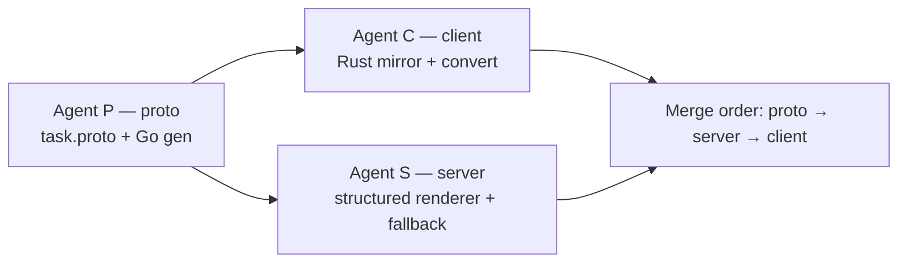

# Structured apply-diff errors — tech spec

Implements the behavior in [`PRODUCT.md`](./PRODUCT.md). This is a cross-repo change spanning the proto contract, the Warp client, and warp-server. It is a follow-up to the diagnostics work in PR #11841 (which added the per-search-block failure detail this spec transmits); it does not need to be coupled to that PR.

Inspected at:
- client `warpdotdev/warp` @ `aa3f5a3be9b32baf88f8758629830ef02221ed1c`
- server `warpdotdev/warp-server` @ `d5f8cab63976df103f421caca82a76181ea54135`
- proto `warpdotdev/warp-proto-apis` — client currently pins `c67de64fc4949f693a679552dc88cebc9f7d0180` (repo HEAD is ahead; branch the proto change from current `main`).

## Context
When an apply-file-diffs tool call fails, the client today renders the entire agent-facing message and ships it as a single string. The structure that exists on the client is discarded at the API boundary.

Client, current flow:
- The typed failure enum: [`diff_application.rs:54 @ aa3f5a3`](https://github.com/warpdotdev/warp/blob/aa3f5a3be9b32baf88f8758629830ef02221ed1c/app/src/ai/blocklist/action_model/execute/request_file_edits/diff_application.rs#L54) (`DiffApplicationError`).
- Rendered to text: [`diff_application.rs:95 @ aa3f5a3`](https://github.com/warpdotdev/warp/blob/aa3f5a3be9b32baf88f8758629830ef02221ed1c/app/src/ai/blocklist/action_model/execute/request_file_edits/diff_application.rs#L95) (`to_conversation_message`) and `error_for_conversation` just below it (`:146`).
- The per-search-block detail that feeds it: [`diff_validation/mod.rs:329-346 @ aa3f5a3`](https://github.com/warpdotdev/warp/blob/aa3f5a3be9b32baf88f8758629830ef02221ed1c/crates/ai/src/diff_validation/mod.rs#L329-L346) (`DiffMatchFailures`, `DiffMatchFailure`).
- Folded into a string-only result variant `RequestFileEditsResult::DiffApplicationFailed { error: String }`: [`action_result/mod.rs:646 @ aa3f5a3`](https://github.com/warpdotdev/warp/blob/aa3f5a3be9b32baf88f8758629830ef02221ed1c/crates/ai/src/agent/action_result/mod.rs#L646). Constructed from `error_for_conversation` at [`request_file_edits.rs:156 @ aa3f5a3`](https://github.com/warpdotdev/warp/blob/aa3f5a3be9b32baf88f8758629830ef02221ed1c/app/src/ai/blocklist/action_model/execute/request_file_edits.rs#L156), and *separately* from file-save (I/O) errors at [`request_file_edits.rs:203 @ aa3f5a3`](https://github.com/warpdotdev/warp/blob/aa3f5a3be9b32baf88f8758629830ef02221ed1c/app/src/ai/blocklist/action_model/execute/request_file_edits.rs#L203).
- Flattened to the wire: [`action_result/convert.rs:292 @ aa3f5a3`](https://github.com/warpdotdev/warp/blob/aa3f5a3be9b32baf88f8758629830ef02221ed1c/crates/ai/src/agent/action_result/convert.rs#L292) maps it to `api::apply_file_diffs_result::Error { message }`.

Proto, current contract: [`task.proto:1169-1195 @ c67de64`](https://github.com/warpdotdev/warp-proto-apis/blob/c67de64fc4949f693a679552dc88cebc9f7d0180/apis/multi_agent/v1/task.proto#L1169-L1195). `ApplyFileDiffsResult.Error` is `{ string message = 1 [(sensitive) = true]; }`. The structured-oneof pattern this spec adopts already exists in the same file: `PermissionDenied` (`:1361`) and `ShellCommandError` (`:1559`).

Server, current consumer: [`tool_call_result/edit_files.go:74-77 @ d5f8cab`](https://github.com/warpdotdev/warp-server/blob/d5f8cab63976df103f421caca82a76181ea54135/logic/ai/multi_agent/utils/formatters/shared/tool_call_result/edit_files.go#L74-L77) copies `res.GetError().GetMessage()` verbatim into the history. The server does zero formatting today. Per-model tool formatting precedent lives alongside it in `output/tool_call/shared/` (`anthropic_text_editor.go`, `openai_apply_patch.go`).

Additional client consumers of the `DiffApplicationFailed` variant that must keep producing a local string (these define the blast radius if the variant shape changes):
- Display impl: [`action_result/mod.rs:698 @ aa3f5a3`](https://github.com/warpdotdev/warp/blob/aa3f5a3be9b32baf88f8758629830ef02221ed1c/crates/ai/src/agent/action_result/mod.rs#L698).
- Markdown render: [`agent/mod.rs:1040 @ aa3f5a3`](https://github.com/warpdotdev/warp/blob/aa3f5a3be9b32baf88f8758629830ef02221ed1c/app/src/ai/agent/mod.rs#L1040).
- SDK text + JSON output: [`agent_sdk/driver/output.rs:103 @ aa3f5a3`](https://github.com/warpdotdev/warp/blob/aa3f5a3be9b32baf88f8758629830ef02221ed1c/app/src/ai/agent_sdk/driver/output.rs#L103) and `:856`.
- Read-back from persisted proto: [`convert_conversation.rs:782 @ aa3f5a3`](https://github.com/warpdotdev/warp/blob/aa3f5a3be9b32baf88f8758629830ef02221ed1c/app/src/ai/agent/api/convert_conversation.rs#L782).

## Proposed changes
### 1. Proto (`warp-proto-apis`, `task.proto`)
Extend `ApplyFileDiffsResult.Error` to carry structured failures while keeping `message` for backward compatibility. Model the failure oneof on `ShellCommandError`. Mark all user-content strings `(sensitive)`.
```protobuf
message ApplyFileDiffsResult {
  // ... unchanged oneof result { Success; Error; } ...

  message Error {
    // Back-compat + fallback. Always rendered verbatim by servers that do not
    // understand `failures`, and the carrier for the Opaque category. New
    // clients keep populating this until the server-render path is everywhere.
    string message = 1 [ (sensitive) = true ];

    // Structured failures, in client-produced order. When non-empty, a
    // structured-aware server renders from these and ignores `message`.
    repeated Failure failures = 2;
  }

  message Failure {
    oneof kind {
      UnmatchedDiffs unmatched_diffs = 1;
      ChangesAlreadyApplied changes_already_applied = 2;
      MissingFile missing_file = 3;
      ReadFailed read_failed = 4;
      AlreadyExists already_exists = 5;
      MultipleFileCreation multiple_file_creation = 6;
      MultipleFileRenames multiple_file_renames = 7;
      MutatedDeletedFile mutated_deleted_file = 8;
      google.protobuf.Empty no_diffs_applicable = 9;
      google.protobuf.Empty remote_file_operations_unsupported = 10;
      // Prerendered text the server surfaces verbatim (save errors, legacy).
      Opaque opaque = 11;
    }

    message UnmatchedDiffs {
      string file = 1 [ (sensitive) = true ];
      uint32 fuzzy_match_failure_count = 2;
      repeated SearchBlockFailure search_block_failures = 3;
    }
    message SearchBlockFailure {
      string search = 1 [ (sensitive) = true ]; // capped client-side
      bool truncated = 2;
      // 1-indexed inclusive range the block was expected to match, if known.
      optional uint32 expected_start_line = 3;
      optional uint32 expected_end_line = 4;
    }
    message ChangesAlreadyApplied { string file = 1 [ (sensitive) = true ]; }
    message MissingFile { string file = 1 [ (sensitive) = true ]; }
    message ReadFailed { string file = 1 [ (sensitive) = true ]; }
    message AlreadyExists { string file = 1 [ (sensitive) = true ]; }
    message MultipleFileCreation { string file = 1 [ (sensitive) = true ]; }
    message MultipleFileRenames { string file = 1 [ (sensitive) = true ]; }
    message MutatedDeletedFile { string file = 1 [ (sensitive) = true ]; }
    message Opaque { string message = 1 [ (sensitive) = true ]; }
  }
}
```
Regenerate with `./script/generate -a multi_agent -v v1` and commit the Go bindings (checked in under `apis/multi_agent/v1/gen/go`). Rust bindings are generated at compile time. The mapping decision — `expected_end_line` is the inclusive end (the client converts from its internal exclusive `Range`) so the server renders without knowing range semantics. Note `ChangesAlreadyApplied` is a distinct `Failure` entry, mirroring how the client folds a no-op signal next to unmatched diffs for the same file.

### 2. Client (`warp`)
Introduce a serializable structured mirror in `crates/ai` (where the API conversion lives), since `DiffApplicationError` lives in the `app` crate and cannot cross the layering boundary:
- New `DiffApplicationFailure` enum in `crates/ai/src/agent/action_result/` mirroring the proto `Failure` variants, including `Opaque { message }`.
- Change the result variant to carry structure: `RequestFileEditsResult::DiffApplicationFailed { failures: Vec<DiffApplicationFailure> }` ([`mod.rs:646`](https://github.com/warpdotdev/warp/blob/aa3f5a3be9b32baf88f8758629830ef02221ed1c/crates/ai/src/agent/action_result/mod.rs#L646)).
- Add a client-side `render()` on the failure list that reproduces today's wording (lift the logic out of `to_conversation_message`/`error_for_conversation`). All local consumers (Display `:698`, `MarkdownActionResult` `agent/mod.rs:1040`, SDK `output.rs:103`/`:856`) call `render()`. This keeps local UX identical and is the source for the `message` back-compat field.
- In the `app` crate, map `DiffApplicationError` → `Vec<DiffApplicationFailure>` at the construction site ([`request_file_edits.rs:156`](https://github.com/warpdotdev/warp/blob/aa3f5a3be9b32baf88f8758629830ef02221ed1c/app/src/ai/blocklist/action_model/execute/request_file_edits.rs#L156)). The file-save (I/O) error path ([`request_file_edits.rs:203`](https://github.com/warpdotdev/warp/blob/aa3f5a3be9b32baf88f8758629830ef02221ed1c/app/src/ai/blocklist/action_model/execute/request_file_edits.rs#L203)) maps to a single `DiffApplicationFailure::Opaque { message }`.
- Update the API boundary ([`convert.rs:292`](https://github.com/warpdotdev/warp/blob/aa3f5a3be9b32baf88f8758629830ef02221ed1c/crates/ai/src/agent/action_result/convert.rs#L292)) to populate `Error.failures` from the structured list **and** set `Error.message = render(...)` for back-compat.
- Update read-back ([`convert_conversation.rs:782`](https://github.com/warpdotdev/warp/blob/aa3f5a3be9b32baf88f8758629830ef02221ed1c/app/src/ai/agent/api/convert_conversation.rs#L782)): reconstruct `failures` from proto when present; otherwise wrap `message` in `Opaque`.
- Bump the `warp_multi_agent_api` rev in `Cargo.toml` (line ~311) to the merged proto commit. The capping of search text already exists (`MAX_DIFF_MATCH_FAILURE_BYTES`); set `SearchBlockFailure.truncated` accordingly.

### 3. Server (`warp-server`)
- `go get github.com/warpdotdev/warp-proto-apis/apis/multi_agent@<rev>` to pick up the regenerated bindings.
- In [`tool_call_result/edit_files.go:74-77`](https://github.com/warpdotdev/warp-server/blob/d5f8cab63976df103f421caca82a76181ea54135/logic/ai/multi_agent/utils/formatters/shared/tool_call_result/edit_files.go#L74), branch on the error shape: if `GetError().GetFailures()` is non-empty, build the agent-facing string from the structured failures; otherwise fall back to `GetError().GetMessage()` (preserving today's behavior for old clients).
- Implement a shared renderer (a new function/file under `formatters/shared/tool_call_result/`) that ports the wording from the client's `to_conversation_message`. Keep `EditFilesToolCallResult.Error string` as the rendered output so the existing `TruncateToolCallResult`/`IsError` paths are unchanged.
- Per-harness/per-model variation is possible later by dispatching to different renderers (precedent: `output/tool_call/shared/{anthropic_text_editor,openai_apply_patch}.go`), but the first cut is one shared renderer that matches current wording.

## End-to-end flow
new client → `DiffApplicationError` mapped to `Vec<DiffApplicationFailure>` → `convert.rs` writes proto `Error.failures` (+ `message` fallback) → server `edit_files.go` renders from `failures` → agent reads server-worded message. Old client omits `failures`; server renders from `message`. The `message` field is the safety net that makes every version pairing in PRODUCT invariants 10–13 hold.

## Testing and validation
- Proto (PRODUCT 1–2, 7): no behavioral test; CI verifies generated Go is in sync (`script/generate`). Confirm `(sensitive)` on every user-content field per the repo's PR checklist.
- Client unit tests in `convert_tests.rs` (PRODUCT 2, 7, 8, 10–12): each `DiffApplicationFailure` variant maps to the expected proto `Failure.kind`; `Error.message` is still populated; `truncated` is set when search text is capped. Adjust the existing `diff_application_tests.rs` to assert the `DiffApplicationError` → `DiffApplicationFailure` mapping and that `render()` output matches the pre-change strings (lock in no-regression).
- Client read-back test (PRODUCT 13): proto with only `message` → `Opaque`; proto with `failures` → structured.
- Server Go tests under `formatters/shared/tool_call_result/` (PRODUCT 3, 4, 9): each structured `Failure` renders to the expected wording; multiple failures aggregate in order; empty/unknown kind falls back to a non-empty message; `message`-only error path renders verbatim.
- Parity check (PRODUCT 3): a table of inputs whose server-rendered output equals the current client wording for every category, so the move is provably non-regressing before any wording is changed.
- Manual: run a real agent edit that misses a search block against a structured-aware server; confirm the agent receives the enumerated failed blocks and retries.

## Risks and mitigations
- **Version skew dropping the message.** Mitigated by always populating `Error.message` on the client until the server-render path is fully rolled out; the server falls back to it. Removing `message` is deferred (see Follow-ups).
- **Wording drift between client `render()` and server renderer during transition.** Both exist temporarily. The parity test pins the server output to the client baseline; once the server owns wording, the client `render()` is only used for local display and may intentionally diverge.
- **Sensitive content leakage.** Every new string field carries `(sensitive)`; reuse the existing capping so oversized blocks are not transmitted whole.
- **Blast radius in the client.** The variant shape change touches ~6 consumers (listed in Context). The `render()` helper keeps all of them one-line changes.

## Parallelization
The proto change is a hard prerequisite: it defines the contract both other repos compile against. Client and server work is independent of each other and parallelizable once the proto shape is fixed. Because the three repos are already separate local checkouts, file-collision risk is low and each agent owns one repo on its own branch.

Sequencing: do the proto change first (Agent P), then fan out client (Agent C) and server (Agent S) in parallel against it. During development, Agents C and S pin to Agent P's branch — C via the commented local-path patch in `Cargo.toml` (`[patch."https://github.com/warpdotdev/warp-proto-apis.git"]`), S via `go mod edit -replace` to the local proto checkout — then switch to the merged commit/rev before their PRs land.

- **Agent P — proto.** Owns `task.proto` + regenerated Go bindings in `warp-proto-apis`. Local agent in `../warp-proto-apis` (worktree `../warp-proto-apis-structured-errors`, branch `varoon/structured-apply-diff-errors`). Output: a merged proto commit/tag the others pin to. Must finish the schema before C and S can compile against the real bindings.
- **Agent C — client.** Owns the Rust changes in `warp` (this branch `varoon/refactor-apply-diffs-logs`, working dir = current checkout). Output: client PR. Validates with `cargo test` on `crates/ai` + `app` and presubmit.
- **Agent S — server.** Owns the Go renderer + fallback in `warp-server` (worktree `../warp-server-structured-errors`, branch `varoon/structured-apply-diff-errors`). Output: server PR. Validates with `go test ./logic/ai/multi_agent/...`.



Merge/rollout order: proto first (merge + tag), then server (so a structured-aware server exists before clients rely on it — though the `message` fallback makes strict ordering non-fatal), then client. Each lands as its own PR in its own repo.

## Follow-ups
- Cleanup PR once the minimum supported client always sends `failures`: drop the client `message` population, delete the now-dead `to_conversation_message`/`error_for_conversation` LLM-facing path (keep only local `render()` if still needed), and remove the server `message` fallback.
- Optional: per-harness/per-model renderers on the server to tune wording for Claude vs Codex vs Oz, reusing the `output/tool_call/shared` dispatch pattern.
- Optional: apply the same structured treatment to `SearchCodebaseResult` (which already has a client-side `SearchCodebaseFailureReason` enum flattened to a string at the boundary) as a second instance of the same refactor.
