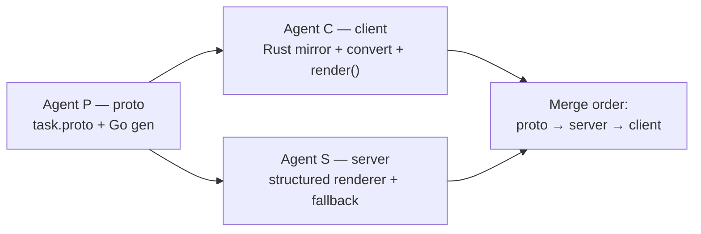

# Structured apply-diff errors — tech spec
Implements the behavior in [`PRODUCT.md`](./PRODUCT.md). This is a cross-repo change spanning the proto contract (`warp-proto-apis`), the Warp client (`warp`), and `warp-server`.
Inspected at (commit-pinned references below link to these):
- client `warpdotdev/warp` @ `af6fc40d476d428637b265da60bf584512e4e1d4` (`origin/master`)
- proto `warpdotdev/warp-proto-apis` @ `ba4ab14cf25987568414be89b7ec25b37a040bb6` (`origin/main`)
- server `warpdotdev/warp-server` @ `5244dbc348e890dbfb7281e2b43e1b37aae0dab0` (`origin/develop`)
## Self-contained scope re: PR #11841
PR #11841 ("Improve edit_files diff match failure errors") is an unmerged, client-only diagnostics change. This spec is a superset of it and does **not** depend on it landing first: `master` today has the simple `DiffMatchFailures` (three `u8` counters, `#[derive(Copy)]`) with no per-search-block detail, so the client work below includes capturing that detail (failed search text + expected line range + a client-side byte cap) as a prerequisite. If #11841 lands first, reuse its `DiffMatchFailure`/`MAX_DIFF_MATCH_FAILURE_BYTES` work verbatim; otherwise implement it here. Either way, #11841's agent-facing string rendering becomes the client-local `render()` and the Opaque back-compat `message` — it is not discarded.
## Context (current state)
When an `edit_files` (apply-file-diffs) tool call fails, the client renders the entire agent-facing message and ships it as a single string; the server copies it verbatim.
Client, current flow (`warp` @ `af6fc40d4`):
- Typed failure enum `DiffApplicationError`: [`diff_application.rs:53`](https://github.com/warpdotdev/warp/blob/af6fc40d476d428637b265da60bf584512e4e1d4/app/src/ai/blocklist/action_model/execute/request_file_edits/diff_application.rs#L53).
- Rendered to text: [`to_conversation_message` (diff_application.rs:94)](https://github.com/warpdotdev/warp/blob/af6fc40d476d428637b265da60bf584512e4e1d4/app/src/ai/blocklist/action_model/execute/request_file_edits/diff_application.rs#L94) and [`error_for_conversation` (diff_application.rs:140)](https://github.com/warpdotdev/warp/blob/af6fc40d476d428637b265da60bf584512e4e1d4/app/src/ai/blocklist/action_model/execute/request_file_edits/diff_application.rs#L140).
- Per-search-block detail source `DiffMatchFailures`: [`crates/ai/src/diff_validation/mod.rs:327`](https://github.com/warpdotdev/warp/blob/af6fc40d476d428637b265da60bf584512e4e1d4/crates/ai/src/diff_validation/mod.rs#L327) (currently `Copy` with three counters; the per-block details vec is added by this work / #11841).
- String-only result variant `RequestFileEditsResult::DiffApplicationFailed { error: String }`: [`crates/ai/src/agent/action_result/mod.rs:669`](https://github.com/warpdotdev/warp/blob/af6fc40d476d428637b265da60bf584512e4e1d4/crates/ai/src/agent/action_result/mod.rs#L669).
- Flattened to the wire: [`convert.rs:302`](https://github.com/warpdotdev/warp/blob/af6fc40d476d428637b265da60bf584512e4e1d4/crates/ai/src/agent/action_result/convert.rs#L302) maps it to `api::apply_file_diffs_result::Error { message }` (the `message` field at `:306`).
Construction sites of `DiffApplicationFailed` (inputs that must map into the structured list):
- Diff-match failures (from `error_for_conversation`): [`request_file_edits.rs:156`](https://github.com/warpdotdev/warp/blob/af6fc40d476d428637b265da60bf584512e4e1d4/app/src/ai/blocklist/action_model/execute/request_file_edits.rs#L156).
- File-save (I/O) errors in `save_failure_result`: [`diff_storage.rs:177`](https://github.com/warpdotdev/warp/blob/af6fc40d476d428637b265da60bf584512e4e1d4/app/src/ai/blocklist/diff_storage.rs#L177).
- Review-surface-vanished (static string): [`code_diff_view.rs:363`](https://github.com/warpdotdev/warp/blob/af6fc40d476d428637b265da60bf584512e4e1d4/app/src/ai/blocklist/inline_action/code_diff_view.rs#L363).
Local consumers of the variant that must keep producing a local string (blast radius of a shape change — note this now includes both GUI and TUI front-ends):
- `Display` impl: [`action_result/mod.rs:721`](https://github.com/warpdotdev/warp/blob/af6fc40d476d428637b265da60bf584512e4e1d4/crates/ai/src/agent/action_result/mod.rs#L721); `is_failed` matcher (variant-only): [`action_result/mod.rs:849`](https://github.com/warpdotdev/warp/blob/af6fc40d476d428637b265da60bf584512e4e1d4/crates/ai/src/agent/action_result/mod.rs#L849).
- Markdown render: [`app/src/ai/agent/mod.rs:1246`](https://github.com/warpdotdev/warp/blob/af6fc40d476d428637b265da60bf584512e4e1d4/app/src/ai/agent/mod.rs#L1246).
- SDK text + JSON output: [`agent_sdk/driver/output.rs:102`](https://github.com/warpdotdev/warp/blob/af6fc40d476d428637b265da60bf584512e4e1d4/app/src/ai/agent_sdk/driver/output.rs#L102) and [`:890`](https://github.com/warpdotdev/warp/blob/af6fc40d476d428637b265da60bf584512e4e1d4/app/src/ai/agent_sdk/driver/output.rs#L890).
- Read-back from persisted proto: [`convert_conversation.rs:803`](https://github.com/warpdotdev/warp/blob/af6fc40d476d428637b265da60bf584512e4e1d4/app/src/ai/agent/api/convert_conversation.rs#L803).
- TUI front-end consumers (via surface-agnostic file-edit work): `crates/warp_tui/src/tui_file_edits_view.rs`, `tui_diff_storage_tests.rs` — these also match on the variant and must be updated.
Proto, current contract (`warp-proto-apis` @ `ba4ab14c`, `apis/multi_agent/v1/task.proto`):
- [`ApplyFileDiffsResult` (task.proto:1310)](https://github.com/warpdotdev/warp-proto-apis/blob/ba4ab14cf25987568414be89b7ec25b37a040bb6/apis/multi_agent/v1/task.proto#L1310); its [`Error { string message }` at :1334](https://github.com/warpdotdev/warp-proto-apis/blob/ba4ab14cf25987568414be89b7ec25b37a040bb6/apis/multi_agent/v1/task.proto#L1334).
- Structured-oneof precedent to model on: [`PermissionDenied` (task.proto:1501)](https://github.com/warpdotdev/warp-proto-apis/blob/ba4ab14cf25987568414be89b7ec25b37a040bb6/apis/multi_agent/v1/task.proto#L1501) and [`ShellCommandError` (task.proto:1799)](https://github.com/warpdotdev/warp-proto-apis/blob/ba4ab14cf25987568414be89b7ec25b37a040bb6/apis/multi_agent/v1/task.proto#L1799).
- The client-rendered `{path, message}` precedent this spec deliberately does *not* copy: [`ReadFilesResult.FailedRead` (task.proto:1279)](https://github.com/warpdotdev/warp-proto-apis/blob/ba4ab14cf25987568414be89b7ec25b37a040bb6/apis/multi_agent/v1/task.proto#L1279).
- Client currently pins the proto at `rev = "b0886a9523e2e05d102f61bd0a212dc15ade4835"` in [`Cargo.toml:348`](https://github.com/warpdotdev/warp/blob/af6fc40d476d428637b265da60bf584512e4e1d4/Cargo.toml#L348); a commented local-path patch is at [`Cargo.toml:569`](https://github.com/warpdotdev/warp/blob/af6fc40d476d428637b265da60bf584512e4e1d4/Cargo.toml#L569).
Server, current consumer (`warp-server` @ `5244dbc3`): [`edit_files.go:80`](https://github.com/warpdotdev/warp-server/blob/5244dbc348e890dbfb7281e2b43e1b37aae0dab0/logic/ai/multi_agent/utils/formatters/shared/tool_call_result/edit_files.go#L80) copies `res.GetError().GetMessage()` into `EditFilesToolCallResult.Error` verbatim — zero formatting. [`TruncateToolCallResult` (:87)](https://github.com/warpdotdev/warp-server/blob/5244dbc348e890dbfb7281e2b43e1b37aae0dab0/logic/ai/multi_agent/utils/formatters/shared/tool_call_result/edit_files.go#L87) and [`IsError` (:115)](https://github.com/warpdotdev/warp-server/blob/5244dbc348e890dbfb7281e2b43e1b37aae0dab0/logic/ai/multi_agent/utils/formatters/shared/tool_call_result/edit_files.go#L115) key off that string. Per-model tool formatting precedent lives under `logic/ai/multi_agent/utils/output/tool_call/shared/` (`anthropic_text_editor.go`, `openai_apply_patch.go`).
## Proposed changes
### 1. Proto (`warp-proto-apis`, `task.proto`)
Extend `ApplyFileDiffsResult.Error` to carry structured failures while keeping `message` for backward compatibility. Model the failure oneof on `PermissionDenied`/`ShellCommandError`. Mark every user-content string `(sensitive)`.
```protobuf
message ApplyFileDiffsResult {
  // ... unchanged oneof result { Success; Error; } ...

  message Error {
    // Back-compat + fallback. Rendered verbatim by servers that do not
    // understand `failures`, and the carrier for the Opaque category. New
    // clients keep populating this until the server-render path is everywhere.
    string message = 1 [ (sensitive) = true ];

    // Structured failures, in client-produced order. When non-empty, a
    // structured-aware server renders from these and ignores `message`.
    repeated Failure failures = 2;
  }

  message Failure {
    oneof kind {
      UnmatchedDiffs unmatched_diffs = 1;
      ChangesAlreadyApplied changes_already_applied = 2;
      MissingFile missing_file = 3;
      ReadFailed read_failed = 4;
      AlreadyExists already_exists = 5;
      MultipleFileCreation multiple_file_creation = 6;
      MultipleFileRenames multiple_file_renames = 7;
      MutatedDeletedFile mutated_deleted_file = 8;
      google.protobuf.Empty no_diffs_applicable = 9;
      google.protobuf.Empty remote_file_operations_unsupported = 10;
      // Prerendered text the server surfaces verbatim (save errors, legacy).
      Opaque opaque = 11;
    }

    message UnmatchedDiffs {
      string file = 1 [ (sensitive) = true ];
      uint32 fuzzy_match_failure_count = 2;
      repeated SearchBlockFailure search_block_failures = 3;
    }
    message SearchBlockFailure {
      string search = 1 [ (sensitive) = true ]; // capped client-side
      bool truncated = 2;
      // 1-indexed inclusive range the block was expected to match, if known.
      optional uint32 expected_start_line = 3;
      optional uint32 expected_end_line = 4;
    }
    message ChangesAlreadyApplied { string file = 1 [ (sensitive) = true ]; }
    message MissingFile { string file = 1 [ (sensitive) = true ]; }
    message ReadFailed { string file = 1 [ (sensitive) = true ]; }
    message AlreadyExists { string file = 1 [ (sensitive) = true ]; }
    message MultipleFileCreation { string file = 1 [ (sensitive) = true ]; }
    message MultipleFileRenames { string file = 1 [ (sensitive) = true ]; }
    message MutatedDeletedFile { string file = 1 [ (sensitive) = true ]; }
    message Opaque { string message = 1 [ (sensitive) = true ]; }
  }
}
```
Regenerate with `./script/generate -a multi_agent -v v1` and commit the Go bindings (checked in under `apis/multi_agent/v1/gen/go`); Rust bindings are generated at compile time. `expected_end_line` is the inclusive end (the client converts from its internal exclusive `Range`) so the server renders without knowing range semantics. `ChangesAlreadyApplied` is a distinct `Failure` entry, mirroring how the client folds a no-op signal next to unmatched diffs for the same file.
### 2. Client (`warp`)
Introduce a serializable structured mirror in `crates/ai` (where the API conversion lives), since `DiffApplicationError` lives in the `app` crate and cannot cross the layering boundary:
- New `DiffApplicationFailure` enum in `crates/ai/src/agent/action_result/` mirroring the proto `Failure` variants, including `Opaque { message }`.
- If not already present from #11841, enrich `DiffMatchFailures` in `crates/ai/src/diff_validation/mod.rs` with per-search-block details (`Vec<DiffMatchFailure { search, expected_range }>`) and a `MAX_DIFF_MATCH_FAILURE_BYTES` cap; drop `#[derive(Copy)]` accordingly.
- Change the result variant to carry structure: `RequestFileEditsResult::DiffApplicationFailed { failures: Vec<DiffApplicationFailure> }` (`action_result/mod.rs:669`).
- Add a `render(&[DiffApplicationFailure]) -> String` helper reproducing today's wording (lift the logic out of `to_conversation_message`/`error_for_conversation`, including the per-block enumeration). This is the single rendering path: all local consumers (Display `:721`, markdown `agent/mod.rs:1246`, SDK `output.rs:102`/`:890`, and the TUI file-edits view) call it, and it is the source for the `message` back-compat field. Do not scatter wording across consumers.
- In the `app` crate, map `DiffApplicationError` → `Vec<DiffApplicationFailure>` at the construction sites: diff-match failures at `request_file_edits.rs:156`; the file-save (I/O) path `save_failure_result` (`diff_storage.rs:177`) and the review-surface-vanished path (`code_diff_view.rs:363`) each map to a single `DiffApplicationFailure::Opaque { message }`.
- Update the API boundary (`convert.rs:302`) to populate `Error.failures` from the structured list **and** set `Error.message = render(...)` for back-compat.
- Update read-back (`convert_conversation.rs:803`): reconstruct `failures` from proto when present; otherwise wrap `message` in `Opaque`.
- Bump the `warp_multi_agent_api` rev in `Cargo.toml:348` to the merged proto commit. Reuse the `MAX_DIFF_MATCH_FAILURE_BYTES` cap and set `SearchBlockFailure.truncated` accordingly.
- **Sensitive-data hardening (PRODUCT invariant 7).** `DiffMatchFailures`/`DiffMatchFailure` and `DiffApplicationFailure` carry user source. Give them a manual redacted `Debug` impl (or guarantee no `{:?}` of them reaches a `safe:`/telemetry context) so search-block text can never leak through logs or crash reports even if a future `{failures:?}` is added. This is more robust than fixing only today's call sites.
### 3. Server (`warp-server`)
- `go get github.com/warpdotdev/warp-proto-apis/apis/multi_agent@<rev>` to pick up the regenerated bindings.
- In `edit_files.go:80`, branch on the error shape: if `GetError().GetFailures()` is non-empty, build the agent-facing string from the structured failures; otherwise fall back to `GetError().GetMessage()` (today's behavior for old clients). Keep `EditFilesToolCallResult.Error string` as the rendered output so `IsError()`/`TruncateToolCallResult` are unchanged.
- Implement a shared renderer (new function/file under `formatters/shared/tool_call_result/`) porting the wording from the client's `to_conversation_message` + per-block enumeration. An unrecognized/empty `kind` renders a generic non-empty message (PRODUCT invariant 9).
- Per-harness/per-model variation is possible later by dispatching to different renderers (precedent: `output/tool_call/shared/{anthropic_text_editor,openai_apply_patch}.go`); the first cut is one shared renderer matching current wording.
## End-to-end flow
new client → `DiffApplicationError` mapped to `Vec<DiffApplicationFailure>` → `convert.rs` writes proto `Error.failures` (+ `message` fallback) → server `edit_files.go` renders from `failures` → agent reads server-worded message. Old client omits `failures`; server renders from `message`. The `message` field is the safety net that makes every version pairing in PRODUCT invariants 10–13 hold.
## Testing and validation
- Proto (PRODUCT 1–2, 7): no behavioral test; CI verifies generated Go is in sync (`./script/generate`). Confirm `(sensitive)` on every user-content field.
- Client unit tests in `convert_tests.rs` (PRODUCT 2, 7, 8, 10–12): each `DiffApplicationFailure` variant maps to the expected proto `Failure.kind`; `Error.message` is still populated; `truncated` is set when search text is capped.
- Adjust `diff_application_tests.rs` to assert the `DiffApplicationError` → `DiffApplicationFailure` mapping and that `render()` output matches the pre-change strings (lock in no-regression). Follow the repo's `${file}_tests.rs` convention.
- Client read-back test (PRODUCT 13): proto with only `message` → `Opaque`; proto with `failures` → structured.
- Redacted-`Debug` test (PRODUCT 7): `format!("{:?}", ...)` of a failure carrying search text does not contain that text.
- Server Go tests under `formatters/shared/tool_call_result/` (PRODUCT 3, 4, 9): each structured `Failure` renders to the expected wording; multiple failures aggregate in order; empty/unknown kind falls back to a non-empty message; `message`-only path renders verbatim. Extend the existing `edit_files_test.go`.
- Parity check (PRODUCT 3): a table of inputs whose server-rendered output equals the current client wording for every category, proving the move is non-regressing before any wording changes.
- Manual: run a real agent edit that misses a search block against a structured-aware server; confirm the agent receives the enumerated failed blocks and retries.
## Parallelization
This is a cross-repo change destined for cloud (remote) execution. The proto change is a hard prerequisite — it defines the contract the other two repos compile against. Once the proto shape is fixed, client and server work are independent and parallelizable. Each repo is a separate checkout, so file-collision risk is zero.
Recommended default: one orchestrator dispatches three **remote** child agents, one per repo, each opening its own PR. If run by a single agent instead, execute the three in the dependency order below.
- **Agent P — proto.** Owns `task.proto` + regenerated Go bindings in `warp-proto-apis`. Branch `varoon/structured-apply-diff-errors` off `origin/main` (a local worktree already exists at `../warp-proto-apis-structured-errors` on that branch for local runs). Deliverable: merged proto commit/rev that P reports back to C and S. Must complete the schema before C and S can compile against real bindings. Validate: `./script/generate -a multi_agent -v v1` produces no diff; committed Go bindings build.
- **Agent C — client.** Owns the Rust changes in `warp`, on this branch `varoon/edit-files-fix` (spec + client implementation land in one PR). During development pin the proto via the commented `[patch."https://github.com/warpdotdev/warp-proto-apis.git"]` at `Cargo.toml:569` to P's branch; switch to the merged rev before the PR lands. Validate: `cargo test -p ai`, `cargo test -p warp` (the diff/convert tests), and `./script/presubmit` (`./script/format` + clippy) per AGENTS.md.
- **Agent S — server.** Owns the Go renderer + fallback in `warp-server`, branch `varoon/structured-apply-diff-errors` off `origin/develop` (use a dedicated warp-server worktree). During development `go mod edit -replace` to the local proto checkout; switch to the merged rev before the PR lands. Validate: `go test ./logic/ai/multi_agent/...`.
Merge/rollout order: **proto → server → client.** Land proto first (merge + tag). Land server next so a structured-aware server exists before clients rely on it — the `message` fallback makes strict ordering non-fatal but this is the safe order. Land client last, pinned to the merged proto rev.

```mermaid
flowchart LR
  P["Agent P — proto<br/>task.proto + Go gen"] --> C["Agent C — client<br/>Rust mirror + convert + render()"]
  P --> S["Agent S — server<br/>structured renderer + fallback"]
  C --> Land["Merge order:<br/>proto → server → client"]
  S --> Land
```
## Risks and mitigations
- **Version skew dropping the message.** Mitigated by always populating `Error.message` on the client until the server-render path is fully rolled out; the server falls back to it.
- **Wording drift between client `render()` and server renderer during transition.** Both exist temporarily; the parity test pins server output to the client baseline. Once the server owns wording, client `render()` is used only for local display and may intentionally diverge.
- **Sensitive content leakage.** Every new string field is `(sensitive)`; the manual redacted `Debug` prevents log/crash-report leakage; the existing cap bounds transmitted size.
- **Blast radius in the client.** The variant shape change touches the consumers listed in Context, now including the TUI front-end; the single `render()` helper keeps each site a one-line change.
## Follow-ups
- Cleanup once the minimum supported client always sends `failures`: drop client `message` population, delete the dead LLM-facing `to_conversation_message`/`error_for_conversation` path (keep local `render()` if still needed), and remove the server `message` fallback.
- Per-harness/per-model renderers on the server to tune wording for Claude vs Codex vs Oz, reusing the `output/tool_call/shared` dispatch pattern.
- **Converge `read_files`/`search_codebase`.** Apply the same structured treatment so both file-tool error paths are server-rendered, rather than leaving `read_files`' `FailedRead { path, message }` and `SearchCodebaseResult`'s client-rendered string permanently on the other pattern.
