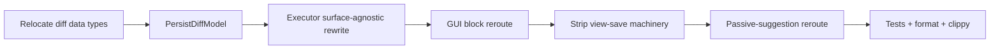

# Surface-Agnostic File-Edit Execution TECH
## Context
This branch is stacked on `tui-agent-tool-calling`, which renders `RequestFileEdits` in the transcript like any other tool call but leaves it unexecuted on non-GUI surfaces: `RequestFileEditsExecutor::execute` requires a registered GUI `CodeDiffView` and returns `NotReady` otherwise (`app/src/ai/blocklist/action_model/execute/request_file_edits.rs`).
The executor is a shared tool executor that both the GUI terminal and the TUI drive, but it is coupled to the GUI in three ways:
- It stores `diff_views: HashMap<AIAgentActionId, ViewHandle<CodeDiffView>>` and drives that view to save files and read back the result (`request_file_edits.rs`).
- The GUI `CodeDiffView` is the only producer of a successful `RequestFileEditsResult`, assembled in `try_emit_diffs_saved` and emitted as `CodeDiffViewEvent::SavedAcceptedDiffs` (`app/src/ai/blocklist/inline_action/code_diff_view.rs`), which the executor repackages.
- The diff data types `FileDiff`, `DiffBase`, and `DiffSessionType` are defined inside the GUI view module `code_diff_view.rs`.
`RequestFileEdits` has a two-phase lifecycle: `preprocess_action` resolves the LLM's edits into concrete diffs (async file reads via `ApplyDiffModel::apply_diffs`) and `execute` runs later to persist them. State computed in preprocess must survive an arbitrary user-interaction gap. Today the `CodeDiffView` is that survivor — its editor buffers hold the resolved (and possibly user-edited) diffs and produce the result on accept.
Relevant code:
- `app/src/ai/blocklist/action_model/execute/request_file_edits.rs` — executor: `diff_views`, `diff_application_failures`, `execute`, `on_diffs_applied`, `should_autoexecute`, `register_requested_edits`, and the shared `updated_file_contexts_from_editor_buffers` helper.
- `app/src/ai/blocklist/action_model/execute/request_file_edits/apply_diff_model.rs` — the GUI-less resolve-side submodel pattern this refactor mirrors for the persist side.
- `app/src/ai/blocklist/inline_action/code_diff_view.rs` — `CodeDiffView`, the `FileDiff`/`DiffBase`/`DiffSessionType` definitions, `set_candidate_diffs`, `accept_and_save`, `SavingDiffs`/`SaveStatus`/`DiffApplicationState`, `handle_save_completed`, `accepted_file_diff_computed`, `try_emit_diffs_saved`, and the `SavedAcceptedDiffs` event.
- `app/src/code/inline_diff.rs` — `InlineDiffView::register_file`, `save_content`, `accept_and_save_diff`, `restore_diff_base`.
- `app/src/ai/blocklist/block.rs` — `handle_requested_edit_complete` creates the `CodeDiffView`, calls `register_requested_edits`, subscribes to `CodeDiffViewEvent`, and on `TryAccept` calls `action_model.execute_action`.
- `app/src/terminal/view.rs` — `on_maa_code_diff_generated` builds a `CodeDiffView::new_passive` and self-drives `accept_and_save` + `SavedAcceptedDiffs` for passive code-diff suggestions, independent of the executor.
- `crates/warp_files/src/lib.rs` — `FileModel::save` / `rename_and_save` / `delete` route local vs. remote and emit `FileSaved` / `FailedToSave`; registration via `register_file_path` / `register_remote_file`.
## Goal
Make file-edit tool calls executable on any surface (GUI and TUI/headless) by routing all persistence through one shared, non-GUI model, and remove the executor's GUI coupling. The interactive review surface — the only thing that genuinely differs between GUI and TUI — stays in the GUI, which hands the executor plain data.
## Proposed changes
### Two focused models
Keep `ApplyDiffModel` as-is — it remains the resolve/read-and-compute half (`apply_diffs` -> `Vec<AIRequestedCodeDiff>`). Add `PersistDiffModel` in `app/src/ai/blocklist/persist_diff_model.rs` (a sibling of `diff_types.rs`, so no GUI or executor-internal module has to re-export it) as the single writer + result producer for every surface. It is a `SingletonEntity` registered at app init immediately after `FileModel` (`app/src/lib.rs`), matching the ownership model of the singleton it wraps; call sites reach it via `PersistDiffModel::handle(ctx)`.
### PersistDiffModel
One shared entry point used by every surface:
```rust
pub(crate) fn resolve_and_persist(
    &mut self,
    diffs: Vec<FileDiff>,
    reviewed: HashMap<String, String>,
    session_type: DiffSessionType,
    ctx: &mut ModelContext<Self>,
) -> BoxFuture<'static, RequestFileEditsResult>
```
Resolution and persistence live behind this one function so no caller hand-assembles resolved edits. Resolution derives each file's final content from `reviewed` (review-surface-supplied, keyed by path) when present, otherwise by applying the diff's deltas to the base content (`build_resolved_edits` / `apply_deltas_to_content` / `split_lines_preserving_newlines`, private to the module). Persistence then, per file, decides the actual write operation exactly once via a `PersistAction` enum derived from `(op, session_type)` — `Write`, `Rename(PathBuf)` (local sessions only; remote has no rename primitive and falls back to an in-place write at the original path), or `Delete` — and drives **both** the `FileModel` dispatch (`save` / `rename_and_save` / `delete`) and the reported outcome (updated/deleted paths, `similar`-based `diff_result`) from that one value, so the report can never diverge from the write. It registers each file with `FileModel` (`register_file_path` local / `register_remote_file` remote), tracks completion via `FileModelEvent` keyed by `FileId`, and calls `FileModel::unsubscribe` for each file once its save/delete resolves (or dispatch fails) so `FileModel` state does not grow unboundedly. When all files resolve it assembles `RequestFileEditsResult`, mapping any `FailedToSave` -> `DiffApplicationFailed`; `updated_files` is built via `updated_file_contexts_from_content_map` (moved here from the executor and renamed from `updated_file_contexts_from_editor_buffers`).
The pure changed-lines helpers (`changed_lines_from_op`, `changed_line_range_for_delta`, `inserted_content_range`) live in `diff_types.rs`, shared by the persist model and the GUI telemetry path instead of duplicated per surface.
### Executor becomes surface-agnostic
Collapse the executor's per-action state into one map. The existing `diff_application_failures` and the resolved diffs are mutually exclusive outcomes of preprocess, and reviewed content only applies to the prepared case, so model them as one state:
```rust
enum PendingFileEdits {
    Prepared {
        diffs: Vec<FileDiff>,
        session_type: DiffSessionType,
        reviewed: Option<HashMap<String, String>>, // GUI-supplied final content per path
    },
    Failed(Vec1<DiffApplicationError>),
}
```
Executor fields become: `active_session`, `apply_diff_model`, `pending: HashMap<AIAgentActionId, PendingFileEdits>`, `terminal_view_id` — replacing `diff_views` and `diff_application_failures` (the persist model is a singleton, not an executor field). Remove `register_requested_edits`; add `set_reviewed_content(action_id, HashMap<path, content>)` (plain data) and a getter exposing the prepared `(Vec<FileDiff>, DiffSessionType)` for the GUI to feed its own view.
- `on_diffs_applied`: insert `Prepared { diffs, session_type, reviewed: None }` on success, or `Failed(errors)` on failure; no view calls. Emits `RequestFileEditsExecutorEvent::DiffsPrepared(action_id)` for review surfaces.
- `set_reviewed_content`: if the entry is `Prepared`, set `reviewed = Some(files)`.
- `should_autoexecute`: allow continue-on-failure via `matches!(self.pending.get(id), Some(PendingFileEdits::Failed(_)))`.
- `execute`: `match self.pending.remove(id)` — `Failed` returns `DiffApplicationFailed`; `Prepared` calls `PersistDiffModel::handle(ctx)` -> `resolve_and_persist(diffs, reviewed.unwrap_or_default(), session_type, ..)`, returning `ActionExecution::new_async`. One path for both surfaces; no `CodeDiffView`, no completion channel, no per-caller resolution logic. Remove the `TODO(surface-agnostic-file-edit-execution)` left on the parent branch.
### GUI reroute (`block.rs`)
- `AIBlock` feeds prepared diffs to its own `CodeDiffView` as data: `handle_requested_edit_complete` feeds immediately if the diffs are already prepared, and a single block-level subscription to the executor (registered once in `AIBlock::new`) handles late `DiffsPrepared` events by looking the view up in the existing `requested_edits` map — no per-action subscriptions that accumulate over the block's lifetime.
- On `CodeDiffViewEvent::TryAccept`: extract `editor.text()` per file via `CodeDiffView::reviewed_file_contents` (returns `HashMap<String, String>`), call `executor.set_reviewed_content(action_id, files)`, then `action_model.execute_action` as today.
- Save-error surfacing: the failure now returns in `RequestFileEditsResult::DiffApplicationFailed`. `CodeDiffView`'s existing `FinishedAction` subscription observes a failed result for an `Accepted` diff and shows the save-failure toast (preserving the pre-refactor per-file `FailedToSave` toast behavior; the state stays `Accepted`, matching the old optimistic accept).
### Strip view-save machinery
Remove from `CodeDiffView`: `accept_and_save`, `SavingDiffs`, `SaveStatus`, `DiffApplicationState`, `accepted_file_diff_computed`, `handle_save_completed`, the result-assembly half of `try_emit_diffs_saved`, and the `SavedAcceptedDiffs` event; collapse `CodeDiffState::Accepted(Option<SavingDiffs>)` to a payloadless `Accepted` and fix its match sites (`is_complete`, revert guard, `try_accept`). Remove from `InlineDiffView`: `accept_and_save_diff` and `save_content`.
Keep GUI-side: editor rendering, delta application for display, `was_edited` tracking, the malformed-line/edited telemetry (relocated out of `try_emit_diffs_saved`, still computed from editor state at accept and emitted GUI-side), and post-accept revert (`restore_diff_base` + its `FileModel` registration).
### Passive-suggestion reroute (`terminal/view.rs`)
`on_maa_code_diff_generated` currently self-drives `view.accept_and_save` + `SavedAcceptedDiffs`. Reroute it through the shared singleton: on `TryAccept`, pass the passive `Vec<FileDiff>` (already in scope) plus `reviewed_file_contents()` to `PersistDiffModel::handle(ctx)` -> `resolve_and_persist(.., DiffSessionType::Local, ..)`. The completion callback inspects the result and shows the save-failure toast on `DiffApplicationFailed` (the result is not surfaced to the LLM on this path). The existing `ContinuePassiveCodeDiffWithAgent` result reporting is unchanged.
### Relocate diff data types
Move `FileDiff`, `DiffBase`, and `DiffSessionType` out of `code_diff_view.rs` into `app/src/ai/blocklist/diff_types.rs` (plus the shared changed-lines helpers) so neither the executor nor the persist model imports a GUI view file. All consumers (`code_diff_view.rs`, `inline_diff.rs`, `request_file_edits.rs`, `block.rs`, `terminal/view.rs`, `passive_suggestions/maa.rs`) import directly from `diff_types` — no re-export shim.
### Call flow
Base (GUI-only), unchanged on the parent branch:
```
PHASE 1 preprocess: apply_diffs -> on_diffs_applied -> diff_view.set_candidate_diffs
                                                       (diffs live inside the view)
        |--------- GAP: user reviews / edits / clicks Accept ---------|
PHASE 2 execute: diff_views.get(id) -> accept_and_save
                     -> reads editor buffers -> FileModel::save -> result (view-produced)
```
New (surface-agnostic):
```
PHASE 1 preprocess: apply_diffs -> on_diffs_applied -> self.pending[id] = Prepared{..}
        |-- GUI: user reviews/edits -> set_reviewed_content(id) fills `reviewed` --|
        |   TUI/headless: no view, no gap, reviewed = None                         |
PHASE 2 execute: self.pending.remove(id)
                   Failed   -> DiffApplicationFailed
                   Prepared -> PersistDiffModel::resolve_and_persist
                                 final = reviewed | base+deltas, per-file PersistAction
                            -> FileModel -> result
```
The result diff sent to the LLM becomes uniformly `similar`-based for both surfaces (previously the GUI used the editor-computed diff).
## Boundaries
- Do not change the resolve side (`ApplyDiffModel` keeps its name and behavior).
- Revert stays GUI-local via `InlineDiffView::restore_diff_base`; the persist model does not own revert.
- No TUI review/approval UI; the TUI registers no reviewed content and runs the headless persist branch of `execute`.
## Testing and validation
Unit-test `PersistDiffModel::resolve_and_persist` (async `App::test`, await the future — see `app/src/ai/blocklist/persist_diff_model_tests.rs`):
- Create, update, delete each write via `FileModel` and return `RequestFileEditsResult::Success`.
- Update-with-rename routes through `rename_and_save` and reports the old path in `deleted_files`.
- Save failure returns `DiffApplicationFailed`.
- Reviewed content overrides delta-applied content; its absence falls back to delta application (headless path).
- `PersistAction::resolve` renames only on local sessions (remote and rename-to-same-path are plain writes), and the remote-rename outcome reports the update at the original path with nothing deleted — matching the actual write.
Targeted runs then format + clippy:
```bash
cargo nextest run -p warp persist_diff_model
./script/format
cargo clippy --workspace --all-targets --all-features --tests -- -D warnings
```
## Parallelization
Do not use child agents. The change is tightly coupled across the executor, one new submodel, the GUI block wiring, the code-diff view, and the passive-suggestion path in a single crate; splitting across worktrees would create more merge overhead than wall-clock savings.
Implementation sequence:

