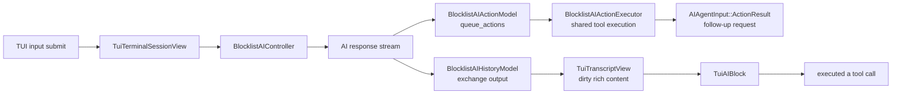
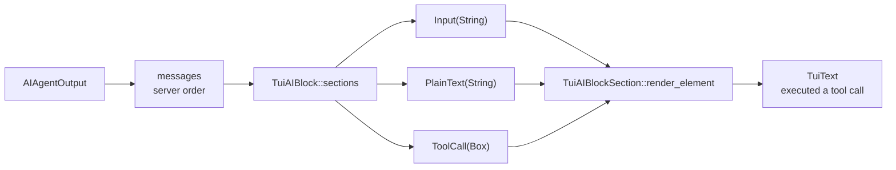
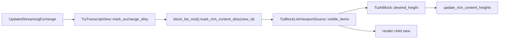
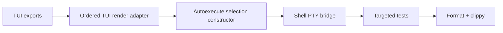

# TUI Agent Tool Calls TECH
## Context
The TUI transcript renders terminal blocks and simple AI exchange blocks in canonical terminal block-list order. AI exchange blocks currently render user input plus streamed plain-text output, but action/tool-call messages are invisible in the transcript even though the shared Agent Mode controller already receives and queues those actions.
Relevant code at `526ade4522df0e65f138c67dcbcb90f1a3ce63e9`:
- [`crates/warp_tui/src/session.rs`](https://github.com/warpdotdev/warp/blob/526ade4522df0e65f138c67dcbcb90f1a3ce63e9/crates/warp_tui/src/session.rs) — boots the headless app, creates `LocalTtyTerminalManager::<TuiTerminalSessionView>`, and keeps the TUI driver plus terminal manager alive.
- [`crates/warp_tui/src/terminal_session_view.rs`](https://github.com/warpdotdev/warp/blob/526ade4522df0e65f138c67dcbcb90f1a3ce63e9/crates/warp_tui/src/terminal_session_view.rs) — constructs the production AI stack for the TUI surface: `ActiveSession`, `TuiConversationSelection`, `BlocklistAIContextModel`, `BlocklistAIInputModel`, `BlocklistAIActionModel`, and `BlocklistAIController`.
- [`crates/warp_tui/src/transcript_view.rs`](https://github.com/warpdotdev/warp/blob/526ade4522df0e65f138c67dcbcb90f1a3ce63e9/crates/warp_tui/src/transcript_view.rs) — subscribes to `BlocklistAIHistoryModel`, creates `TuiAIBlock`s for visible exchanges, and appends them to `TerminalModel::BlockList` as `RichContentType::AIBlock`.
- [`crates/warp_tui/src/tui_block_list_viewport_source.rs`](https://github.com/warpdotdev/warp/blob/526ade4522df0e65f138c67dcbcb90f1a3ce63e9/crates/warp_tui/src/tui_block_list_viewport_source.rs) — walks the canonical block-list sum tree, measures dirty rich-content views, updates cached heights, and renders terminal blocks plus TUI agent blocks.
- [`crates/warp_tui/src/agent_block.rs`](https://github.com/warpdotdev/warp/blob/526ade4522df0e65f138c67dcbcb90f1a3ce63e9/crates/warp_tui/src/agent_block.rs) — currently derives `TuiAIBlockSection`s from `output.text_from_agent_output()`, which only yields `AIAgentOutputMessageType::Text` and therefore drops action/tool-call messages.
- [`app/src/ai/agent/mod.rs`](https://github.com/warpdotdev/warp/blob/526ade4522df0e65f138c67dcbcb90f1a3ce63e9/app/src/ai/agent/mod.rs) — defines `AIAgentOutput`, ordered `AIAgentOutputMessage`s, `AIAgentOutputMessageType::Action(AIAgentAction)`, and helper iterators such as `text_from_agent_output()` and `actions()`.
- [`app/src/ai/blocklist/block/view_impl/output.rs`](https://github.com/warpdotdev/warp/blob/526ade4522df0e65f138c67dcbcb90f1a3ce63e9/app/src/ai/blocklist/block/view_impl/output.rs) — GUI AI block rendering loops over `output.messages` in order and delegates each message variant to the appropriate renderer.
- [`app/src/ai/blocklist/controller.rs`](https://github.com/warpdotdev/warp/blob/526ade4522df0e65f138c67dcbcb90f1a3ce63e9/app/src/ai/blocklist/controller.rs) — when a response stream finishes, queues emitted actions through `BlocklistAIActionModel::queue_actions` and later sends completed action results back to the model.
- [`app/src/ai/blocklist/action_model.rs`](https://github.com/warpdotdev/warp/blob/526ade4522df0e65f138c67dcbcb90f1a3ce63e9/app/src/ai/blocklist/action_model.rs) and [`app/src/ai/blocklist/action_model/execute.rs`](https://github.com/warpdotdev/warp/blob/526ade4522df0e65f138c67dcbcb90f1a3ce63e9/app/src/ai/blocklist/action_model/execute.rs) — own the shared action queue, preprocessing, permission checks, serial/parallel scheduling, cancellation, and per-action execution dispatch.
- [`app/src/ai/blocklist/action_model/execute/request_file_edits.rs`](https://github.com/warpdotdev/warp/blob/526ade4522df0e65f138c67dcbcb90f1a3ce63e9/app/src/ai/blocklist/action_model/execute/request_file_edits.rs) — currently requires a registered GUI `CodeDiffView` before `RequestFileEdits` can execute.
The current TUI transcript work deliberately uses production-shaped models instead of a separate TUI-only conversation pipeline. This feature should keep that direction: render action messages in the TUI, but continue to execute tool calls through the shared action model.
## Proposed changes
### End-to-end data flow

The rendering path and the execution path share the same `AIAgentOutputMessageType::Action` source message but remain separate:
- Rendering derives a transcript item from the stored output message.
- Execution is driven by `BlocklistAIController` and `BlocklistAIActionModel`.
- Completed action results flow back to the LLM as `AIAgentInput::ActionResult`; the first TUI UI does not render those results.
### Ordered message-to-section adapter
Replace `TuiAIBlock::sections`' output extraction with an ordered pass over `AIAgentOutput.messages`. The GUI AI block already follows this shape in `output.rs`: one ordered pass over messages, then variant-specific rendering. The TUI matches the ordering pattern without porting the GUI renderer.

Use a flat section enum so the block stays extensible as more message types get TUI renderers:
```rust
#[derive(Clone, Debug, Eq, PartialEq)]
enum TuiAIBlockSection {
    Input(String),
    PlainText(String),
    ToolCall(Box<AIAgentAction>),
}
```
The `ToolCall` variant carries the full `AIAgentAction` even though the first renderer ignores the fields. The section is derived render data, not durable UI state. Carrying the action now gives future renderers direct access to `id`, `task_id`, `requires_result`, and the concrete `AIAgentActionType` without changing the adapter API. `AIAgentAction` is large, so the variant is boxed to satisfy clippy's `large_enum_variant`.
The adapter behavior should be:
- Each input's `AIAgentInput::display_query()` value is joined with newlines into a single `TuiAIBlockSection::Input`; the renderer splits it per line, prefixing the first line with the prompt marker and indenting continuation lines beneath it.
- `AIAgentOutputMessageType::Text(AIAgentText { sections })` becomes one `TuiAIBlockSection::PlainText` per non-empty `AIAgentTextSection::PlainText`.
- `AIAgentOutputMessageType::Action(action)` becomes one `TuiAIBlockSection::ToolCall(Box::new(action.clone()))`.
- Code, table, image, Mermaid, reasoning, summarization, todo, subagent, web, artifact, skill, message-bus, lifecycle-event, debug, and comments-addressed messages remain unsupported until the TUI has specific renderers for them.
The `ToolCall` arm of `TuiAIBlockSection::render_element` renders exactly `executed a tool call`. The first implementation does not include the tool name, status, arguments, or result details. The stub is styled as a muted status row (`theme.terminal_colors().bright.black` plus `Modifier::DIM`) so it reads as a tool-call event rather than blending into the agent's plain-text prose.
### State ownership
Do not store a materialized `Vec<TuiAIBlockSection>` on `TuiAIBlock`. Like the GUI AI block, durable state should be stored only when it represents interaction state that must survive renders.
`TuiAIBlock` holds the exchange identity and backing model; sections are re-derived on each render:
```rust
pub(super) struct TuiAIBlock {
    conversation_id: AIConversationId,
    exchange_id: AIAgentExchangeId,
    model: Rc<dyn AIBlockModel<View = Self>>,
}
```
Later stateful renderers can add maps keyed by stable IDs:
- `MessageId` for collapsible reasoning, summarization, web, or todo sections.
- `AIAgentActionId` for expandable or status-aware tool cards.
Even when those maps exist, `output.messages` should remain the ordering source. The render adapter can consult state maps while deriving sections, but it should not replace the ordered message pass with independently ordered per-type collections.
### Redraw and height updates
No action-model event subscription is needed for the static tool-call label. New action messages enter the exchange output through the existing response-stream/history path. `TuiTranscriptView::mark_exchange_dirty` already marks the owning rich-content view dirty on `UpdatedStreamingExchange`, and `TuiBlockListViewportSource` already measures dirty rich-content views and writes updated heights back to the terminal block list.

When future TUI tool cards show live states like queued, blocked, running, failed, or cancelled, `TuiTranscriptView` should subscribe to `BlocklistAIActionModel` events and dirty the owning rich-content item by action ID. That coupling should not be added until visible status depends on it.
### Automatic execution policy
TUI-created conversations should opt into `AIConversationAutoexecuteMode::RunToCompletion` through `TuiConversationSelection`, so emitted tool calls can execute without a first-pass TUI approval UI.
`TuiConversationSelection::new` takes the new-conversation autoexecute mode explicitly:
```rust
pub(super) fn new(
    terminal_surface_id: EntityId,
    autoexecute_override: AIConversationAutoexecuteMode,
    ctx: &mut ModelContext<Box<dyn ConversationSelection>>,
) -> Self
```
Call it from `TuiTerminalSessionView::new` with `AIConversationAutoexecuteMode::RunToCompletion`. Callers pass the mode directly rather than deriving it from sandbox detection. Keep `toggle_pending_query_autoexecute` intact so a future TUI affordance can switch between `RunToCompletion` and `RespectUserSettings`.
Do not duplicate permission logic in the TUI. `BlocklistAIPermissions`, execution profiles, and autonomous/sandboxed execution behavior remain inside the shared action execution path.
### Shell-command PTY bridge
Shell-command tool calls require one TUI-specific bridge because the shared shell command executor emits model events rather than directly writing to the TUI PTY.
Add PTY-driving variants to `TuiTerminalSessionEvent`:
```rust
pub(crate) enum TuiTerminalSessionEvent {
    ExecuteCommand(Box<ExecuteCommandEvent>),
    WriteAgentInput {
        bytes: Cow<'static, [u8]>,
        mode: AIAgentPtyWriteMode,
    },
}
```
Update `PtyIntentEvent` so:
- `ExecuteCommand` maps to `PtyIntent::ExecuteCommand`.
- `WriteAgentInput` maps to `PtyIntent::WriteAgentInput`.
Subscribe `TuiTerminalSessionView` to `action_model.as_ref(ctx).shell_command_executor(ctx)` and translate:
- `ShellCommandExecutorEvent::ExecuteCommand { action_id, command }` into `TuiTerminalSessionEvent::ExecuteCommand`.
- `ShellCommandExecutorEvent::WriteToPty { input, mode }` into `TuiTerminalSessionEvent::WriteAgentInput`.
- `CancelExecution` and `TransferControlToUser { .. }` are no-ops for the first pass. Cancellation is left as a `TODO(tui-agent-cancel)`: the GUI cancel path sends an interrupt (ETX) to the running command's PTY because the user's Ctrl-C is routed to the agent block instead of the command's shell, and the TUI should mirror that once a control-handoff affordance exists.
The command event should use `CommandExecutionSource::AI` and `AgentInteractionMetadata::new_hidden(action_id, conversation_id)`. The conversation ID should be looked up with `BlocklistAIHistoryModel::conversation_id_for_action(action_id, ctx.view_id())`, and the active session ID should come from the current terminal model active block.
### Headless file-edit execution (deferred)
`RequestFileEdits` renders in the transcript like other tool calls, but it is not executed on non-GUI surfaces in this branch: `RequestFileEditsExecutor::execute` still requires a registered GUI `CodeDiffView` and returns `NotReady` otherwise (`app/src/ai/blocklist/action_model/execute/request_file_edits.rs`).
Making file edits executable without a GUI review view is handled in the stacked `surface-agnostic-file-edit-execution` follow-up, which routes both surfaces through a shared, non-GUI `PersistDiffModel`. This branch deliberately adds no headless persistence path.
### Public TUI export boundary
Extend `app/src/tui_export.rs` only for types that `warp_tui` must name directly:
- `AIAgentAction`, `AIAgentActionId`, `AIAgentActionType`, and `TaskId` for the `ToolCall` section variant and test fixtures.
- `AIAgentPtyWriteMode`, `AgentInteractionMetadata`, and `ShellCommandExecutorEvent` for the PTY bridge.
Do not export action status/result types for this feature. The static stub renderer does not need them.
### Boundaries and non-goals
Do not port GUI inline-action components into the TUI. `RequestedCommand`, `CodeDiffView`, `RunAgentsCardView`, and `AskUserQuestionView` remain GUI-specific.
Do not render full tool results in this change. Finished tool results continue to flow back to the model as `AIAgentInput::ActionResult` through `BlocklistAIController`.
Do not add TUI approval editors for commands, run-agents configs, or ask-user-question answers. `RunToCompletion` is the first-step execution policy.
Do not change canonical transcript ordering. Agent blocks remain `RichContentType::AIBlock` entries in `TerminalModel::BlockList`, and terminal blocks continue to render through `render_terminal_block_rows`.
## Testing and validation
Add unit tests in `crates/warp_tui/src/agent_block_tests.rs` for the ordered message adapter:
- `Text -> Action -> Text` renders as text, `executed a tool call`, text in that order.
- Multiple action messages render multiple `ToolCall` stub lines.
- The `ToolCall` section preserves the action ID and action type in derived content even though rendering only emits the static label.
- Unsupported text sections and unsupported message variants are ignored without disturbing adjacent supported items.
- `desired_height` accounts for the tool-call stub line.
Keep transcript dirty/reflow tests focused on `UpdatedStreamingExchange`; no action-model event dirtying test is needed for the static stub.
The shell-command PTY bridge is covered by compilation only for this branch. `TuiTerminalSessionEvent`'s `PtyIntentEvent` mapping and the shell-executor event translation are exercised through the type system rather than dedicated unit tests, since constructing an `ExecuteCommandEvent` requires `SessionId`, which is intentionally not exported through `tui_export` for this feature. Add direct tests when a session-id test seam is available.
File-edit execution is out of scope for this branch (deferred to the stacked follow-up), so no `RequestFileEditsExecutor` persistence tests are added here.
Run targeted tests first:
```bash
cargo test -p warp_tui agent_block
cargo test -p warp_tui transcript_view
cargo test -p warp_tui tui_block_list_viewport_source
cargo test -p warp request_file_edits
```
Then run formatting and the standard Rust validation for touched crates:
```bash
./script/format
cargo clippy --workspace --all-targets --all-features --tests -- -D warnings
```
## Parallelization
Do not use child agents for the implementation. The work is tightly coupled across one TUI surface, one render adapter, and shared executor exports. Splitting implementation across worktrees would create more merge overhead than wall-clock savings.
The implementation sequence should be:

The shell bridge lands in this branch; headless file-edit execution is a separate stacked follow-up because it primarily refactors GUI persistence rather than the TUI transcript path.
