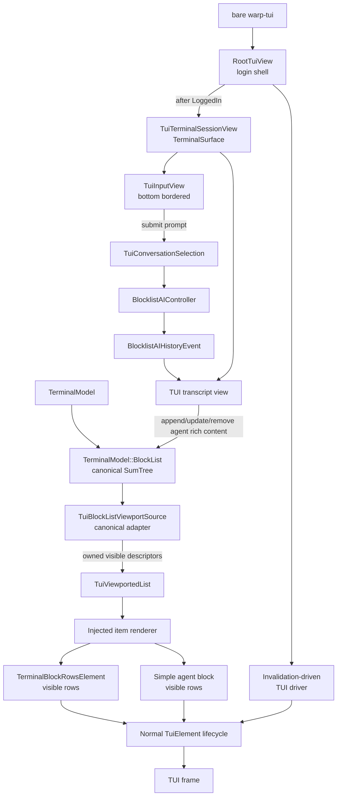

# TUI transcript view — TECH
## Context
This PR builds the first production-shaped conversation transcript view for Warp's TUI. It proves the transcript container and canonical ordering path with two intentionally simple block renderers:
- an agent block that renders user input and streamed plain-text agent output
- a terminal block that renders command/input and streamed terminal output
Bare `warp-tui` launches a real login-gated TUI root. Once authenticated, the root delegates to an authenticated terminal session view containing an editor-backed input docked at the bottom and a transcript above it. Submitting the input sends a prompt to the surface's conversation, streaming the response into the transcript as an agent block.

Rich block content and interactive block affordances are outside this PR. Those features must extend the block-render boundary established here rather than alter the transcript container or introduce a TUI-specific blocklist.
The generalized, content-agnostic TUI viewport this transcript renders into (the virtualized list, scroll/anchor model, height reconciliation, and wheel/event plumbing) is a dependency provided by the downstack branch and specified in [`specs/tui-viewport/TECH.md`](../tui-viewport/TECH.md). This spec covers only the terminal-backed transcript built on top of it.

The current TUI prompt path is owned by `crates/warp_tui/src/terminal_session_view.rs`. `TuiTerminalSessionView` creates the production AI context/input/action/controller models for its terminal surface, owns a `TuiConversationSelection`, and sends submitted prompts through `BlocklistAIController::send_user_query_in_conversation`. The earlier one-shot stdout prompt-streaming path and separate `TuiConversationModel` are removed in this PR.

WarpUI already has a TUI-specific element/view/presenter stack. [`TuiElement`](https://github.com/warpdotdev/warp/blob/e36e8ddf823d6a25a5225251a7db60698f5da74d/crates/warpui_core/src/elements/tui/mod.rs#L96-L140) defines the normal layout, rendering, presentation, event, and cursor lifecycle, while [`TuiPresenter`](https://github.com/warpdotdev/warp/blob/e36e8ddf823d6a25a5225251a7db60698f5da74d/crates/warpui_core/src/presenter/tui.rs#L81-L208) retains laid-out trees and records child-view embeddings. The transcript must return normal visible `TuiElement` trees so this lifecycle remains intact; it must not use a context-free raw-buffer row renderer.

`TerminalModel::BlockList` is the canonical ordered presentation model for a terminal surface. Its heterogeneous [`BlockHeightItem`](https://github.com/warpdotdev/warp/blob/e36e8ddf823d6a25a5225251a7db60698f5da74d/app/src/terminal/model/blocks.rs#L121-L196) sum tree orders terminal blocks and rich content and tracks accumulated height, count, and block count in [`BlockList`](https://github.com/warpdotdev/warp/blob/e36e8ddf823d6a25a5225251a7db60698f5da74d/app/src/terminal/model/blocks.rs#L225-L270). Terminal output updates model-authoritative block heights, while view-measured rich content uses dirty marking and height writeback ([`mark_rich_content_dirty`](https://github.com/warpdotdev/warp/blob/e36e8ddf823d6a25a5225251a7db60698f5da74d/app/src/terminal/model/blocks.rs#L1173-L1180), [`update_rich_content_heights`](https://github.com/warpdotdev/warp/blob/e36e8ddf823d6a25a5225251a7db60698f5da74d/app/src/terminal/model/blocks.rs#L2349-L2351)). The GUI follows the same canonical-order model by inserting one rich-content AI block per exchange in [`TerminalView::handle_ai_history_model_event`](https://github.com/warpdotdev/warp/blob/e36e8ddf823d6a25a5225251a7db60698f5da74d/app/src/terminal/view.rs#L6030-L6220).

The TUI transcript will use this existing order. It will not own a second transcript order or introduce a `TUIBlocklistElement`.
## Proposed changes
### TUI transcript composition root
Change the no-prompt TUI frontend callback in `crates/warp_tui/src/lib.rs`: after app-side authentication, bare `warp-tui` starts a real TUI session instead of printing the authenticated user ID and exiting.

Add a root TUI view that owns login branching and the optional terminal-session child handle. The root window and TUI driver start immediately so the login placeholder can render, but `TuiTerminalSessionView` and the local terminal manager are created only after `TuiLoginPhase::LoggedIn`. `RootTuiView::ensure_terminal_session` creates the terminal child through the root view's own `ViewContext`, preserving normal TUI view hierarchy and parentage, while `crates/warp_tui/src/session.rs` owns the driver and retains the terminal manager handle after login.

When logged in and the terminal child exists, the root renders `TuiTerminalSessionView`. The authenticated session view renders a transcript above a bordered bottom input:
```rust
TuiColumn::new()
    .flex_child(TuiChildView::new(&transcript_view))
    .child(bordered_input)
```
The transcript fills remaining rows above the input. Short transcript content is bottom-aligned so it grows upward from the input; once content reaches the top of the transcript region, the existing viewport scrolling behavior takes over. The bordered input uses the real layout width minus the session padding, not a fixed input width. The input border uses the Figma cyan token through the active theme's terminal palette.

`TuiTerminalSessionView` is the `TerminalSurface` driven by the normal local terminal manager, so its transcript reads the same `TerminalModel` that receives shell output. `crates/warp_tui/src/session.rs` keeps the `spawn_tui_driver` handle alive from startup and fills in the retained terminal manager handle after login.
For now, `crates/warp_tui/src/session.rs::init` forces the already-initialized `Appearance` singleton to the TUI dark theme before constructing the TUI session. This is scoped to the TUI process and preserves the user's font and non-theme appearance settings. It does not change normal GUI theme selection. The temporary override exists because the current TUI transcript design is dark-mode-only.

This PR also relies on small TUI-core support changes: `TuiViewportedList` supports `TuiViewportVerticalAlignment::GrowFromBottom` for short transcript content, `TuiEventContext::set_origin_view` is public for TUI event tests, `AppContext::subscribe_to_view` documents that `ViewHandle<S>` is the proof that `S` is a GUI or TUI view while `S: Entity` supplies event typing, `TuiContainer` supports uniform, per-axis, and per-side padding so callers can express one-sided spacing without local spacer elements, and `warpui_core::elements::tui::color` converts GUI `Fill` values into Ratatui `Color` values at the final TUI rendering boundary.

### App integration surface
The `warp_tui` crate accesses app-owned terminal and AI types through `app/src/tui_export.rs`. This PR expands that export boundary for the transcript, including:
- agent exchange/input/output types, `AIBlockModel`, and `AIBlockModelImpl`
- terminal block/grid/list/rich-content types and terminal colors
- `CommandExecutionSource`, `ExecuteCommandEvent`, and `should_show_task_in_blocklist`
- `Appearance` and the TUI dark theme constructor needed by the TUI startup theme override

The app-side trait bounds are relaxed where TUI surfaces now share production models:
- `AIBlockModelImpl<V>` is bounded by `Entity` rather than GUI `View`, allowing `TuiAgentBlockView` to reuse the production exchange model.
- `TerminalSurface` is bounded by `Entity` rather than GUI `View`, with default no-op callbacks for optional GUI-oriented hooks.
- selected terminal model test helpers are exposed behind `test-util` for `warp_tui` tests.

### Appearance and color handling
TUI transcript colors are derived from the same `Appearance::theme()` source of truth used by GUI code. The TUI does not own feature-local fixed color constants or a separate `crates/warp_tui/src/theme.rs` color role module.

The Figma node for `Terminal/Dark/True` defines the relevant dark tokens as `background: #050505`, `foreground: #ffffff`, `cyan: #d0d1fe`, `cyan_overlay_1: #d0d1fe1a`, `white: #f1f1f1`, `green: #b4fa72`, `red: #ff8272`, and `ANSI Bright/ANSI Bright black: #8e8e8e`. The TUI uses Warp's regular bundled dark theme for now rather than introducing a near-duplicate TUI-specific theme for the small background difference.

TUI render code reads the active `WarpTheme` and chooses base theme tokens at each call site rather than adding transcript-specific theme methods:
- terminal surface and agent-block background use `theme.surface_1()`
- submitted prompt text uses `theme.foreground()`
- submitted prompt row background blends `theme.background()` with `theme.terminal_colors().normal.cyan` at 10% opacity twice, matching the two `cyan_overlay_1` layers in Figma
- agent plain-text output uses `theme.terminal_colors().normal.white`
- input border color uses `theme.terminal_colors().normal.cyan`

The explicit background blending is required because Ratatui terminal colors are opaque cell colors. The generic conversion from GUI `Fill` to Ratatui `Color` does not invent a background context for translucent fills. Callers must blend overlays against the intended background before converting.

The shared conversion lives in `crates/warpui_core/src/elements/tui/color.rs` as `impl From<warpui_core::elements::Fill> for ratatui::style::Color`. This keeps Ratatui-specific knowledge in the TUI element layer. `warp_tui` call sites first convert theme-layer `warp_core::ui::theme::Fill` values into `warpui_core::elements::Fill`, then into TUI `Color`.

The TUI dark theme's terminal palette also supplies future richer transcript roles. Diff additions/removals should use `theme.terminal_colors().normal.green` and `.normal.red`, and lower-priority status text should use `theme.terminal_colors().bright.black` when matching the Figma terminal token semantics.

### Interactive input hookup
`TuiTerminalSessionView` embeds the editor-backed [`TuiInputView`](../../crates/warp_tui/src/input/view.rs) (a `warp::editor::CodeEditorModel` in char-cell mode) as the fixed bottom child. It subscribes to `TuiInputViewEvent::Submitted`; on submit it trims the text, ignores empty prompts, creates a selected `AgentViewEntryOrigin::Tui` conversation through `TuiConversationSelection` if needed, and sends through `BlocklistAIController`. `TuiInputView::submit` already clears the editor buffer, so the input resets after each send.
The input box is rendered with a styled `TuiContainer` border using `theme.terminal_colors().normal.cyan`. The input view reports cursor coordinates through the normal `TuiElement::cursor_position` path.
The input view drives agent prompts only. Running shell commands from the TUI is future work, so `TuiTerminalSessionEvent` emits no direct PTY intents; terminal-block rendering is exercised by tests that drive `TerminalModel` directly rather than by interactive input. `TuiTerminalSessionView` refreshes on a positive allowlist of terminal model events that affect block, grid, or prompt rendering and relies on the terminal wakeup stream for PTY output redraws.

### TUI block-list viewport source
Add a `TuiBlockListViewportSource` adapter under `crates/warp_tui/src/` over the canonical `TerminalModel::BlockList` sum tree.

The adapter maps canonical entries to owned TUI transcript descriptors:
```rust
enum TuiBlockListViewportItemId {
    TerminalBlock(BlockId),
    AgentBlock(EntityId),
}
enum TuiBlockListVisibleItem {
    TerminalBlock { block_id: BlockId },
    AgentBlock {
        registration: AgentBlockRegistration,
    },
}
```

The adapter uses the `BlockList` sum tree as the source of truth and seeks by the accumulated `BlockHeight` dimension to the requested `scroll_top`, then walks only until the viewport bottom. It skips unsupported blocklist item kinds in this PR rather than rendering placeholders for them. Visible item origins use one coordinate system: absolute content-space rows from the top of the canonical block list.

`TuiBlockListViewportSource` refreshes rich-content heights before slicing, inside `visible_items`. It measures the union of `BlockList`'s dirty rich-content queue and every non-dirty registered `TuiAgentBlockView` whose rows fall within the viewport padded by an overhang band (`OVERHANG_ROWS`), measuring each through the view-level `desired_height` helper and writing the results back through `BlockList::update_rich_content_heights_in_lines`. Because the source owns this cheap, exact predictor and commits heights before windowing, the generic viewport needs no post-layout height reconciliation. The overhang band mirrors the GUI blocklist and keeps near-off-screen reflow (e.g. width changes) correct; agent blocks farther off-screen than the band retain their cached height until dirtied or scrolled near the viewport.

`BlockList::take_dirty_rich_content_items` is public so the TUI viewport source can consume pending rich-content height invalidations. The `warp_tui` crate accesses that helper and other app-owned model types only through the narrow `warp::tui_export` boundary.

### Transcript view and exchange lifecycle
Add a TUI transcript view under `crates/warp_tui/src/` that owns the generalized viewport state and the terminal-history integration. The terminal session view embeds it as the flex child above the bottom input in this PR. It subscribes to terminal-surface-scoped `BlocklistAIHistoryEvent`s and mirrors the existing GUI model-level lifecycle:
- `AppendedExchange` creates a simple TUI agent block view and inserts one `RichContentItem` into the canonical `BlockList`.
- `UpdatedStreamingExchange` marks the corresponding canonical rich-content item dirty and notifies the transcript.
- `ReassignedExchange` updates the block's conversation association.
- removal, deletion, clear, and transfer events remove the affected TUI agent rich-content entries.
TUI agent rich-content entries intentionally leave `agent_view_conversation_id` unset. That field encodes GUI Agent View filtering; setting it while the TUI block list remains in `AgentViewState::Inactive` causes the shared `BlockList` height-update path to hide the entry. The TUI transcript keeps its conversation/exchange association in its own registration map while retaining canonical outer ordering in `BlockList`.

The transcript wraps `TuiViewportedList` in `TuiScrollable` for mouse-wheel handling, renders `TuiBlockListViewportSource` through that viewport, and stores viewport position in its view-owned handle:
```rust
let source = TuiBlockListViewportSource::new(
    self.model.clone(),
    self.agent_blocks.clone(),
);
TuiScrollable::new(
    TuiViewportedList::new(self.viewport.clone(), source)
        .with_vertical_alignment(TuiViewportVerticalAlignment::GrowFromBottom),
)
```

### Simple terminal block
Add a simple terminal-block rows element under `crates/warp_tui/src/terminal_block.rs`. It exposes the terminal block's full logical row height to the generic viewport, which then clips top/bottom visibility through `TuiClipped`. The element locks the terminal model during TUI render, matching existing GUI terminal paint prior art, and directly paints terminal cell glyphs and styles from the block's prompt/command grid followed by its output grid into the TUI buffer.

The renderer preserves terminal cell glyphs and styles and supports incremental output because terminal block heights and grid contents are already updated by `TerminalModel`.

### Simple agent block
Add a simple `TuiAgentBlockView` keyed by `(AIConversationId, AIAgentExchangeId)`. This remains a registered TUI view because the shared block-list rich-content infrastructure stores and resolves rich content by view id. The rendering logic is intentionally thin and could be separated into a pure renderer later, but that would add indirection without changing the current infrastructure requirement. The view reads the current exchange from `BlocklistAIHistoryModel` and extracts logical `TuiAgentBlockSection`s:
- the exchange's displayable user input, preserving multi-line input as individual submitted prompt lines
- concatenated streamed `AIAgentTextSection::PlainText` output

The view returns a normal generic TUI element tree from those sections rather than introducing a custom agent-block element. User input is rendered with `TuiContainer` and `TuiText` using a full-width background derived from the TUI dark theme background plus two cyan overlay layers, matching the Figma prompt row. Each submitted input line receives the `≫ ` prefix and the same styled `TuiText` treatment until the TUI text element supports mixed-style spans. Plain-text output is rendered with `TuiText` using the active theme's terminal white token. The agent block body paints the same transcript background as its parent so clipped intermediate buffers do not leak a default/reset cell background; visually, only the submitted prompt row is highlighted. Input/output separation and bottom padding are expressed with `TuiContainer` padding in the composed `TuiColumn` tree, not with a separate manual height formula.

The rich-content height adapter measures the same composed element tree at the actual viewport width through `TuiAgentBlockView::desired_height` and writes that height back to `BlockList`. The viewport renders the agent block through the registered view handle and clips the resulting generic element tree through the viewport item boundary. It intentionally omits all non-plain-text agent output rather than inventing placeholder production behavior in this PR.
## End-to-end flow

## Testing and validation
### Generalized viewport tests
The generalized viewport element, scroll/anchor model, height reconciliation, and wheel/event conversion are tested in the downstack branch; see [`specs/tui-viewport/TECH.md`](../tui-viewport/TECH.md).

### Block renderer tests
Current focused `warp_tui` crate unit tests cover:
- agent block rendering of user input and streamed plain-text output
- agent block colors sourced from `Appearance::theme()` rather than fixed hex constants
- agent block width-dependent height measurement through composed TUI layout
- rich-content height writeback using the agent block view's measured height
- omission of unsupported agent sections until the TUI renders them intentionally
- terminal block row slicing through the block-list viewport source
- viewport SumTree seeking by scroll position and unified `origin_y` coordinates
- directional and axis-specific `TuiContainer` padding

### Transcript integration tests
Current `warpui::App::test` and `TuiPresenter` coverage verifies:
- terminal and simple agent blocks appear in canonical `BlockList` order
- terminal block visible-row slicing
- TUI agent rich content stays visible without GUI Agent View state
- transcript rendering from canonical terminal blocks
- agent rich-content dirty marking and removal from canonical `BlockList`
- mouse-wheel scrolling while key events remain unhandled by the transcript viewport
- `TuiViewportedList` grow-from-bottom alignment for short content

Additional validation that still needs attention before treating the TUI transcript as production-complete:
- `AppendedExchange`, reassignment, clear, deletion, and transfer events through real `BlocklistAIHistoryModel` fixtures
- submitted input prompt produces a streamed agent block in canonical `BlockList` order
- resize reflows agent text, updates rich-content height, and stabilizes the current frame
- follow-bottom remains pinned while streaming and anchored scrolling remains stable away from the bottom
- terminal session/root composition tests for login-gated child-view ownership

### Manual validation
- Run bare `cargo run -p warp_tui`; verify it enters the alternate screen and displays a bordered input docked at the bottom, with the transcript above it.
- Type a prompt and press Enter; verify the input clears and an agent block with streamed plain-text output appears.
- Create enough blocks to overflow the screen, then use the mouse wheel; verify the transcript preserves its anchor away from the bottom and resumes following after scrolling back to the end.
- Resize the terminal; verify the transcript reflows and preserves/follows its anchor as appropriate.
- Exit with Ctrl-C; verify the alternate screen and terminal mode restore cleanly.

Run:
- `./script/format`
- `cargo check -p warp_tui --all-targets`
- `cargo nextest run -p warp_tui`
- `cargo nextest run -p warpui_core --features tui`
- `cargo clippy -p warp_tui --all-targets -- -D warnings`
- `cargo clippy -p warpui_core --features tui --all-targets -- -D warnings`
- `cargo fmt -- --check`
## Parallelization
Parallel implementation agents are not proposed. The generalized viewport API, TUI block-list viewport source, block renderers, and transcript lifecycle are tightly coupled through evolving associated types and height/locking contracts; parallel branches would spend significant time restacking and reconciling the same interfaces. Implement sequentially on `harry/tui-transcript-view`, then run focused validation in parallel where the test runner permits it.
## Risks and mitigations
- **A second transcript order diverges from the terminal model.** Use `TerminalModel::BlockList` as the only canonical order; `TuiBlockListViewportSource` is an adapter, not storage.
- **Viewport abstraction leaks terminal or agent types.** Keep descriptors opaque to `TuiViewportedList`; all type-specific rendering stays in the injected app-layer function.
- **Terminal-model deadlock or UI stall.** Avoid nested terminal-model locks; terminal block rows lock during render consistently with GUI terminal paint, while viewport indexing and height writeback keep their lock scopes separate.
- **Hidden O(N) traversal defeats virtualization.** Seek the canonical block-height SumTree to the requested scroll window and stop at the viewport bottom rather than walking from the start of the block list.
- **Streaming height changes cause visual jumps.** Preserve stable anchors, batch height feedback, and stabilize visible layout in the current pass.
- **TUI and GUI behavior regress together.** Keep the new viewport TUI-specific; reuse backend-neutral pure algorithms only when their contracts truly match.
- **Simple test blocks become accidental production taxonomy.** Keep their scope explicit and verify the block-render seam rather than expanding content behavior in this PR.
- **TUI launch leaves the host terminal in raw/alternate-screen mode.** Tie terminal restoration to the owned driver handle and cover teardown in runtime tests.
## Outside this PR
- final production agent/terminal block styling and content taxonomy
- rich or interactive block affordances
- production-grade input affordances beyond submitting a prompt (history, completions, richer multi-line UX)
