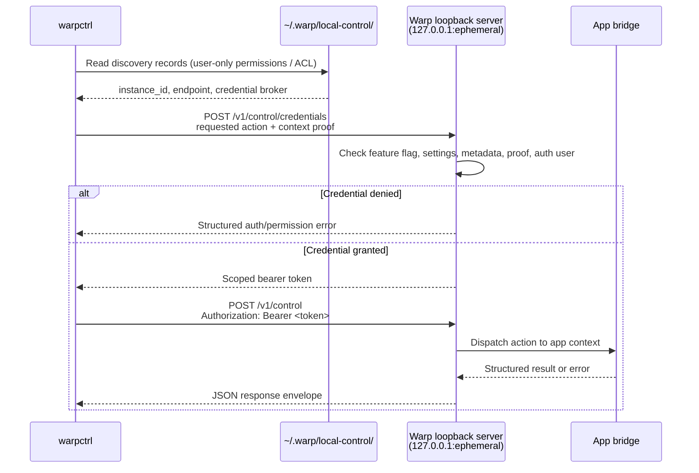

# warpctrl operator README
`warpctrl` is the provisional standalone CLI for controlling an already-running local Warp app instance. It is intended for scripts, demos, agent workflows, and developer automation that need to perform allowlisted Warp UI actions without launching the GUI executable in CLI mode.

The local-control protocol and catalog are intentionally allowlisted. Commands outside the implemented capability set should fail with structured unsupported-action errors until their handlers land, and docs or skills must not present stubbed commands as guaranteed live app handlers.

## Packaging model
`warpctrl` should be packaged as a separate CLI artifact from the Warp GUI app while reusing shared repository code:
- `crates/local_control` owns discovery records, local authentication material, client transport, protocol envelopes, action names, and error types.
- `crates/warp_cli` owns command parsing conventions for local-control subcommands.
- the app-side bridge owns the per-process loopback listener and dispatches supported actions onto the live Warp UI context.

The binary should initialize only CLI parsing, instance discovery, local authentication loading, request serialization, HTTP transport, and output formatting. It should not initialize GUI state, terminal models, rendering, workspaces, or main-app startup paths.

During the provisional naming period, release artifacts and helper names may be channelized, but operator docs and examples should use `warpctrl` unless an integration branch explicitly documents a channel-specific alias.

This branch wires the standalone binary target and the macOS/Linux bundle-script artifact selectors:
- `cargo build -p warp --bin warpctrl`
- `script/macos/bundle --artifact warpctrl ...`
- `script/linux/bundle --artifact warpctrl ...`

Windows has the native Rust binary target, but installer/release helper exposure remains follow-up packaging work.

## Install and invocation guidance
### macOS
Build locally with `cargo build -p warp --bin warpctrl`, then run `target/debug/warpctrl` or copy/symlink that binary onto `PATH`.

For distributable standalone artifact checks, use `script/macos/bundle --artifact warpctrl` with the desired channel/signing flags. The bundle script writes a standalone `warpctrl` binary into its macOS artifact output directory instead of embedding it in the GUI app bundle.

### Linux
Build locally with `cargo build -p warp --bin warpctrl`, then run `target/debug/warpctrl` or copy/symlink that binary onto `PATH`.

For distributable standalone artifact checks, use `script/linux/bundle --artifact warpctrl` with the desired channel/package selection. The Linux bundle script routes packaging through the standalone control-binary artifact path; downstream package installation should place the emitted `warpctrl` binary according to that package format.

Run `warpctrl --version` after installation to confirm the shell is resolving the expected build.

### Windows
Build locally with `cargo build -p warp --bin warpctrl`, then run `target\debug\warpctrl.exe` or copy that binary onto `PATH`.

The Windows-native binary target exists in this slice. Installer helper creation and release-artifact wiring still need a later packaging change before docs can promise an installer-provided `warpctrl` command.

## Command contract
The command surface separates low-sensitivity metadata reads, underlying-data reads, app-state mutations, metadata-configuration mutations, and underlying-data mutations. Metadata read permission must not be treated as permission to read terminal contents, command history, input buffers, file contents, Drive object contents, or AI conversation content.

Implemented command families in this branch include:
- app, instance, capability, window, tab, pane, session, action, theme, appearance, setting, file, project, and Drive metadata reads;
- block output, input buffer, and history reads;
- app/window/tab/pane/session/input staging mutations;
- allowlisted theme and setting mutations;
- surface, file open, project open, and Drive app-state open mutations;
- authenticated Drive object create/update/delete/insert/share-to-team mutations;
- `input run`, guarded by an additional fail-closed execution policy.

`drive.workflow.run` remains a catalog stub in this branch. Auth setup commands, tab/pane naming/color variants, several theme shortcut commands, keybinding reads, and direct workflow execution are planned or reserved but not implemented by the runtime bridge.

## Safe targeting guidance
For repeatable scripts and Agent workflows:
- Start with `warpctrl --output-format json instance list` and record the target `instance_id`.
- If exactly one compatible instance is listed, implicit targeting may be acceptable for interactive use. In scripts, pass `--instance <instance_id>` once discovered.
- If multiple instances are listed, always pass `--instance`; do not rely on active/frontmost selection unless the task is explicitly interactive and ambiguity is acceptable.
- Prefer opaque `instance_id` selectors over PID selectors for durable automation. `--pid` is a convenience filter for short-lived local debugging.
- Handle structured failures explicitly: `no_instance`, `ambiguous_instance`, `local_control_disabled`, `unauthorized_local_client`, `insufficient_permissions`, `execution_context_not_allowed`, `unsupported_action`, and `stale_target`.
- Treat `unsupported_action` as a version or implementation mismatch, not as permission to fall back to mutating UI automation or internal dispatch.

## End-to-end local test flow
Use matching app and CLI bits from the same branch or release artifact so the protocol version, parser, and action catalog agree.

1. Start Warp and leave at least one window open.
2. Confirm that the local-control server registered the running process:
   ```bash
   warpctrl --output-format json instance list
   ```
3. Copy the desired `instance_id`, then check the selected app's protocol version and implemented action catalog:
   ```bash
   warpctrl --output-format json app version --instance <instance_id>
   warpctrl --output-format json action list --instance <instance_id>
   ```
4. Inspect local structure and settings metadata:
   ```bash
   warpctrl --output-format json tab list --instance <instance_id>
   warpctrl --output-format json theme list --instance <instance_id>
   warpctrl --output-format json appearance get --instance <instance_id>
   warpctrl --output-format json setting list --instance <instance_id>
   warpctrl --output-format json setting get --instance <instance_id> appearance.themes.theme
   ```
5. Smoke-test visible app-state mutations:
   ```bash
   warpctrl tab create --instance <instance_id>
   warpctrl pane split --direction right --instance <instance_id>
   ```
6. Smoke-test JSON output for Drive and execution-related commands only in a disposable dogfood environment with the required Scripting permissions enabled:
   ```bash
   warpctrl --output-format json drive object create --type notebook --content '{"blocks":[]}' --instance <instance_id>
   warpctrl --output-format json input run "pwd" --instance <instance_id>
   ```
7. Verify visible UI effects in the running app and capture screenshots according to `TECH.md` before treating the stack as review-ready.

Expected failures:
- no running compatible app: exits non-zero with a no-instance error;
- multiple ambiguous instances: exits non-zero and asks for `--instance`;
- unsupported app build or stale discovery record: exits non-zero with a protocol, stale-target, or transport error;
- implemented parser command but unimplemented app bridge in the selected app: exits non-zero with an unsupported-action error;
- authenticated-user action without a logged-in Warp account: exits non-zero with an authenticated-user error;
- `input.run` without explicit local execution policy approval: exits non-zero with an insufficient-permissions error.

## Command reference status
The app advertises action status through the local-control catalog. Operator docs and agent skills should describe commands as usable only when the selected app advertises them as implemented.

### Implemented catalog actions
- action: `instance.list`, status: implemented.
- action: `instance.inspect`, status: implemented.
- action: `app.ping`, status: implemented.
- action: `app.version`, status: implemented.
- action: `app.active`, status: implemented.
- action: `app.focus`, status: implemented.
- action: `capability.list`, status: implemented.
- action: `capability.inspect`, status: implemented.
- action: `window.list`, status: implemented.
- action: `window.inspect`, status: implemented.
- action: `window.create`, status: implemented.
- action: `window.focus`, status: implemented.
- action: `window.close`, status: implemented.
- action: `tab.list`, status: implemented.
- action: `tab.inspect`, status: implemented.
- action: `tab.create`, status: implemented.
- action: `tab.activate`, status: implemented.
- action: `tab.move`, status: implemented.
- action: `tab.close`, status: implemented.
- action: `pane.list`, status: implemented.
- action: `pane.inspect`, status: implemented.
- action: `pane.split`, status: implemented.
- action: `pane.focus`, status: implemented.
- action: `pane.navigate`, status: implemented.
- action: `pane.resize`, status: implemented.
- action: `pane.maximize`, status: implemented.
- action: `pane.close`, status: implemented.
- action: `session.list`, status: implemented.
- action: `session.inspect`, status: implemented.
- action: `session.previous`, status: implemented.
- action: `session.next`, status: implemented.
- action: `session.reopen_closed`, status: implemented.
- action: `block.list`, status: implemented.
- action: `block.inspect`, status: implemented.
- action: `block.output`, status: implemented.
- action: `input.get`, status: implemented.
- action: `input.insert`, status: implemented.
- action: `input.replace`, status: implemented.
- action: `input.clear`, status: implemented.
- action: `input.mode.set`, status: implemented.
- action: `input.run`, status: implemented.
- action: `history.list`, status: implemented.
- action: `theme.list`, status: implemented.
- action: `theme.set`, status: implemented.
- action: `appearance.get`, status: implemented.
- action: `setting.list`, status: implemented.
- action: `setting.get`, status: implemented.
- action: `setting.set`, status: implemented.
- action: `setting.toggle`, status: implemented.
- action: `action.list`, status: implemented.
- action: `action.inspect`, status: implemented.
- action: `surface.settings.open`, status: implemented.
- action: `surface.command_palette.open`, status: implemented.
- action: `surface.command_search.open`, status: implemented.
- action: `surface.warp_drive.open`, status: implemented.
- action: `surface.warp_drive.toggle`, status: implemented.
- action: `surface.resource_center.toggle`, status: implemented.
- action: `surface.ai_assistant.toggle`, status: implemented.
- action: `surface.code_review.toggle`, status: implemented.
- action: `surface.left_panel.toggle`, status: implemented.
- action: `surface.right_panel.toggle`, status: implemented.
- action: `surface.vertical_tabs.toggle`, status: implemented.
- action: `file.list`, status: implemented.
- action: `file.open`, status: implemented.
- action: `project.active`, status: implemented.
- action: `project.list`, status: implemented.
- action: `project.open`, status: implemented.
- action: `drive.list`, status: implemented.
- action: `drive.inspect`, status: implemented.
- action: `drive.open`, status: implemented.
- action: `drive.notebook.open`, status: implemented.
- action: `drive.env_var_collection.open`, status: implemented.
- action: `drive.object.share.open`, status: implemented.
- action: `drive.object.create`, status: implemented.
- action: `drive.object.update`, status: implemented.
- action: `drive.object.delete`, status: implemented.
- action: `drive.object.insert`, status: implemented.
- action: `drive.object.share_to_team`, status: implemented.

### Catalog stubs
- action: `auth.status`, status: stub.
- action: `auth.login`, status: stub.
- action: `auth.api_key.set`, status: stub.
- action: `auth.api_key.status`, status: stub.
- action: `auth.api_key.revoke`, status: stub.
- action: `tab.rename`, status: stub.
- action: `tab.reset_name`, status: stub.
- action: `tab.color.set`, status: stub.
- action: `tab.color.clear`, status: stub.
- action: `pane.unmaximize`, status: stub.
- action: `pane.rename`, status: stub.
- action: `pane.reset_name`, status: stub.
- action: `session.activate`, status: stub.
- action: `theme.get`, status: stub.
- action: `theme.system.set`, status: stub.
- action: `theme.light.set`, status: stub.
- action: `theme.dark.set`, status: stub.
- action: `appearance.font_size.increase`, status: stub.
- action: `appearance.font_size.decrease`, status: stub.
- action: `appearance.font_size.reset`, status: stub.
- action: `appearance.zoom.increase`, status: stub.
- action: `appearance.zoom.decrease`, status: stub.
- action: `appearance.zoom.reset`, status: stub.
- action: `keybinding.list`, status: stub.
- action: `keybinding.get`, status: stub.
- action: `drive.workflow.run`, status: stub.

## Explicit exclusions
`warpctrl` operates Warp product surfaces, not arbitrary local filesystems or internal dispatch tables. The public catalog must not include local file content reads, local file content writes, local file appends, local file deletes, accepted-command submission, agent-prompt submission, arbitrary internal action dispatch, arbitrary ACL editing, external sharing, or public-link creation.

File/path support is limited to app-state and metadata behavior:
- `file.open <path>` opens a file in Warp's visible editor surface.
- `file.list` lists files currently open in Warp editor state.
- `project.open`, `project.list`, and `project.active` operate Warp project/workspace state.

Use native file tools, shell commands, or editor integrations for filesystem content reads, writes, appends, and deletes.

Warp Drive sharing v0 has two distinct paths:
- `drive.object.share.open` is an app-state mutation that opens the share dialog for user review and does not change sharing state.
- `drive.object.share_to_team` is the only direct native sharing mutation in the v0 product scope. It makes a personal object available to the current user's team through Warp's standard team-sharing behavior and requires authenticated-user plus underlying-data-mutation authority.

Sharing with named users, external guests, arbitrary ACL edits, and public links remain excluded until separately reviewed.

## Security model
The local-control protocol is designed for same-user scripting, not cross-user or network access. The trust boundary is the local user account.
- **Loopback-only listener.** Each Warp process binds its control server to `127.0.0.1` on an ephemeral port. The listener is not reachable from the network.
- **Scoped credentials.** Clients request short-lived scoped credentials from `/v1/control/credentials`; the app checks feature flags, requested invocation context, action metadata, execution-context proof, Settings > Scripting permissions, and authenticated-user requirements before issuing a bearer token.
- **File-permission-gated discovery.** Discovery records are stored in a per-user local-control directory. On POSIX platforms, files must be created with `0600` permissions (owner read/write only). On Windows, records must be stored under the current user's app data directory with an ACL that grants access only to the current user, Administrators, and SYSTEM.
- **Stale-record pruning.** On each `instance list` or implicit discovery call, records whose PID is no longer alive are deleted automatically, preventing stale discovery metadata from lingering on disk.
- **No CORS.** The control endpoints do not set permissive CORS headers, so browser-origin JavaScript cannot read responses even if it guesses the port. The credential requirement provides a second layer since browsers cannot read the discovery file.
- **Fail-closed execution.** `input.run` is catalog-implemented but requires an additional explicit local approval policy before command execution; normal Settings > Scripting permission alone is not sufficient.



**Known limitations and future hardening:**
- The credential broker and scoped bearer tokens still operate inside a same-user trust boundary.
- Windows local-control authentication is not complete until discovery-record ACL creation and validation are implemented.
- Higher-risk handlers such as `input.run` should retain dedicated fail-closed policy checks in addition to ordinary permission categories.
- Broader Drive sharing, arbitrary ACL editing, accepted-command submission, and agent-prompt submission remain out of scope.

## Documentation review notes
- Treat `warpctrl` as provisional executable naming until packaging signs off on final artifact aliases.
- Keep examples aligned with `ActionKind::implemented_metadata()` and the selected app's advertised catalog.
- Do not document catalog commands as usable just because they exist in protocol enums or parser scaffolding; operator docs should distinguish implemented commands from planned allowlist entries.
- Windows packaging may initially follow the existing helper-wrapper pattern rather than shipping a native standalone executable. Update this README when that decision is final.
